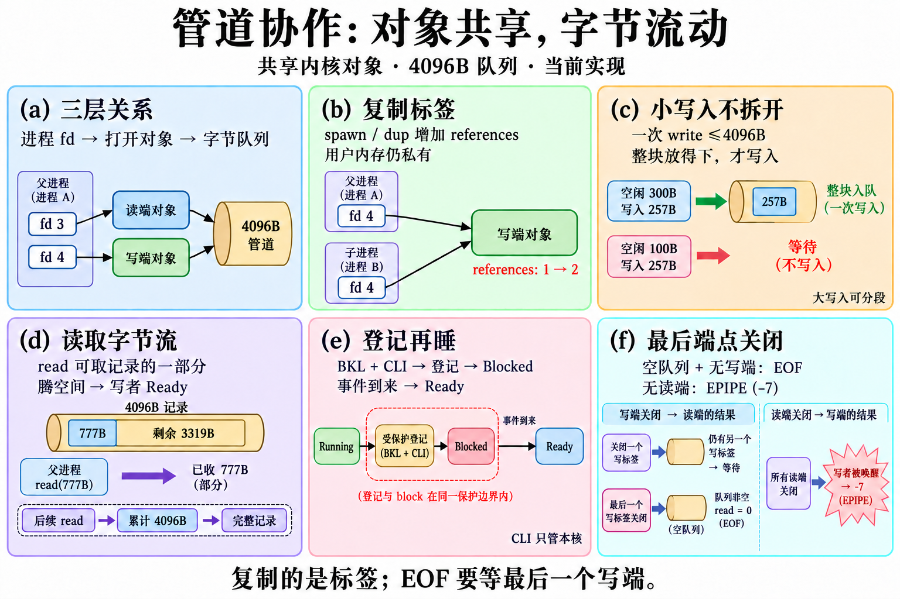
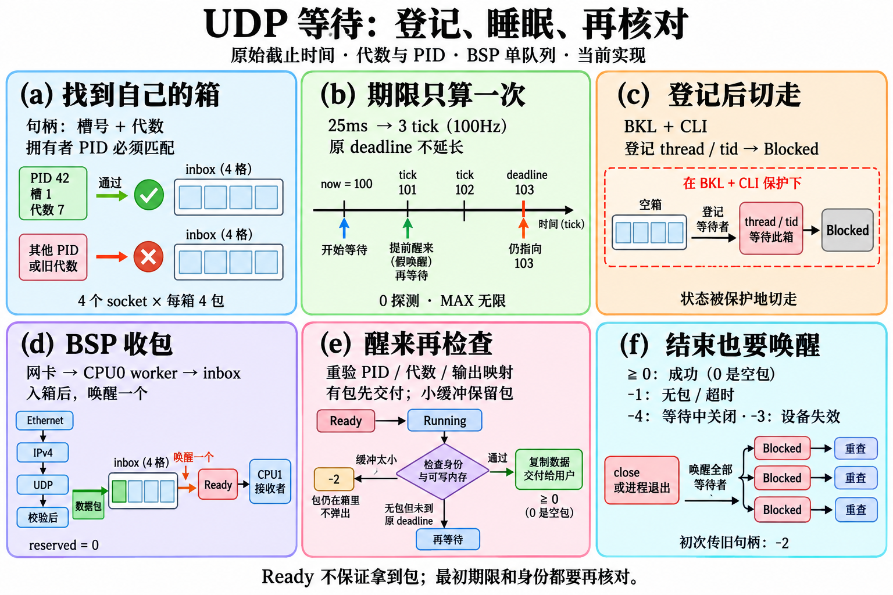
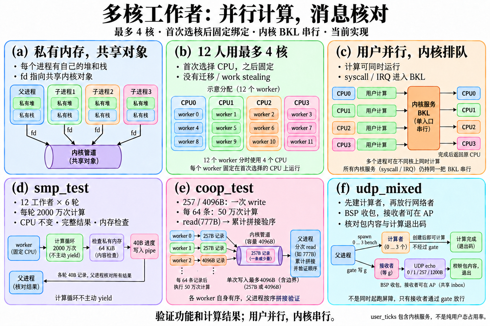

# 从字节队列到多核工作者：逐函数读懂进程协作

本文面向第一次读内核代码的读者。对应源码基线为提交 `67efd0d008e0b58b31c89ad4ecfbab502416e087`，讲解 [fd.cpp](../../kernel/fs/fd.cpp)、[network.cpp](../../kernel/net/network.cpp) 的全部函数，并逐个解释 [coop_test.cpp](../../user/programs/coop_test.cpp)、[smp_test.cpp](../../user/programs/smp_test.cpp)、[udp_mixed.cpp](../../user/programs/udp_mixed.cpp) 的函数。文末补充三个共同计算助手，使“算了什么”和“怎样独立核对”也能看明白。

配套 [六栏图规格](specs/COOPERATION_FIGURES.md) 用 `P(a)`…`P(f)` 表示管道图的六栏，用 `U(a)`…`U(f)` 表示 UDP 等待图，用 `M(a)`…`M(f)` 表示多核工作者图。**三张配图已使用内置 imagegen 生成并视觉审校，原始输出和编辑提示词均保留。** 源码链接中的 `#L` 是固定提交的起始行，方便对照；本地源码链接方便离线阅读。

## 配套六栏图

图面用短句展示共同流程，下面逐函数讲细节。生成来源、精确提示词与修正记录见 [图片清单](images-cooperation.json)。

## 先弄清五个词

**进程**有自己的用户地址空间、堆和栈。创建子进程不会让两份用户堆自动共享。**线程**是调度器保存和恢复的执行现场；当前这些用户程序通过多个进程协作，没有面向用户的共享内存或 futex 接口。

**fd** 是某个进程表中的整数标签，好比“第几张取件票”。**OpenFileDescription** 是内核里的共享打开对象，保存文件位置或管道端点。父子进程的标签可以指向同一对象：两个标签读同一文件，会推进同一个 offset；两个写标签可以把字节放入同一个管道。**PipeState** 才是保存管道字节的环形队列。标签、打开对象、队列是三个不同层次。

**BKL** 是大内核锁。最多四颗 CPU 可以同时执行各自用户代码；进入内核操作共享状态时，通过 CPU 所有的 BKL 串行执行。`CLI` 只关闭本 CPU 的普通中断，不会阻止其他 CPU，所以不能代替跨核锁。等待路径先保护“检查条件→登记→阻塞→保存旧现场”，之后在安全的用户返回或 idle 路径放锁；不能让 AP 拿着这把锁执行 HLT 去等 BSP 的时钟或收包线程。

## 数字与边界

| 机制 | 当前值与语义 |
| --- | --- |
| 公开 fd | `0/1/2` 是标准输入／输出／错误；普通标签为 `3…18`。内核普通槽为 `0…15`，标准流内部槽为 `16/17/18`。除翻译函数外，本章 fd 内核函数均接收内部槽号。 |
| 管道 | 固定 4096B 字节队列；一次 write 的总长度 ≤4096B，必须等到能整块写入。大写入可分段并与其他写者交错。read 仍是字节流，可以只读出记录的一部分。 |
| 关闭 | 队列排空且最后一个写端对象消失，read 返回 0（EOF）；没有读端时，新写入返回 `-7`（EPIPE/BROKEN_PIPE）。复制标签只增加对象 references，端点对象销毁时才减 readers/writers。 |
| UDP | 全局最多 4 个 socket，每个最多 4 个数据报，每包 payload ≤1200B。绑定端口全局唯一，9000 为内核回显服务保留。 |
| UDP 身份 | handle 低三位保存槽号，其余位保存 generation；还必须匹配 owner PID。它不是 fd，不随 fd_inherit 自动继承。 |
| UDP 元数据 | 12B：来源 IPv4 地址 4B、来源端口 2B、目的端口 2B、payload 长度 2B、reserved 2B；reserved 收包时明确为 0。 |
| UDP 等待 | syscall 40；timeout=0 探测，1…60000ms 有限等待，UINT32_MAX 无限等待。≥0 是一个包的长度，0 也是有效空包；-1 无包／超时／无法阻塞；-2 参数／身份／输出缓冲错误；-3 设备不可用；-4 等待中被关闭。 |
| 时钟与多核 | BSP PIT 100Hz，一 tick 约10ms；AP 本地 timer 用于本核抢占，不重复增加全局时间。首次分配 CPU 后固定绑定，没有运行时迁移。 |
| 网络能力 | 真实 Ethernet、ARP、受限 IPv4、ICMP echo、UDP；RX 为 BSP 单队列 worker。静态地址 10.0.2.15/24、网关 10.0.2.2；当前没有 TCP、DHCP、DNS、IPv6、IPv4 选项或分片。 |

函数下的“输入”既包括参数，也包括必须满足的调用条件。文件内部的小助手通常信任调用方，不能直接当成接收任意用户指针的 syscall。用户指针、公开 fd 翻译和当前 PID 取值由 syscall 边界负责；下面会单独说明阻塞后的再次检查。

## 一、fd.cpp：标签如何连接到共享对象

### `save_interrupt_flags_and_disable`

源码：[fd.cpp:19](https://github.com/zmy1213/os64/blob/67efd0d008e0b58b31c89ad4ecfbab502416e087/kernel/fs/fd.cpp#L19)；图块：P(e)。

- **输入**：内核正在运行，调用路径已持有 BKL。
- **结果**：返回执行 CLI 前的 RFLAGS，并关闭本核中断。
- **步骤**：用 pushfq 读取标志，再 pop 到变量，最后 cli；memory 屏障约束编译器移动共享内存操作。
- **为什么**：记住原来的 IF，后面才能恢复调用者的状态，而不是一律开中断。
- **限制**：它没有获取 BKL，也不锁其他 CPU；只供本文件内核路径使用。

### `restore_interrupt_flags`

源码：[fd.cpp:24](https://github.com/zmy1213/os64/blob/67efd0d008e0b58b31c89ad4ecfbab502416e087/kernel/fs/fd.cpp#L24)；图块：P(e)。

- **输入**：前面保存的完整 RFLAGS。
- **结果**：恢复原标志，包括原来的 IF。
- **步骤**：把 flags 压栈，再用 popfq 恢复。
- **为什么**：嵌套调用时，原来关着中断的调用者仍应保持关中断。
- **限制**：只接受可信内核保存值；不是让用户任意改 RFLAGS 的接口。

### `valid`

源码：[fd.cpp:27](https://github.com/zmy1213/os64/blob/67efd0d008e0b58b31c89ad4ecfbab502416e087/kernel/fs/fd.cpp#L27)；图块：P(a)。

- **输入**：一个内部 fd 槽号。
- **结果**：0…18 返回 true；其他值返回 false。
- **步骤**：先检查非负，再与内部槽容量 19 比较。
- **为什么**：避免用负数或越界数访问 entries 数组。
- **限制**：只判断下标范围，不代表槽位已打开。

### `structural`

源码：[fd.cpp:28](https://github.com/zmy1213/os64/blob/67efd0d008e0b58b31c89ad4ecfbab502416e087/kernel/fs/fd.cpp#L28)；图块：P(a)。

- **输入**：文件描述符表指针。
- **结果**：表非空且 vfs 指针非空则 true。
- **步骤**：检查 t，再检查 t->vfs。
- **为什么**：很多小助手需要一个最基本的结构有效性检查。
- **限制**：不验证文件系统是否已挂载，挂载检查另有函数。

### `description`

源码：[fd.cpp:29](https://github.com/zmy1213/os64/blob/67efd0d008e0b58b31c89ad4ecfbab502416e087/kernel/fs/fd.cpp#L29)；图块：P(a)。

- **输入**：结构有效的表和内部槽号。
- **结果**：返回显式打开对象；无对象时返回 nullptr。
- **步骤**：依次检查 structural、valid、entry.open，然后读 description 指针。
- **为什么**：把多处重复查表集中起来，避免读取无效槽。
- **限制**：未重定向的标准流是隐式绑定终端，可以“已打开”但没有显式对象；nullptr 不等于所有情况下都关闭。

### `empty_slot`

源码：[fd.cpp:32](https://github.com/zmy1213/os64/blob/67efd0d008e0b58b31c89ad4ecfbab502416e087/kernel/fs/fd.cpp#L32)；图块：P(a)。

- **输入**：有效表，调用方持 BKL。
- **结果**：返回首个空普通槽 0…15；满表返回 -1。
- **步骤**：按槽号顺序扫描 entries.open。
- **为什么**：open、dup、pipe 都需要分配普通标签。
- **限制**：不搜索标准流槽，不自己检查 t 是否为空，也不自己预留槽。

### `wake`

源码：[fd.cpp:36](https://github.com/zmy1213/os64/blob/67efd0d008e0b58b31c89ad4ecfbab502416e087/kernel/fs/fd.cpp#L36)；图块：P(e)。

- **输入**：某个管道的读者或写者等待数组；调用方已保护共享状态。
- **结果**：清空登记并请求唤醒其中的线程。
- **步骤**：先保存每个线程指针、清空该格，再调用 scheduler_wake_thread。
- **为什么**：先清登记避免同一次事件重复处理；读出数据和写入数据都可能让对方条件成立。
- **限制**：唤醒到 Ready 不保证立即执行，也不保证醒来时条件仍成立；这是管道的 TCB 指针队列，不是 UDP 的 pointer＋tid 身份队列。

### `wait_on`

源码：[fd.cpp:42](https://github.com/zmy1213/os64/blob/67efd0d008e0b58b31c89ad4ecfbab502416e087/kernel/fs/fd.cpp#L42)；图块：P(e)。

- **输入**：等待数组；有活跃非 idle 线程；调用者持 BKL 且本核中断关闭。
- **结果**：成功经过阻塞切换返回 true；无线程、登记满或切换失败返回 false。
- **步骤**：找空格或当前线程已有格；登记当前 TCB；调用调度器 block；恢复后清掉仍属于自己的登记。
- **为什么**：登记与进入 Blocked 之间不能释放 BKL，否则对方可能提前唤醒而当前线程随后又睡下去。
- **限制**：不负责判断“有无数据／空间”，调用者醒来必须回到循环重新检查；没有有限超时参数。

### `pipe_read`

源码：[fd.cpp:55](https://github.com/zmy1213/os64/blob/67efd0d008e0b58b31c89ad4ecfbab502416e087/kernel/fs/fd.cpp#L55)；图块：P(d)、P(e)、P(f)。

- **输入**：有效 PipeState、可写输出缓冲、请求字节数。
- **结果**：最多读请求数量；队列空且无写端返回 0；无法阻塞返回 -1。
- **步骤**：零长度立即返回；有数据则取 min(size,count)，按环尾前后最多两次复制，移动 head、减少 count，唤醒写者；无数据但有写者则登记等待后重查。
- **为什么**：环形队列不必把剩余字节整体向前搬；腾出的空间让写者继续。
- **限制**：read 不保留消息边界。EOF 需要队列先排空；读 0 字节返回 0 也不能用来判断 EOF。输出地址有效性由上层检查。

### `pipe_write`

源码：[fd.cpp:77](https://github.com/zmy1213/os64/blob/67efd0d008e0b58b31c89ad4ecfbab502416e087/kernel/fs/fd.cpp#L77)；图块：P(c)、P(e)、P(f)。

- **输入**：有效管道、可读源缓冲、一次调用的总长度 size。
- **结果**：全部写入返回 size；无读端且尚未写入返回 -7；大写入中途失败可返回已写数量。
- **步骤**：循环查 readers 与空闲空间；size≤4096 时只在整个 size 都放得下时复制；更大写入取当前可用空间；按环尾分两段复制，增加 count，唤醒读者；空间不足则等待再查。
- **为什么**：整条小记录不能写一半后睡下，否则另一写者可插入中间。
- **限制**：原子性是“一次小 write 的字节不被其他写入插开”，不是事务或消息队列。拆成两个 write 的头和体不保证相邻；大写入允许交错，唤醒顺序也不保证公平。

### `release`

源码：[fd.cpp:106](https://github.com/zmy1213/os64/blob/67efd0d008e0b58b31c89ad4ecfbab502416e087/kernel/fs/fd.cpp#L106)；图块：P(b)、P(f)。

- **输入**：一个仍有效的显式打开对象；调用方持 BKL。
- **结果**：减少 references，最后引用消失时关闭底层资源并释放对象。
- **步骤**：空指针直接返回；减引用仍非零就结束；文件对象关闭 VFS handle；管道对象按读／写端减少对应端点数并唤醒对方；两类端点都没了才释放 PipeState；最后释放对象。
- **为什么**：标签关闭与共享对象销毁不是同一时刻；其他进程仍持有标签时不能提前销毁。
- **限制**：references、readers、writers 都不是 CPU 原子变量；安全来自 BKL。不能对已经释放的对象再调用 release。

### `attach`

源码：[fd.cpp:120](https://github.com/zmy1213/os64/blob/67efd0d008e0b58b31c89ad4ecfbab502416e087/kernel/fs/fd.cpp#L120)；图块：P(a)、P(b)。

- **输入**：有效表、有效空目标槽、已准备好的打开对象。
- **结果**：槽变为显式打开，open_count 增加；标准槽的关闭标记清除。
- **步骤**：写入 {object,true}；增加本表显式引用计数；必要时改 standard_closed。
- **为什么**：把安装标签的步骤统一，继承、重定向和新建都能用。
- **限制**：不增加 object.references；对象新建或复制引用时由调用方先准备计数。也不自动释放目标槽旧对象。

### `fd_public_to_slot`

源码：[fd.cpp:125](https://github.com/zmy1213/os64/blob/67efd0d008e0b58b31c89ad4ecfbab502416e087/kernel/fs/fd.cpp#L125)；图块：P(a)。

- **输入**：用户看到的 fd。
- **结果**：0/1/2 转 16/17/18；3…18 转 0…15；非法值 -1。
- **步骤**：检查范围，然后按是否小于 3 选择偏移。
- **为什么**：历史普通槽布局保留，用户仍能使用熟悉的标准流编号。
- **限制**：返回的是内部下标，不代表该 fd 已打开。

### `fd_slot_to_public`

源码：[fd.cpp:129](https://github.com/zmy1213/os64/blob/67efd0d008e0b58b31c89ad4ecfbab502416e087/kernel/fs/fd.cpp#L129)；图块：P(a)。

- **输入**：内部槽号。
- **结果**：0…15 转公开 3…18；16/17/18 转公开 0/1/2；非法值 -1。
- **步骤**：先 valid，再对普通／标准槽分别加减偏移。
- **为什么**：新 open、dup、pipe 的结果要翻译后才交给用户。
- **限制**：不能把内部 fd_open 的返回值直接当成公开标签。

### `initialize_file_descriptor_table`

源码：[fd.cpp:132](https://github.com/zmy1213/os64/blob/67efd0d008e0b58b31c89ad4ecfbab502416e087/kernel/fs/fd.cpp#L132)；图块：P(a)。

- **输入**：待初始化的表与已挂载 VfsMount。
- **结果**：成功安装 vfs 返回 true；参数或挂载错误返回 false。
- **步骤**：t 为空先拒绝；清零表；检查挂载；保存 vfs。
- **为什么**：新进程的标签和计数应从确定的空状态开始，标准流可隐式绑定终端。
- **限制**：仅用于新表；不能用清零替代对活表 fd_close_all，否则会丢失引用。

### `file_descriptor_table_is_ready`

源码：[fd.cpp:138](https://github.com/zmy1213/os64/blob/67efd0d008e0b58b31c89ad4ecfbab502416e087/kernel/fs/fd.cpp#L138)；图块：P(a)。

- **输入**：表指针。
- **结果**：结构有效且 VFS 已挂载则 true。
- **步骤**：结合 structural 与 vfs_is_mounted。
- **为什么**：文件 open 要求能实际访问文件系统。
- **限制**：它不检查每个槽或每个共享对象。

### `fd_kind`

源码：[fd.cpp:139](https://github.com/zmy1213/os64/blob/67efd0d008e0b58b31c89ad4ecfbab502416e087/kernel/fs/fd.cpp#L139)；图块：P(a)。

- **输入**：表和内部槽号。
- **结果**：返回文件、读管道、写管道、终端输入／输出或 Invalid。
- **步骤**：先找显式对象；没有对象时只允许标准槽；查关闭标记，标准0为输入、1/2为输出。
- **为什么**：标准流默认无需分配打开对象，重定向后又可指向管道或文件。
- **限制**：类型判断不是读写权限判断，普通文件还需 flags。

### `fd_is_open`

源码：[fd.cpp:145](https://github.com/zmy1213/os64/blob/67efd0d008e0b58b31c89ad4ecfbab502416e087/kernel/fs/fd.cpp#L145)；图块：P(a)。

- **输入**：表和内部槽号。
- **结果**：类型不是 Invalid 即 true。
- **步骤**：调用 fd_kind 后比较。
- **为什么**：让显式对象和隐式标准流使用同一个“是否打开”判断。
- **限制**：true 不代表可以读或写任意方向。

### `fd_terminal_number`

源码：[fd.cpp:146](https://github.com/zmy1213/os64/blob/67efd0d008e0b58b31c89ad4ecfbab502416e087/kernel/fs/fd.cpp#L146)；图块：P(a)。

- **输入**：调用方已确认是终端的内部槽号。
- **结果**：显式终端对象保存的终端号，或隐式标准流的 0/1/2。
- **步骤**：有对象读 terminal_number；否则槽号减 16。
- **为什么**：复制终端标签后，标签号可能变化，但它仍须记得指向原来的终端。
- **限制**：本函数不验证类型和范围；不能把普通文件或非法槽传来解释成终端。

### `fd_open`

源码：[fd.cpp:150](https://github.com/zmy1213/os64/blob/67efd0d008e0b58b31c89ad4ecfbab502416e087/kernel/fs/fd.cpp#L150)；图块：P(a)。

- **输入**：已挂载表、1…63 字节非空路径、读／写／创建／截断／追加标志。
- **结果**：成功返回内部普通槽；失败 -1。
- **步骤**：找空槽、检查路径；先分配对象；检查文件存在与类型，按 flags 创建／截断；打开 VFS 文件，记录 kind/references/flags/path，attach。
- **为什么**：先有对象内存再允许 create/truncate，可避免单纯对象分配失败时已经改了磁盘。
- **限制**：这不是整个 open 流程的磁盘事务，后续失败仍可能发生在 create/truncate 之后；没有权限用户模型，路径和文件容量有上限。

### `fd_can_read`

源码：[fd.cpp:167](https://github.com/zmy1213/os64/blob/67efd0d008e0b58b31c89ad4ecfbab502416e087/kernel/fs/fd.cpp#L167)；图块：P(a)。

- **输入**：表和内部槽。
- **结果**：管道读端、终端输入或带 kOpenRead 的文件返回 true。
- **步骤**：查 kind；文件类型再查对象 flags。
- **为什么**：提前拒绝把写端当读端使用。
- **限制**：只判断能力，不读取数据，也不检查用户缓冲。

### `fd_can_write`

源码：[fd.cpp:173](https://github.com/zmy1213/os64/blob/67efd0d008e0b58b31c89ad4ecfbab502416e087/kernel/fs/fd.cpp#L173)；图块：P(a)。

- **输入**：表和内部槽。
- **结果**：管道写端、终端输出或带 kOpenWrite 的文件返回 true。
- **步骤**：查 kind；文件类型再查写标志。
- **为什么**：统一端点方向与文件打开方式的检查。
- **限制**：不代表磁盘空间、管道读者或 TX 资源一定存在。

### `fd_read`

源码：[fd.cpp:178](https://github.com/zmy1213/os64/blob/67efd0d008e0b58b31c89ad4ecfbab502416e087/kernel/fs/fd.cpp#L178)；图块：P(d)。

- **输入**：表、内部槽、输出地址和 bytes≤INT32_MAX。
- **结果**：管道读结果或 VFS 文件读数量；参数／类型错误 -1。
- **步骤**：检查读能力、非零长度指针和长度；找显式对象；管道交给 pipe_read，文件交给 vfs_read_file。
- **为什么**：上层按 kind 接键盘／终端，本层集中处理文件和管道共享对象。
- **限制**：隐式终端在这里返回 -1；实际用户 stdin 由 syscall 键盘路径处理。缓冲可写映射验证在 syscall 边界，不由 fd_read 完成。

### `fd_write`

源码：[fd.cpp:185](https://github.com/zmy1213/os64/blob/67efd0d008e0b58b31c89ad4ecfbab502416e087/kernel/fs/fd.cpp#L185)；图块：P(c)。

- **输入**：表、内部槽、可读数据、bytes≤INT32_MAX。
- **结果**：成功返回数量；管道传播阻塞／EPIPE结果；文件失败 -1。
- **步骤**：先检查能力，零长度返回0；管道交给 pipe_write；文件验证路径仍对应原 inode，追加模式用最新文件末尾，否则用共享 offset；分配零填充全文件 staging，读旧内容、覆盖本次区域、整文件写回；更新 inode 和共享 offset。
- **为什么**：零填充定义跳过区域的内容；核对 inode 防止旧打开对象误写路径下的另一个文件；共享 offset 让 dup/spawn 的读写位置一致。
- **限制**：教学文件最大69632B，写一次可能搬运整文件，性能不等同缓存页或增量块写。终端输出由 syscall 接设备；这不是崩溃恢复事务。

### `fd_close`

源码：[fd.cpp:205](https://github.com/zmy1213/os64/blob/67efd0d008e0b58b31c89ad4ecfbab502416e087/kernel/fs/fd.cpp#L205)；图块：P(f)。

- **输入**：表和一个打开的内部槽。
- **结果**：关闭成功 true，非法／已关闭 false。
- **步骤**：先拿对象；清槽；标准流设置关闭标记；显式对象减少本表 open_count 并 release。
- **为什么**：先取消这个标签，再考虑共享对象是否还能被其他标签使用。
- **限制**：close 只关闭该标签；其他标签仍引用写端时，读者不会因此立刻获得 EOF。

### `fd_close_nonstandard`

源码：[fd.cpp:213](https://github.com/zmy1213/os64/blob/67efd0d008e0b58b31c89ad4ecfbab502416e087/kernel/fs/fd.cpp#L213)；图块：P(f)。

- **输入**：表指针。
- **结果**：关闭普通内部槽0…15，保留标准流。
- **步骤**：逐槽检查并 fd_close。
- **为什么**：部分内核路径需要清普通文件而保留标准流配置。
- **限制**：它与 close_all 不同，重定向到标准流的显式引用还活着。

### `fd_close_all`

源码：[fd.cpp:216](https://github.com/zmy1213/os64/blob/67efd0d008e0b58b31c89ad4ecfbab502416e087/kernel/fs/fd.cpp#L216)；图块：P(f)。

- **输入**：表指针。
- **结果**：关闭全部19槽，包括隐式或重定向标准流。
- **步骤**：逐槽检查打开状态，再调用 fd_close。
- **为什么**：进程退出必须释放所有标签，才能产生 EOF/EPIPE 并让底层资源最终回收。
- **限制**：不释放 FileDescriptorTable 本身，也不负责进程退出码或 PCB 回收。

### `fd_inherit`

源码：[fd.cpp:219](https://github.com/zmy1213/os64/blob/67efd0d008e0b58b31c89ad4ecfbab502416e087/kernel/fs/fd.cpp#L219)；图块：P(b)、M(a)。

- **输入**：两个结构有效且不同的表：新子表 destination、父表 source。
- **结果**：成功 true；结构／同表错误 false。
- **步骤**：关掉 destination 旧标签；复制挂载和标准关闭标记；扫描 source，每个显式对象先 references++，再 attach 到子表同一槽。
- **为什么**：父子标签表各自独立，指向的打开对象共享，因而继承 offset 和管道生命期。
- **限制**：不复制管道字节，也不共享用户堆。当前没有 close-on-exec 标志，全部显式标签都会继承，包括启动门的端点。

### `fd_dup2`

源码：[fd.cpp:230](https://github.com/zmy1213/os64/blob/67efd0d008e0b58b31c89ad4ecfbab502416e087/kernel/fs/fd.cpp#L230)；图块：P(b)。

- **输入**：有效 old/new 内部槽，old 已打开。
- **结果**：成功返回 new 槽，失败 -1；old==new 直接返回。
- **步骤**：源有对象则先加引用；隐式终端则先创建显式终端对象；准备成功后关闭目标旧标签，attach 源对象到目标。
- **为什么**：先保护源引用再关目标，可正确处理两个标签已经指向同一对象的情况；分配失败不破坏目标。
- **限制**：共享的是打开对象及 offset。内核返回内部槽，syscall 才翻译公开值；不会新建独立文件位置。

### `fd_dup`

源码：[fd.cpp:244](https://github.com/zmy1213/os64/blob/67efd0d008e0b58b31c89ad4ecfbab502416e087/kernel/fs/fd.cpp#L244)；图块：P(b)。

- **输入**：结构有效的表和源内部槽。
- **结果**：首个空普通槽上的复制标签；失败 -1。
- **步骤**：empty_slot 找目标，再 fd_dup2。
- **为什么**：让调用者不必自己挑目标标签。
- **限制**：表满时失败；只有普通槽可作为自动分配目标。

### `fd_pipe`

源码：[fd.cpp:248](https://github.com/zmy1213/os64/blob/67efd0d008e0b58b31c89ad4ecfbab502416e087/kernel/fs/fd.cpp#L248)；图块：P(a)。

- **输入**：结构有效表和可写的两元素内部槽输出数组。
- **结果**：成功安装读／写端并返回 true；资源不足 false。
- **步骤**：找到两个不同空普通槽；分配 PipeState 和两个打开对象，任何分配失败都回收；设置 readers=writers=1、两端 references=1，各自指向同一 pipe；attach 并输出读／写槽。
- **为什么**：两端方向不同但共享一份字节队列；全部资源准备好后才暴露端点，避免半条管道。
- **限制**：需要两个空标签及固定缓冲内存；它不建立双向通道，也不提供消息边界。找第二槽的临时标记依赖 BKL 保护。

### `fd_references_inode`

源码：[fd.cpp:262](https://github.com/zmy1213/os64/blob/67efd0d008e0b58b31c89ad4ecfbab502416e087/kernel/fs/fd.cpp#L262)；图块：P(f)。

- **输入**：表与 inode 编号。
- **结果**：该表至少一个文件对象引用此 inode 则 true。
- **步骤**：扫描19槽；只对 File 类型比较对象中 inode_number。
- **为什么**：删除文件前可检查是否仍被打开，避免悬空的文件对象。
- **限制**：只扫描这一个表；全系统是否有人引用需要上层遍历进程。管道不参与 inode 检查。

### `fd_stat`

源码：[fd.cpp:270](https://github.com/zmy1213/os64/blob/67efd0d008e0b58b31c89ad4ecfbab502416e087/kernel/fs/fd.cpp#L270)；图块：P(a)。

- **输入**：显式文件对象对应槽和输出 VfsStat。
- **结果**：VFS 状态查询成功 true，否则 false。
- **步骤**：找对象，检查 File 类型与 stat 指针，调用 vfs_file_stat。
- **为什么**：复用打开文件的身份查询信息。
- **限制**：不是管道统计接口；用户输出地址可写检查仍在 syscall。

### `fd_seek`

源码：[fd.cpp:273](https://github.com/zmy1213/os64/blob/67efd0d008e0b58b31c89ad4ecfbab502416e087/kernel/fs/fd.cpp#L273)；图块：P(b)。

- **输入**：显式文件槽与新 offset。
- **结果**：VFS seek 成功 true，否则 false。
- **步骤**：找文件对象并调用 vfs_seek_file。
- **为什么**：位置保存在共享打开对象里，后续标签都从新的 offset 使用。
- **限制**：不能 seek 管道；dup 与继承标签也会看到位置改变。

### `fd_tell`

源码：[fd.cpp:276](https://github.com/zmy1213/os64/blob/67efd0d008e0b58b31c89ad4ecfbab502416e087/kernel/fs/fd.cpp#L276)；图块：P(b)。

- **输入**：显式文件槽。
- **结果**：返回共享位置；不匹配文件时返回0。
- **步骤**：找对象，File 类型则 vfs_tell_file。
- **为什么**：使调用者了解下一次文件读取的位置。
- **限制**：0 同时可能是合法文件开头和错误结果，不能单凭0判断成功。

### `fd_open_count`

源码：[fd.cpp:279](https://github.com/zmy1213/os64/blob/67efd0d008e0b58b31c89ad4ecfbab502416e087/kernel/fs/fd.cpp#L279)；图块：P(a)。

- **输入**：表指针。
- **结果**：结构有效返回 open_count，否则0。
- **步骤**：读取本表显式标签引用计数。
- **为什么**：能观察当前表显式持有多少资源引用。
- **限制**：未重定向的隐式0/1/2不计入；多个标签指同一对象仍分别计数，不是系统独立对象数量。

## 二、network.cpp：从网卡字节到进程的收件箱

发包方向是“用户调用 → 身份／指针边界 → UDP → IPv4 → Ethernet → Virtio TX”。收包方向是“Virtio RX → BSP worker → Ethernet 初筛 → ARP 或 IPv4 → ICMP 或 UDP → socket inbox → 让等待者 Ready”。这里讲的是协议层全部函数；网卡队列和 wake-only IRQ 的实现分别位于 [virtio_net.cpp](../../kernel/net/virtio_net.cpp) 与 [network_irq.cpp](../../kernel/net/network_irq.cpp)，并不隐藏在 network.cpp 中。

### `restore_interrupts`

源码：[network.cpp:52](https://github.com/zmy1213/os64/blob/67efd0d008e0b58b31c89ad4ecfbab502416e087/kernel/net/network.cpp#L52)；图块：U(c)。

- **输入**：保存的布尔值：进入本段前是否开中断。
- **结果**：原来开中断时执行 STI；原来关闭时维持调用段已关闭的状态。
- **步骤**：仅在 enabled 为 true 时调用 enable_interrupts。
- **为什么**：接收、关闭等路径用 CLI 保护本核时序，结束时恢复原 IF 约定。
- **限制**：不像 fd 版本恢复完整 RFLAGS；依赖调用者先关中断，不获取跨核 BKL。

### `wake_udp_receivers`

源码：[network.cpp:53](https://github.com/zmy1213/os64/blob/67efd0d008e0b58b31c89ad4ecfbab502416e087/kernel/net/network.cpp#L53)；图块：U(d)、U(f)。

- **输入**：socket 与 all 标志，调用者已保护其等待数组。
- **结果**：all=false 最多成功唤醒一个；all=true 扫描并唤醒全部有效等待者。
- **步骤**：取 thread/tid 后立即清格；检查线程槽仍 in_use 且 tid 相等，再 scheduler_wake_thread；成功增加 udp_wait_wakes。
- **为什么**：TCB 槽可能在超时／退出后被复用，不能仅凭相同内存指针唤醒新的无关线程；一个数据报通常只需一个接收者。
- **限制**：Ready 不是立即取到包。失效登记会清除，线程仍需重查 socket、队列和期限；tid 是有界身份值而非永久不重复的数学标识。

### `read16`

源码：[network.cpp:65](https://github.com/zmy1213/os64/blob/67efd0d008e0b58b31c89ad4ecfbab502416e087/kernel/net/network.cpp#L65)；图块：U(d)。

- **输入**：至少2个有效字节的地址。
- **结果**：把网络高字节在前的排列读成一个 uint16_t。
- **步骤**：第一个字节左移8，再与第二字节按位或。
- **为什么**：线上的字节顺序与 x86 小端内存顺序不同，不能直接强转读整数。
- **限制**：不检查地址或长度，协议解析器必须先确认包足够长。

### `read32`

源码：[network.cpp:66](https://github.com/zmy1213/os64/blob/67efd0d008e0b58b31c89ad4ecfbab502416e087/kernel/net/network.cpp#L66)；图块：U(d)。

- **输入**：至少4个有效字节。
- **结果**：读出高字节在前的 uint32_t。
- **步骤**：四字节分别移24、16、8、0位后或在一起。
- **为什么**：IPv4 地址在内部统一用逻辑整数表示，例如10.0.2.15为0x0a00020f。
- **限制**：它不验证是否是合法 IPv4 地址，也不做边界检查。

### `write16`

源码：[network.cpp:67](https://github.com/zmy1213/os64/blob/67efd0d008e0b58b31c89ad4ecfbab502416e087/kernel/net/network.cpp#L67)；图块：U(d)。

- **输入**：至少2B可写地址与16位数。
- **结果**：写入网络字节序。
- **步骤**：先写 value>>8，再写低8位。
- **为什么**：端口、长度、校验和在包中都要求大端排列。
- **限制**：调用方须保证空间；只写两字节，不自动更新相关校验和。

### `write32`

源码：[network.cpp:68](https://github.com/zmy1213/os64/blob/67efd0d008e0b58b31c89ad4ecfbab502416e087/kernel/net/network.cpp#L68)；图块：U(d)。

- **输入**：至少4B可写地址与32位数。
- **结果**：按高字节到低字节写四字节。
- **步骤**：依次写移24、16、8、0位后的低8位。
- **为什么**：发送 IPv4／ARP 时地址字段必须保持线上排列。
- **限制**：不是用户内存安全复制接口，不能接未验证用户指针。

### `equal_mac`

源码：[network.cpp:72](https://github.com/zmy1213/os64/blob/67efd0d008e0b58b31c89ad4ecfbab502416e087/kernel/net/network.cpp#L72)；图块：U(d)。

- **输入**：两个至少6B的 MAC 地址。
- **结果**：六个字节全部相同则 true。
- **步骤**：逐字节比较，首个不同即返回 false。
- **为什么**：以太网目标地址、ARP 内外来源一致性都需要这个检查。
- **限制**：相同地址不证明来源可信，没有密码认证。

### `broadcast_mac`

源码：[network.cpp:76](https://github.com/zmy1213/os64/blob/67efd0d008e0b58b31c89ad4ecfbab502416e087/kernel/net/network.cpp#L76)；图块：U(d)。

- **输入**：一个6B MAC 地址。
- **结果**：全是0xff则 true。
- **步骤**：逐字节检查。
- **为什么**：广播 ARP 需要本机接收，即使目标不是自己的单播 MAC。
- **限制**：只识别以太网广播，不代表 IPv4 广播或组播均受支持。

### `unicast_mac`

源码：[network.cpp:80](https://github.com/zmy1213/os64/blob/67efd0d008e0b58b31c89ad4ecfbab502416e087/kernel/net/network.cpp#L80)；图块：U(d)。

- **输入**：一个6B MAC 地址。
- **结果**：首字节最低位0且地址非全0则 true。
- **步骤**：先拒绝组播／广播位，再检查至少一字节非零。
- **为什么**：拒绝不合理的以太网来源和无效 ARP 映射。
- **限制**：这只是单播形态检查，不验证真实网卡归属。

### `checksum_sum`

源码：[network.cpp:85](https://github.com/zmy1213/os64/blob/67efd0d008e0b58b31c89ad4ecfbab502416e087/kernel/net/network.cpp#L85)；图块：U(d)。

- **输入**：有效字节区、长度、可选初始累加值。
- **结果**：返回尚未折叠进位的32位校验和累加值。
- **步骤**：每次取两个字节为大端16位词并相加；奇数尾字节作为高8位，低8位补零。
- **为什么**：一个数据段可以接着伪首部的初始和继续累加，不用构造额外伪首部数组。
- **限制**：依赖受限包长避免32位和溢出；不适合直接累计任意无限大字节流。

### `checksum_finish`

源码：[network.cpp:90](https://github.com/zmy1213/os64/blob/67efd0d008e0b58b31c89ad4ecfbab502416e087/kernel/net/network.cpp#L90)；图块：U(d)。

- **输入**：校验和的32位累加值。
- **结果**：返回折叠进位后的16位反码。
- **步骤**：把高16位加回低16位，直到不再有高位进位，再逐位取反。
- **为什么**：Internet checksum 用回卷进位，不能简单丢掉超出16位的部分。
- **限制**：它不是密码校验；并不能防恶意修改。

### `checksum`

源码：[network.cpp:94](https://github.com/zmy1213/os64/blob/67efd0d008e0b58b31c89ad4ecfbab502416e087/kernel/net/network.cpp#L94)；图块：U(d)。

- **输入**：有效字节区及长度。
- **结果**：返回完整 Internet checksum；含正确原校验字段的报文重新计算应为0。
- **步骤**：checksum_sum 后 checksum_finish。
- **为什么**：同一助手既可生成 IP／ICMP 校验字段，也可验证接收报文。
- **限制**：生成时需先清零报文校验字段；无长度或地址安全检查。

### `udp_checksum`

源码：[network.cpp:95](https://github.com/zmy1213/os64/blob/67efd0d008e0b58b31c89ad4ecfbab502416e087/kernel/net/network.cpp#L95)；图块：U(d)。

- **输入**：来源／目的 IPv4 整数、UDP 首部＋payload 字节区及长度。
- **结果**：返回包含 IPv4 伪首部的 UDP checksum。
- **步骤**：先加两地址的各半段、协议号17、UDP长度，再累加真实UDP区并折叠。
- **为什么**：仅校验 payload 无法发现端点地址被错误改变；伪首部把端点和协议纳入校验。
- **限制**：只实现 IPv4 版本；接收层允许 IPv4 UDP 的校验字段为0表示未提供校验。

### `timeout_ticks`

源码：[network.cpp:101](https://github.com/zmy1213/os64/blob/67efd0d008e0b58b31c89ad4ecfbab502416e087/kernel/net/network.cpp#L101)；图块：U(b)。

- **输入**：毫秒数与全局 PIT 频率。
- **结果**：向上取整的 tick 数。
- **步骤**：以64位计算 (ms×hz+999)/1000。
- **为什么**：25ms在100Hz下要等待3个tick，不能向下取整成2个。
- **限制**：精度受 PIT 粒度限制；是否已经到期和加法溢出由等待入口另外检查。

### `valid_destination`

源码：[network.cpp:104](https://github.com/zmy1213/os64/blob/67efd0d008e0b58b31c89ad4ecfbab502416e087/kernel/net/network.cpp#L104)；图块：U(a)、U(d)。

- **输入**：IPv4逻辑整数，网卡地址与掩码已经初始化。
- **结果**：拒绝0、全1地址、首字节≥224，以及本子网全1主机部分；其余按本实现返回 true。
- **步骤**：检查明显不支持的地址类别，再按 netmask 判断本子网定向广播。
- **为什么**：当前只做单播教学路径，不把包发向组播或本子网广播。
- **限制**：不是完整的路由策略或所有保留地址规则验证；不做 DNS，也不保证目的主机可达。

### `next_hop`

源码：[network.cpp:110](https://github.com/zmy1213/os64/blob/67efd0d008e0b58b31c89ad4ecfbab502416e087/kernel/net/network.cpp#L110)；图块：U(d)。

- **输入**：目的IPv4地址与静态掩码／网关。
- **结果**：本子网返回目的地址，跨子网返回网关地址。
- **步骤**：比较 destination&mask 与本机 address&mask。
- **为什么**：以太网发送只需下一跳 MAC；远端 IP 可跨网络，但当前链路只通往邻居或网关。
- **限制**：只有一条静态网关路径，没有路由表、DHCP或多网卡策略。

### `learn_arp`

源码：[network.cpp:114](https://github.com/zmy1213/os64/blob/67efd0d008e0b58b31c89ad4ecfbab502416e087/kernel/net/network.cpp#L114)；图块：U(d)。

- **输入**：来源IPv4地址与6B MAC。
- **结果**：合法映射存入最多8项ARP缓存。
- **步骤**：拒绝无效地址、本机地址和非单播MAC；优先已有相同IP，再找空格，满时替换 learned 最旧项；记PIT时间并复制MAC。
- **为什么**：收到本机相关ARP后缓存映射，使后续发送免去重复广播等待。
- **限制**：没有认证和防ARP欺骗机制；只作有界缓存，不动态扩容。

### `find_arp`

源码：[network.cpp:128](https://github.com/zmy1213/os64/blob/67efd0d008e0b58b31c89ad4ecfbab502416e087/kernel/net/network.cpp#L128)；图块：U(d)。

- **输入**：待查下一跳地址。
- **结果**：未过期映射的MAC指针，未找到返回 nullptr。
- **步骤**：扫描8项；按PIT频率计算60秒生存期，先使过期项失效，再匹配IP。
- **为什么**：动态网络中旧MAC可能不再可用，不能永久信任缓存。
- **限制**：返回的是缓存内部地址，调用者应立即复制，不能在跨调度后当永久对象使用；PIT未运行时过期逻辑也受影响。

### `ethernet_header`

源码：[network.cpp:137](https://github.com/zmy1213/os64/blob/67efd0d008e0b58b31c89ad4ecfbab502416e087/kernel/net/network.cpp#L137)；图块：U(d)。

- **输入**：有14B以上可写空间的 frame、目标MAC、EtherType。
- **结果**：写出目的6B、来源6B、类型2B。
- **步骤**：复制目标MAC、驱动提供的本机MAC，再 write16 类型。
- **为什么**：以太网头告诉网卡下一跳和上层协议。
- **限制**：只构造头部，不发包，不检查整帧空间，也不支持VLAN头。

### `transmit_frame`

源码：[network.cpp:142](https://github.com/zmy1213/os64/blob/67efd0d008e0b58b31c89ad4ecfbab502416e087/kernel/net/network.cpp#L142)；图块：U(d)。

- **输入**：可写frame、有效帧长度，缓冲至少能容纳60B填充。
- **结果**：virtio发送成功 true，否则 false；设备故障时触发状态更新和等待者唤醒。
- **步骤**：长度不足60B先零填充至60B；virtio_net_send；若驱动 ready 变false，调用 network_status。
- **为什么**：以太网最短帧要求和IP/UDP有效载荷长度不同，填充不能被误算进payload；设备失效不能让无限UDP等待永远挂起。
- **限制**：队列满可能失败；成功表示交给本机TX，不表示对方收到。FCS由设备链路处理，本函数不生成。

### `send_arp`

源码：[network.cpp:150](https://github.com/zmy1213/os64/blob/67efd0d008e0b58b31c89ad4ecfbab502416e087/kernel/net/network.cpp#L150)；图块：U(d)。

- **输入**：操作号1请求或2响应、目标IP和目标MAC。
- **结果**：发送成功 true，并增加相应ARP计数；失败 false。
- **步骤**：构造零填充帧，写Ethernet／IPv4地址格式、双方地址；响应填写目标MAC，请求目标MAC字段保持零；transmit_frame并记账。
- **为什么**：请求先广播“谁拥有这个IP”，响应告知自己的MAC，给IPv4发送建立下一跳映射。
- **限制**：内部调用方保证 operation 为1/2；不提供ARP代理或复杂地址冲突处理。

### `resolve_mac`

源码：[network.cpp:162](https://github.com/zmy1213/os64/blob/67efd0d008e0b58b31c89ad4ecfbab502416e087/kernel/net/network.cpp#L162)；图块：U(b)、U(d)。

- **输入**：目的IP、0…60000ms ARP预算和6B结果区；需可调度且中断开启才能主动等待。
- **结果**：缓存命中或ARP响应后返回MAC并 true；超时、不可睡眠、设备失败等返回 false。
- **步骤**：next_hop 后查缓存；缺失则发广播，记录启动PIT；循环 pump BSP协议、查缓存，在预算内最多三次请求；每轮 timer_sleep_ms(1) 让出线程。
- **为什么**：睡眠给BSP时钟和网络worker执行机会，AP不能拿BKL靠HLT等它们。
- **限制**：0预算只接受缓存命中。重试和返回受tick量化；它是ARP解析，不是可靠UDP重传。AP上 network_poll 跳过，由BSPworker收包。

### `send_ipv4`

源码：[network.cpp:185](https://github.com/zmy1213/os64/blob/67efd0d008e0b58b31c89ad4ecfbab502416e087/kernel/net/network.cpp#L185)；图块：U(d)。

- **输入**：下一跳MAC、目的IP、协议号、≤1480B的payload。
- **结果**：成功发出一个无选项、禁止分片的IPv4报文 true，否则 false。
- **步骤**：构造Ethernet头；清20B IPv4头；version/IHL=0x45，填长度、递增ID、DF、TTL64、协议与地址，算首部checksum，复制payload后发送。
- **为什么**：各层长度明确：Ethernet14B＋IP20B＋上层字节；DF避免需要当前未实现的分片重组。
- **限制**：不做MTU发现和分片，不接收任意大包；成功不是对端确认。

### `send_udp`

源码：[network.cpp:199](https://github.com/zmy1213/os64/blob/67efd0d008e0b58b31c89ad4ecfbab502416e087/kernel/net/network.cpp#L199)；图块：U(d)。

- **输入**：下一跳MAC、目的IP、来源／目的端口、≤1200B payload。
- **结果**：成功 true并 udp_sent++，失败 false。
- **步骤**：检查目的端口非0、长度与指针；构造8B头、复制数据；算伪首部checksum，若结果0在线上写0xffff；交 send_ipv4 协议17。
- **为什么**：UDP保留一个数据报的边界；checksum值0在线上有“未提供”含义，真实计算结果0须用0xffff表达。
- **限制**：不重传、不排序、不建立连接；来源端口合法性由socket或内核echo调用方保证。

### `receive_arp`

源码：[network.cpp:212](https://github.com/zmy1213/os64/blob/67efd0d008e0b58b31c89ad4ecfbab502416e087/kernel/net/network.cpp#L212)；图块：U(d)。

- **输入**：已通过Ethernet初筛的帧与长度。
- **结果**：学习给本机的ARP映射；本机被请求时发送响应；格式错增加 invalid_packets。
- **步骤**：确保至少42B，校验硬件／协议类型、长度、操作号和内外来源MAC；只处理目标IP为本机的消息，响应还需目标MAC匹配；learn_arp，再按需应答。
- **为什么**：不能在只有短帧时读取ARP字段，也不能让不一致的内外MAC进入缓存。
- **限制**：只处理本机相关ARP；不学习全部旁听流量，也没有来源认证。

### `receive_icmp`

源码：[network.cpp:228](https://github.com/zmy1213/os64/blob/67efd0d008e0b58b31c89ad4ecfbab502416e087/kernel/net/network.cpp#L228)；图块：U(d)。

- **输入**：Ethernet帧、来源IP、已由IPv4限制大小的ICMP区。
- **结果**：响应echo请求；匹配当前ping的echo响应时记录 replied与完成tick。
- **步骤**：检查≥8B及checksum；type8/code0复制后改type0重算并应答；type0/code0需peer、ID、sequence、总长40和32B模式逐项匹配，才标完成。
- **为什么**：只看type0会误把别人的响应当成本次ping；数据模式核对避免损坏回应蒙混过关。
- **限制**：只实现echo；全局只能一个主动ping，不处理完整ICMP错误、路径MTU或traceroute。

### `receive_udp`

源码：[network.cpp:245](https://github.com/zmy1213/os64/blob/67efd0d008e0b58b31c89ad4ecfbab502416e087/kernel/net/network.cpp#L245)；图块：U(d)。

- **输入**：Ethernet、来源IP、IPv4传下来的UDP区和精确长度。
- **结果**：合法包进入端口对应的inbox或内核echo；无端口／箱满／超长等丢弃并计数。
- **步骤**：校验≥8B、UDP长度必须等于IP payload长度、目的端口和可选checksum；≤1200B后记接收；9000直接回显；其他端口查socket，入环形inbox、metadata.reserved=0、count++、唤醒一个接收者。
- **为什么**：完整数据报只有在格式和容量确认后才暴露给程序；显式reserved防止将未初始化padding传给用户。
- **限制**：最多4个socket×4包；箱满不阻塞网卡worker，直接丢包。未知端口没有生成ICMP unreachable；来源端口0在接收格式上可通过。

### `receive_frame`

源码：[network.cpp:273](https://github.com/zmy1213/os64/blob/67efd0d008e0b58b31c89ad4ecfbab502416e087/kernel/net/network.cpp#L273)；图块：U(d)。

- **输入**：驱动回调传入帧指针、字节数和未用上下文。
- **结果**：过滤并分派ARP／ICMP／UDP；格式错或未支持类型计入状态。
- **步骤**：先检查14…1514B、目标MAC是本机或广播、来源单播；EtherType分派；IPv4检查版本／总长，再拒绝选项与分片、校验TTL和首部checksum；只给本机IP的包继续分派协议1或17。
- **为什么**：每读下一层字段前先证实上一层长度，避免短包越界；用IP total length排除Ethernet填充。
- **限制**：不支持VLAN、IPv6、TCP、IPv4选项／分片。invalid与unsupported是不同计数，地址不匹配的包也可能安静忽略。

### `lookup_socket`

源码：[network.cpp:299](https://github.com/zmy1213/os64/blob/67efd0d008e0b58b31c89ad4ecfbab502416e087/kernel/net/network.cpp#L299)；图块：U(a)、U(e)。

- **输入**：正handle与可信调用路径给出的owner PID。
- **结果**：槽号1…4、open、owner、generation全部匹配才返回对象，否则 nullptr。
- **步骤**：handle&7 解槽号，handle>>3 解代数；定位静态socket数组后比身份。
- **为什么**：关闭重开可能复用同一数组地址，不能只看槽号或对象指针；PID还阻止跨进程拿数字操作。
- **限制**：28位generation最终会循环，因此是有界的陈旧句柄防护，不是无限不重复或随机安全凭证。owner PID必须由syscall取当前用户进程，不能让用户自报。

### `network_initialize`

源码：[network.cpp:309](https://github.com/zmy1213/os64/blob/67efd0d008e0b58b31c89ad4ecfbab502416e087/kernel/net/network.cpp#L309)；图块：U(d)。

- **输入**：已初始化的物理页分配器。
- **结果**：virtio初始化成功后建立静态网络状态，返回 true；无设备等失败 false。
- **步骤**：已ready则查驱动ready；否则先 virtio_net_initialize，再设10.0.2.15、掩码255.255.255.0、网关10.0.2.2、echo9000。
- **为什么**：默认地址直接适配QEMU user network，使初学者无需先实现DHCP。
- **限制**：无网卡时本地OS仍可工作；不是通用自动配置或设备热插拔初始化。

### `network_status`

源码：[network.cpp:319](https://github.com/zmy1213/os64/blob/67efd0d008e0b58b31c89ad4ecfbab502416e087/kernel/net/network.cpp#L319)；图块：U(f)。

- **输入**：调用路径已持BKL，无显式参数。
- **结果**：返回共享NetworkStatus的const引用；驱动从ready变不可用时唤醒全部UDP接收者。
- **步骤**：检查驱动ready；首次失效设协议ready=false；暂关本核中断，逐socket wake(all)，恢复原IF。
- **为什么**：设备出错也是等待结束条件，不能只依赖“到包或timeout”。
- **限制**：不是原子拷贝快照，引用仍指向共享状态；用户输出由其它接口复制。计数不证明任何吞吐上限。

### `network_poll`

源码：[network.cpp:329](https://github.com/zmy1213/os64/blob/67efd0d008e0b58b31c89ad4ecfbab502416e087/kernel/net/network.cpp#L329)；图块：U(d)。

- **输入**：最大处理budget，默认32。
- **结果**：返回本次驱动处理数量；AP、不可用或递归进入返回0。
- **步骤**：启SMP时先限制CPU0；检查状态和polling标志；设置防递归，调用 virtio_net_poll(receive_frame)，清标志并再刷新状态。
- **为什么**：硬件RX留给BSP单worker；AP程序从共同inbox取包，避免把单队列误写成多队列。
- **限制**：不是每核收包；BKL仍串行。启动和未启SMP的宿主模型可主动pump，正式worker唤醒／IRQ桥在其它文件。

### `network_parse_ipv4`

源码：[network.cpp:340](https://github.com/zmy1213/os64/blob/67efd0d008e0b58b31c89ad4ecfbab502416e087/kernel/net/network.cpp#L340)；图块：U(a)。

- **输入**：NUL结尾字符串与uint32输出区。
- **结果**：严格四段十进制IPv4解析成功 true，失败 false。
- **步骤**：每段至少一位，最多三位且≤255；前三段必须点分隔，末段后必须NUL；逐段把逻辑值左移8位后加当前段。
- **为什么**：给shell目的地址一个确定格式，拒绝拖尾、空段和溢出值。
- **限制**：允许十进制前导0；只解析数值，不做DNS，也不调用valid_destination判定发送策略。

### `network_format_ipv4`

源码：[network.cpp:356](https://github.com/zmy1213/os64/blob/67efd0d008e0b58b31c89ad4ecfbab502416e087/kernel/net/network.cpp#L356)；图块：U(a)。

- **输入**：逻辑IPv4整数、至少16B的输出缓冲。
- **结果**：写点分十进制并NUL结尾，成功 true；空间不足／空指针 false。
- **步骤**：从高到低取四个字节，每个按需要写百／十／个位，中间写点。
- **为什么**：最坏255.255.255.255为15字符，再加NUL共16B。
- **限制**：即使较短地址也要求capacity≥16；内部不校验用户可写映射。

### `network_ping`

源码：[network.cpp:368](https://github.com/zmy1213/os64/blob/67efd0d008e0b58b31c89ad4ecfbab502416e087/kernel/net/network.cpp#L368)；图块：U(b)、U(d)。

- **输入**：单播目的IP、1…60000ms timeout与结果区；有网卡、时钟、中断开启且无其它ping。
- **结果**：结果含sent、replied、sequence、PIT量化RTT；返回是否收到验证过的响应。
- **步骤**：清结果；先占用全局active避免ARP等待期间另一个ping覆盖状态；解析MAC；构造固定32B模式echo并发出；循环BSPpump和sleep直到回复／期限／故障，写结果并清active。
- **为什么**：活跃标志必须在可能调度的ARP之前设置；回复要匹配本次身份与内容。
- **限制**：ARP解析与echo等待各自有一个timeout预算，总调用可超过单个timeout。RTT不是微秒精度；仅一个并发ping，sleep失败立即结束，不能拿BKL退回HLT。

### `network_udp_open`

源码：[network.cpp:397](https://github.com/zmy1213/os64/blob/67efd0d008e0b58b31c89ad4ecfbab502416e087/kernel/net/network.cpp#L397)；图块：U(a)。

- **输入**：本地端口与可信owner PID，通常由syscall提供。
- **结果**：返回正handle；设备不可用 -3，端口非法／已用 -2，四槽全满 -1。
- **步骤**：拒绝0和保留9000；全局检查重复端口；找空slot，generation递增或回绕为1，写open/port/owner，清收件箱首位与数量，编码handle。
- **为什么**：相同slot再次使用也得到不同代数，使一般陈旧handle被拒绝；绑定端口唯一让RX分派确定。
- **限制**：不分配可无限增长socket，不实现绑定多个地址、复用端口或TCP监听。内核owner默认0，用户不可冒充该owner。

### `network_udp_close`

源码：[network.cpp:410](https://github.com/zmy1213/os64/blob/67efd0d008e0b58b31c89ad4ecfbab502416e087/kernel/net/network.cpp#L410)；图块：U(f)。

- **输入**：handle与owner PID。
- **结果**：找到自己的socket时 true；无效或他人handle false。
- **步骤**：保存IF并CLI；lookup_socket；设open=false、清收件箱；唤醒所有等待者；恢复IF。
- **为什么**：关闭条件必须通知无限接收等待者，不能让线程只等永远不会再来的包。
- **限制**：它不是TCP断开，不发FIN，也不通知远端。代数在下次open增加；原wait恢复后得到-4，新调用旧handle得到-2。

### `network_udp_close_owner`

源码：[network.cpp:420](https://github.com/zmy1213/os64/blob/67efd0d008e0b58b31c89ad4ecfbab502416e087/kernel/net/network.cpp#L420)；图块：U(f)。

- **输入**：退出／释放进程的PID。
- **结果**：关闭该PID所有socket并唤醒所有其等待者。
- **步骤**：保存IF、CLI、扫描四槽；open且owner匹配则关闭、清箱、wake(all)；恢复IF。
- **为什么**：异常退出也要释放端口和接收等待状态，防止下一次实验继承旧网络资源。
- **限制**：不关闭他人的socket；不做进程或TCB本体回收，后者由调度器负责。

### `network_udp_send`

源码：[network.cpp:429](https://github.com/zmy1213/os64/blob/67efd0d008e0b58b31c89ad4ecfbab502416e087/kernel/net/network.cpp#L429)；图块：U(a)、U(d)。

- **输入**：handle、目的IP／端口、payload和长度、0…60000ms ARP预算、owner PID。
- **结果**：成功返回payload字节数（含0）；-1 ARP／TX暂时失败，-2身份／参数错误，-3无设备。
- **步骤**：入口查ready与handle、地址、大小；resolve_mac可能睡眠；回来用原handle＋owner重新lookup并与原socket核对；再构造UDP发送。
- **为什么**：ARP期间会调度其他线程，对象槽可能被关闭重开；旧handle不能借相同指针使用新socket。
- **限制**：发送成功无对端ACK，队列满可失败。源payload用户可读验证由syscall负责；这不是可靠消息协议。

### `network_udp_receive`

源码：[network.cpp:442](https://github.com/zmy1213/os64/blob/67efd0d008e0b58b31c89ad4ecfbab502416e087/kernel/net/network.cpp#L442)；图块：U(e)。

- **输入**：handle、metadata输出、payload输出容量和owner。
- **结果**：有包返回完整payload长度；空箱 -1，错身份／指针／容量 -2，无设备 -3。
- **步骤**：入口检查身份；主动network_poll在BSP或早期模型有效；查首包；容量不足保留包；复制12B metadata及payload后推进FIFO并count--。
- **为什么**：非阻塞版本给调用者立即探测路径，同时避免默默截断数据报。
- **限制**：0是有效空包，不能当“没有包”。本函数不会等待；syscall39负责用户输出范围及最大capacity检查，内核直接调用者须给可信缓冲。

### `network_udp_receive_wait`

源码：[network.cpp:459](https://github.com/zmy1213/os64/blob/67efd0d008e0b58b31c89ad4ecfbab502416e087/kernel/net/network.cpp#L459)；图块：U(a)…U(f)。

- **输入**：handle、12B metadata、0…1200B输出容量、timeout=0／1…60000／UINT32_MAX、owner；实际等待需活跃非idle线程、中断和时钟。
- **结果**：成功返回一个完整包的长度；-1无包／超时／无法登记，-2参数／身份／输出映射错误，-3故障，-4已经进入等待后被关闭。
- **步骤**：先验证并只计算一次绝对PIT deadline；循环在BKL＋CLI下重查设备和原handle；有包先重验当前用户可写映射，再检查容量、复制并出队；无包且到期返回；否则登记{thread,tid}并block_until同一deadline；恢复后清自己的旧登记，回循环。
- **为什么**：一次唤醒只说明条件可能改变；其他接收者可能抢先取包。保持原deadline防止每次假唤醒延长等待；generation防复用；复制前重验防旧输出检查失效；原子登记／切走防丢唤醒。
- **限制**：有限期限向上取整，Ready后还有调度排队；已入箱包优先于超时检查，容量／映射错误保留包。无限内核deadline用UINT64_MAX；不能拿AP的本地tick当全局时钟。udp_wait_blocks在一次阻塞恢复后累计，不是当前Blocked数量。

### 把 `network_udp_receive_wait` 的一次等待完整走一遍

假设 BSP PIT 当前是100，用户在CPU1调用25ms有限等待，收件箱为空。`timeout_ticks`算出3，**这次调用的原始 deadline 是103**。它登记自己的TCB指针和tid，在BKL与CLI保护下切走。调度器内部时间从另一个初始化起点计数：若内部计数当前19，只剩3tick，则内部唤醒目标为22，不能把103直接拿去与19比较。转换由调度器helper完成，网络层仍保存原来的103。

如果tick101收到一个包，BSP把它入箱并唤醒一个接收者。Ready意味着“可以再被选择运行”，没有保证该包已经专属于被唤醒者。该线程重新运行时再次校验设备、owner与generation；若数据仍在箱里，先重新验证metadata与payload整个声明输出范围在**当前用户地址空间**内可写，再复制。12B元数据最后2B reserved已经在收包路径设为0。

如果另一接收者先取走包，本线程还可以再次登记，但期限仍是103，不能变成104或更晚。如果重新运行时socket已经被关闭或同一槽被新socket占用，原handle不再匹配，返回-4；第一次就传入旧handle则入口返回-2。若容量太小，返回-2但不弹出包，程序可以换足够大的缓冲再收。如果到期时箱里已经有包，当前代码先处理有包分支，成功交付它；如果无包才返回-1。

“用户映射可能在等待期间改变”是复制前重新检查的理由，不代表当前已经有共享用户堆或用户多线程API。这是等待边界应保留的防御条件。socket generation 防止对象槽复用，等待者tid防止线程槽复用，二者保护的是不同身份。

## 三、用户程序：自己定义记录，再独立验证

下面的 `coop_test::worker` 之类写法表示“某个文件里的函数”，方便区分三个同名 `main`／`worker`，不是源码里新增了这样的 C++ 命名空间。端点参数是用户可见fd，在syscall层才转换为内核槽。一次spawn得到另一个有私有用户内存的进程；共享关系来自继承fd指向的内核对象。

### coop_test 的记录格式与启动门

每条消息先放32B `RecordHeader`，字段是magic、worker、sequence、bytes（各4B），result、cpu（各8B）。正文的每个字节都可由头与位置重新计算。父进程读取字节流时，先收齐32B头，再按bytes收齐整条记录；777B读取块既可能覆盖多条小记录，也可能只是4096B记录的一段。所有写者的一次小write不被插开，因此这套解析成立。

另一个gate管道只用来开闸：父创建全部worker之后，每个成功创建者得到一个G。worker关掉继承的gate写标签，再读一个G。若它保留自己的写标签，父取消启动并close后仍有写引用，worker可能永远等不到EOF。别把“父已close”当成“所有写端已销毁”。

### `coop_test::equal`

源码：[coop_test.cpp:20](https://github.com/zmy1213/os64/blob/67efd0d008e0b58b31c89ad4ecfbab502416e087/user/programs/coop_test.cpp#L20)；图块：M(e)。

- **输入**：两个可信NUL结尾字符串。
- **结果**：内容相同 true，否则 false。
- **步骤**：同步前进到第一个不同字符或字符串末尾，比较最后字符。
- **为什么**：同一个ELF既作为父进程也作为worker，需识别命令子模式。
- **限制**：不接空指针，不比较CPU状态，也不判断参数合法性。

### `coop_test::integer`

源码：[coop_test.cpp:24](https://github.com/zmy1213/os64/blob/67efd0d008e0b58b31c89ad4ecfbab502416e087/user/programs/coop_test.cpp#L24)；图块：M(e)。

- **输入**：数字字符串和uint64输出区。
- **结果**：非空十进制、未溢出时输出数值并true。
- **步骤**：逐字符拒绝非数字；乘10前检查 value≤(UINT64_MAX-digit)/10；成功后输出。
- **为什么**：worker编号、fd和轮数都从spawn参数字符串传递，要避免错误文本绕过边界。
- **限制**：接受0，具体允许范围由main再检查；不支持符号或十六进制。

### `coop_test::decimal`

源码：[coop_test.cpp:35](https://github.com/zmy1213/os64/blob/67efd0d008e0b58b31c89ad4ecfbab502416e087/user/programs/coop_test.cpp#L35)；图块：M(e)。

- **输入**：uint64值和至少21B输出数组。
- **结果**：写十进制文本及NUL。
- **步骤**：反复取余10放临时数组，再反向写出。
- **为什么**：spawn参数是字符串，不是直接传整数寄存器给新进程。
- **限制**：没有capacity参数，当前所有调用都提供21B。

### `coop_test::field`

源码：[coop_test.cpp:42](https://github.com/zmy1213/os64/blob/67efd0d008e0b58b31c89ad4ecfbab502416e087/user/programs/coop_test.cpp#L42)；图块：M(e)。

- **输入**：可信字段名和值。
- **结果**：向标准输出写 label＋十进制值＋换行。
- **步骤**：print、number、print三次辅助输出。
- **为什么**：日志可以被外部脚本按字段读取，而不是只看到一个成功字样。
- **限制**：它不是原子整行日志操作；多进程同时输出仍可能交错，不承担记录协议。

### `coop_test::record_size`

源码：[coop_test.cpp:45](https://github.com/zmy1213/os64/blob/67efd0d008e0b58b31c89ad4ecfbab502416e087/user/programs/coop_test.cpp#L45)；图块：M(e)、P(c)。

- **输入**：每个worker自己的sequence。
- **结果**：偶数序号257B，奇数序号4096B。
- **步骤**：判断 sequence%2。
- **为什么**：同时覆盖普通小记录和刚好等于管道容量的边界记录。
- **限制**：这些是测试自定消息大小；pipe本身不知道257或4096是一条记录。

### `coop_test::payload_byte`

源码：[coop_test.cpp:48](https://github.com/zmy1213/os64/blob/67efd0d008e0b58b31c89ad4ecfbab502416e087/user/programs/coop_test.cpp#L48)；图块：M(e)。

- **输入**：本记录32B头及payload中的字节位置。
- **结果**：可重复计算的8位模式值。
- **步骤**：混合position×17、worker×31、sequence×7，再异或result对应的八位段，最后截成8位。
- **为什么**：父进程可以独立重算每字节，发现串包、插入或损坏，而不是只比较长度。
- **限制**：是功能核对模式，不是加密或抗碰撞哈希。

### `coop_test::worker`

源码：[coop_test.cpp:53](https://github.com/zmy1213/os64/blob/67efd0d008e0b58b31c89ad4ecfbab502416e087/user/programs/coop_test.cpp#L53)；图块：M(c)、M(e)、P(b)…P(e)。

- **输入**：编号、data读写端、gate读写端、轮数；端点从父进程继承。
- **结果**：逐条写记录，成功0；开闸、CPU状态或写入失败返回10/11/12。
- **步骤**：关闭自己不用的data读端和gate写端；读一个G后关闭gate读端；每64条刷新CPU快照并做50万次依赖整数计算；构造32B头、可复算payload；每条以一次≤4096B write写入；结束关data写端。
- **为什么**：不保留多余端点才能正确EOF/EPIPE；整个记录一次write才验证小写入原子性；计算不主动yield，让CPU计算与管道背压自然交替。
- **限制**：默认每worker2048条、共32次计算批次。不同worker之间没有固定输出顺序；本worker序号必须递增。此测试记录CPU身份，但pin不变的明确检查由smp_test承担。

### `coop_test::blocked_writer`

源码：[coop_test.cpp:86](https://github.com/zmy1213/os64/blob/67efd0d008e0b58b31c89ad4ecfbab502416e087/user/programs/coop_test.cpp#L86)；图块：P(e)、P(f)。

- **输入**：已被父进程填满的data管道与control管道端点。
- **结果**：发送开始标记后等待写1B；最终收到BROKEN_PIPE=-7则0，否则21。
- **步骤**：关data读端／control读端；向control写S；write data 的X因满而等待；恢复后关写端，检查结果。
- **为什么**：构造可观察的“写者真的在等，最后读端关闭会唤醒并报EPIPE”情况。
- **限制**：S只表示开始尝试，不单独证明已经Blocked；父函数还观察调度计数。

### `coop_test::close_wakes_blocked_writer`

源码：[coop_test.cpp:95](https://github.com/zmy1213/os64/blob/67efd0d008e0b58b31c89ad4ecfbab502416e087/user/programs/coop_test.cpp#L95)；图块：P(f)、M(e)。

- **输入**：自己的ELF路径。
- **结果**：整个关闭唤醒实验符合预期则true。
- **步骤**：建data/control两管道；写4096B填满data并取基线；spawn blockedwriter；父关多余写端；读S后在最多5秒内观察Blocked计数增量；关最后data读端与control读端；wait子退出0并打印结果。
- **为什么**：用登记状态而非固定延时猜测堵塞，让close→wake→EPIPE路径得到真实执行。
- **限制**：blocked_threads是系统级计数，不是该子线程的独立身份查询；实验需要受控负载。失败也会关闭端点并wait已创建子进程。

### `coop_test::check_record`

源码：[coop_test.cpp:134](https://github.com/zmy1213/os64/blob/67efd0d008e0b58b31c89ad4ecfbab502416e087/user/programs/coop_test.cpp#L134)；图块：M(e)。

- **输入**：已完整拼好的记录及长度、worker/round范围、每worker下一个序号、累计CPU mask。
- **结果**：全部头、计算值、payload正确则true，并更新该worker序号与CPU mask。
- **步骤**：复制头；检查magic、编号、CPU、序号、长度；批数=sequence/64+1；用bench_expected核对批数×50万次的完整64位结果；逐字节核对payload；最后再推进计数。
- **为什么**：不能先推进序号再检查，否则坏记录会污染后续验证；完整计算值可发现少算或多算。
- **限制**：调用者先保证有完整头与记录；不是对任意裸缓冲的自足解析器。mask记录出现过的CPU，不在此函数强制覆盖全部在线CPU。

### `coop_test::cooperate`

源码：[coop_test.cpp:151](https://github.com/zmy1213/os64/blob/67efd0d008e0b58b31c89ad4ecfbab502416e087/user/programs/coop_test.cpp#L151)；图块：M(a)、M(e)、P(a)…P(f)。

- **输入**：ELF路径、1…8个worker、1…4096轮。
- **结果**：成功0并输出 records_atomic_compute_ok；任何数据、退出或页回收检查失败4，前置失败另有非0码。
- **步骤**：取资源/CPU快照，先跑EPIPE实验；建data与gate；spawn全部worker，再写每个成功worker一个G并关闭gate；父每次read最多777B，先拼32B头、再按头长度拼257/4096B整记录；check_record；EOF后wait全部子，核对轮数、总字节、总记录及free_pages恢复。
- **为什么**：读流可能分割记录，多写者小write原子只保证不插开，不保证一次read完整；父拼接与独立校验能同时检测流格式和计算错误。
- **限制**：开闸发生在spawn都尝试完成之后，各子真正起跑仍由调度决定；cpu_mask和dispatch_mask是输出观测，没有在此函数中强制等于online_mask。free_pages恢复不等于检测所有类型资源泄漏。

### `coop_test::main`

源码：[coop_test.cpp:233](https://github.com/zmy1213/os64/blob/67efd0d008e0b58b31c89ad4ecfbab502416e087/user/programs/coop_test.cpp#L233)；图块：M(e)。

- **输入**：用户命令参数，或父通过spawn传入的worker／blockedwriter参数。
- **结果**：解析并调用相应模式；用法错误1。
- **步骤**：优先识别blockedwriter的4fd与worker的id/4fd/rounds并检查范围；普通模式默认4worker、2048rounds，再调用cooperate。
- **为什么**：一个程序可以创建自己作为受控子进程，避免另编一组仅为测试使用的ELF。
- **限制**：内部子模式不是稳定系统ABI；命令run /bin/coop_test [workers] [rounds]的上限由当前固定资源决定。

### smp_test 的独立核对

`Progress` 是五个uint64字段，共40B：worker、round、cpu、tick、result。每条一次write，远小于4096B原子上限。父按worker分别维护下一轮、首次CPU和上次tick，不要求不同worker按编号轮流报告。每worker六轮、每轮2000万次，全部12worker共14.4亿次依赖整数迭代；并不意味着12核或12条同时执行的硬件流水线。

### `smp_test::equal`

源码：[smp_test.cpp:10](https://github.com/zmy1213/os64/blob/67efd0d008e0b58b31c89ad4ecfbab502416e087/user/programs/smp_test.cpp#L10)；图块：M(d)。

- **输入**：两个可信NUL字符串。
- **结果**：判断是否为worker子模式。
- **步骤**：逐字节比较至末尾。
- **为什么**：父／子共同使用一个ELF入口。
- **限制**：不验证其余参数。

### `smp_test::decimal`

源码：[smp_test.cpp:11](https://github.com/zmy1213/os64/blob/67efd0d008e0b58b31c89ad4ecfbab502416e087/user/programs/smp_test.cpp#L11)；图块：M(d)。

- **输入**：uint64数值和至少21B输出。
- **结果**：十进制NUL字符串。
- **步骤**：先倒序取十进制位，再逆序写出。
- **为什么**：把fd、编号与统一deadline放进spawn参数。
- **限制**：没有容量参数，调用方提供21B数组。

### `smp_test::field`

源码：[smp_test.cpp:16](https://github.com/zmy1213/os64/blob/67efd0d008e0b58b31c89ad4ecfbab502416e087/user/programs/smp_test.cpp#L16)；图块：M(d)。

- **输入**：字段名与64位值。
- **结果**：标准输出的名称和数值行。
- **步骤**：print、number、换行。
- **为什么**：让CPU覆盖与物理页前后值可检查。
- **限制**：不是性能测量算法或原子消息写。

### `smp_test::worker`

源码：[smp_test.cpp:17](https://github.com/zmy1213/os64/blob/67efd0d008e0b58b31c89ad4ecfbab502416e087/user/programs/smp_test.cpp#L17)；图块：M(b)…M(d)。

- **输入**：id<12、继承的进度管道读／写标签、共同PIT起跑deadline。
- **结果**：完成6轮时0；CPU身份、写入、内存分配／内容错误返回10…15。
- **步骤**：关不用读端，记录初始CPU；deadline之前sleep1；每轮分配64KiB私有缓冲并填id/round/offset模式，做2000万次bench_compute且计算循环不主动yield，核对缓冲后release；确认CPU仍等于初始，单次write发送40B Progress；奇数轮sleep1；关写端。
- **为什么**：多worker共用有限CPU时，本地timer必须抢占无yield计算；CPU不变证明当前pin；私有模式与睡眠同时覆盖地址隔离、回收、BSP唤醒AP。
- **限制**：6轮合计每worker1.2亿次计算；共同deadline只是时间门，spawn太慢的worker可在deadline后立即开始，不是严格屏障。没有用户共享内存。

### `smp_test::main`

源码：[smp_test.cpp:42](https://github.com/zmy1213/os64/blob/67efd0d008e0b58b31c89ad4ecfbab502416e087/user/programs/smp_test.cpp#L42)；图块：M(a)、M(b)、M(d)。

- **输入**：无参数父模式，或6参数worker模式。
- **结果**：成功0并输出 twelve_workers_pin_compute_wake_resources_ok；失败非0。
- **步骤**：检查CPU快照版本／在线1…4／连续mask；建pipe，设PIT现在+50tick，spawn12；父关写端，按40B拼Progress；逐worker验证CPU固定、轮次1…6、tick不倒退、完整64位预计值；读EOF、wait子；重复4轮stackfault与nxfault并要求异常退出142；核对物理页、内核heap、抢占增长、所有在线CPU均有执行与tick增量。
- **为什么**：一个“能启动AP”日志还不能证明各核能算、抢占、睡醒、故障退出和回收；这里要求这些实际路径都完成。
- **限制**：worker参数来自父的受控格式，子分支使用通用parse_number；本测试是正确性回归，不是Linux比较的正式采样。user_ticks含用户TCB的内核服务时间，不能解释为纯ring3占用率。

### udp_mixed 的启动顺序

父进程先创建网络receiver，receiver在gate读g处等待；父随后创建计算者，成功后写g。只有receiver被这道门限制，计算者没有gate read，创建成功即可被调度运行。计算工作可以与网络收发重叠，重叠多少还取决于计算长度、主机调度及网络响应速度。

正常结束等待计算者和网络子；创建失败也要等已创建计算者退出，因为它们同样继承了gate写标签，只有这些引用释放后接收者才可见EOF。这个细节直接来自fd_inherit的共享对象语义。

### `udp_mixed::equal`

源码：[udp_mixed.cpp:6](https://github.com/zmy1213/os64/blob/67efd0d008e0b58b31c89ad4ecfbab502416e087/user/programs/udp_mixed.cpp#L6)；图块：M(f)。

- **输入**：两个可信NUL字符串。
- **结果**：判断receiver子模式。
- **步骤**：逐字节比较。
- **为什么**：同一ELF既启动混合负载，也运行接收者。
- **限制**：不替代IP、端口或数值检查。

### `udp_mixed::integer`

源码：[udp_mixed.cpp:7](https://github.com/zmy1213/os64/blob/67efd0d008e0b58b31c89ad4ecfbab502416e087/user/programs/udp_mixed.cpp#L7)；图块：M(f)。

- **输入**：非空十进制文本、limit上限、输出区。
- **结果**：值≤limit时写值true；格式错／过大false。
- **步骤**：逐位读；用limit/10和limit%10在乘法前拒绝超限。
- **为什么**：即使输入长到uint64会溢出，也必须在溢出前拒绝；不同字段有不同上限。
- **限制**：可以解析0；端口、包数、迭代数是否允许0由main另外检查。

### `udp_mixed::ipv4`

源码：[udp_mixed.cpp:17](https://github.com/zmy1213/os64/blob/67efd0d008e0b58b31c89ad4ecfbab502416e087/user/programs/udp_mixed.cpp#L17)；图块：M(f)。

- **输入**：可信文本与uint32输出区。
- **结果**：严格四段十进制解析成功true。
- **步骤**：每段1…3位且≤255，点分隔，第四段后无额外字符；拼成逻辑32位地址。
- **为什么**：网络实验目的地址不应因模糊解析被送往意外端点。
- **限制**：仅数值解析，无DNS或是否可达检查；与kernel解析助手同类但位于独立用户地址空间。

### `udp_mixed::decimal`

源码：[udp_mixed.cpp:26](https://github.com/zmy1213/os64/blob/67efd0d008e0b58b31c89ad4ecfbab502416e087/user/programs/udp_mixed.cpp#L26)；图块：M(f)。

- **输入**：uint64和至少21B输出。
- **结果**：NUL结束的十进制文本。
- **步骤**：倒序取位，再正序写入。
- **为什么**：向receiver和bench子进程传递数值参数。
- **限制**：本函数没有capacity边界，调用方需提供足够空间。

### `udp_mixed::field`

源码：[udp_mixed.cpp:30](https://github.com/zmy1213/os64/blob/67efd0d008e0b58b31c89ad4ecfbab502416e087/user/programs/udp_mixed.cpp#L30)；图块：M(f)。

- **输入**：字段名与值。
- **结果**：输出一行统计。
- **步骤**：print名称、number数值、print换行。
- **为什么**：分别保留已发、已收、字节、CPU与计算结果，不能只凭一条ok掩盖丢包。
- **限制**：字段输出本身不提供分组原子性；实际网络验证数据经UDP接收与逐字节检查。

### `udp_mixed::receiver`

源码：[udp_mixed.cpp:31](https://github.com/zmy1213/os64/blob/67efd0d008e0b58b31c89ad4ecfbab502416e087/user/programs/udp_mixed.cpp#L31)；图块：M(f)、U(a)…U(f)。

- **输入**：目的IP／port、1…1000包、继承的gate端点。
- **结果**：完整echo与metadata均正确时0，开闸／socket等失败非0，并输出收发计数。
- **步骤**：先关自己不用写端，读g后关读端；udp_open9200；按0/1/257/1200B循环填i×37+iteration模式并发包；1200B先用1B容量receive_wait要求-2，再用足够容量取同一整包；第二包用无限等待，其余2000ms；核对地址、两端口、长度、reserved=0、每字节；关闭socket并打印所在CPU。
- **为什么**：空包是有效数据，不能当无包；太小缓冲不消费包；AP接收者只等共享inbox，真正RX仍由BSPworker处理。
- **限制**：需要实际宿主echo服务，且同时只能有一个绑定9200的接收者；UDP可能丢包，有限超时会报告失败。第二包无限等待由外部测试总超时兜底；本函数不是可无限可靠传送的应用协议。

### `udp_mixed::main`

源码：[udp_mixed.cpp:62](https://github.com/zmy1213/os64/blob/67efd0d008e0b58b31c89ad4ecfbab502416e087/user/programs/udp_mixed.cpp#L62)；图块：M(a)、M(c)、M(f)。

- **输入**：目的IP、PORT，可选0…3计算者、1…1000包、1…5亿次/worker迭代；或内部receiver参数。
- **结果**：正确网络回显及全部计算退出码匹配则0与correctness=ok，否则非0。
- **步骤**：取CPU/性能快照，建gate；先spawnreceiver，使常见多核场景优先选另一空闲核；再spawn0…3个bench子，独立计算预计checksum；父关读端，全部创建成功才写g放行网络；无论成败wait已建计算者，再关最后gate写标签，使失败接收者可得EOF；wait网络子；输出耗时tick、切换、每CPU dispatch/tick差。
- **为什么**：把网络等待放在多核计算竞争中执行，核对数据和计算结果，同时完整收尾避免下次实验混入旧负载。
- **限制**：gate只确保网络在创建计算者后开始，计算者可以此前已经运行，并非同时起跑屏障。bench子也继承gate标签，失败时要先wait它们才真正关闭最后写端。首次选核是调度器决策，非用户affinity API；此测试不强制无争用延迟上界或宣称多队列。

## 四、共同计算助手：循环算结果，快速独立核对

源文件为 [bench_workload.hpp](../../user/bench_workload.hpp)。三个程序调用同一组工作负载助手，但每个ELF都有自己的计算状态。一个迭代只是整数递推，不读写共享用户内存。

### `bench_workload::bench_compute`

源码：[bench_workload.hpp:8](https://github.com/zmy1213/os64/blob/67efd0d008e0b58b31c89ad4ecfbab502416e087/user/bench_workload.hpp#L8)；图块：M(c)…M(f)。

- **输入**：iterations迭代次数与64位初值state。
- **结果**：返回恰好迭代后的完整64位状态。
- **步骤**：每次执行 state=state×6364136223846793005+1442695040888963407，后一次依赖前一次；uint64运算按2的64次方取模。
- **为什么**：明确依赖链让工作量可以复算，也不会因为结果没被使用而整个被优化掉。
- **限制**：这是刻意简单的整数负载，不代表数据库、编译器、浮点或所有现实计算；O(N)，单worker自身迭代不能任意同时分开。

### `bench_workload::bench_expected`

源码：[bench_workload.hpp:14](https://github.com/zmy1213/os64/blob/67efd0d008e0b58b31c89ad4ecfbab502416e087/user/bench_workload.hpp#L14)；图块：M(d)…M(f)。

- **输入**：同样的iterations与初值，但用于预计值核对。
- **结果**：与逐次递推相同的完整64位结果，约O(log N)工作。
- **步骤**：把一次变换写成a×x+b；两次是a²×x+(a+1)b；按迭代数二进制位，反复平方变换并累积被选中的幂，最后返回multiply×state+add。
- **为什么**：验证不能再做一遍同样大的循环，否则会把时间花在重复负载；不同算法也更容易发现少算或多算。
- **限制**：同样在uint64模运算里成立；不是在实数域做无限精度乘法。没有证明其它工作负载正确。

### `bench_workload::bench_checksum`

源码：[bench_workload.hpp:24](https://github.com/zmy1213/os64/blob/67efd0d008e0b58b31c89ad4ecfbab502416e087/user/bench_workload.hpp#L24)；图块：M(f)。

- **输入**：已完整验证的64位计算结果。
- **结果**：返回0…250的退出状态摘要。
- **步骤**：将高低32位异或，再取模251。
- **为什么**：跨guest比较时Linux退出码只有8位，保留252…255给worker错误，父可核对预计小摘要。
- **限制**：摘要有碰撞，不能单独替代完整64位验证；coop_test和smp_test在管道记录中直接核对完整结果，udp_mixed父按bench退出摘要核对。

## 五、怎样读实验结果，哪些话还不能说

可以先在已经构建好的OS64 Shell中运行 `run /bin/coop_test 4 128`，看blocked-writer EPIPE检查与record检查；运行 `run /bin/smp_test`，看12worker覆盖当前在线CPU、每worker固定CPU和页回收。smp_test循环较长，这是有意让timer抢占与多次睡醒真正发生。`udp_mixed`还需要宿主真实UDP echo端点，按 [网络教程](../NETWORK_TUTORIAL.md) 配好后再运行；仅在Shell写一个目的地址并不能凭空提供对端服务。

- **完整结果验证**：计算预计值、逐字节内容、每worker轮次及子退出码都有意义；只看打印“开始”或“有4核”不够。
- **资源回收验证**：前后物理页／heap相等说明这些受控路径的资源计数恢复；不等于形式化证明所有未来路径没有泄漏。
- **计数语义**：dispatch表示调度次数；user_ticks按用户TCB归属计时，包括其内核服务。二者不能直接当成纯用户态CPU占用率，更不能从4核在线推断4倍加速。
- **网络语义**：send成功表示本机接纳TX，不是远端ACK；UDP无可靠重传与排序。RX仍是BSP单队列，AP接收者消费inbox，不是每核网卡队列。
- **并行边界**：用户指令真正可多核并行，进入内核后BKL串行；线程首次分核后固定，没有迁移／work stealing；当前没有TCP、用户共享内存或futex。

本次交付只核对源码、撰写教程和生成配图，不重新执行代码构建或虚拟机测试。既有功能证据见 [最终验证记录](../measurements/validation/README.md) 与 [1／2／4核网络记录](../measurements/network-smp/final/README.md)；它们应与各自记录的构建清单、日志一起理解。正式性能比较还必须控制镜像、负载、CPU数、采样方式和宿主环境，不能用这些正确性程序的任意一次耗时宣称“最快”。
