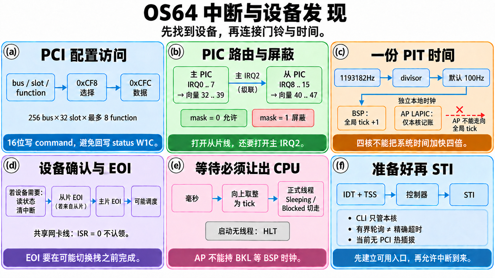
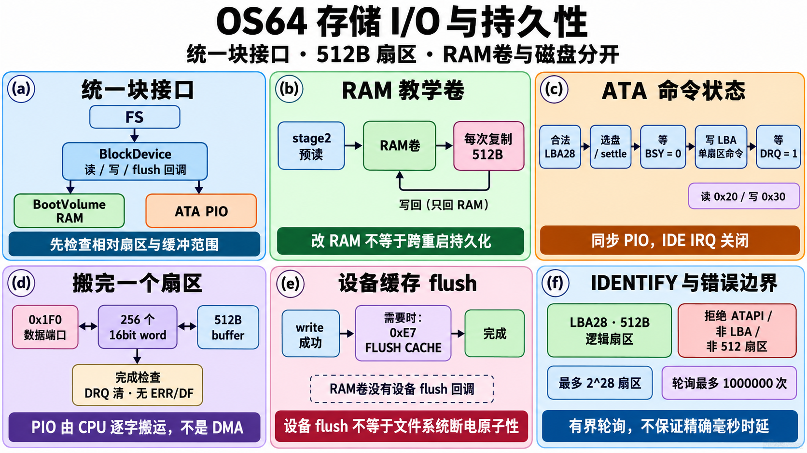
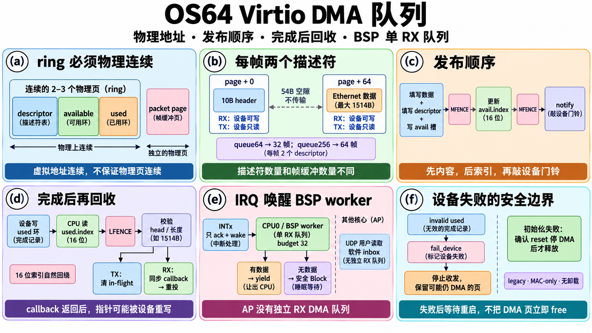

# 设备与 I/O 逐函数图解：输入、磁盘、DMA 与日志

本章解释 **162 个显式 C++ 定义**。同名 `in8/out8` 按文件前缀区分；这些前缀用于讲义，不是源码新增的命名空间。每行都是一个函数的实际契约：输入、输出或副作用、执行步骤、理由、边界和复杂度。复杂状态机另有展开，不能把一句“读硬件”当作完整解释。

原有函数实现没有因本章配图而修改；日志/性能头文件的旧单核注释已纠正。图使用内置图像生成工具直接生成，准确提示词与生成/审校记录分别保存到 `prompts/` 和 `images-io.json`。这里解释当前 x86 教学实现，不能据此声称已有 USB 输入、NVMe、多队列网卡、零拷贝或无锁内核。

## 五张图与共同约定

| 图号 | 图 | 读图顺序 |
| --- | --- | --- |
| I | [输入与行编辑](images/console-input.png) | 扫描码/串口字节 → 事件队列 → 等待 → 草稿 → VGA/串口 |
| H | [中断与设备发现](images/interrupt-devices.png) | PCI 枚举 → PIC 路由 → PIT 时间 → 中断确认 → 安全等待 |
| S | [存储 I/O](images/storage-io.png) | 块接口 → 两种后端 → PIO 状态机 → 512B 传输 → flush |
| V | [Virtio DMA](images/virtio-dma.png) | 物理连续 ring → 两描述符 → 发布 → 设备完成 → 有界 poll |
| O | [日志与观测](images/logging-observability.png) | 固定记录 → 序号环 → 覆盖 → 增量读取 → 快照 → 字节工具 |

**BKL 与 CLI 是两件事。** 本章共享内核对象的运行期调用发生在 CPU 所有的大内核锁内；CLI 只保护本 CPU 不被可屏蔽中断重入。许多内部助手只做 CLI，不自行取得 BKL。IRQ、syscall 或正式内核线程的调用链必须先遵守入口锁规则，见 [内核锁图解](SMP_BOOT_FUNCTIONS.md#内核锁三个函数维持一条不变量)。

复杂度以字符/字节数 N、线程槽 T=32、页分配器搜索范围 P、一次 poll 的预算 B 表示。固定容量让许多循环有上限，但“有上限的检查次数”不是“有精确毫秒时延保证”。设备端口和 DMA 地址也不是普通用户指针，不能直接由未经验证的用户输入决定。

## 控制台：一份草稿怎样同时画到两处

源码：[console.cpp](../../kernel/console/console.cpp)。VGA 为 80×25 字符单元，每单元 16 位：低字节字符、高字节颜色。输入编辑器维护 `length`、`cursor`、`history_cursor`，而屏幕光标只是它的显示结果。

### `console::console_read_line_with_history(buffer, capacity, history)` — I(d)、I(e)、I(f)

输入至少能放字符和 NUL 的缓冲区，以及可选历史回调；返回提交的长度，或 `SIZE_MAX` 表示超长整行拒绝。空缓冲/容量<2 返回0。开始时记屏幕起点和历史数量；没有事件就登记键盘等待并阻塞。登记失败的正式线程睡一 tick 调度出去，无正式线程的早期阶段才使用裸 HLT。

左右/Home/End 只移动编辑位置；Delete 删除光标右字符，Backspace 删除左字符；插入字符先把后缀右移。Up 首次保存未提交草稿，再复制历史；Down 到历史末尾恢复草稿。修改后统一重绘 VGA 与串口，Enter 添加 NUL 返回。插删/重绘最坏 O(N)，等待时间取决于输入。

容量将满时不是偷偷截断执行：设置 overflow，继续消费到 Enter，清缓冲并返回超长标志，此后退格/历史键也不恢复这条被截断草稿。草稿历史暂存256B，普通 Shell 输入上限255字符；更大调用缓冲不自动扩大暂存区。可打印字符限 ASCII，尚无 UTF-8/IME 或完整终端协议。控制台与 stdin 共用输入环，不能当多终端事件广播服务。

### 控制台其它函数逐一对照 — I(d)、I(e)、I(f)

| 函数 | 实际契约与执行逻辑 | 图块 |
| --- | --- | --- |
| `console::vga_buffer()` | 无参数→volatile 16位指针到0xB8000；避免把设备写当可省略RAM访问。没有映射/权限检查，依赖启动环境；O(1)。 | I(e) |
| `console::vga_cell(ch, color)` | 字符与颜色→高8位颜色、低8位字符的单元；字符先转uint8防符号扩展。仅编码，不绘制，O(1)。 | I(e) |
| `console::clear_row(row)` | 行号→写80个空格/当前色；全行清除，不限viewport列。调用方保证row<25，O(80)。 | I(e) |
| `console::scroll_if_needed()` | 当前行越过24→从start_row起逐行上移、清末行、光标回24；前面状态行保留，但滚动复制全部80列。未越界无动作；O(80×有效行数)。 | I(e) |
| `console::put_visible_char(ch)` | 可信可见字符→写光标单元并推进；列达右边界则回左边界、换行、必要时滚动。内部不验字符或坐标，调用链保证；通常O(1)，滚动O(屏幕单元)。 | I(e) |
| `console::newline()` | 无参数→列回viewport左侧、行加1、处理滚动；换行不是写可见符号。依赖已配置视口，通常O(1)，可能滚屏。 | I(e) |
| `console::backspace()` | 无参数→退一格并擦空；左列边界时回上一行末列，显示区域起点不再退。只改显示，不改草稿，O(1)。 | I(d)、I(e) |
| `console::is_printable_ascii(ch)` | 字符→是否0x20..0x7E；过滤不能直接展示的字节，不解码Unicode，O(1)。 | I(d) |
| `console::current_cursor()` | 无参数→row/column值副本；编辑器保存起点用，不读硬件光标寄存器，O(1)。 | I(d) |
| `console::set_cursor(cursor)` | 坐标副本→改逻辑row/column；不验范围/不发送串口转义，可信内部调用，O(1)。 | I(d)、I(e) |
| `console::set_cursor_to_line_offset(line_start, offset)` | 起点与字符偏移→按视口宽度商/余数算行列；可跨显示行，不解析宽字符。宽度非零与有效起点由配置/编辑状态保证，O(1)。 | I(d)、I(e) |
| `console::redraw_input_line(line_start, buffer, length, cursor, rendered_length)` | 草稿与旧渲染长度→先预卷屏，写max(新/旧长度)个字符或空格，再定位cursor并串口重绘；空rendered_length直接返回。调用方保证buffer/length/cursor合法；O(N+卷屏单元数)。 | I(d)、I(e)、I(f) |
| `console::copy_line_text(destination, capacity, out_length, source)` | 可信字符串→最多capacity-1字符＋NUL并写长度；source空表示空串，目标空/容量<2/长度指针空无动作。用于历史复制，可能截短，O(min(N,capacity))。 | I(d) |
| `console::history_entry_count(history)` | provider→调用entry_count或返回0；缺provider/回调允许无历史，不验证回调执行成本。自身O(1)，回调另算。 | I(d) |
| `console::console_set_viewport(start_column, end_column)` | 列区间→限制到80列；无效区间回退[0,80)，光标越界回左边界。保证写入宽度非零；不创建独立终端、不限制clear/scroll整行拷贝，O(1)。 | I(e) |
| `console::initialize_console(start_row, color)` | 起始行/色→越界行夹到24，设位置并清下面全部行，标initialized。早期初始化调用，不自动加锁；O(有效行×80)。 | I(e) |
| `console::console_is_initialized()` | 无参数→ready标志；方便早期日志判断显示是否可用，不检验后续映射，O(1)。 | I(e) |
| `console::console_write_char(ch)` | 字符→newline/backspace/ASCII写入三选一；其它字节丢弃。不向串口自动镜像每个输出、不解析ANSI；通常O(1)，可能滚屏。 | I(e) |
| `console::console_write_string(text)` | NUL文本→逐字符console_write_char；空指针无动作。调用方保证结束符，O(N+滚动成本)。 | I(e) |
| `console::console_set_color(color)` | 颜色→仅改变后续单元属性；不重染旧字符，不验证颜色语义，O(1)。 | I(e) |
| `console::console_clear()` | 无参数→清start_row之后所有80列并重置光标；不删除Shell历史，也不清输入队列；O(屏幕单元)。 | I(e) |
| `console::console_read_line(buffer, capacity)` | 输入区→转调带history接口但history=null；返回规则相同。不是简单尾部追加，仍支持编辑事件；复杂度与等待同主函数。 | I(d)、I(f) |

## 键盘：256格事件环不是256字节字符串

源码：[keyboard.cpp](../../kernel/interrupts/keyboard.cpp)。PS/2 Set1扫描码和串口翻译后的输入都进入同一事件环。方向键也是一个事件，但不是字符。环保存256个事件；`char_count`只统计其中字符事件。两组各32槽等待者分别等任意事件与字符。

### `keyboard::handle_keyboard_irq()` — I(a)、I(b)

无参数；若0x64状态说无输出则返回。否则从0x60读一个扫描码，记IRQ数与最近码。非E0路径单独更新左右Shift与CapsLock；其余交给翻译状态机。字母大小写按 Shift XOR CapsLock 决定，标点按有限替换表；翻译成功提交事件。它不在IRQ里执行Shell、读磁盘或重绘整行，固定映射规模O(1)，调用提交可能扫描等待者O(T)。

### `keyboard::keyboard_wait_for_input_event()` — I(c)

无参数，返回是否已有事件或完成一次阻塞/恢复。要求键盘ready、入口IF=1、当前为正式非idle线程；CLI后检查环、登记本线程、再次检查、再进入Blocked。无空槽/不能阻塞返回false并撤登记；恢复后清等待项。调用链一直持BKL，不能在登记到保存旧栈之间放开，避免唯一IRQ先唤醒Running线程失败、线程随后睡下。O(T)登记加调度选择，等待无有限时长保证；true不等于已消费事件。

### `keyboard::keyboard_wait_for_stream_char()` — I(c)

与任意事件等待同样的CLI→检查→登记→重查→Blocked链，条件改为`char_count>0`，队列改为stream_waiters。单纯方向键不应满足字符等待。返回/错误/复杂度与上一函数相同；stdin恢复以后仍须尝试读取，别的消费者可能先取得字符。

### 键盘辅助与公开查询逐函数表

| 函数 | 实际契约与执行逻辑 | 图块 |
| --- | --- | --- |
| `keyboard::out8(port, value)` | 可信端口/值→OUTB写8位；仅内核权限，不验端口范围，O(1)。 | I(a) |
| `keyboard::in8(port)` | 可信端口→INB读取8位；由调用方解释状态bit，错误设备不变成软件异常码，O(1)。 | I(a) |
| `keyboard::save_interrupt_flags_and_disable()` | 无参数→返回旧RFLAGS并CLI；只防本核IRQ，跨核还须BKL，O(1)。 | I(c) |
| `keyboard::restore_interrupt_flags(flags)` | 旧flags→POPFQ还原完整标志；可信内部保存值，不能接用户任意flags，不负责放BKL，O(1)。 | I(c) |
| `keyboard::advance_buffer_index(index)` | 0..255索引→加1且256归0；固定ring回绕，输入合法由调用者保证，O(1)。 | I(b) |
| `keyboard::wait_for_input_buffer_empty()` | 无参数→最多100000次读0x64，input-full清零成功；控制器异常返回false。这里是有界忙等，非100000毫秒，O(上限)。 | I(a) |
| `keyboard::drain_output_buffer()` | 无参数→最多100000次读掉旧0x60字节，输出为空即停；初始化避免把BIOS遗留当新键，达到上限也不返回错误，O(上限)。 | I(a) |
| `keyboard::translate_regular_scancode(scancode, out_event)` | Set1码→字符事件/bool；空输出、释放码bit7=1或未映射码false。有限switch映射ASCII，Shift/Caps由IRQ层处理，O(1)。 | I(a) |
| `keyboard::translate_extended_scancode(scancode, out_event)` | E0后的码→方向/Delete/Home/End事件；释放/未知/空输出false，character清0。不支持任意扩展序列，O(1)。 | I(a) |
| `keyboard::translate_scancode_to_input_event(scancode, out_event)` | 字节→翻译结果；E0只设置前缀并false，下个字节清前缀后走扩展，否则普通。跨IRQ保留解码状态，不是每字节必有字符，O(1)。 | I(a) |
| `keyboard::enqueue_input_event(event)` | 事件→写尾槽、回绕、增加事件数，字符则增加char_count；满256格丢事件并加dropped计数。该计数虽叫char也含被丢非字符，不自行加锁，O(1)。 | I(b) |
| `keyboard::try_dequeue_input_event(out_event, characters_only)` | 输出区/模式→队首事件/bool；空区/空环false。characters_only遇非字符不消费，成功推进head/count并相应减char_count；调用方保护，O(1)。 | I(b)、I(c) |
| `keyboard::stream_waiter_is_registered(thread)` | 线程→是否在字符waiters；空线程false，逐32槽地址比较，无TID代数机制，O(T)。 | I(c) |
| `keyboard::register_stream_waiter(thread)` | 线程→去重后占第一个空字符等待槽/bool；空或全满false，既有项true，不改变Blocked状态，O(T)。 | I(c) |
| `keyboard::unregister_stream_waiter(thread)` | 线程→清字符等待数组中的匹配项；空无动作，不销毁线程或消费字符，O(T)。 | I(c) |
| `keyboard::input_waiter_is_registered(thread)` | 线程→是否已在任意事件waiters；空false，地址扫描，由调用方保证TCB生命周期，O(T)。 | I(c) |
| `keyboard::register_input_waiter(thread)` | 线程→去重/占空任意事件槽；空/满false，既有项true。与stdin字符队列分开，O(T)。 | I(c) |
| `keyboard::unregister_input_waiter(thread)` | 线程→清任意事件队列匹配项；只取消登记，不自动改线程状态，O(T)。 | I(c) |
| `keyboard::wake_input_waiters()` | 无参数→对每个非空任意事件等待者scheduler_wake_thread，再清槽；有新事件就重试，不保证每人拿到事件，O(T+调度入队成本)。 | I(c) |
| `keyboard::wake_stream_waiters()` | 无参数→唤醒并清字符等待者；提交字符才调用，但满环时也可能发生无新增字符的唤醒，消费者须重查，O(T+调度成本)。 | I(c) |
| `keyboard::initialize_keyboard()` | 无参数→排旧字节、清计数/环索引/前缀/修饰键和两组等待者，设ready并true；是启动重置，不应覆盖运行中等待者。O(T+控制器轮询)。 | I(a)、I(b) |
| `keyboard::keyboard_is_ready()` | 无参数→initialized!=0；不证明后续硬件可响应，O(1)。 | I(a) |
| `keyboard::keyboard_submit_input_event(event)` | 合法事件→ready时CLI、enqueue、wake任意等待者，字符再wake字符等待者，恢复flags；未ready忽略。即使环满也会唤醒，故wake不是交付保证，O(T+调度成本)。 | I(b)、I(c) |
| `keyboard::keyboard_irq_count()` | 无参数→已读取扫描码的IRQ次数；无数据IRQ不加，不等于输入字符数，O(1)。 | I(a)、O(e) |
| `keyboard::keyboard_last_scancode()` | 无参数→最近原始字节，可能是E0或释放码，不能直接当ASCII，O(1)。 | I(a)、O(e) |
| `keyboard::keyboard_buffered_char_count()` | 无参数→环内字符事件数；不含方向键，不是ring总占用，O(1)。 | I(b)、O(e) |
| `keyboard::keyboard_dropped_char_count()` | 无参数→满环时丢弃的事件计数；历史累计而非当前长度，名称不限制为字符，O(1)。 | I(b)、O(e) |
| `keyboard::keyboard_try_read_input_event(out_event)` | 输出区→CLI保护出任意事件再还原flags；空指针false，无事件false，console使用它保留编辑语义，O(1)。 | I(b)、I(d) |
| `keyboard::keyboard_try_read_char(out_char)` | 输出字符区→只接受队首字符；非字符头不消费false。用于严格字符尝试，可能挡住后面的字符；空指针false，O(1)。 | I(b) |
| `keyboard::keyboard_try_read_stream_char(out_char)` | 输出区→逐个取事件，丢掉编辑事件直到字符或空；stdin语义避免头部箭头堵塞，但会消费这些事件。空false，最坏O(256)，不是向console广播。 | I(b)、I(c) |
| `keyboard::keyboard_inject_test_scancode(scancode)` | 测试字节→两次等控制器空，发0xD2再写字节；任一超限false。仅8042/QEMU教学测试注入，不是正常键盘驱动输入来源，O(轮询上限)。 | I(a) |

## 串口：字节也能变成同一组编辑事件

源码：[serial.cpp](../../kernel/interrupts/serial.cpp)。COM1 基址0x3F8，IRQ4。这里只支持少量ANSI按键序列和ASCII，输出轮询最多100000次，输入IRQ每次最多读取256字节。`ESC`、`[`、后续字节是跨调用状态，不能逐字节当普通字符显示。

| 函数 | 实际契约与执行逻辑 | 图块 |
| --- | --- | --- |
| `serial::out8(port, value)` | 可信端口/值→OUTB；调用方知道COM寄存器含义，无软件范围验证，O(1)。 | I(f) |
| `serial::in8(port)` | 可信端口→INB；0xFF在初始化可表示设备无效，不是所有调用都统一错误码，O(1)。 | I(f) |
| `serial::put(ch)` | 字节→等LSR bit5发送空后写数据；100000次后静默放弃，避免无限卡机。同步忙等非异步TX队列，O(上限)。 | I(f) |
| `serial::movement(count, direction)` | 位移数与C/D→发ESC[十进制数方向；0无动作。20字符数值暂存符合size_t范围，内部仅左右控制，O(数字位数×put成本)。 | I(f) |
| `serial::submit(ch)` | RX字节→有限escape状态机，A/B/C/D/H/F/3~变编辑事件；CR→LF、CRLF去重、DEL→BS，非法控制字节丢弃，提交键盘队列。每字节O(1)+唤醒成本，不是完整ANSI/UTF-8解码器。 | I(a)、I(f) |
| `serial::initialize_serial_input()` | 无参数→要求键盘ready且LSR≠0xFF；关UART中断、8N1保留启动波特率、开清FIFO/OUT2、复位解析器、开RX中断与PIC IRQ4。失败false；不重新探测任意串口，O(1)。 | I(a)、H(b) |
| `serial::serial_begin_input_line()` | 无参数→input_cursor=0；只是同步新草稿显示位置，不清UART RX或键盘环，O(1)。 | I(d)、I(f) |
| `serial::serial_move_input_cursor(cursor)` | 目标位置→ready时计算左右差并发movement，记录位置；不ready无动作，不验证cursor≤草稿长，O(数字位数×输出成本)。 | I(f) |
| `serial::serial_redraw_input_line(buffer, length, cursor)` | 有效草稿→先回input_cursor列，输出length字符、ESC[K清右侧，更新并移动目标cursor；未ready忽略。没有按缓冲容量检查，编辑器保证，O(N×输出成本)。 | I(d)、I(f) |
| `serial::serial_end_input_line()` | 无参数→ready时输出CRLF，始终归零input_cursor；不提交命令，O(输出轮询)。 | I(f) |
| `serial::handle_serial_irq()` | 无参数→最多256次LSR有数据就读并submit，最后读IIR确认；不在此解释Shell/改草稿，EOI由上层IRQ处理。O(256×提交成本)。 | I(a)、H(d) |

## PCI 与 PIC：找到设备，再把门铃接对

源码：[pci.cpp](../../kernel/device/pci.cpp)、[pic.cpp](../../kernel/interrupts/pic.cpp)。PCI 配置机制#1使用0xCF8选择地址、0xCFC读取数据，这两步须在同一受保护调用链，不能让别核中途替换地址。PIC管理16根线，重映射到32..47；BSP保留虚拟线路，AP本地钟另走LAPIC。

| 函数 | 实际契约与执行逻辑 | 图块 |
| --- | --- | --- |
| `pci::address(device, offset)` | bus/slot/function/offset→使能bit31＋位域拼接，offset清低2位；仅标准256B配置空间，不是PCIe ECAM，内部调用参数有效，O(1)。 | H(a) |
| `pci::select(device, offset)` | 设备/偏移→OUTL到0xCF8；只选择，不读数据，BKL保护选择与后续数据端口不被别核混用，O(1)。 | H(a) |
| `pci::pci_read32(device, offset)` | 设备/偏移→select后INL 0xCFC；按4B对齐读，调用者拆vendor/device等，无设备通常全1，O(1)。 | H(a) |
| `pci::pci_read16(device, offset)` | 设备/偏移→select再从0xCFC+(offset&2) INW；只支持对齐16位位置，避免错读相邻字段，O(1)。 | H(a) |
| `pci::pci_write16(device, offset, value)` | 16位值→选择后OUTW；写command不把邻接status的write-one-to-clear位一起回写。内部偏移正确由调用者保证，O(1)。 | H(a) |
| `pci::pci_find_device(vendor, id, result)` | 标识与输出→扫描256bus×32slot，func0缺设备跳slot，多功能才扫8func，首个匹配复制并true；空输出/无匹配false。穷举有界O(256×32×8)，未建立PCI树/热插拔。 | H(a) |
| `pci::pci_disable_msix(device)` | 设备→status无capabilities直接返回；从0x34追对齐cap链最多48项，找到ID0x11清MSI-X enable。自环/低于0x40/超上限停止；不支持所有中断机制，O(48)。 | H(a)、H(b) |
| `pic::out8(port, value)` | 可信端口/值→OUTB；上层只访问PIC寄存器，函数不验权限/设备，O(1)。 | H(b) |
| `pic::in8(port)` | 端口→INB；读取mask再改一bit要受保护，不是原子硬件RMW，O(1)。 | H(b) |
| `pic::io_wait()` | 无参数→向0x80写0，给旧式端口访问一点间隔；不是精确睡眠或等待一次IRQ，O(1)。 | H(b) |
| `pic::initialize_pic()` | 无参数→依次ICW1/向量基址/级联/8086模式，主mask=0xFE只放IRQ0、从mask=0xFF；每步io_wait，返回true但无硬件回读验证，启动调用，O(1)。 | H(b) |
| `pic::enable_pic_irq(irq_line)` | 0..15线→清对应mask位；从片线还清主IRQ2级联位；越界false。位0是允许，不能画反；O(1)。 | H(b) |
| `pic::disable_pic_irq(irq_line)` | 0..15线→置mask位屏蔽；从片仅改自身，不重新屏蔽主级联，越界false，O(1)。 | H(b) |
| `pic::send_pic_eoi(vector)` | 中断向量→40..47先从片EOI，再总向主片EOI；调用方应传PIC向量。不是清网卡源，要先设备read-to-clear；O(1)。 | H(d) |

## PIT：一份系统时间，不是四核相加

源码：[pit.cpp](../../kernel/interrupts/pit.cpp)。输入频率1193182Hz，通道0经IRQ0。默认配置100Hz；毫秒等待向上取整。只有BSP PIT增加系统全局tick，AP本地LAPIC只做本核时间片记账。

| 函数 | 实际契约与执行逻辑 | 图块 |
| --- | --- | --- |
| `pit::out8(port, value)` | 可信端口/字节→OUTB到PIT命令或数据寄存器；不等一个tick，O(1)。 | H(c) |
| `pit::initialize_pit(frequency_hz)` | 非零Hz→divisor=1193182/Hz，要求1..65535，清计数并写模式0x34/除数低高字节，设ready；非法false。记录请求频率，实际频率受整数除数误差影响，O(1)。 | H(c) |
| `pit::handle_timer_irq()` | 无参数→PIT tick加1，再scheduler_handle_timer_tick推进全局期限与本核记账；仅BSP IRQ0路径。自身O(1)，睡眠扫描/调度另算；不直接EOI。 | H(c)、H(d) |
| `pit::timer_tick_count()` | 无参数→自PIT初始化起的计数，不是调度器从初始化起的total_ticks；O(1)。 | H(c)、O(e) |
| `pit::timer_frequency_hz()` | 无参数→已记录的请求Hz；未初始化为0，不保证精密校准实际Hz，O(1)。 | H(c)、O(e) |
| `pit::timer_is_ready()` | 无参数→ready标志，不能证明未来IRQ一直到达，O(1)。 | H(c) |
| `pit::timer_wait_ticks(ticks)` | 相对等待→0/未ready无动作；正式非idle线程调用scheduler_sleep并切走，启动无线程才差值HLT/yield循环。void不转报睡眠失败；不可AP持BKL等BSP时钟。调度成本加实际等待，无精确截止时延。 | H(e) |
| `pit::timer_sleep_ms(milliseconds)` | ms→ready要求、0成功，先验乘加溢出，再ceil(ms×Hz/1000)至少1tick；正式线程还验total_ticks加法并返回sleep结果，否则调用启动等待。有限时钟量化，不是忙等毫秒循环，O(1)+调度/等待。 | H(e) |

## 存储：统一块接口不代表统一持久性

源码：[boot_volume.cpp](../../kernel/storage/boot_volume.cpp)、[block_device.cpp](../../kernel/storage/block_device.cpp)、[ata_pio.cpp](../../kernel/storage/ata_pio.cpp)。一个扇区512B。BootVolume是stage2已经预读到RAM的教学卷，写入只是改内存；ATA PIO是真实IDE磁盘路径。文件系统通过回调表调用它们，不需要知道后端端口。

### ATA 一次单扇区传输怎样推进 — S(c)、S(d)、S(e)

`issue()`先验证ready、容量与LBA28范围，选择主盘和LBA高4位，四次alternate-status读取让设备稳定；等待不忙/无DRQ时不让上一条ERR阻断新命令。写count=1及LBA其余字节，写READ0x20或WRITE0x30，等BSY清且DRQ置位。读/写函数通过0x1F0搬256个16位word，最后确认DRQ清、无ERR/DF。轮询最多1000000次，错误状态保存供诊断，不是异步IDE IRQ/DMA。

write返回成功不是文件系统断电原子性保证；需要flush0xE7让设备缓存完成，再由更高层决定事务提交。当前无持久化日志恢复，不能把成功flush画成突然断电永远不会损坏文件系统。

### BootVolume 与块抽象逐函数表

| 函数 | 实际契约与执行逻辑 | 图块 |
| --- | --- | --- |
| `boot_volume::initialize_boot_volume(volume, boot_info)` | 输出与可信启动信息→清为未ready，再验证指针非零/扇区数非零/扇区512，直接记录RAM基址与容量并true；空/非法false。不复制整卷、不验证任意伪造BootInfo的内存范围，O(1)。 | S(a)、S(b) |
| `boot_volume::boot_volume_is_ready(volume)` | 对象→非空且ready；只结构标志，不重新验证磁盘/映射，O(1)。 | S(b) |
| `boot_volume::boot_volume_total_bytes(volume)` | ready对象→64位sector_count×sector_size，否则0；避免容量乘法32位截断，O(1)。 | S(a) |
| `boot_volume::boot_volume_read_sector(volume, sector_index, buffer, buffer_size)` | 相对扇区/输出→验ready、指针、容量和索引，按偏移复制512B；非法false。byte_offset当前32位，安全范围依赖stage2小卷约定，不是任意超大RAM盘接口，O(512)。 | S(b) |
| `boot_volume::boot_volume_write_sector(volume, sector_index, buffer, buffer_size)` | 相对扇区/输入→同样检查后复制回RAM卷；不写IDE、不跨重启持久化。当前偏移限制同读函数，O(512)。 | S(b) |
| `block_device::read_boot_volume_sector(context, sector_index, buffer, buffer_size)` | 回调context→转BootVolume并转调读；统一回调签名，不额外验对象；结果/代价由后端决定。 | S(a)、S(b) |
| `block_device::write_boot_volume_sector(context, sector_index, buffer, buffer_size)` | 可写context→转调RAM卷写；回调能变后端不意味自动落盘，边界由后端检查。 | S(a)、S(b) |
| `block_device::initialize_block_device_from_boot_volume(device, volume)` | 输出/ready卷→填context、start_lba、容量、512B、读写指针，flush=null、ready；非法false。仅挂表，不做I/O，O(1)。 | S(a) |
| `block_device::block_device_is_ready(device)` | 对象→非空/ready/512B/容量非零/读写回调均有才true；当前不接只读缺写回调后端，O(1)。 | S(a) |
| `block_device::block_device_total_bytes(device)` | ready对象→64位容量，否则0；只是容量描述不是可读缓存量，O(1)。 | S(a) |
| `block_device::block_device_read_sector(device, sector_index, buffer, buffer_size)` | 相对扇区/输出→先验对象、指针、size≥512、index<capacity，再调用read_sector；不自行加start_lba、不解析FS。O(1)+后端。 | S(a) |
| `block_device::block_device_write_sector(device, sector_index, buffer, buffer_size)` | 相对扇区/输入→同样验界再write回调；写入可失败，上层负责事务。O(1)+后端，不自动flush。 | S(a)、S(e) |
| `block_device::block_device_flush(device)` | 对象→未ready false；无flush回调视为成功，有则调用。RAM卷无设备缓存要刷，但true不代表它持久化；O(1)+后端。 | S(e) |

### ATA PIO 逐函数表

| 函数 | 实际契约与执行逻辑 | 图块 |
| --- | --- | --- |
| `ata_pio::in8(port)` | 状态/错误端口→INB值；内部合法端口调用，解释BSY/DRQ/ERR由上层，O(1)。 | S(c) |
| `ata_pio::out8(port, value)` | ATA命令/地址字节→OUTB；不等待命令完成，后续wait_status必要，O(1)。 | S(c) |
| `ata_pio::in16(port)` | 数据端口→16位word；单次不足一扇区，读函数循环256次，O(1)。 | S(d) |
| `ata_pio::out16(port, value)` | 16位word→数据端口；前提DRQ允许传输，函数本身不验状态，O(1)。 | S(d) |
| `ata_pio::settle()` | 无参数→读alternate status0x3F6四次，给选择/命令延迟；不清正常status中断源，不是通用定时sleep，O(1)。 | S(c) |
| `ata_pio::wait_status(disk, data_request, check_error=true)` | 有效disk/目标DRQ态→最多百万读status；0/0xFF失败，BSY继续，允许查错时ERR/DF记last_error失败，DRQ符合则true。调用方保证disk，O(轮询上限)。 | S(c)、S(f) |
| `ata_pio::issue(disk, lba, command)` | ready盘/合法LBA/READ或WRITE→选择盘、稳定、等待、写1扇区地址/命令、等DRQ；越界/超LBA28/设备错误false。内部命令由调用者限制，O(轮询上限)。 | S(c) |
| `ata_pio::read_adapter(context, sector, buffer, size)` | const回调context→转为ATA对象后调用读；const_cast因为读也记录状态错误，不表示扇区数据被修改。检查/成本同读后端。 | S(a) |
| `ata_pio::write_adapter(context, sector, buffer, size)` | context→转调ATA写；用于BlockDevice函数表，不另做事务，检查/成本同后端。 | S(a) |
| `ata_pio::flush_adapter(context)` | context→转调ATA flush；让统一块接口可控制设备缓存，非法由后端拒绝。 | S(a)、S(e) |
| `ata_pio::initialize_ata_pio_primary_master(disk)` | 输出→清状态、nIEN关IDE IRQ、选择主盘、IDENTIFY0xEC读256word；拒ATAPI/无LBA能力/明确非512逻辑扇区；取LBA28容量并截到2^28。空/无响应/非法false，O(256+轮询)。 | S(c)、S(f) |
| `ata_pio::initialize_block_device_from_ata_pio(device, disk)` | 输出/readyATA→清device并挂context、512B容量、读写/flush回调与ready；无效false。只primary master，不检测AHCI/NVMe，O(1)。 | S(a) |
| `ata_pio::ata_pio_read_sector(disk, lba, buffer, size)` | ≥512B输出→issue0x20、256次INW按低/高字节写、稳定再验完成；空/短区/错误false，可能已部分修改buffer，不承诺失败不写；O(512+轮询)。 | S(d)、S(f) |
| `ata_pio::ata_pio_write_sector(disk, lba, buffer, size)` | ≥512B输入→issue0x30、256次OUTW、稳定并验完成；错误false可能已传出数据，非事务回滚；不自动flush。O(512+轮询)。 | S(d)、S(e)、S(f) |
| `ata_pio::ata_pio_flush(disk)` | ready盘→选择主盘、等空闲（忽略旧ERR）、发0xE7、等完成；非法/设备错false。是设备缓存完成请求，不提供FS日志恢复；O(轮询上限)。 | S(e) |

## Virtio：CPU 与网卡怎样交换 DMA 缓冲

源码：[virtio_net.cpp](../../kernel/net/virtio_net.cpp)、[network_irq.cpp](../../kernel/net/network_irq.cpp)、[network.hpp](../../kernel/net/network.hpp)。驱动支持legacy PCI设备1AF4:1000、revision0、I/O BAR、MAC特性；没有协商校验和卸载/GSO/合并接收/间接描述符。

### 先把四个对象分开 — V(a)、V(b)、V(c)、V(d)

**Descriptor**告诉设备物理地址/长度/方向；**available ring**是CPU公布可用头描述符的清单；**used ring**是设备完成的清单；**packet page**存真实字节。legacy queue PFN只给一个起始物理地址，ring本身需连续2或3个物理页，C++指针连续不等于物理连续。每个包的page可独立分配。

每帧用两个描述符：10B virtio header在page+0，Ethernet数据在page+64，中间54B是空隙，不计入传输长度。RX两描述符都有设备可写标志；TX没有。队列支持64/128/256描述符，但每帧用2个且上限64帧，因此queue64只提供32个RX/TX帧缓冲，queue128/256提供64个。

发布严格按“写数据/descriptor/available槽 → MFENCE → available.index → MFENCE → 设备notify”。设备写used.index后CPU读并LFENCE，再读取completed元素和缓冲。索引为16位自然回绕；差值按模65536解释，不能用普通大小比较判是否新完成。

### `virtio_net::allocate_ring(queue, id)` — V(a)、V(f)

选择设备队列，读size并要求64..256且2的幂、queue PFN当前为0。按布局算used的页对齐偏移和总2/3页；反复从分配器搜索相邻物理页，遇不连续先释放本次已取页再从下一个起点尝试。成功记录页数、直映指针、清ring、设NO_INTERRUPT、写queue PFN并回读确认；不成功false。

传入queue为内部合法对象；函数依赖已设置的allocator/设备I/O基址。成功拿页后其它阶段失败由初始化路径reset确认后释放，不能让仍DMA的设备指向已重用页面。最坏是页候选数×逐次页分配搜索成本，不能误称O(1)；容量小也不能替代物理连续性验证。

### `virtio_net::virtio_net_initialize(allocator)` — H(a)、V(a)、V(b)、V(f)

ready实例直接true；空allocator或已有初始化尝试的实例false，故失败后不就地重复分配。找到设备、检查revision和I/O BAR，记录IRQ/PIC line，禁MSI-X、开I/O与bus-master并先屏蔽INTx，reset读回0后设ACK/DRIVER；要求MAC特性，只协商MAC并校验有效单播地址。

准备RX/TX rings，按队列大小求32/64帧容量；RX逐页分配/清零/配置可写描述符并enqueue；TX逐页准备。准备失败尝试reset，只有设备确认0才释放页；无法确认停DMA时保留。最后写DRIVER_OK并回读，成功才notify RX。DMA故障后没有热恢复/重初始化接口，不能把“保留页防DMA访问释放内存”当正常资源回收。成本由连续页搜索、页面分配与清零主导。

### `virtio_net::virtio_net_poll(budget, handler, context)` — V(d)、V(e)、V(f)

设备未ready/无handler/预算0返回0，预算截到RX容量。先回收TX；非IRQ模式读ISR清源；待配置改变时重读并验MAC。读取used.index并acquire，完成数若大于RX容量视为设备坏。每次检查head范围、used长度在header+14..header+1514、缓冲有效且header flags/gso_type为0；非法包计drop，合法包计数并同步调用handler。随后推进last_used、把头重新enqueue，批次末notify。

返回处理过的条目数，包含被丢弃的包；不是handler成功包数。读取的end是本批快照，预算用完或后来新包留给下批。handler拿到的是page+64借用指针，返回后重投给设备，不能把该指针长期保存。预算限制循环，但handler执行成本仍由协议层决定，O(B×(校验+callback))。当前只有BSP收包worker消费单RX队列，没有每核DMA队列。

### `virtio_net::virtio_net_send(frame, bytes)` — V(b)、V(c)、V(d)

要求ready、有效帧指针与14..1514B。先只reap TX、不递归RX；扫描未in-flight槽，满则tx_busy++并false。清10B header、复制帧到page+64、配两描述符、标in-flight、enqueue并notify，再计TX次数/字节。成功只表示交给本机设备队列，不是远端ACK；槽只能在used完成后回收。O(TX槽数+N+completion数)，没有零拷贝。

### Virtio 其余函数与网络IRQ逐一对照

下表列出上述四个复杂函数之外的20个Virtio定义，以及网络IRQ的3个定义与IPv4构造助手。表格所说的容量始终区分descriptor数与帧buffer数。

| 函数 | 实际契约与执行逻辑 | 图块 |
| --- | --- | --- |
| `virtio_net::in8(port)` | 寄存器端口→8位值；用于status/ISR/MAC，read-to-clear副作用由具体寄存器决定，内部合法端口，O(1)。 | V(d)、H(d) |
| `virtio_net::in16(port)` | 端口→16位队列大小/选择相关值；不自动转为网络字节序，O(1)。 | V(a) |
| `virtio_net::in32(port)` | 端口→32位feature/PFN值；读取可能影响设备状态的契约由硬件说明，调用者限定，O(1)。 | V(a) |
| `virtio_net::out8(port, value)` | 端口/值→OUTB设备status/控制；不等于DMA发布屏障，O(1)。 | V(f) |
| `virtio_net::out16(port, value)` | 端口/值→OUTW选queue或notify；描述符必须先正确发布，函数不自行MFENCE，O(1)。 | V(c) |
| `virtio_net::out32(port, value)` | 端口/值→OUTL features/PFN；不能用虚拟地址替PFN，内部值预验，O(1)。 | V(a) |
| `virtio_net::publish_barrier()` | 无参数→MFENCE＋编译器memory约束；先让DMA缓冲/描述符写可见再公开index，不是取得BKL，O(1)。 | V(c) |
| `virtio_net::acquire_barrier()` | 无参数→LFENCE＋编译器memory约束；读设备完成index后再观察元素/字节，不回收页面，O(1)。 | V(d) |
| `virtio_net::align_page(value)` | 内部小正数→(value+4095)&~4095向上页对齐；通用溢出不检查，当前ring大小有界，O(1)。 | V(a) |
| `virtio_net::release_pages()` | 无参数→释放记录的两ring页及非零RX/TX页；只在已确认reset停DMA的初始化清理调用，不清记录、不支持重复free，O(分配页数)。 | V(f) |
| `virtio_net::enqueue(queue, head)` | 合法头→写available[2+next%size]并16位next加1；不立即公开index/notify，调用方保证size/descriptor/空间，O(1)。 | V(c) |
| `virtio_net::notify(queue, id)` | 队列/编号→MFENCE、写available.index、MFENCE、OUTW doorbell；保证设备先见内容后见可用数，不保证已发出包，O(1)。 | V(c) |
| `virtio_net::configure_chain(queue, head, next, page, payload_length, writable)` | 已分配page/两个索引→10B header链到page+64数据，RX设WRITE、TX不设；不协商ANY_LAYOUT所以必须分开header，内部索引/长度已限，O(1)。 | V(b) |
| `virtio_net::fail_device()` | 无参数→errors++、ready=false、status=0x87、关本设备INTx；保留可能仍DMA的页，等待重启，不热修复，O(1)。 | V(f) |
| `virtio_net::reap_transmit()` | 无参数→读TX used.index并acquire；若差>buffer数或head非法/不在途则fail；合法逐个清in-flight/推进last_used。尚未完成槽不可复用，O(本批TX完成数)。 | V(d)、V(f) |
| `virtio_net::virtio_net_status()` | 无参数→状态const引用；不刷新设备、不创建快照或取锁，读取调用方保护/按文档语义解释，O(1)。 | O(e)、V(f) |
| `virtio_net::virtio_net_enable_receive_interrupts()` | 无参数→要求ready/合法ELCR电平line；设电平并回读，RX允许IRQ、TX抑制、屏障/清ISR、开PCI INTx。非法false；本函数不负责PIC解mask，不开MSI-X，O(1)。 | H(b)、V(e) |
| `virtio_net::virtio_net_disable_receive_interrupts()` | 无参数→已开时屏蔽本设备PCI INTx、RX NO_INTERRUPT、屏障/清ISR、置irq_enabled=false；不屏蔽共享PIC line，避免伤其它设备，O(1)。 | H(b)、V(f) |
| `virtio_net::virtio_net_acknowledge_irq(irq_line)` | IRQ线→启用且匹配时read-to-clear ISR；bit0/1均无则false不认领；有则计IRQ/config待处理、acquire并true。先撤设备电平再PIC EOI，不解析包，O(1)。 | H(d)、V(e) |
| `virtio_net::virtio_net_receive_pending()` | 无参数→ready时读used.index/acquire，返回config_pending或index≠last_used；只是有工作，不消费包，O(1)。 | V(e) |
| `network_irq::network_enable_irq(worker)` | 有效长期kernel非idle线程→要求网卡ready/IF开，已有worker只接受同一人；CLI注册、开设备与PIC，失败撤回，最后STI。O(1)，TCB须保持存活，不能随便传短命线程。 | V(e)、H(b) |
| `network_irq::network_handle_irq(irq_line)` | 线号→设备ack不认领false，否则wake长期worker并true；IRQ不拷包、不分配、不切栈，worker已Running时wakefalse也可。O(唤醒成本)。 | V(e)、H(d) |
| `network_irq::network_wait_for_event()` | worker上下文→IRQ不可用/设备坏退一tick sleep；否则须当前worker/IF开，CLI查pending；有数据则STI并yield一次，无则安全Block后开中断。BKL保护无漏醒，不保证持续流量的公平实时份额。 | V(e)、H(e) |
| `network::network_ipv4(a, b, c, d)` | 四个8位octet→按a<<24/b<<16/c<<8/d拼32位协议值；先转uint32防移位符号问题。不是主机内存中IPv4结构、不查路由，O(1)。 | V(e) |

## 日志与性能：先准确记录，再解释数字

源码：[log.cpp](../../kernel/log/log.cpp)、[perf.cpp](../../kernel/perf/perf.cpp)、[runtime.cpp](../../kernel/runtime/runtime.cpp)。日志最多256条，每条128B，component内容最多15字节、message内容最多87字节再加NUL；按字节计数，不是按Unicode字符个数计数。sequence从1增加；容量满时覆盖最旧记录并统计overwritten。日志writer不分配、阻塞或写串口，不在每tick格式化输出。

| 函数 | 实际契约与执行逻辑 | 图块 |
| --- | --- | --- |
| `log::InterruptGuard::InterruptGuard()` | 无参数→保存本核flags并CLI；保护ring短临界区，BKL保护跨核，host-test版本为空。非递归大锁，O(1)。 | O(a) |
| `log::InterruptGuard::~InterruptGuard()` | 作用域结束→旧IF=1才STI，否则保持关；不释放BKL/不写日志，O(1)。 | O(a) |
| `log::copy_text(output, capacity, text)` | 有效输出、正容量、可选NUL文本→截到capacity-1并加NUL，text空写空；内部16/88容量保证，capacity0不支持，O(min(N,capacity))。 | O(a) |
| `log::kernel_log_initialize()` | 无参数→guard下清256×128B、sequence=1/overwritten=count=0；启动清空，不保留跨重启日志，不应运行期抹掉未导出记录，O(容量字节数)。 | O(b) |
| `log::kernel_log_write(level, component, message)` | 等级/文本→(next-1)%256槽清零，填seq/tick/level、截文、next++；未满count++否则overwritten++。等级内部可信、不做过滤；reserved/填充清0。固定128B成本，O(1)。 | O(a)、O(b)、O(c) |
| `log::kernel_log_process_event(level, event, pid)` | 生命周期事件/PID→栈88B拼最多65字节事件＋" pid="＋最多10个ASCII数字字节，再写process组件。无堆分配，固定边界保证NUL；只生命周期调用而非每tick，O(固定字节数)。 | O(a) |
| `log::kernel_log_read(after_sequence, output, capacity)` | 序号/输出条数→guard下从max(最旧保留号,after+1)顺序复制；空/0容量/after已最新返回0，旧记录被覆盖只返回仍在环里的。O(min(capacity,256))，不是磁盘读取，无64位序号回绕恢复设计。 | O(c)、O(d) |
| `log::kernel_log_stats()` | 无参数→guard下next_sequence/overwritten/count值副本；无需遍历日志，不自动重置丢失计数，O(1)。 | O(c)、O(e) |
| `log::kernel_log_level_name(level)` | 数字→debug/info/warn/error，未知→unknown；静态字符串，不改级别或过滤，O(1)。 | O(a) |
| `perf::performance_snapshot(output)` | 有效内核输出→空则返回；CLI清128B v1，填PIT时间/Hz、全局调度计数、free_page_count、heap used、日志统计、CPU能力与原始TSC，再恢复旧IF。调用路径持BKL，CLI本身不能跨核取一致快照；无分配、固定字段O(1)。TSC不转纳秒，user_ticks另见SMP快照，不能据此宣称纯用户占用率。 | O(e) |

### freestanding 字节工具逐函数表 — O(f)

内核没有自动依赖宿主C库，编译器仍可能把结构初始化降低成`memset/memcpy`，因此提供这些C ABI符号。全部要求调用方保证N个字节可访问，不做用户指针校验/页映射/锁获取；使用它们不自动获得DMA发布顺序。

| 函数 | 实际契约与执行逻辑 | 图块 |
| --- | --- | --- |
| `runtime::memory_set(destination, value, size)` | 可写区/8位值/N→逐字节填N并返回原destination；N0不访问，非零无空检查，O(N)。 | O(f) |
| `runtime::memset(destination, value, size)` | C ABI整数值→转uint8并委托memory_set；仅freestanding编译分支，语义为低8位填充，O(N)。 | O(f) |
| `runtime::memcpy(destination, source, size)` | C ABI区间→委托memory_copy；重叠区不支持，要用memmove，O(N)。 | O(f) |
| `runtime::memmove(destination, source, size)` | 可重叠N字节区→dst地址高于src从末尾倒复制，否则顺复制，返回dst；避免尚未读取的源被覆盖。地址比较依赖当前平坦x86环境，无范围验证，O(N)。 | O(f) |
| `runtime::memcmp(left, right, size)` | 两个N字节区→首个无符号字节不同返回-1/1，全同0；非字符串结束比较、不是恒定时间密码比较，最坏O(N)，可提前结束。 | O(f) |
| `runtime::memory_copy(destination, source, size)` | 非重叠区→从0到N-1逐字节复制并返回dst；内核最基本实现，不自称最快/零拷贝，O(N)。 | O(f) |

## 对着图检查三条完整链

**按方向键。** 键盘E0前缀或串口ESC序列→一个编辑事件→256格环→console任意事件等待者Ready→编辑光标改变→VGA坐标与串口转义同步。唤醒只是可重试，不保证该消费者拿到事件。stdin的stream路径会跳过并消费编辑事件，不能把这份输入环当多个终端各自的事件流。

**磁盘写一个扇区。** FS回调→BlockDevice验证→ATA issue→DRQ→256 word→完成检查→需要时flush；不要把写RAM BootVolume画成这条落盘链。设备flush成功也不能补出尚未实现的断电日志恢复。

**网卡收到一帧。** 设备DMA到RX page并写used→INTx电平→IRQ read-to-clear再PIC EOI→wake BSP worker→CLI下检查pending/Block避免漏醒→预算poll→同步协议callback→归还descriptor。AP上的UDP接收者从软件inbox取包，DMA页的短期借用指针不传给用户长期保存。

本章是源码解释与图像审校，测试证据需回到相应构建版本的 [最终验证记录](../measurements/validation/README.md)、[网络记录](../measurements/network-smp/final/README.md) 和 [多核测量报告](../measurements/smp/REPORT.md)。正确性记录、资源恢复、容量证明和正式性能比较分别回答不同问题。
