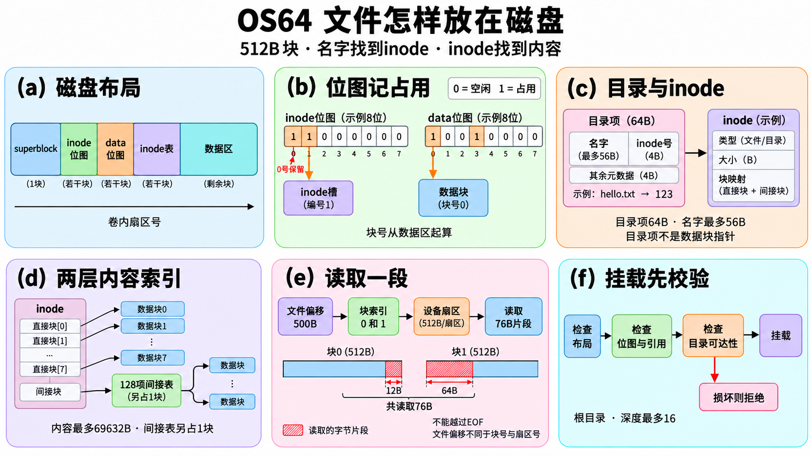
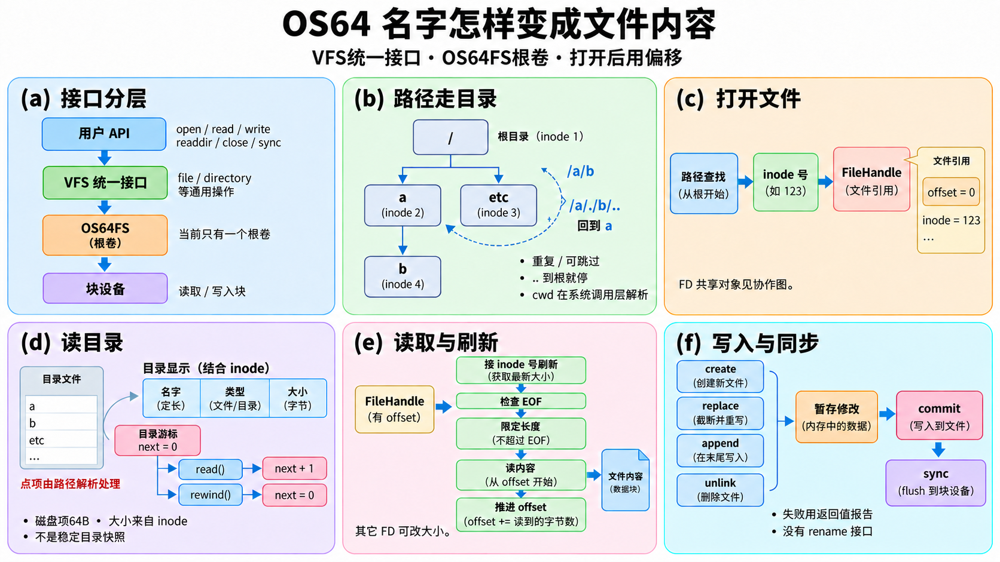

# 文件系统逐函数：名字怎样找到磁盘字节

讲义标题中的文件前缀用于区分同名函数，不表示源码新增了这些命名空间。

本章对照当前源码解释 `kernel/fs/os64fs.cpp` 的87个、`directory.cpp` 的8个、`file.cpp` 的9个、`vfs.cpp` 的27个定义，共131项。fd共享打开对象见 [协作教程](COOPERATION_FUNCTIONS.md)。图规格集中在 [文件与Shell图规格](specs/FILES_SHELL_FIGURES.md)。

先区分三个编号：**文件偏移**是这个文件里第几个字节；**数据块号**是数据区里的第几块；**设备扇区号**是从整卷开头算起的位置。当前每扇区／块都是512B，8个直接块加单级间接块128个索引，文件内容最多 `(8+128)×512=69632B`；存128个索引的间接块本身还占一个数据块。目录也是内容由固定64B目录项组成的文件，目录项包含名字与inode号，inode描述大小及块映射。名字最多56字节，路径栈最多16层。

磁盘依次是superblock、inode位图、data位图、inode表、数据区。挂载会检查布局、占用位图与真实引用、目录名字唯一、父子归属和从根可达性，损坏时拒绝挂载；这不是自动修复工具。

公开修改通过 `mutate` 做**有界内存暂存与同步失败回滚**：先保留整个内存状态，对修改过的最多256个扇区同时保存旧内容与新内容，完整操作和一致性校验成功后才写真实设备；失败时尽力逆序恢复已尝试的扇区，恢复失败则停止使用该挂载。**没有持久化日志、断电恢复事务、rename或原子rename接口**。运行中检测到的失败可回滚，不等于写入一半断电后还能恢复。

图块：`L(a…f)`=磁盘布局，`T(a…f)`=修改暂存／提交，`V(a…f)`=VFS与路径。复杂度中的 `I`=inode数，`B`=数据区块数，`E`=某目录项数，`D`=路径深度，`R`=传输字节数，`S`=暂存扇区数≤256，`K`=间接表项数128。复杂度写本层主要循环与调用成本；真实磁盘延迟另计，不把一次设备I/O宣称为零成本。所有内核共享状态操作依赖既有BKL，不另有无锁文件系统。

## 三张图先建立整体关系

L(c)里的磁盘目录项共64B：inode号4B，type／name_length／flags合计4B，名字数组56B。L(e)从文件偏移500B读76B，先取块0末尾12B，再取块1开头64B；图形长度仅示意，数字标注表示实际字节数。

T(e)把提交和恢复各自画成一个阶段：提交阶段包含写新扇区与flush，任一步失败都进入逆序写旧扇区再flush。恢复成功仍返回原操作失败；恢复失败停止挂载。阶段框只是教学分组，并不宣称硬件上原子完成。

V(d)显示的名字／类型／大小是公开目录结果；大小来自另读的子inode，不是磁盘64B目录项字段。用户DirectoryEntry ABI是68B，包含57B的NUL结尾名字数组和size_bytes。路径的点与双点在解析时处理，磁盘目录不存这两个名字。

原始图片、精确提示词、实际尺寸与审校记录见[图清单](images-files.json)及[规格](specs/FILES_SHELL_FIGURES.md)。

## OS64FS：布局、读取与一致性检查

### `os64fs::signature_matches`

源码：[os64fs.cpp:14](https://github.com/zmy1213/os64/blob/67efd0d008e0b58b31c89ad4ecfbab502416e087/kernel/fs/os64fs.cpp#L14)；图块：L(a)。

| 项目 | 说明 |
| --- | --- |
| 输入 | 至少8B签名 |
| 返回／结果 | 8字节等于OS64FSV3为true |
| 主步骤 | 先拒绝空指针，再逐字节比固定签名 |
| 为什么 | 挂载先确认读到自己的格式 |
| 失败与边界 | 只辨识格式，不认证内容 |
| 复杂度 | O(8) |

### `os64fs::is_path_separator`

源码：[os64fs.cpp:28](https://github.com/zmy1213/os64/blob/67efd0d008e0b58b31c89ad4ecfbab502416e087/kernel/fs/os64fs.cpp#L28)；图块：V(b)。

| 项目 | 说明 |
| --- | --- |
| 输入 | 一个字符 |
| 返回／结果 | 等于/为true |
| 主步骤 | 直接比较字符 |
| 为什么 | 统一组件切分规则 |
| 失败与边界 | 不把反斜杠当目录分隔 |
| 复杂度 | O(1) |

### `os64fs::skip_path_separators`

源码：[os64fs.cpp:34](https://github.com/zmy1213/os64/blob/67efd0d008e0b58b31c89ad4ecfbab502416e087/kernel/fs/os64fs.cpp#L34)；图块：V(b)。

| 项目 | 说明 |
| --- | --- |
| 输入 | 路径指针 |
| 返回／结果 | 第一个非/位置或nullptr |
| 主步骤 | 为空则返回；循环跳过连续/ |
| 为什么 | 容忍重复斜杠 |
| 失败与边界 | 不复制字符串，不处理点组件 |
| 复杂度 | O(重复斜杠数) |

### `os64fs::component_length`

源码：[os64fs.cpp:46](https://github.com/zmy1213/os64/blob/67efd0d008e0b58b31c89ad4ecfbab502416e087/kernel/fs/os64fs.cpp#L46)；图块：V(b)。

| 项目 | 说明 |
| --- | --- |
| 输入 | 有效组件起点 |
| 返回／结果 | 至/或NUL的长度 |
| 主步骤 | 逐字符计数 |
| 为什么 | 先界定当前名字再查目录 |
| 失败与边界 | 不自己验证56B上限，不接空指针 |
| 复杂度 | O(组件长度) |

### `os64fs::name_matches`

源码：[os64fs.cpp:55](https://github.com/zmy1213/os64/blob/67efd0d008e0b58b31c89ad4ecfbab502416e087/kernel/fs/os64fs.cpp#L55)；图块：V(b)。

| 项目 | 说明 |
| --- | --- |
| 输入 | 目录项、名字、长度 |
| 返回／结果 | 长度与字节全匹配为true |
| 主步骤 | 检查指针和容量，再逐字节比 |
| 为什么 | 名字不是必须NUL结束的磁盘字段 |
| 失败与边界 | 大小写敏感，不做Unicode归一化 |
| 复杂度 | O(名字长度≤56) |

### `os64fs::component_is_dot`

源码：[os64fs.cpp:73](https://github.com/zmy1213/os64/blob/67efd0d008e0b58b31c89ad4ecfbab502416e087/kernel/fs/os64fs.cpp#L73)；图块：V(b)。

| 项目 | 说明 |
| --- | --- |
| 输入 | 组件和长度 |
| 返回／结果 | 仅单字符.为true |
| 主步骤 | 非空、长度1、内容为点 |
| 为什么 | .让查找停在当前目录 |
| 失败与边界 | 不读超出组件的字节 |
| 复杂度 | O(1) |

### `os64fs::component_is_dot_dot`

源码：[os64fs.cpp:79](https://github.com/zmy1213/os64/blob/67efd0d008e0b58b31c89ad4ecfbab502416e087/kernel/fs/os64fs.cpp#L79)；图块：V(b)。

| 项目 | 说明 |
| --- | --- |
| 输入 | 组件和长度 |
| 返回／结果 | 仅两个点为true |
| 主步骤 | 非空、长度2，再比两个字符 |
| 为什么 | ..要求路径栈退一级 |
| 失败与边界 | 不读取磁盘父目录项 |
| 复杂度 | O(1) |

### `os64fs::filesystem_data_block_count`

源码：[os64fs.cpp:87](https://github.com/zmy1213/os64/blob/67efd0d008e0b58b31c89ad4ecfbab502416e087/kernel/fs/os64fs.cpp#L87)；图块：L(a)。

| 项目 | 说明 |
| --- | --- |
| 输入 | 设备扇区大小与数据区长度 |
| 返回／结果 | 数据总字节/块大小 |
| 主步骤 | 空对象或块大小0返回0；64位乘法再除 |
| 为什么 | 扇区数量与块数量概念分开 |
| 失败与边界 | 依赖挂载布局限制可表示的结果 |
| 复杂度 | O(1) |

### `os64fs::filesystem_indirect_entry_capacity`

源码：[os64fs.cpp:103](https://github.com/zmy1213/os64/blob/67efd0d008e0b58b31c89ad4ecfbab502416e087/kernel/fs/os64fs.cpp#L103)；图块：L(d)。

| 项目 | 说明 |
| --- | --- |
| 输入 | 块大小 |
| 返回／结果 | 块大小/4，即当前128 |
| 主步骤 | 检查非空与非零再除uint32大小 |
| 为什么 | 间接块内容是块号表 |
| 失败与边界 | 不是数据payload容量 |
| 复杂度 | O(1) |

### `os64fs::bitmap_required_bytes`

源码：[os64fs.cpp:111](https://github.com/zmy1213/os64/blob/67efd0d008e0b58b31c89ad4ecfbab502416e087/kernel/fs/os64fs.cpp#L111)；图块：L(b)。

| 项目 | 说明 |
| --- | --- |
| 输入 | bit_count |
| 返回／结果 | ceil(bit_count/8) |
| 主步骤 | 整除再补不足一字节 |
| 为什么 | 最后不到8位也要空间 |
| 失败与边界 | 不直接做加7，避免该加法溢出 |
| 复杂度 | O(1) |

### `os64fs::bitmap_bit_is_set`

源码：[os64fs.cpp:115](https://github.com/zmy1213/os64/blob/67efd0d008e0b58b31c89ad4ecfbab502416e087/kernel/fs/os64fs.cpp#L115)；图块：L(b)。

| 项目 | 说明 |
| --- | --- |
| 输入 | 位图、字节数、位号 |
| 返回／结果 | 在范围且该位1为true |
| 主步骤 | byte=index/8，mask=1<<(index%8)，先检查范围 |
| 为什么 | 一个bit记录一个资源占用 |
| 失败与边界 | 空或越界返回false，与真正空位要由调用方区分 |
| 复杂度 | O(1) |

### `os64fs::bitmap_set_bit`

源码：[os64fs.cpp:130](https://github.com/zmy1213/os64/blob/67efd0d008e0b58b31c89ad4ecfbab502416e087/kernel/fs/os64fs.cpp#L130)；图块：L(b)。

| 项目 | 说明 |
| --- | --- |
| 输入 | 可写位图与位号 |
| 返回／结果 | 该位设1，无返回值 |
| 主步骤 | 检查范围，按位或mask |
| 为什么 | 分配只改一个资源标志 |
| 失败与边界 | 越界静默不改，不独自减少free_count |
| 复杂度 | O(1) |

### `os64fs::bitmap_clear_bit`

源码：[os64fs.cpp:145](https://github.com/zmy1213/os64/blob/67efd0d008e0b58b31c89ad4ecfbab502416e087/kernel/fs/os64fs.cpp#L145)；图块：L(b)。

| 项目 | 说明 |
| --- | --- |
| 输入 | 可写位图与位号 |
| 返回／结果 | 该位设0 |
| 主步骤 | 检查范围，按位与反mask |
| 为什么 | 回收释放占用标志 |
| 失败与边界 | 计数与重复释放检查由上层负责 |
| 复杂度 | O(1) |

### `os64fs::data_block_index_is_valid`

源码：[os64fs.cpp:160](https://github.com/zmy1213/os64/blob/67efd0d008e0b58b31c89ad4ecfbab502416e087/kernel/fs/os64fs.cpp#L160)；图块：L(d)。

| 项目 | 说明 |
| --- | --- |
| 输入 | 文件系统与块号 |
| 返回／结果 | 非invalid且小于数据块总数为true |
| 主步骤 | 排除0xffffffff再比B |
| 为什么 | invalid不是磁盘块0 |
| 失败与边界 | 只查范围，不验证位图是否占用 |
| 复杂度 | O(1) |

### `os64fs::read_superblock`

源码：[os64fs.cpp:166](https://github.com/zmy1213/os64/blob/67efd0d008e0b58b31c89ad4ecfbab502416e087/kernel/fs/os64fs.cpp#L166)；图块：L(a)。

| 项目 | 说明 |
| --- | --- |
| 输入 | 已安装设备的filesystem |
| 返回／结果 | 读出头结构为true |
| 主步骤 | 读逻辑扇区0的512B，再复制superblock |
| 为什么 | 超级块告诉后续各区位置 |
| 失败与边界 | 读失败false；签名布局后续另查 |
| 复杂度 | 一次扇区读 |

### `os64fs::write_superblock`

源码：[os64fs.cpp:177](https://github.com/zmy1213/os64/blob/67efd0d008e0b58b31c89ad4ecfbab502416e087/kernel/fs/os64fs.cpp#L177)；图块：T(c)。

| 项目 | 说明 |
| --- | --- |
| 输入 | 有效filesystem/device |
| 返回／结果 | 写扇区0成功为true |
| 主步骤 | 清零512B缓冲，复制头并写回 |
| 为什么 | 未定义尾部也有确定字节 |
| 失败与边界 | 自身不flush；在staged设备上只是暂存 |
| 复杂度 | 一次扇区写 |

### `os64fs::read_inode_table`

源码：[os64fs.cpp:189](https://github.com/zmy1213/os64/blob/67efd0d008e0b58b31c89ad4ecfbab502416e087/kernel/fs/os64fs.cpp#L189)；图块：L(c)。

| 项目 | 说明 |
| --- | --- |
| 输入 | 文件系统布局 |
| 返回／结果 | 全表缓存成功为true |
| 主步骤 | 查所需/缓存容量≤8192B，清缓存，按扇区读入，再记有效字节 |
| 为什么 | 以后按inode号在内存定位 |
| 失败与边界 | 任一读失败false，不能当完成的缓存 |
| 复杂度 | O(inode表扇区数) |

### `os64fs::read_bitmap`

源码：[os64fs.cpp:227](https://github.com/zmy1213/os64/blob/67efd0d008e0b58b31c89ad4ecfbab502416e087/kernel/fs/os64fs.cpp#L227)；图块：L(b)。

| 项目 | 说明 |
| --- | --- |
| 输入 | 设备、起始扇区、容量与输出 |
| 返回／结果 | 位图缓存及有效字节数 |
| 主步骤 | 检查需求可容纳于缓存与扇区区间，清缓存，逐扇区读 |
| 为什么 | 后续分配直接操作内存bit |
| 失败与边界 | 需求0、越界或I/O错false |
| 复杂度 | O(位图扇区数) |

### `os64fs::write_cached_sectors`

源码：[os64fs.cpp:265](https://github.com/zmy1213/os64/blob/67efd0d008e0b58b31c89ad4ecfbab502416e087/kernel/fs/os64fs.cpp#L265)；图块：T(c)。

| 项目 | 说明 |
| --- | --- |
| 输入 | 设备、起始扇区、扇区数、缓存 |
| 返回／结果 | 整段写成功true |
| 主步骤 | 逐512B调用块设备写，失败立即停 |
| 为什么 | 元数据区复用同一写回循环 |
| 失败与边界 | 内部信任已校验缓存大小；单独调用可部分写入 |
| 复杂度 | O(扇区数) |

### `os64fs::write_inode_table`

源码：[os64fs.cpp:288](https://github.com/zmy1213/os64/blob/67efd0d008e0b58b31c89ad4ecfbab502416e087/kernel/fs/os64fs.cpp#L288)；图块：T(c)。

| 项目 | 说明 |
| --- | --- |
| 输入 | filesystem |
| 返回／结果 | inode表写回结果 |
| 主步骤 | 调用write_cached_sectors传表区范围与缓存 |
| 为什么 | 缓存更新需要有落盘出口 |
| 失败与边界 | 不flush，不独自保证事务 |
| 复杂度 | O(inode表扇区数) |

### `os64fs::write_inode_bitmap`

源码：[os64fs.cpp:296](https://github.com/zmy1213/os64/blob/67efd0d008e0b58b31c89ad4ecfbab502416e087/kernel/fs/os64fs.cpp#L296)；图块：T(c)。

| 项目 | 说明 |
| --- | --- |
| 输入 | filesystem |
| 返回／结果 | inode位图写回结果 |
| 主步骤 | 转交缓存写回器与对应区域 |
| 为什么 | 占用标记与inode表须一起一致 |
| 失败与边界 | 不能只写这一张图就认为操作完整 |
| 复杂度 | O(inode位图扇区数) |

### `os64fs::write_data_bitmap`

源码：[os64fs.cpp:304](https://github.com/zmy1213/os64/blob/67efd0d008e0b58b31c89ad4ecfbab502416e087/kernel/fs/os64fs.cpp#L304)；图块：T(c)。

| 项目 | 说明 |
| --- | --- |
| 输入 | filesystem |
| 返回／结果 | data位图写回结果 |
| 主步骤 | 转交缓存写回器与data区域 |
| 为什么 | 数据块占用也必须保存 |
| 失败与边界 | I/O失败false，不做独立回滚 |
| 复杂度 | O(data位图扇区数) |

### `os64fs::filesystem_layout_is_valid`

源码：[os64fs.cpp:312](https://github.com/zmy1213/os64/blob/67efd0d008e0b58b31c89ad4ecfbab502416e087/kernel/fs/os64fs.cpp#L312)；图块：L(f)。

| 项目 | 说明 |
| --- | --- |
| 输入 | 读出的头与设备参数 |
| 返回／结果 | 布局完全符合v3为true |
| 主步骤 | 检查签名版本、512B、扇区范围、结构大小、free计数；64位验证缓存容量与各区按序不重叠 |
| 为什么 | 不让恶意或损坏头引导越界读写 |
| 失败与边界 | 不检查全部内容占用，交后续扫描 |
| 复杂度 | O(1)固定字段检查 |

### `os64fs::inode_is_valid`

源码：[os64fs.cpp:399](https://github.com/zmy1213/os64/blob/67efd0d008e0b58b31c89ad4ecfbab502416e087/kernel/fs/os64fs.cpp#L399)；图块：L(c)、L(f)。

| 项目 | 说明 |
| --- | --- |
| 输入 | 已mounted文件系统与inode |
| 返回／结果 | 结构/块映射基本有效true |
| 主步骤 | 检查编号类型、link_count=1、大小所需块数、目录64B对齐；8直接槽和间接块存在条件 |
| 为什么 | 读取映射前先限制可达范围 |
| 失败与边界 | 还没检查块重复或位图一致性；没有硬链接语义 |
| 复杂度 | O(8) |

### `os64fs::read_u32_from_data_block`

源码：[os64fs.cpp:443](https://github.com/zmy1213/os64/blob/67efd0d008e0b58b31c89ad4ecfbab502416e087/kernel/fs/os64fs.cpp#L443)；图块：L(d)。

| 项目 | 说明 |
| --- | --- |
| 输入 | 块号、块内偏移、输出 |
| 返回／结果 | 读取一个间接索引true |
| 主步骤 | 定位扇区与偏移，拒绝4B跨扇区，读512B再复制4B |
| 为什么 | 索引表是数据块，但存的是块号 |
| 失败与边界 | 无效块、边界或读失败false |
| 复杂度 | 一次扇区读 |

### `os64fs::inode_block_index_for_file_block`

源码：[os64fs.cpp:480](https://github.com/zmy1213/os64/blob/67efd0d008e0b58b31c89ad4ecfbab502416e087/kernel/fs/os64fs.cpp#L480)；图块：L(d)。

| 项目 | 说明 |
| --- | --- |
| 输入 | 有效inode与文件块序号 |
| 返回／结果 | 输出实际数据区块号 |
| 主步骤 | 先检查inode与序号；前8个取direct，否则读间接槽；再查块范围 |
| 为什么 | 把文件逻辑块换成物理存储块 |
| 失败与边界 | 只支持一层间接；超出block_count失败 |
| 复杂度 | O(8)，间接再一次扇区读 |

### `os64fs::read_inode_block_bytes`

源码：[os64fs.cpp:511](https://github.com/zmy1213/os64/blob/67efd0d008e0b58b31c89ad4ecfbab502416e087/kernel/fs/os64fs.cpp#L511)；图块：L(e)。

| 项目 | 说明 |
| --- | --- |
| 输入 | inode、offset、输出、R |
| 返回／结果 | 范围内全部读成功true |
| 主步骤 | 检查大小；逐文件块定位sector；缓存最近一个扇区，按块/扇区边界取min并复制 |
| 为什么 | 任意字节读可跨多个不连续块 |
| 失败与边界 | 不得越EOF；中途失败false，输出可能已有前缀 |
| 复杂度 | O(R+触及扇区数)，间接另读索引 |

### `os64fs::cached_inode_pointer`

源码：[os64fs.cpp:585](https://github.com/zmy1213/os64/blob/67efd0d008e0b58b31c89ad4ecfbab502416e087/kernel/fs/os64fs.cpp#L585)；图块：L(c)。

| 项目 | 说明 |
| --- | --- |
| 输入 | 文件系统、inode号 |
| 返回／结果 | 缓存中的const指针或nullptr |
| 主步骤 | 号乘inode_size，检查终点在有效缓存内 |
| 为什么 | 避免重新访问磁盘表 |
| 失败与边界 | 不验证该inode已占用或内容类型 |
| 复杂度 | O(1) |

### `os64fs::inode_bytes_are_zero`

源码：[os64fs.cpp:602](https://github.com/zmy1213/os64/blob/67efd0d008e0b58b31c89ad4ecfbab502416e087/kernel/fs/os64fs.cpp#L602)；图块：L(f)。

| 项目 | 说明 |
| --- | --- |
| 输入 | inode指针 |
| 返回／结果 | 每字节0为true |
| 主步骤 | 扫描sizeof(inode)原始字节 |
| 为什么 | 释放inode必须全零，避免残留内容冒充空闲 |
| 失败与边界 | 只检查字节，不修改位图 |
| 复杂度 | O(sizeof inode) |

### `os64fs::set_validation_debug`

源码：[os64fs.cpp:617](https://github.com/zmy1213/os64/blob/67efd0d008e0b58b31c89ad4ecfbab502416e087/kernel/fs/os64fs.cpp#L617)；图块：L(f)。

| 项目 | 说明 |
| --- | --- |
| 输入 | 文件系统、错误码/索引/期望/实际 |
| 返回／结果 | 保存诊断四字段 |
| 主步骤 | 空对象不写，直接赋值 |
| 为什么 | 挂载失败要知道哪项不一致 |
| 失败与边界 | 这是诊断，不能修复磁盘 |
| 复杂度 | O(1) |

### `os64fs::mark_data_block_allocated`

源码：[os64fs.cpp:632](https://github.com/zmy1213/os64/blob/67efd0d008e0b58b31c89ad4ecfbab502416e087/kernel/fs/os64fs.cpp#L632)；图块：L(f)。

| 项目 | 说明 |
| --- | --- |
| 输入 | 临时seen位图、块号、已用计数 |
| 返回／结果 | 首次有效引用true并计数 |
| 主步骤 | 查块范围；若seen已1报重复；否则设bit并加used |
| 为什么 | 两个inode不能同时拥有同一数据块 |
| 失败与边界 | 仅校验临时图，不实际分配磁盘块 |
| 复杂度 | O(1) |

### `os64fs::validate_directory_references`

源码：[os64fs.cpp:655](https://github.com/zmy1213/os64/blob/67efd0d008e0b58b31c89ad4ecfbab502416e087/kernel/fs/os64fs.cpp#L655)；图块：L(f)。

| 项目 | 说明 |
| --- | --- |
| 输入 | 已缓存inode和位图 |
| 返回／结果 | 目录树一致且根可达true |
| 主步骤 | 扫描目录项：有效名字/类型/已分配孩子/唯一父；逐项查同名重复；建parents表后逐inode追到根且≤16层 |
| 为什么 | 排除重复名字、孤立inode和目录环 |
| 失败与边界 | 要求树形单父，无硬链接；读错或不一致false |
| 复杂度 | O(I+各目录E²+I×D)，含目录I/O |

### `os64fs::validate_allocation_maps_and_collect_stats`

源码：[os64fs.cpp:716](https://github.com/zmy1213/os64/blob/67efd0d008e0b58b31c89ad4ecfbab502416e087/kernel/fs/os64fs.cpp#L716)；图块：L(f)、T(d)。

| 项目 | 说明 |
| --- | --- |
| 输入 | 已mounted缓存 |
| 返回／结果 | 一致true并刷新统计 |
| 主步骤 | inode0必须占；扫已分配inode验证并标所有direct/indirect块；空inode必须零；交叉比data位图、目录树与free计数 |
| 为什么 | free_count不应仅相信头，真实所有权要重算 |
| 失败与边界 | 只检测拒绝，不做fsck修复；临时4KiB seen图 |
| 复杂度 | O(I+B+占用块+目录验证) |

### `os64fs::find_child_inode`

源码：[os64fs.cpp:857](https://github.com/zmy1213/os64/blob/67efd0d008e0b58b31c89ad4ecfbab502416e087/kernel/fs/os64fs.cpp#L857)；图块：V(b)。

| 项目 | 说明 |
| --- | --- |
| 输入 | 目录inode、组件与输出 |
| 返回／结果 | 匹配项的inode号true |
| 主步骤 | 按entry顺序读，name_matches命中即输出 |
| 为什么 | 目录当前是线性数组，没有索引树 |
| 失败与边界 | 无匹配或I/O错误同样false |
| 复杂度 | O(E×名字长度)，含逐项读 |

### `os64fs::refresh_runtime_stats_from_superblock`

源码：[os64fs.cpp:901](https://github.com/zmy1213/os64/blob/67efd0d008e0b58b31c89ad4ecfbab502416e087/kernel/fs/os64fs.cpp#L901)；图块：L(b)。

| 项目 | 说明 |
| --- | --- |
| 输入 | 有效filesystem |
| 返回／结果 | 刷新free与used内存统计 |
| 主步骤 | 读取头free_count，用总数减free得到used |
| 为什么 | 分配/释放后统计不应陈旧 |
| 失败与边界 | 依赖原计数已一致，不自己重新扫描 |
| 复杂度 | O(1) |

### `os64fs::block_count_for_size`

源码：[os64fs.cpp:915](https://github.com/zmy1213/os64/blob/67efd0d008e0b58b31c89ad4ecfbab502416e087/kernel/fs/os64fs.cpp#L915)；图块：L(d)。

| 项目 | 说明 |
| --- | --- |
| 输入 | 文件系统与字节size |
| 返回／结果 | ceil(size/block_size)，0返回0 |
| 主步骤 | 用(size-1)/block+1避免额外向上加法 |
| 为什么 | 尾部不足一块仍占整块 |
| 失败与边界 | 空对象/块大小0也返回0 |
| 复杂度 | O(1) |

### `os64fs::mutable_cached_inode_pointer`

源码：[os64fs.cpp:924](https://github.com/zmy1213/os64/blob/67efd0d008e0b58b31c89ad4ecfbab502416e087/kernel/fs/os64fs.cpp#L924)；图块：T(b)。

| 项目 | 说明 |
| --- | --- |
| 输入 | 文件系统与inode号 |
| 返回／结果 | 可写缓存指针或nullptr |
| 主步骤 | 检查号与乘法后区间，返回表内位置 |
| 为什么 | 修改inode先改内存副本 |
| 失败与边界 | 调用者负责合法内容与提交，不是写盘 |
| 复杂度 | O(1) |

### `os64fs::zero_inode_bytes`

源码：[os64fs.cpp:942](https://github.com/zmy1213/os64/blob/67efd0d008e0b58b31c89ad4ecfbab502416e087/kernel/fs/os64fs.cpp#L942)；图块：T(b)。

| 项目 | 说明 |
| --- | --- |
| 输入 | 可写inode |
| 返回／结果 | 全部字节清0 |
| 主步骤 | 为空不写，否则memory_set |
| 为什么 | 释放项需满足挂载的零字节约束 |
| 失败与边界 | 不自动释放inode号或数据块 |
| 复杂度 | O(sizeof inode) |

### `os64fs::initialize_empty_inode_layout`

源码：[os64fs.cpp:950](https://github.com/zmy1213/os64/blob/67efd0d008e0b58b31c89ad4ecfbab502416e087/kernel/fs/os64fs.cpp#L950)；图块：L(c)、T(b)。

| 项目 | 说明 |
| --- | --- |
| 输入 | inode输出 |
| 返回／结果 | 零字段且8direct/indirect均invalid |
| 主步骤 | 先全零，再逐槽写0xffffffff |
| 为什么 | 未用槽不可误指数据块0 |
| 失败与边界 | 只有布局初始化，不分配编号或类型 |
| 复杂度 | O(8) |

### `os64fs::write_inode_to_cache`

源码：[os64fs.cpp:962](https://github.com/zmy1213/os64/blob/67efd0d008e0b58b31c89ad4ecfbab502416e087/kernel/fs/os64fs.cpp#L962)；图块：T(b)。

| 项目 | 说明 |
| --- | --- |
| 输入 | filesystem与inode |
| 返回／结果 | 写入对应缓存true |
| 主步骤 | 检查编号，定位可写槽，复制结构 |
| 为什么 | 数据写完须更新大小/块映射缓存 |
| 失败与边界 | 不flush，不先做完整inode一致性检查 |
| 复杂度 | O(sizeof inode) |

### `os64fs::split_parent_path_and_name`

源码：[os64fs.cpp:978](https://github.com/zmy1213/os64/blob/67efd0d008e0b58b31c89ad4ecfbab502416e087/kernel/fs/os64fs.cpp#L978)；图块：T(a)、V(b)。

| 项目 | 说明 |
| --- | --- |
| 输入 | path与父/叶缓冲容量 |
| 返回／结果 | 父路径、叶名与长度true |
| 主步骤 | 测NUL长度，去尾斜杠，找最后分隔；叶≤56且非./..；无父则用/；容量检查再复制 |
| 为什么 | create/unlink需要父目录和待改名字两部分 |
| 失败与边界 | 根或空叶拒绝，父不存在由后续查；不递归创建 |
| 复杂度 | O(路径长度) |

### `os64fs::lookup_mutation_target`

源码：[os64fs.cpp:1051](https://github.com/zmy1213/os64/blob/67efd0d008e0b58b31c89ad4ecfbab502416e087/kernel/fs/os64fs.cpp#L1051)；图块：T(a)。

| 项目 | 说明 |
| --- | --- |
| 输入 | mounted文件系统与path |
| 返回／结果 | 父inode和孩子存在信息true |
| 主步骤 | 拆父/叶，lookup父须目录；线性找叶并读孩子；没匹配也成功且child_exists=false |
| 为什么 | 不存在是create的正常条件，不该与父不存在混同 |
| 失败与边界 | 父坏、目录读失败false；固定父路径缓冲 |
| 复杂度 | O(路径查找+父E) |

### `os64fs::write_data_block_bytes`

源码：[os64fs.cpp:1100](https://github.com/zmy1213/os64/blob/67efd0d008e0b58b31c89ad4ecfbab502416e087/kernel/fs/os64fs.cpp#L1100)；图块：T(c)。

| 项目 | 说明 |
| --- | --- |
| 输入 | 块号、块内offset、数据和R |
| 返回／结果 | 全部写成功true |
| 主步骤 | 验证不超块；部分扇区先读原512B，覆盖后写；整扇区跳过原读 |
| 为什么 | 局部修改不能破坏扇区其它字节 |
| 失败与边界 | 空数据指针拒绝，即使R=0；中途失败可能已有写，依赖公开mutate暂存 |
| 复杂度 | O(R+触及扇区数) |

### `os64fs::zero_data_block`

源码：[os64fs.cpp:1163](https://github.com/zmy1213/os64/blob/67efd0d008e0b58b31c89ad4ecfbab502416e087/kernel/fs/os64fs.cpp#L1163)；图块：T(c)。

| 项目 | 说明 |
| --- | --- |
| 输入 | 有效块号 |
| 返回／结果 | 该块全部零写成功true |
| 主步骤 | 准备零扇区，写每个组成扇区 |
| 为什么 | 新分配块不泄露原数据 |
| 失败与边界 | 设备错false；当前一块一扇区 |
| 复杂度 | O(每块扇区数) |

### `os64fs::write_u32_to_data_block`

源码：[os64fs.cpp:1188](https://github.com/zmy1213/os64/blob/67efd0d008e0b58b31c89ad4ecfbab502416e087/kernel/fs/os64fs.cpp#L1188)；图块：L(d)、T(c)。

| 项目 | 说明 |
| --- | --- |
| 输入 | 块号、偏移、32位索引 |
| 返回／结果 | 写索引成功true |
| 主步骤 | 把value地址和4B交write_data_block_bytes |
| 为什么 | 间接表更新复用局部写逻辑 |
| 失败与边界 | 本机v3按结构字节写，不是网络大端 |
| 复杂度 | 一次读改写或staging更新 |

### `os64fs::sync_metadata`

源码：[os64fs.cpp:1197](https://github.com/zmy1213/os64/blob/67efd0d008e0b58b31c89ad4ecfbab502416e087/kernel/fs/os64fs.cpp#L1197)；图块：T(c)。

| 项目 | 说明 |
| --- | --- |
| 输入 | filesystem |
| 返回／结果 | 全部元数据写与flush成功true |
| 主步骤 | 按inode位图→data位图→inode表→头写，最后设备flush |
| 为什么 | 让缓存与磁盘账本一起输出 |
| 失败与边界 | 普通sync不自带undo事务；staged flush只是内存成功 |
| 复杂度 | O(元数据扇区数) |

### `os64fs::allocate_inode_number`

源码：[os64fs.cpp:1207](https://github.com/zmy1213/os64/blob/67efd0d008e0b58b31c89ad4ecfbab502416e087/kernel/fs/os64fs.cpp#L1207)；图块：L(b)、T(b)。

| 项目 | 说明 |
| --- | --- |
| 输入 | mounted文件系统与输出号 |
| 返回／结果 | 找到空号true并设位减free |
| 主步骤 | 从1扫描，跳已用，设bit后刷新统计 |
| 为什么 | inode0保留不可作正常文件 |
| 失败与边界 | 无空间/参数错false；这里只占内存 |
| 复杂度 | O(I) |

### `os64fs::free_inode_number`

源码：[os64fs.cpp:1235](https://github.com/zmy1213/os64/blob/67efd0d008e0b58b31c89ad4ecfbab502416e087/kernel/fs/os64fs.cpp#L1235)；图块：L(b)、T(b)。

| 项目 | 说明 |
| --- | --- |
| 输入 | 已占的非0号 |
| 返回／结果 | 清位增free true |
| 主步骤 | 检查范围与占用，清bit更新统计 |
| 为什么 | 重复释放会使free计数错误，必须拒绝 |
| 失败与边界 | 不自己清inode或回收块，调用方组织步骤 |
| 复杂度 | O(1) |

### `os64fs::allocate_data_block_index`

源码：[os64fs.cpp:1251](https://github.com/zmy1213/os64/blob/67efd0d008e0b58b31c89ad4ecfbab502416e087/kernel/fs/os64fs.cpp#L1251)；图块：L(b)、T(c)。

| 项目 | 说明 |
| --- | --- |
| 输入 | mounted文件系统与输出 |
| 返回／结果 | 空块零化后true |
| 主步骤 | 扫data图，设位减free并zero；零化失败撤回bit与计数 |
| 为什么 | 给文件干净且独占的存储块 |
| 失败与边界 | 无空间/零化失败false，不跳着找下一块掩盖I/O错 |
| 复杂度 | O(B)+零化一块 |

### `os64fs::free_data_block_index`

源码：[os64fs.cpp:1283](https://github.com/zmy1213/os64/blob/67efd0d008e0b58b31c89ad4ecfbab502416e087/kernel/fs/os64fs.cpp#L1283)；图块：L(b)、T(b)。

| 项目 | 说明 |
| --- | --- |
| 输入 | 已占有效块号 |
| 返回／结果 | 清位增free true |
| 主步骤 | 范围/占用检查后清bit和统计 |
| 为什么 | 阻止双重释放并允许后续复用 |
| 失败与边界 | 不擦旧磁盘内容，下一次分配才零化 |
| 复杂度 | O(1) |

### `os64fs::ensure_indirect_block_initialized`

源码：[os64fs.cpp:1298](https://github.com/zmy1213/os64/blob/67efd0d008e0b58b31c89ad4ecfbab502416e087/kernel/fs/os64fs.cpp#L1298)；图块：L(d)、T(c)。

| 项目 | 说明 |
| --- | --- |
| 输入 | filesystem与inode |
| 返回／结果 | 已有或新建索引表true |
| 主步骤 | 已有有效表直接返回；否则分配零块，128槽写invalid，失败释放；成功安装indirect号 |
| 为什么 | 尚未用的索引槽不能默认指向块0 |
| 失败与边界 | 逐4B写较慢；外层mutate保障完整资源失败撤销 |
| 复杂度 | O(K)次索引改写+分配扫描 |

### `os64fs::ensure_inode_file_block`

源码：[os64fs.cpp:1329](https://github.com/zmy1213/os64/blob/67efd0d008e0b58b31c89ad4ecfbab502416e087/kernel/fs/os64fs.cpp#L1329)；图块：L(d)、T(c)。

| 项目 | 说明 |
| --- | --- |
| 输入 | inode、文件块序号与输出 |
| 返回／结果 | 现有或追加块映射true |
| 主步骤 | 现有则查；新块必须序号==block_count且<136；分配块，填direct或初始化间接槽，成功block_count++ |
| 为什么 | 只允许沿尾增长，保持连续逻辑块 |
| 失败与边界 | 不支持稀疏洞；容量、分配、索引写失败false |
| 复杂度 | O(B)新分配；首次间接再O(K) |

### `os64fs::free_inode_file_block`

源码：[os64fs.cpp:1380](https://github.com/zmy1213/os64/blob/67efd0d008e0b58b31c89ad4ecfbab502416e087/kernel/fs/os64fs.cpp#L1380)；图块：T(b)、L(d)。

| 项目 | 说明 |
| --- | --- |
| 输入 | inode与现有块序号 |
| 返回／结果 | 释放对应块true |
| 主步骤 | direct清位并置invalid；indirect读槽、释放、再写invalid |
| 为什么 | 缩文件从尾回收每个映射 |
| 失败与边界 | 不减block_count，调用truncate负责；中间删洞不支持 |
| 复杂度 | O(1)直接，间接含I/O |

### `os64fs::truncate_inode_to_size`

源码：[os64fs.cpp:1414](https://github.com/zmy1213/os64/blob/67efd0d008e0b58b31c89ad4ecfbab502416e087/kernel/fs/os64fs.cpp#L1414)；图块：T(b)。

| 项目 | 说明 |
| --- | --- |
| 输入 | inode与不增大的new_size |
| 返回／结果 | 缩小并释放多余块true |
| 主步骤 | 算所需块数，从尾逐块free并减count；回到≤8块时释放间接表；改size |
| 为什么 | 不能遗留无文件内容使用的块与索引块 |
| 失败与边界 | new_size>旧size拒绝；不零掉保留块尾部 |
| 复杂度 | O(释放块数)，含间接I/O |

### `os64fs::write_inode_bytes`

源码：[os64fs.cpp:1446](https://github.com/zmy1213/os64/blob/67efd0d008e0b58b31c89ad4ecfbab502416e087/kernel/fs/os64fs.cpp#L1446)；图块：T(c)。

| 项目 | 说明 |
| --- | --- |
| 输入 | inode、offset≤原size、数据和R |
| 返回／结果 | 完整写并扩展size true |
| 主步骤 | 限制≤69632B；逐块ensure与按偏移写，最后更新最大end |
| 为什么 | 把字节偏移/扩容/块映射组合起来 |
| 失败与边界 | 不支持offset超原EOF的稀疏写；零R需有效buffer；失败由mutate撤销 |
| 复杂度 | O(R+新增块×B)，首次间接O(K) |

### `os64fs::append_directory_entry`

源码：[os64fs.cpp:1504](https://github.com/zmy1213/os64/blob/67efd0d008e0b58b31c89ad4ecfbab502416e087/kernel/fs/os64fs.cpp#L1504)；图块：T(a)、T(c)。

| 项目 | 说明 |
| --- | --- |
| 输入 | 目录inode与一项 |
| 返回／结果 | 末尾追加64B成功true |
| 主步骤 | write_inode_bytes从directory.size起写一项 |
| 为什么 | 目录数据结构与普通字节写复用 |
| 失败与边界 | 内部未单独保证名字唯一，mutation target先检查 |
| 复杂度 | 写一项+可能分配块 |

### `os64fs::remove_directory_entry`

源码：[os64fs.cpp:1516](https://github.com/zmy1213/os64/blob/67efd0d008e0b58b31c89ad4ecfbab502416e087/kernel/fs/os64fs.cpp#L1516)；图块：T(a)。

| 项目 | 说明 |
| --- | --- |
| 输入 | 目录inode与条目下标 |
| 返回／结果 | 删除并缩64B true |
| 主步骤 | 非最后项时用最后项覆盖，再truncate一项 |
| 为什么 | 不保留数组洞，避免整体移动E条 |
| 失败与边界 | 目录展示顺序可能改变；不是rename |
| 复杂度 | O(1)项读写+尾块回收 |

### `os64fs::initialize_new_inode`

源码：[os64fs.cpp:1547](https://github.com/zmy1213/os64/blob/67efd0d008e0b58b31c89ad4ecfbab502416e087/kernel/fs/os64fs.cpp#L1547)；图块：T(b)。

| 项目 | 说明 |
| --- | --- |
| 输入 | 输出inode、编号和类型 |
| 返回／结果 | 初始化空文件/目录true |
| 主步骤 | empty布局，设置号/type/link_count1，目录mode0755文件0644 |
| 为什么 | 初始元数据有明确类型与默认mode |
| 失败与边界 | mode现在是元数据，尚无完整权限用户模型 |
| 复杂度 | O(8) |

### `os64fs::initialize_os64fs`

源码：[os64fs.cpp:1564](https://github.com/zmy1213/os64/blob/67efd0d008e0b58b31c89ad4ecfbab502416e087/kernel/fs/os64fs.cpp#L1564)；图块：L(f)。

| 项目 | 说明 |
| --- | --- |
| 输入 | 输出filesystem与ready设备 |
| 返回／结果 | 全部挂载校验通过true |
| 主步骤 | 清对象，读头验布局，缓存两图与表，暂mounted以读root，验根目录和完整引用；失败记mount_error撤mounted/设备 |
| 为什么 | 按阶段报错比无条件相信磁盘安全 |
| 失败与边界 | 不是格式化，坏卷不自动修复；不得拿活挂载直接重置 |
| 复杂度 | 加载元数据+完整校验成本 |

### `os64fs::os64fs_is_mounted`

源码：[os64fs.cpp:1648](https://github.com/zmy1213/os64/blob/67efd0d008e0b58b31c89ad4ecfbab502416e087/kernel/fs/os64fs.cpp#L1648)；图块：L(f)。

| 项目 | 说明 |
| --- | --- |
| 输入 | filesystem |
| 返回／结果 | 非空/device在/marked为true |
| 主步骤 | 三条件相与 |
| 为什么 | 其它API的入口前提 |
| 失败与边界 | 不在每次调用重扫磁盘 |
| 复杂度 | O(1) |

### `os64fs::os64fs_superblock`

源码：[os64fs.cpp:1654](https://github.com/zmy1213/os64/blob/67efd0d008e0b58b31c89ad4ecfbab502416e087/kernel/fs/os64fs.cpp#L1654)；图块：L(a)。

| 项目 | 说明 |
| --- | --- |
| 输入 | mounted文件系统 |
| 返回／结果 | 内存头const指针，失败nullptr |
| 主步骤 | 检查mounted再返回成员地址 |
| 为什么 | 诊断布局不需重新读sector0 |
| 失败与边界 | 是共享内部引用，不是独立快照 |
| 复杂度 | O(1) |

### `os64fs::os64fs_inode_type_name`

源码：[os64fs.cpp:1662](https://github.com/zmy1213/os64/blob/67efd0d008e0b58b31c89ad4ecfbab502416e087/kernel/fs/os64fs.cpp#L1662)；图块：L(c)。

| 项目 | 说明 |
| --- | --- |
| 输入 | 类型号 |
| 返回／结果 | file/dir/unknown字面量 |
| 主步骤 | switch两个支持类型 |
| 为什么 | 向读者显示可读节点类型 |
| 失败与边界 | 未知类型不自动变成文件 |
| 复杂度 | O(1) |

### `os64fs::os64fs_query_stats`

源码：[os64fs.cpp:1673](https://github.com/zmy1213/os64/blob/67efd0d008e0b58b31c89ad4ecfbab502416e087/kernel/fs/os64fs.cpp#L1673)；图块：L(b)。

| 项目 | 说明 |
| --- | --- |
| 输入 | mounted文件系统与输出 |
| 返回／结果 | 复制当前统计true |
| 主步骤 | 检查并复制固定结构 |
| 为什么 | 显示剩余inode/data容量 |
| 失败与边界 | 计数来自校验和运行更新，不重新盘点 |
| 复杂度 | O(sizeof stats) |

### `os64fs::os64fs_query_validation_debug`

源码：[os64fs.cpp:1682](https://github.com/zmy1213/os64/blob/67efd0d008e0b58b31c89ad4ecfbab502416e087/kernel/fs/os64fs.cpp#L1682)；图块：L(f)。

| 项目 | 说明 |
| --- | --- |
| 输入 | 对象与诊断输出 |
| 返回／结果 | 复制最后诊断true |
| 主步骤 | 非空即复制，不要求mounted |
| 为什么 | 失败挂载也要能读取错误细节 |
| 失败与边界 | 只保留一个诊断位置 |
| 复杂度 | O(sizeof debug) |

### `os64fs::os64fs_mount_error`

源码：[os64fs.cpp:1692](https://github.com/zmy1213/os64/blob/67efd0d008e0b58b31c89ad4ecfbab502416e087/kernel/fs/os64fs.cpp#L1692)；图块：L(f)。

| 项目 | 说明 |
| --- | --- |
| 输入 | 对象或nullptr |
| 返回／结果 | 当前错误码或BadDevice |
| 主步骤 | 非空读成员，否则固定错码 |
| 为什么 | 用明确阶段辨别挂载失败 |
| 失败与边界 | 不返回字符串或自行修复 |
| 复杂度 | O(1) |

### `os64fs::os64fs_read_inode`

源码：[os64fs.cpp:1696](https://github.com/zmy1213/os64/blob/67efd0d008e0b58b31c89ad4ecfbab502416e087/kernel/fs/os64fs.cpp#L1696)；图块：L(c)。

| 项目 | 说明 |
| --- | --- |
| 输入 | mounted、非0号、输出 |
| 返回／结果 | 复制且校验有效true |
| 主步骤 | 检查范围及缓存终点，copy，inode_is_valid与编号一致 |
| 为什么 | 不让缓存坏槽成为后续块访问入口 |
| 失败与边界 | 不验证inode占用bit，此一致性由挂载扫描保障 |
| 复杂度 | O(8+sizeof inode) |

### `os64fs::os64fs_lookup_path`

源码：[os64fs.cpp:1717](https://github.com/zmy1213/os64/blob/67efd0d008e0b58b31c89ad4ecfbab502416e087/kernel/fs/os64fs.cpp#L1717)；图块：V(b)。

| 项目 | 说明 |
| --- | --- |
| 输入 | mounted、路径、inode输出 |
| 返回／结果 | 从根走到目标true |
| 主步骤 | inode栈从root开始；跳连续/，.不动，..退栈不越根；普通名线性find_child后push，至NUL复制 |
| 为什么 | 用栈实现父目录语义，无需磁盘保存./.. |
| 失败与边界 | 深度≤16；底层即使无前导/也从根走，上层cwd要先展开；不存在或非目录中间组件失败 |
| 复杂度 | O(路径长度+各级E×名字长度) |

### `os64fs::os64fs_directory_entry_count`

源码：[os64fs.cpp:1794](https://github.com/zmy1213/os64/blob/67efd0d008e0b58b31c89ad4ecfbab502416e087/kernel/fs/os64fs.cpp#L1794)；图块：V(d)。

| 项目 | 说明 |
| --- | --- |
| 输入 | 目录inode |
| 返回／结果 | size/64，不合法0 |
| 主步骤 | inode检查、目录类型和整项对齐后除 |
| 为什么 | 条目游标用数量而非字节offset |
| 失败与边界 | 0可能是空目录，也可能错误 |
| 复杂度 | O(8) |

### `os64fs::os64fs_read_directory_entry`

源码：[os64fs.cpp:1805](https://github.com/zmy1213/os64/blob/67efd0d008e0b58b31c89ad4ecfbab502416e087/kernel/fs/os64fs.cpp#L1805)；图块：V(d)。

| 项目 | 说明 |
| --- | --- |
| 输入 | 目录与条目序号、输出 |
| 返回／结果 | 读出64B且基本有效true |
| 主步骤 | 查entry_count，offset=index×64，读字节，再检查非0inode及name_length≤56 |
| 为什么 | 从文件字节映射恢复一条目录记录 |
| 失败与边界 | 不单独查所有父子关系，挂载扫描另做 |
| 复杂度 | 固定64B读取，含块定位I/O |

### `os64fs::os64fs_read_inode_data`

源码：[os64fs.cpp:1829](https://github.com/zmy1213/os64/blob/67efd0d008e0b58b31c89ad4ecfbab502416e087/kernel/fs/os64fs.cpp#L1829)；图块：L(e)、V(e)。

| 项目 | 说明 |
| --- | --- |
| 输入 | inode、offset、buffer、R |
| 返回／结果 | 转交字节读结果 |
| 主步骤 | 调用read_inode_block_bytes |
| 为什么 | 公开入口隐藏跨块地址细节 |
| 失败与边界 | 同样不能越EOF，失败与部分输出需区分 |
| 复杂度 | O(R+扇区数) |

### `os64fs::os64fs_create_file_impl`

源码：[os64fs.cpp:1838](https://github.com/zmy1213/os64/blob/67efd0d008e0b58b31c89ad4ecfbab502416e087/kernel/fs/os64fs.cpp#L1838)；图块：T(a)…T(c)。

| 项目 | 说明 |
| --- | --- |
| 输入 | staged文件系统与新路径 |
| 返回／结果 | 创建空文件true |
| 主步骤 | lookup父与不存在叶，分配号，empty文件inode，生成64B目录项，写孩子与父缓存后sync |
| 为什么 | 把inode身份和名字链接一起建立 |
| 失败与边界 | 仅内部使用，后期失败靠外层mutate快照撤销 |
| 复杂度 | 路径查找+O(I)+父扩容+元数据写 |

### `os64fs::os64fs_create_directory_impl`

源码：[os64fs.cpp:1889](https://github.com/zmy1213/os64/blob/67efd0d008e0b58b31c89ad4ecfbab502416e087/kernel/fs/os64fs.cpp#L1889)；图块：T(a)…T(c)。

| 项目 | 说明 |
| --- | --- |
| 输入 | staged文件系统与新目录名 |
| 返回／结果 | 创建空目录true |
| 主步骤 | 与create类似，但type=directory，不添加./..实体项 |
| 为什么 | 父路径栈已支持点语义，目录可从0项开始 |
| 失败与边界 | 父必须存在；非mkdir -p；内部失败靠外层撤销 |
| 复杂度 | 路径查找+O(I)+父扩容+元数据写 |

### `os64fs::write_file_common`

源码：[os64fs.cpp:1934](https://github.com/zmy1213/os64/blob/67efd0d008e0b58b31c89ad4ecfbab502416e087/kernel/fs/os64fs.cpp#L1934)；图块：T(a)…T(c)。

| 项目 | 说明 |
| --- | --- |
| 输入 | 路径、数据、R、append_mode |
| 返回／结果 | 覆盖或追加全部完成true |
| 主步骤 | 缺文件先内部create；必须普通文件；覆盖先truncate0，追加用原size；写数据，更新inode缓存并sync |
| 为什么 | 把两种修改共享成一套受暂存保护的路径 |
| 失败与边界 | ≤69632B；不是原地随机patch；不是持久日志事务 |
| 复杂度 | 路径+块写/分配+元数据，包在mutate中 |

### `os64fs::os64fs_write_file_impl`

源码：[os64fs.cpp:1990](https://github.com/zmy1213/os64/blob/67efd0d008e0b58b31c89ad4ecfbab502416e087/kernel/fs/os64fs.cpp#L1990)；图块：T(c)。

| 项目 | 说明 |
| --- | --- |
| 输入 | staged对象、路径和R |
| 返回／结果 | 覆盖结果 |
| 主步骤 | write_file_common(...,false) |
| 为什么 | 明确覆盖从文件开头重建 |
| 失败与边界 | 不应绕公开mutate直接对设备调用 |
| 复杂度 | 同write_file_common |

### `os64fs::os64fs_append_file_impl`

源码：[os64fs.cpp:1995](https://github.com/zmy1213/os64/blob/67efd0d008e0b58b31c89ad4ecfbab502416e087/kernel/fs/os64fs.cpp#L1995)；图块：T(c)。

| 项目 | 说明 |
| --- | --- |
| 输入 | staged对象、路径和R |
| 返回／结果 | 追加结果 |
| 主步骤 | write_file_common(...,true) |
| 为什么 | 保留已有内容并从尾追加 |
| 失败与边界 | 总大小仍不能超过136内容块 |
| 复杂度 | 同write_file_common |

### `os64fs::os64fs_unlink_impl`

源码：[os64fs.cpp:2000](https://github.com/zmy1213/os64/blob/67efd0d008e0b58b31c89ad4ecfbab502416e087/kernel/fs/os64fs.cpp#L2000)；图块：T(a)…T(c)。

| 项目 | 说明 |
| --- | --- |
| 输入 | staged对象与存在路径 |
| 返回／结果 | 删除文件或空目录true |
| 主步骤 | 拒绝非空目录，truncate孩子0，移除父条目，更新两inode，free编号并zero孩子，sync |
| 为什么 | 回收名字、inode、数据三层资源 |
| 失败与边界 | 根无法作为叶；打开文件检查由上层负责；不递归删除 |
| 复杂度 | 路径+释放块+元数据 |

### `os64fs::os64fs_sync`

源码：[os64fs.cpp:2043](https://github.com/zmy1213/os64/blob/67efd0d008e0b58b31c89ad4ecfbab502416e087/kernel/fs/os64fs.cpp#L2043)；图块：T(f)。

| 项目 | 说明 |
| --- | --- |
| 输入 | mounted对象 |
| 返回／结果 | 元数据与flush结果 |
| 主步骤 | 检查mounted转sync_metadata |
| 为什么 | 明确把缓存推出设备 |
| 失败与边界 | 不暂存undo，不提供断电原子性 |
| 复杂度 | O(元数据扇区数) |

### `os64fs::find_mutation_sector`

源码：[os64fs.cpp:2067](https://github.com/zmy1213/os64/blob/67efd0d008e0b58b31c89ad4ecfbab502416e087/kernel/fs/os64fs.cpp#L2067)；图块：T(b)。

| 项目 | 说明 |
| --- | --- |
| 输入 | Mutation与设备扇区号 |
| 返回／结果 | 暂存项指针或nullptr |
| 主步骤 | 线性找sectors[0…count) |
| 为什么 | 同扇区多次改应复用一份旧快照 |
| 失败与边界 | S最多256，非哈希表 |
| 复杂度 | O(S) |

### `os64fs::staged_read`

源码：[os64fs.cpp:2073](https://github.com/zmy1213/os64/blob/67efd0d008e0b58b31c89ad4ecfbab502416e087/kernel/fs/os64fs.cpp#L2073)；图块：T(b)。

| 项目 | 说明 |
| --- | --- |
| 输入 | Mutation上下文、扇区号与输出 |
| 返回／结果 | 优先读changed，未暂存读backing |
| 主步骤 | 查暂存项；命中复制512B，未命中调用真设备读 |
| 为什么 | 后续步骤必须看到自己前面暂存的新内容 |
| 失败与边界 | 输出不足512B拒绝；无项仍可能真实读失败 |
| 复杂度 | O(S)+一次复制/设备读 |

### `os64fs::staged_write`

源码：[os64fs.cpp:2081](https://github.com/zmy1213/os64/blob/67efd0d008e0b58b31c89ad4ecfbab502416e087/kernel/fs/os64fs.cpp#L2081)；图块：T(c)。

| 项目 | 说明 |
| --- | --- |
| 输入 | Mutation、扇区号、数据 |
| 返回／结果 | 只记录新内容成功true |
| 主步骤 | 查项；首次先读取original且count<256，再记index/递增；每次复制512B changed |
| 为什么 | 操作完成以前不写真实介质，同时保留undo原值 |
| 失败与边界 | 超256或原读失败false；不是长期缓存 |
| 复杂度 | O(S)+首次一次原扇区读 |

### `os64fs::staged_flush`

源码：[os64fs.cpp:2095](https://github.com/zmy1213/os64/blob/67efd0d008e0b58b31c89ad4ecfbab502416e087/kernel/fs/os64fs.cpp#L2095)；图块：T(c)。

| 项目 | 说明 |
| --- | --- |
| 输入 | staged上下文 |
| 返回／结果 | 恒true |
| 主步骤 | 没有真实动作 |
| 为什么 | 内部sync只完成暂存，最终commit才真flush |
| 失败与边界 | 绝不能把它解释成落盘成功 |
| 复杂度 | O(1) |

### `os64fs::mutate`

源码：[os64fs.cpp:2099](https://github.com/zmy1213/os64/blob/67efd0d008e0b58b31c89ad4ecfbab502416e087/kernel/fs/os64fs.cpp#L2099)；图块：T(a)…T(f)。

| 项目 | 说明 |
| --- | --- |
| 输入 | mounted、path、可选数据与修改操作 |
| 返回／结果 | 校验且真实提交/flush成功true |
| 主步骤 | 拒绝嵌套/坏输入，分配Mutation，快照内存并换staged设备；执行impl再全卷校验；逐暂存项提交；失败逆序恢复包括失败尝试项，flush恢复快照，回滚失败mounted=false；释放暂存与active标记 |
| 为什么 | 资源不足先不碰真实盘，检测I/O错时尽力回旧状态 |
| 失败与边界 | 最多256扇区；断电会丢内存undo；介质持续坏可撤销失败；没有journal或rename |
| 复杂度 | staging查找最坏O(S²)+操作+全卷校验+提交S次写 |

### `os64fs::os64fs_create_file`

源码：[os64fs.cpp:2165](https://github.com/zmy1213/os64/blob/67efd0d008e0b58b31c89ad4ecfbab502416e087/kernel/fs/os64fs.cpp#L2165)；图块：T(a)。

| 项目 | 说明 |
| --- | --- |
| 输入 | mounted与新path |
| 返回／结果 | 公开创建成功true |
| 主步骤 | mutate选择kCreateFile，空payload |
| 为什么 | 所有外部创建都进入暂存边界 |
| 失败与边界 | 已存在、父错、资源/I/O问题false |
| 复杂度 | mutate成本 |

### `os64fs::os64fs_create_directory`

源码：[os64fs.cpp:2168](https://github.com/zmy1213/os64/blob/67efd0d008e0b58b31c89ad4ecfbab502416e087/kernel/fs/os64fs.cpp#L2168)；图块：T(a)。

| 项目 | 说明 |
| --- | --- |
| 输入 | mounted与新path |
| 返回／结果 | 公开创建目录结果 |
| 主步骤 | mutate选择kCreateDirectory |
| 为什么 | 统一回滚与校验，不暴露impl |
| 失败与边界 | 不是递归mkdir-p |
| 复杂度 | mutate成本 |

### `os64fs::os64fs_write_file`

源码：[os64fs.cpp:2171](https://github.com/zmy1213/os64/blob/67efd0d008e0b58b31c89ad4ecfbab502416e087/kernel/fs/os64fs.cpp#L2171)；图块：T(c)。

| 项目 | 说明 |
| --- | --- |
| 输入 | mounted、path、数据和size |
| 返回／结果 | 公开整文件覆盖结果 |
| 主步骤 | mutate选择kWriteFile |
| 为什么 | 先验证完整修改再提交真实盘 |
| 失败与边界 | 没有rename原子替换语义；受大小/空间限制 |
| 复杂度 | mutate成本 |

### `os64fs::os64fs_append_file`

源码：[os64fs.cpp:2174](https://github.com/zmy1213/os64/blob/67efd0d008e0b58b31c89ad4ecfbab502416e087/kernel/fs/os64fs.cpp#L2174)；图块：T(c)。

| 项目 | 说明 |
| --- | --- |
| 输入 | mounted、path、数据和size |
| 返回／结果 | 公开追加结果 |
| 主步骤 | mutate选择kAppendFile |
| 为什么 | 追加也可能分配inode/block，需要完整边界 |
| 失败与边界 | 不是跨多个独立调用的大事务 |
| 复杂度 | mutate成本 |

### `os64fs::os64fs_unlink`

源码：[os64fs.cpp:2177](https://github.com/zmy1213/os64/blob/67efd0d008e0b58b31c89ad4ecfbab502416e087/kernel/fs/os64fs.cpp#L2177)；图块：T(a)。

| 项目 | 说明 |
| --- | --- |
| 输入 | mounted与path |
| 返回／结果 | 公开删除结果 |
| 主步骤 | mutate选择kUnlink |
| 为什么 | unlink失败应恢复资源账本 |
| 失败与边界 | 只删文件/空目录，打开引用由上层拒绝 |
| 复杂度 | mutate成本 |

## directory：上层句柄与统一接口

### `directory::copy_dir_entry_to_public_entry`

源码：[directory.cpp:8](https://github.com/zmy1213/os64/blob/67efd0d008e0b58b31c89ad4ecfbab502416e087/kernel/fs/directory.cpp#L8)；图块：V(d)。

| 项目 | 说明 |
| --- | --- |
| 输入 | 原目录项、子inode、输出 |
| 返回／结果 | 统一DirectoryEntry true |
| 主步骤 | 清输出，复制号/类型/长度/子size，按长度复制名字再NUL |
| 为什么 | 磁盘名字不保证NUL，上层显示需要安全文本 |
| 失败与边界 | 名字>56或空指针false |
| 复杂度 | O(名字长度) |

### `directory::directory_open`

源码：[directory.cpp:32](https://github.com/zmy1213/os64/blob/67efd0d008e0b58b31c89ad4ecfbab502416e087/kernel/fs/directory.cpp#L32)；图块：V(d)。

| 项目 | 说明 |
| --- | --- |
| 输入 | mounted、path、输出handle |
| 返回／结果 | 目录句柄true |
| 主步骤 | 先清handle，lookup必须directory；缓存inode、总项数、游标0与open=true |
| 为什么 | 后续逐项读不需每次重走路径 |
| 失败与边界 | 文件类型或查找错false；不是活目录对象的重新初始化 |
| 复杂度 | 路径查找+固定拷贝 |

### `directory::directory_is_open`

源码：[directory.cpp:62](https://github.com/zmy1213/os64/blob/67efd0d008e0b58b31c89ad4ecfbab502416e087/kernel/fs/directory.cpp#L62)；图块：V(d)。

| 项目 | 说明 |
| --- | --- |
| 输入 | handle |
| 返回／结果 | open且挂载有效且type目录true |
| 主步骤 | 逐条件检查 |
| 为什么 | 防止已关句柄继续读 |
| 失败与边界 | 不刷新目录inode快照 |
| 复杂度 | O(1) |

### `directory::directory_close`

源码：[directory.cpp:69](https://github.com/zmy1213/os64/blob/67efd0d008e0b58b31c89ad4ecfbab502416e087/kernel/fs/directory.cpp#L69)；图块：V(d)。

| 项目 | 说明 |
| --- | --- |
| 输入 | 打开handle |
| 返回／结果 | 清零true |
| 主步骤 | 检查open再清结构 |
| 为什么 | 游标不再可用，不残留旧路径状态 |
| 失败与边界 | 已关/空false；不unlink目录 |
| 复杂度 | O(sizeof handle) |

### `directory::directory_entry_count`

源码：[directory.cpp:78](https://github.com/zmy1213/os64/blob/67efd0d008e0b58b31c89ad4ecfbab502416e087/kernel/fs/directory.cpp#L78)；图块：V(d)。

| 项目 | 说明 |
| --- | --- |
| 输入 | handle |
| 返回／结果 | 打开时保存总数，失败0 |
| 主步骤 | 检查is_open再取entry_count |
| 为什么 | 顺序枚举有明确结束边界 |
| 失败与边界 | 目录修改后不自动刷新，0也可能错误 |
| 复杂度 | O(1) |

### `directory::directory_read`

源码：[directory.cpp:86](https://github.com/zmy1213/os64/blob/67efd0d008e0b58b31c89ad4ecfbab502416e087/kernel/fs/directory.cpp#L86)；图块：V(d)。

| 项目 | 说明 |
| --- | --- |
| 输入 | 打开handle、输出 |
| 返回／结果 | 下一个public项true |
| 主步骤 | 到边界false；读raw项→读孩子inode→转换，成功才next_index++ |
| 为什么 | 名字与大小来自两层结构，读错不跳项 |
| 失败与边界 | false也表示结束；目录打开后的修改不保证稳定遍历 |
| 复杂度 | 固定项读+inode拷贝+名字长度 |

### `directory::directory_rewind`

源码：[directory.cpp:109](https://github.com/zmy1213/os64/blob/67efd0d008e0b58b31c89ad4ecfbab502416e087/kernel/fs/directory.cpp#L109)；图块：V(d)。

| 项目 | 说明 |
| --- | --- |
| 输入 | 打开handle |
| 返回／结果 | 游标归0 true |
| 主步骤 | 检查后设置next_entry_index=0 |
| 为什么 | 重复遍历不用重开 |
| 失败与边界 | 不刷新缓存inode/总项数 |
| 复杂度 | O(1) |

### `directory::directory_tell`

源码：[directory.cpp:118](https://github.com/zmy1213/os64/blob/67efd0d008e0b58b31c89ad4ecfbab502416e087/kernel/fs/directory.cpp#L118)；图块：V(d)。

| 项目 | 说明 |
| --- | --- |
| 输入 | handle |
| 返回／结果 | 下个项的索引，失败0 |
| 主步骤 | 检查后读next_entry_index |
| 为什么 | 目录游标是项序号而非文件字节数 |
| 失败与边界 | 0与错误无法仅凭值区别 |
| 复杂度 | O(1) |

## file：上层句柄与统一接口

### `file::copy_inode_to_stat`

源码：[file.cpp:9](https://github.com/zmy1213/os64/blob/67efd0d008e0b58b31c89ad4ecfbab502416e087/kernel/fs/file.cpp#L9)；图块：V(a)。

| 项目 | 说明 |
| --- | --- |
| 输入 | inode、FileStat输出 |
| 返回／结果 | 统一元数据true |
| 主步骤 | 复制类型/号/链接/大小/mode/块数及8direct和indirect |
| 为什么 | 上层不需了解整份磁盘inode |
| 失败与边界 | 空指针false；不查文件是否存在 |
| 复杂度 | O(8) |

### `file::file_open`

源码：[file.cpp:31](https://github.com/zmy1213/os64/blob/67efd0d008e0b58b31c89ad4ecfbab502416e087/kernel/fs/file.cpp#L31)；图块：V(c)。

| 项目 | 说明 |
| --- | --- |
| 输入 | mounted、path、输出handle |
| 返回／结果 | 普通文件handle true |
| 主步骤 | 清输出；lookup必须file；复制inode，offset0/open=true |
| 为什么 | 保存身份让后续read不再解析名字 |
| 失败与边界 | 目录或不存在false；不自动create |
| 复杂度 | 路径查找+固定结构 |

### `file::file_is_open`

源码：[file.cpp:60](https://github.com/zmy1213/os64/blob/67efd0d008e0b58b31c89ad4ecfbab502416e087/kernel/fs/file.cpp#L60)；图块：V(c)。

| 项目 | 说明 |
| --- | --- |
| 输入 | handle |
| 返回／结果 | open、挂载与file类型均对true |
| 主步骤 | 固定条件相与 |
| 为什么 | 保护读/seek入口 |
| 失败与边界 | 不代表inode最新，read再刷新 |
| 复杂度 | O(1) |

### `file::file_close`

源码：[file.cpp:67](https://github.com/zmy1213/os64/blob/67efd0d008e0b58b31c89ad4ecfbab502416e087/kernel/fs/file.cpp#L67)；图块：V(c)。

| 项目 | 说明 |
| --- | --- |
| 输入 | handle |
| 返回／结果 | 清零true |
| 主步骤 | 非空且open才清整个结构 |
| 为什么 | 结束这个低层读取句柄 |
| 失败与边界 | 不是fd引用释放，也不删磁盘文件 |
| 复杂度 | O(sizeof handle) |

### `file::file_stat`

源码：[file.cpp:76](https://github.com/zmy1213/os64/blob/67efd0d008e0b58b31c89ad4ecfbab502416e087/kernel/fs/file.cpp#L76)；图块：V(a)。

| 项目 | 说明 |
| --- | --- |
| 输入 | mounted、path、输出 |
| 返回／结果 | 路径元数据true |
| 主步骤 | lookup再copy_inode_to_stat，不建立持续handle |
| 为什么 | stat只看信息，目录也可查询 |
| 失败与边界 | 名字错/空输出false；mode未形成权限系统 |
| 复杂度 | 路径查找+O(8) |

### `file::file_handle_stat`

源码：[file.cpp:92](https://github.com/zmy1213/os64/blob/67efd0d008e0b58b31c89ad4ecfbab502416e087/kernel/fs/file.cpp#L92)；图块：V(e)。

| 项目 | 说明 |
| --- | --- |
| 输入 | 打开handle、输出 |
| 返回／结果 | 按inode身份刷新stat true |
| 主步骤 | 从缓存按原号read_inode，确认file再转换 |
| 为什么 | 同一文件可能被另一个标签改大小 |
| 失败与边界 | 类型改变或无效false；不按名字追到别的文件 |
| 复杂度 | O(8) |

### `file::file_read`

源码：[file.cpp:102](https://github.com/zmy1213/os64/blob/67efd0d008e0b58b31c89ad4ecfbab502416e087/kernel/fs/file.cpp#L102)；图块：V(e)。

| 项目 | 说明 |
| --- | --- |
| 输入 | handle、可写buffer、请求R |
| 返回／结果 | 成功读数，0含EOF/错误/零请求 |
| 主步骤 | 按inode号刷新大小及block引用，限制到剩余长度；底层跨块读成功后才offset+=实际数 |
| 为什么 | 另一描述符覆盖文件后旧块引用不能再用于读 |
| 失败与边界 | 错误以0表达，不能仅凭0区分EOF；输出映射由syscall验证 |
| 复杂度 | O(R+扇区/间接读取) |

### `file::file_seek`

源码：[file.cpp:138](https://github.com/zmy1213/os64/blob/67efd0d008e0b58b31c89ad4ecfbab502416e087/kernel/fs/file.cpp#L138)；图块：V(c)、V(e)。

| 项目 | 说明 |
| --- | --- |
| 输入 | handle、新offset |
| 返回／结果 | offset≤最新size true |
| 主步骤 | 刷新inode，检查类型与界内，再改offset |
| 为什么 | 文件变短后不能按旧size把游标移出EOF |
| 失败与边界 | 不支持稀疏seek扩展或pipe seek |
| 复杂度 | O(8) |

### `file::file_tell`

源码：[file.cpp:152](https://github.com/zmy1213/os64/blob/67efd0d008e0b58b31c89ad4ecfbab502416e087/kernel/fs/file.cpp#L152)；图块：V(c)。

| 项目 | 说明 |
| --- | --- |
| 输入 | handle |
| 返回／结果 | 当前offset，失败0 |
| 主步骤 | is_open再取offset |
| 为什么 | 读后可观察位置推进 |
| 失败与边界 | 不刷新size，0有错误歧义 |
| 复杂度 | O(1) |

## vfs：上层句柄与统一接口

### `vfs::to_vfs_node_type`

源码：[vfs.cpp:9](https://github.com/zmy1213/os64/blob/67efd0d008e0b58b31c89ad4ecfbab502416e087/kernel/fs/vfs.cpp#L9)；图块：V(a)。

| 项目 | 说明 |
| --- | --- |
| 输入 | 底层类型 |
| 返回／结果 | VFS file/dir，未知0 |
| 主步骤 | switch显式翻译 |
| 为什么 | 上层类型不绑定磁盘常量 |
| 失败与边界 | 未知不得当合法节点 |
| 复杂度 | O(1) |

### `vfs::copy_file_stat_to_vfs_stat`

源码：[vfs.cpp:21](https://github.com/zmy1213/os64/blob/67efd0d008e0b58b31c89ad4ecfbab502416e087/kernel/fs/vfs.cpp#L21)；图块：V(a)。

| 项目 | 说明 |
| --- | --- |
| 输入 | FileStat与VfsStat |
| 返回／结果 | 转换合法类型true |
| 主步骤 | 清输出，翻译type，复制元数据和8direct |
| 为什么 | VFS提供统一外观，底层以后可替换 |
| 失败与边界 | 空输入或未知type false |
| 复杂度 | O(8) |

### `vfs::copy_directory_entry_to_vfs_entry`

源码：[vfs.cpp:44](https://github.com/zmy1213/os64/blob/67efd0d008e0b58b31c89ad4ecfbab502416e087/kernel/fs/vfs.cpp#L44)；图块：V(d)。

| 项目 | 说明 |
| --- | --- |
| 输入 | 目录项与VFS输出 |
| 返回／结果 | 合法统一项true |
| 主步骤 | 查长度，清输出，类型翻译，复制名字并NUL与size |
| 为什么 | Shell只消费稳定上层字段 |
| 失败与边界 | 长度>56/未知type false |
| 复杂度 | O(名字长度) |

### `vfs::initialize_vfs`

源码：[vfs.cpp:68](https://github.com/zmy1213/os64/blob/67efd0d008e0b58b31c89ad4ecfbab502416e087/kernel/fs/vfs.cpp#L68)；图块：V(a)。

| 项目 | 说明 |
| --- | --- |
| 输入 | 输出mount与mounted OS64FS |
| 返回／结果 | 唯一根挂载true |
| 主步骤 | 清mount，检查底层可用，保存os64fs指针与mounted |
| 为什么 | 把上层接口入口连接到已有卷 |
| 失败与边界 | 只有一个OS64FS根，无多挂载ops表 |
| 复杂度 | O(sizeof mount) |

### `vfs::vfs_is_mounted`

源码：[vfs.cpp:86](https://github.com/zmy1213/os64/blob/67efd0d008e0b58b31c89ad4ecfbab502416e087/kernel/fs/vfs.cpp#L86)；图块：V(a)。

| 项目 | 说明 |
| --- | --- |
| 输入 | mount |
| 返回／结果 | 本层和底层都mounted true |
| 主步骤 | 检查非空/标志/os64fs状态 |
| 为什么 | 底层回滚失败停用时上层也停止 |
| 失败与边界 | 不重新读盘或修复 |
| 复杂度 | O(1) |

### `vfs::vfs_node_type_name`

源码：[vfs.cpp:92](https://github.com/zmy1213/os64/blob/67efd0d008e0b58b31c89ad4ecfbab502416e087/kernel/fs/vfs.cpp#L92)；图块：V(a)。

| 项目 | 说明 |
| --- | --- |
| 输入 | VFS类型 |
| 返回／结果 | file/dir/unknown |
| 主步骤 | switch输出字面量 |
| 为什么 | 用于ls/stat可读显示 |
| 失败与边界 | 未知不是可用类型 |
| 复杂度 | O(1) |

### `vfs::vfs_stat`

源码：[vfs.cpp:103](https://github.com/zmy1213/os64/blob/67efd0d008e0b58b31c89ad4ecfbab502416e087/kernel/fs/vfs.cpp#L103)；图块：V(a)、V(b)。

| 项目 | 说明 |
| --- | --- |
| 输入 | mount、path、输出 |
| 返回／结果 | 统一VfsStat true |
| 主步骤 | 检查挂载，file_stat lookup，再转换 |
| 为什么 | 路径与磁盘格式留给下层 |
| 失败与边界 | 查找/转换失败false；含目录 |
| 复杂度 | 路径查找+O(8) |

### `vfs::vfs_open_file`

源码：[vfs.cpp:118](https://github.com/zmy1213/os64/blob/67efd0d008e0b58b31c89ad4ecfbab502416e087/kernel/fs/vfs.cpp#L118)；图块：V(c)。

| 项目 | 说明 |
| --- | --- |
| 输入 | mount、path、输出 |
| 返回／结果 | 包装文件handle true |
| 主步骤 | 输出先清零，挂载可用才file_open |
| 为什么 | 失败句柄有确定空状态 |
| 失败与边界 | 只能普通文件，不create |
| 复杂度 | 路径查找 |

### `vfs::vfs_file_is_open`

源码：[vfs.cpp:131](https://github.com/zmy1213/os64/blob/67efd0d008e0b58b31c89ad4ecfbab502416e087/kernel/fs/vfs.cpp#L131)；图块：V(c)。

| 项目 | 说明 |
| --- | --- |
| 输入 | VfsFile |
| 返回／结果 | 下层文件仍打开true |
| 主步骤 | 非空再file_is_open |
| 为什么 | 统一包装层的有效性检查 |
| 失败与边界 | 不刷新inode，不表示read一定成功 |
| 复杂度 | O(1) |

### `vfs::vfs_close_file`

源码：[vfs.cpp:135](https://github.com/zmy1213/os64/blob/67efd0d008e0b58b31c89ad4ecfbab502416e087/kernel/fs/vfs.cpp#L135)；图块：V(c)。

| 项目 | 说明 |
| --- | --- |
| 输入 | VfsFile |
| 返回／结果 | file_close结果 |
| 主步骤 | 要求有对象且handle.open，交下层清零 |
| 为什么 | VFS用户不需直接触碰FileHandle |
| 失败与边界 | 不是fd共享引用计数操作 |
| 复杂度 | O(sizeof handle) |

### `vfs::vfs_file_stat`

源码：[vfs.cpp:143](https://github.com/zmy1213/os64/blob/67efd0d008e0b58b31c89ad4ecfbab502416e087/kernel/fs/vfs.cpp#L143)；图块：V(e)。

| 项目 | 说明 |
| --- | --- |
| 输入 | 打开VfsFile、输出 |
| 返回／结果 | 最新inode的统一stat true |
| 主步骤 | file_handle_stat按身份刷新，再格式转换 |
| 为什么 | 打开之后变化也能被观察 |
| 失败与边界 | 底层错或未知类型false |
| 复杂度 | O(8) |

### `vfs::vfs_read_file`

源码：[vfs.cpp:156](https://github.com/zmy1213/os64/blob/67efd0d008e0b58b31c89ad4ecfbab502416e087/kernel/fs/vfs.cpp#L156)；图块：V(e)。

| 项目 | 说明 |
| --- | --- |
| 输入 | VfsFile、buffer、R |
| 返回／结果 | 下层读数量，错0 |
| 主步骤 | 检查open，再file_read |
| 为什么 | offset与跨块读只在一处实现 |
| 失败与边界 | EOF与错误同0，不增加可靠错误细分 |
| 复杂度 | O(R+设备读取) |

### `vfs::vfs_seek_file`

源码：[vfs.cpp:165](https://github.com/zmy1213/os64/blob/67efd0d008e0b58b31c89ad4ecfbab502416e087/kernel/fs/vfs.cpp#L165)；图块：V(c)。

| 项目 | 说明 |
| --- | --- |
| 输入 | VfsFile与offset |
| 返回／结果 | 下层seek bool |
| 主步骤 | open后file_seek |
| 为什么 | 避免VFS另维护一份位置 |
| 失败与边界 | 最新size内才可seek |
| 复杂度 | O(8) |

### `vfs::vfs_tell_file`

源码：[vfs.cpp:173](https://github.com/zmy1213/os64/blob/67efd0d008e0b58b31c89ad4ecfbab502416e087/kernel/fs/vfs.cpp#L173)；图块：V(c)。

| 项目 | 说明 |
| --- | --- |
| 输入 | VfsFile |
| 返回／结果 | offset或0 |
| 主步骤 | open后file_tell |
| 为什么 | 向fd/Shell提供位置 |
| 失败与边界 | 0仍有错误歧义 |
| 复杂度 | O(1) |

### `vfs::vfs_open_directory`

源码：[vfs.cpp:181](https://github.com/zmy1213/os64/blob/67efd0d008e0b58b31c89ad4ecfbab502416e087/kernel/fs/vfs.cpp#L181)；图块：V(d)。

| 项目 | 说明 |
| --- | --- |
| 输入 | mount、path、输出 |
| 返回／结果 | 包装目录handle true |
| 主步骤 | 先清输出，挂载有效后directory_open |
| 为什么 | 统一文件/目录入口但类型分开 |
| 失败与边界 | 普通文件不能目录open |
| 复杂度 | 路径查找 |

### `vfs::vfs_directory_is_open`

源码：[vfs.cpp:194](https://github.com/zmy1213/os64/blob/67efd0d008e0b58b31c89ad4ecfbab502416e087/kernel/fs/vfs.cpp#L194)；图块：V(d)。

| 项目 | 说明 |
| --- | --- |
| 输入 | VfsDirectory |
| 返回／结果 | 下层有效true |
| 主步骤 | 非空再directory_is_open |
| 为什么 | 保护目录cursor操作 |
| 失败与边界 | 目录变动不自动刷新快照 |
| 复杂度 | O(1) |

### `vfs::vfs_close_directory`

源码：[vfs.cpp:199](https://github.com/zmy1213/os64/blob/67efd0d008e0b58b31c89ad4ecfbab502416e087/kernel/fs/vfs.cpp#L199)；图块：V(d)。

| 项目 | 说明 |
| --- | --- |
| 输入 | VfsDirectory |
| 返回／结果 | 下层关闭结果 |
| 主步骤 | handle.open后directory_close |
| 为什么 | 释放读取状态 |
| 失败与边界 | 不删目录，无fd共享引用操作 |
| 复杂度 | O(sizeof handle) |

### `vfs::vfs_directory_entry_count`

源码：[vfs.cpp:207](https://github.com/zmy1213/os64/blob/67efd0d008e0b58b31c89ad4ecfbab502416e087/kernel/fs/vfs.cpp#L207)；图块：V(d)。

| 项目 | 说明 |
| --- | --- |
| 输入 | VfsDirectory |
| 返回／结果 | 缓存总项数或0 |
| 主步骤 | 检查有效后下层entry_count |
| 为什么 | 上层可按项数决定显示循环 |
| 失败与边界 | 打开后项数快照，不是实时统计 |
| 复杂度 | O(1) |

### `vfs::vfs_read_directory`

源码：[vfs.cpp:215](https://github.com/zmy1213/os64/blob/67efd0d008e0b58b31c89ad4ecfbab502416e087/kernel/fs/vfs.cpp#L215)；图块：V(d)。

| 项目 | 说明 |
| --- | --- |
| 输入 | 打开目录、输出 |
| 返回／结果 | 下一统一项true |
| 主步骤 | directory_read推进游标，再convert类型和名字 |
| 为什么 | 低层负责遍历，VFS只负责形状 |
| 失败与边界 | 转换失败时下层游标已前进；false也可能EOF |
| 复杂度 | 固定目录I/O+名字复制 |

### `vfs::vfs_rewind_directory`

源码：[vfs.cpp:231](https://github.com/zmy1213/os64/blob/67efd0d008e0b58b31c89ad4ecfbab502416e087/kernel/fs/vfs.cpp#L231)；图块：V(d)。

| 项目 | 说明 |
| --- | --- |
| 输入 | 目录handle |
| 返回／结果 | 回到第0项true |
| 主步骤 | 检查再directory_rewind |
| 为什么 | 允许重新枚举同一快照 |
| 失败与边界 | 不会重读目录inode或更新总项数 |
| 复杂度 | O(1) |

### `vfs::vfs_tell_directory`

源码：[vfs.cpp:239](https://github.com/zmy1213/os64/blob/67efd0d008e0b58b31c89ad4ecfbab502416e087/kernel/fs/vfs.cpp#L239)；图块：V(d)。

| 项目 | 说明 |
| --- | --- |
| 输入 | 目录handle |
| 返回／结果 | 下个项索引或0 |
| 主步骤 | 检查再directory_tell |
| 为什么 | 与文件字节offset区分 |
| 失败与边界 | 0不独自证明成功 |
| 复杂度 | O(1) |

### `vfs::vfs_create_file`

源码：[vfs.cpp:247](https://github.com/zmy1213/os64/blob/67efd0d008e0b58b31c89ad4ecfbab502416e087/kernel/fs/vfs.cpp#L247)；图块：V(f)。

| 项目 | 说明 |
| --- | --- |
| 输入 | mount、新path |
| 返回／结果 | OS64FS公开create结果 |
| 主步骤 | 挂载与path检查后os64fs_create_file |
| 为什么 | 上层创建不用认磁盘布局 |
| 失败与边界 | 父必须存在，重名false，进入mutate |
| 复杂度 | 路径+mutate全部成本 |

### `vfs::vfs_create_directory`

源码：[vfs.cpp:253](https://github.com/zmy1213/os64/blob/67efd0d008e0b58b31c89ad4ecfbab502416e087/kernel/fs/vfs.cpp#L253)；图块：V(f)。

| 项目 | 说明 |
| --- | --- |
| 输入 | mount、新目录path |
| 返回／结果 | OS64FS创建结果 |
| 主步骤 | 检查后os64fs_create_directory |
| 为什么 | mkdir经统一VFS边界 |
| 失败与边界 | 不是mkdir-p，多级父须已有 |
| 复杂度 | 路径+mutate成本 |

### `vfs::vfs_write_file`

源码：[vfs.cpp:259](https://github.com/zmy1213/os64/blob/67efd0d008e0b58b31c89ad4ecfbab502416e087/kernel/fs/vfs.cpp#L259)；图块：V(f)。

| 项目 | 说明 |
| --- | --- |
| 输入 | mount、path、内容和size |
| 返回／结果 | 整文件覆盖结果 |
| 主步骤 | 检查后公开os64fs_write_file |
| 为什么 | editor等提交完整新内容 |
| 失败与边界 | 不是rename替换，不保证断电原子 |
| 复杂度 | mutate+内容写成本 |

### `vfs::vfs_append_file`

源码：[vfs.cpp:266](https://github.com/zmy1213/os64/blob/67efd0d008e0b58b31c89ad4ecfbab502416e087/kernel/fs/vfs.cpp#L266)；图块：V(f)。

| 项目 | 说明 |
| --- | --- |
| 输入 | mount、path、内容和size |
| 返回／结果 | 追加结果 |
| 主步骤 | 检查后公开os64fs_append_file |
| 为什么 | 追加也经同一资源回滚边界 |
| 失败与边界 | 总长≤69632B，无跨调用事务 |
| 复杂度 | mutate+新增内容成本 |

### `vfs::vfs_unlink`

源码：[vfs.cpp:273](https://github.com/zmy1213/os64/blob/67efd0d008e0b58b31c89ad4ecfbab502416e087/kernel/fs/vfs.cpp#L273)；图块：V(f)。

| 项目 | 说明 |
| --- | --- |
| 输入 | mount、path |
| 返回／结果 | 删除结果 |
| 主步骤 | 检查后os64fs_unlink |
| 为什么 | VFS不重复实现资源回收 |
| 失败与边界 | 只文件/空目录；打开引用由上层查 |
| 复杂度 | mutate+释放块成本 |

### `vfs::vfs_sync`

源码：[vfs.cpp:279](https://github.com/zmy1213/os64/blob/67efd0d008e0b58b31c89ad4ecfbab502416e087/kernel/fs/vfs.cpp#L279)；图块：V(f)。

| 项目 | 说明 |
| --- | --- |
| 输入 | mount |
| 返回／结果 | 下层metadata与flush结果 |
| 主步骤 | 挂载有效后os64fs_sync |
| 为什么 | 显式把内存账本推出设备 |
| 失败与边界 | 不是日志commit，不自带undo |
| 复杂度 | 元数据扇区写+flush |

## 一次失败为何不等于断电恢复

假设覆盖已有文件要新写20个扇区。公开write先换成staged设备：修改者看到changed内容，真实盘还保留original。无空间、超过文件上限、坏目录关系或暂存超过256项时，操作先失败，旧内存快照与磁盘内容可保留；一致性通过才进入真正写回。

若提交第8个扇区返回设备错误，代码把这次失败的尝试也算在undo里，因为设备可能写了一部分后才报告错。它从第8个向前恢复原扇区并flush，再恢复内存快照。若恢复也失败，mounted=false，避免继续分配并覆盖可能仍在用的块。

如果恰好断电，内存里的original和快照都丢失，所以这里没有承诺掉电后全旧或全新。要做到这一点需要另设计持久化日志或其它可恢复格式。editor保存走同一公开write事务边界，没有实现原子rename。
