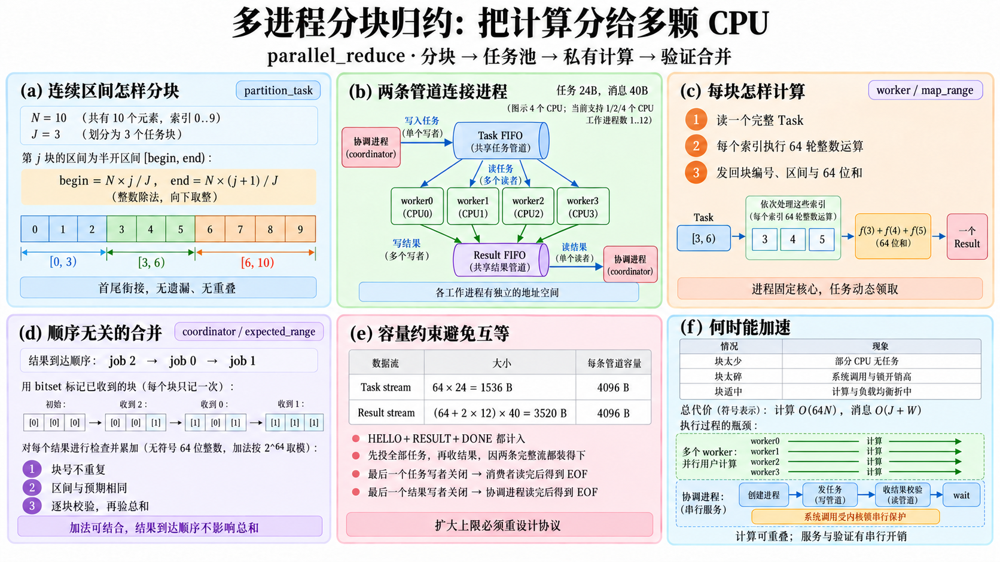

# 从零做一次多进程分块归约

这篇教程新增了能运行的 `/bin/parallel_reduce`。先把一段连续的数据分成小块，让多个工作进程从同一条任务管道领取下一块；每个工作进程算出局部结果，协调进程检查并合并。这就是这里的 Map/Reduce：**Map 把每个索引变成数值，Reduce 把数值相加**。

源码在 [parallel_reduce.cpp](../../user/programs/parallel_reduce.cpp)，复用 [bench_workload.hpp](../../user/bench_workload.hpp) 的整数计算与独立校验。下文的 A.a–A.f 对应图中六栏。



## 先运行，再看代码

宿主是运行 QEMU 的电脑；客体是 QEMU 里面的 OS64。下面第一组命令在**宿主的仓库目录**执行。已有数据盘先关闭 QEMU，再更新工具；这个更新会备份原数据盘，只替换 `/bin`。

```sh
make build
make update-tools
OS64_CPUS=4 make run
```

在**客体的 OS64 Shell**执行：

```text
run /bin/parallel_reduce
run /bin/parallel_reduce 1 64 1048576
run /bin/parallel_reduce 4 64 1048576
run /bin/parallel_reduce 12 64 1048576
run /bin/parallel_reduce 4 7 10003
run /bin/parallel_reduce 12 1 17
run /bin/parallel_reduce 4 64 1
```

三个参数依次是 `workers jobs items`：工作进程数、任务块数、待处理索引总数。不带参数使用 `4 64 1048576`。支持 1–12 个工作进程、1–64 块、1–16777216 个索引；每个索引做 64 轮依赖上一步结果的整数运算。参数超过上限、不是纯数字或缺项，返回错误码 1。

成功时应看到 `parallel_reduce tasks_once_full64_resources_ok` 和 `run_exit_code=0`。`checksum` 应等于 `expected`；处理 1048576 个索引时，完整 64 位结果是 **11753808538976649216**。`completed_jobs` 应等于参数中的块数。`free_pages_before/after` 和 `heap_bytes_before/after` 应各自相等。

`worker=3 cpu=0 jobs=8` 的意思是“第 3 号工作进程在 CPU0 完成了 8 块”，CPU 编号从 0 开始。`work_cpu_mask` 是参与非空计算的 CPU 位图：1 表示 CPU0，2 表示 CPU1，3 表示 CPU0＋CPU1，15 表示四颗核都做了非空工作。**这是一项观测，不是每次运行都会填满所有位的保证。** 单个任务不能同时交给多个消费者；`12 1 17` 就只有一个进程领到那一块，其余进程正常收到 EOF 并退出。

## A.a：为什么不会漏算或重算

处理的索引为 `[0,N)`，包含 0，不包含 N。第 j 块的边界是 `begin = N*j/J` 和 `end = N*(j+1)/J`，除法向下取整。例如 N=10、J=3，三块为 `[0,3)`、`[3,6)`、`[6,10)`。

前一块的 end 和后一块的 begin 使用同一个表达式，因而衔接；第一块 begin=0，最后一块 end=N。N<J 时允许空块，例如 N=1、J=64，前 63 块为空，最后一块包含索引 0。空块的结果是 0，仍然必须返回一次结果消息。

## A.b：进程与任务不是同一个东西

工作进程是工人，任务是工单。创建 4 个进程并不表示只处理 4 块。每个进程读取下一张工单，算完以后继续领取，直到管道写端全部关闭且数据读尽。

每个用户进程有私有地址空间，因此 Task 里传的是**索引范围**，没有传另一个进程的内存指针。本例的数据由索引生成，不需要复制大型输入数组。如果将来换成实际数组，必须重新设计如何传递数据；当前系统没有供这些用户进程使用的共享内存映射接口。

调度器在首次运行时给进程选定核心，之后不迁移。本例的“动态领取”发生在任务层：一个固定 CPU 上的工作进程算完当前块，就从共享队列拿下一块。它没有实现每核双端队列或 work stealing，也不能承诺领取数量相等。

## A.e：字节流怎样承载工单

两条管道分别承载任务和结果，容量各为 4096 字节。OS64 小于等于容量的写入会等待整次写入能放下，然后原子提交。因此不会出现两个写者把一条 40 字节消息交错拼在一起。但管道本身仍然是**字节流**，没有通用的消息边界服务。

本协议另外约定：协调进程每次写一个完整 24 字节 Task；每个消费者每次只读 24 字节；没有第三方读取或写入。因此任务队列里的数据量始终是 24 的倍数，消费者要么拿到一张完整工单，要么在读尽后拿到 EOF。它不能改成“先读 8 字节消息头、再读 16 字节消息体”：多个消费者可能分别拿到同一张工单的不同部分。

结果消息固定为 40 字节，有 HELLO、RESULT、DONE 三种。多个消费者各自原子写入，只有协调进程读取。协调进程的 `read_message()` 还会积累部分读取结果，满 40 字节以后才解释字段，EOF 出现在半条消息中就是协议错误。

| 流 | 最多写入的数据 | 每条管道容量 |
| --- | --- | --- |
| 任务 | 64×24＝1536 字节 | 4096 字节 |
| 结果，包括每个进程的 HELLO 与 DONE | (64＋2×12)×40＝3520 字节 | 4096 字节 |

这两个上界解释了为什么协调进程可以先写完全部任务，再读取结果：即使读取暂时不发生，两条**完整数据流**都能装下，不会形成“父等任务腾空间、子等结果腾空间”的互等。上界由 `static_assert` 同时检查。不能只增加任务数常量，然后继续相信这份证明；无限队列需要持续交错投递与回收，或引入其他背压协议。

`spawn` 会继承文件描述符。子进程要关闭任务写端与结果读端等多余描述符，父进程要关闭任务读端与结果写端。最后一个任务写端关闭后，消费者先读尽已有数据，再收到 EOF；最后一个结果写端关闭后，协调进程收到 EOF。忘记关闭任何一份写端，等待 EOF 的进程就可能一直睡着。

## A.d：为什么结果先后顺序不影响答案

返回值使用无符号 64 位整数，加法按 `2^64` 取模。这样的加法可以结合与交换：不论先收到第 2 块还是第 0 块，完整总和都相同。本例不使用浮点数；浮点加法的舍入会使不同合并顺序产生不同末位，不能照搬这个结论。

协调进程检查每个块号只能出现一次，区间必须和自己计算的分块一致，每块的 64 位结果必须正确，最后结果数与总和也必须正确。`received == jobs` 加上“不重复且块号合法”，共同保证所有块恰好返回一次。

图中 `f(i)` 是对索引 i 的映射，等于 `bench_compute(64,i+123)`；初值 seed 是 i+123。校验没有把慢循环再算一遍。`bench_compute` 的每一步为 `x = a*x+b`；把64步数值变换记作 F，仍可写成 `F(seed)=factor*seed+bias`。`bench_expected(64,0)` 给出 bias，`bench_expected(64,1)-bias` 给出 factor。索引区间的 seed 是 `begin+123` 到 `end-1+123`，其和由等差数列公式计算。由此能独立推算每块的完整结果。

`count*(count-1)` 的乘法发生在除以 2 **之前**。当前 N≤2^24，使这个中间值和 seed_sum 都不会溢出；不能任意放宽 N 后忽略这个条件。factor、bias 和最终总和的无符号溢出则是本例明确要求的模运算。

## 每个函数做什么

这里逐个说明新增文件的 12 个定义。`bench_compute()`、`bench_expected()`、`bench_checksum()` 的详细说明见 [协作讲义的公共计算助手](COOPERATION_FUNCTIONS.md)。下面的错误码来自本程序，管道底层错误含义见 [管道图解](COOPERATION_FUNCTIONS.md)。

### `equal(a, b)` — A.b

输入两个以零结尾的字符串，返回内容是否相同。逐个比较字符，遇到不相同或结尾就停止；用来识别内部的 `worker` 子进程模式。它依赖 `main` 收到有效的 argv，不是任意用户指针验证函数。代价与共同前缀长度成正比。

### `parse_bounded(text, limit, result)` — A.e

输入十进制文本、最大值与输出地址；成功返回 true 并写入结果。它先拒绝空字符串，再检查每个字符是不是数字。在乘 10 前检查 `value > (limit-digit)/10`，避免“先溢出，再判断大小”；digit 本身也不能超过 limit。0 可以解析，是否允许 0 由 main 判断。失败不写结果，负号、加号与空格也拒绝；复杂度 O(文本长度)。

### `decimal(value, output)` — A.b

把整数转换成以零结尾的十进制字符串。先反向收集个位，再翻转复制；0 也会写成一个字符。调用方提供至少 21 字节缓冲区，可容纳 uint64 的最多 20 位与结尾。它为 spawn 的字符串参数准备进程号和描述符，没有进行堆分配。

### `field(label, value)` — A.f

依次输出标签、数字、换行，方便人读与回归程序提取指标。底层输出会进入系统调用，不能把大量打印塞进要比较的计算循环；本程序在计算和回收后打印。复杂度受标签和数字长度影响，它不会将多个 write 合并成一个原子输出记录。

### `read_message(fd, message)` — A.d、A.e

从**唯一的结果读端**积累一个 40 字节 Message。读满返回 1；尚未开始下一条消息便读到 EOF 返回 0；底层读失败或半条消息遇到 EOF 返回 -1。它处理部分读，不能在多个竞争读者之间自动维护记录边界。可能睡眠等待写者，等待时间没有独立的有限超时保证。

### `partition_task(job, jobs, items)` — A.a

返回含 magic、块编号、begin、end 的 24 字节 Task。两次整数除法按上述公式确定区间；生产者和验证者都使用它，保证对区间有相同约定。调用者确保 jobs 非零且 job<jobs，当前参数上限保证乘法不溢出。O(1)，允许返回空区间。

### `map_range(begin, end)` — A.c

遍历半开区间，为每个 index 调用 `bench_compute(64,index+123)`，把结果加到 uint64 总和。没有共享可写用户数据，也没有主动 yield；定时器可以抢占它。空区间返回 0。工作量为 64×区间长度，暂不把进程启动、管道和系统调用开销计入这段纯计算。

### `expected_range(begin, end)` — A.d

利用两次仿射跳跃和等差数列和，独立推算同一区间应有的完整 64 位归约值。空区间的 triangle 为 0，避免 count-1 下溢。调用者保证 begin≤end≤最大索引数；上限不能随意扩大。固定 64 步的跳跃校验规模固定，代价不随区间长度线性增长。

### `close_ordinary_except(first, second)` — A.b、A.e

关闭普通描述符 3–18 中除了任务读端、结果写端以外的项。它保留 0/1/2 的标准输入输出错误，不操作父进程的独立表；关闭子进程继承的多余引用，确保最后写端消失时能产生 EOF。未打开的项返回的关闭错误可以忽略；扫描固定 16 项。

### `worker(id, task_read, result_write)` — A.b、A.c、A.e

先丢弃多余描述符，获取当前 CPU 并发送 HELLO。循环读取完整 Task，检查 magic、编号和区间，计算结果，再次核对 CPU 未变化，发送 RESULT。任务 EOF 后发送 DONE，关闭自身两端并返回。HELLO、每个 RESULT、DONE 在该进程内部按这个顺序写入，不要求不同进程的消息顺序相同。

快照失败、部分工单、非法字段、CPU 改变或写失败分别导致 10–15 的非零状态；返回 main 以后正常进程退出会关闭尚未显式关闭的资源。它只证明本例协议的完整消息，不提供重试、容错任务重新分配或超时取消。计算开销由领取的索引数决定，消息数量由领取的任务数决定。

### `coordinator(path, workers, jobs, items)` — A.a、A.b、A.d、A.e、A.f

记录资源快照与开始 tick，创建两条管道，然后 spawn 工作进程。子参数只有路径、`worker`、进程编号和两项描述符字符串。所有进程尝试启动后，父关闭多余两端；全部启动成功才投递任务，随后关闭任务写端。

结果循环先核对进程编号、CPU 和 HELLO，再根据类型处理。RESULT 要通过块号去重、区间与完整值验证；DONE 必须报告该进程确实发回的结果数量。读尽以后关闭结果读端，逐个 waitpid 等待并回收，再核对总量、总和、页数与内核堆占用。

如果部分 spawn 失败，它不再投任务，关闭任务写端和结果读端，让已启动进程通过 EOF/EPIPE 结束，然后仍然等待回收；协议错误也会关闭结果读端，不能只提前返回留下孩子。资源快照获取失败返回 2，创建管道失败返回 3，协议/子退出/结果/资源检查失败返回 4。对不受本例控制的恶意子进程，这个协调者没有管道读超时或强制终止 API。

纯计算总工作 O(64N)，任务与结果消息 O(J+W)，去重数组占固定 64 项，进程信息占固定 12 项。每个块的闭式校验规模固定，但创建地址空间、内核锁、阻塞唤醒、CPU 争用等时间不能藏在“并行除以 CPU 数”的理想式里。

### `main(argc, argv)` — A.b、A.e

区分内部 worker 模式与外部协调者模式。worker 模式必须有 5 项参数，编号小于 12、两个描述符各在 3–18 且不同。协调者支持默认参数或正好三项显式数字参数，逐个验证上界与非零要求，再调用 coordinator。内部 worker 模式是父子约定，不是允许任意输入直接绕过资源和进程权限。

## A.f：怎样解释性能

保持 N 相同，再改变工作进程数、块数与 QEMU CPU 数，才知道变化来自哪里。J 太小会让部分核心无事可做；J 太大，每块计算变少，系统调用、队列、锁和校验占比上升。W 大于核心数会增加抢占和创建成本；它可以帮助处理不均匀任务，但不能承诺总会更快。

本例证明“多个进程合作把计算做对”，并显示实际参与计算的核心。它没有重复采样、中位数/尾延迟统计，也没有把这份新算法移植到 Linux，因此输出不能支持“比 Linux 更快”或“最快”的结论。正式同工作量对照应读 [既有 1/2/4 核性能报告](../measurements/smp/REPORT.md)。Linux 的调度与本教程的固定核心设计也有不同，进一步阅读 [Linux 官方调度文档](https://docs.kernel.org/scheduler/sched-design-CFS.html) 时要注意该文描述 CFS；不能把它当当前全部 Linux 调度策略的概括。

宿主运行自动回归：

```sh
make test-parallel-reduction
```

它在独立临时磁盘上运行 1/2/4 核，每核配置 7 次归约、10 种错误参数和已有 pipe_test；每块在客体校验，总和还在宿主独立校验。包含 N=10003/J=7 的不均匀区间、N=1/J=64 的空块、W=12/J=1 和重复 W=12 的资源回收。实测原始证据见 [本例验证记录](validation/README.md)。测试不挂载个人 data.img，也不将“每颗核必须领到任务”写成通过条件。
