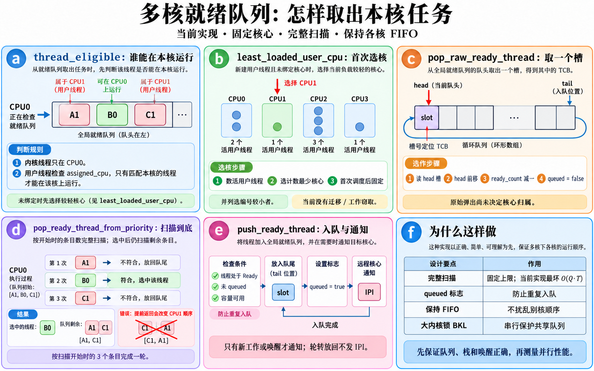
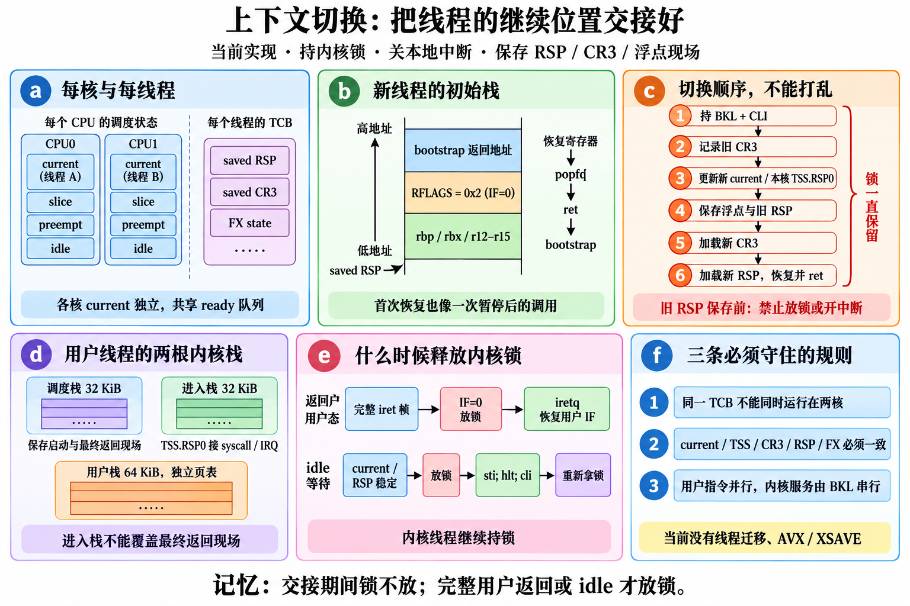
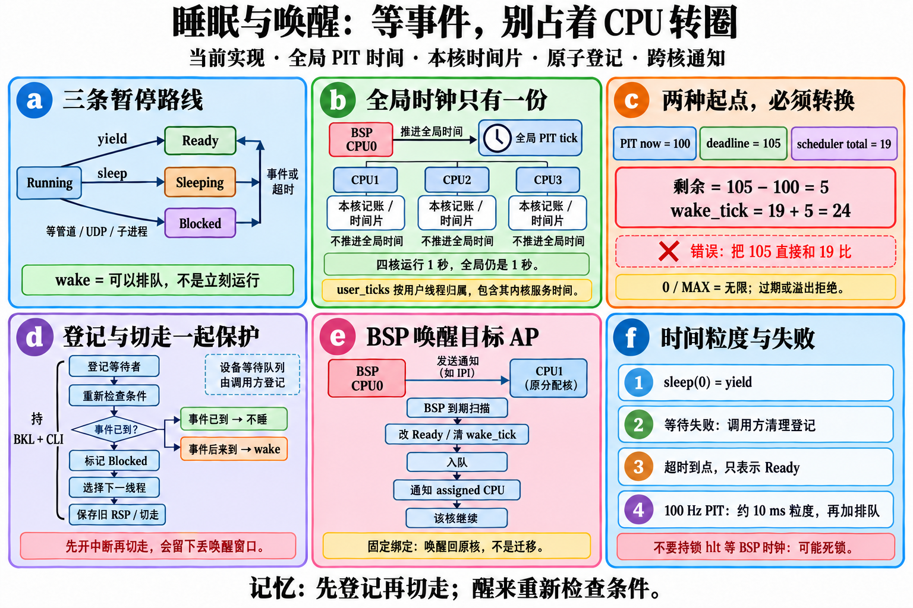
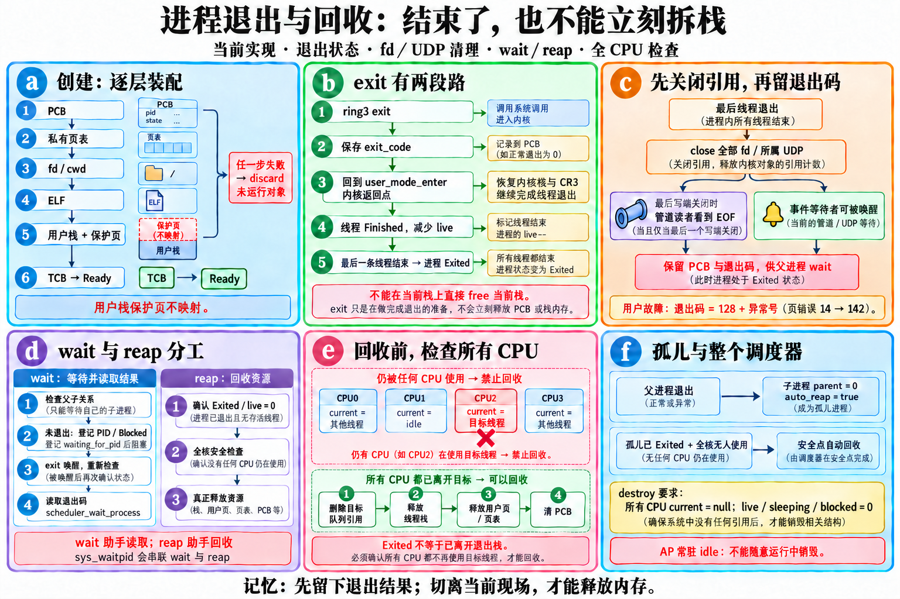

# 看图读函数：多核调度、睡眠与进程回收

本章逐个解释 `kernel/task/scheduler.cpp` 的函数，包括匿名命名空间中的辅助函数，并解释 `context_switch.asm` 的真正入口。先读每组图片理解机制，再找同名函数阅读细节。图片讲一个协作过程，几个小函数可能共同对应同一图块。

四张 PNG 信息图均由图像生成工具直接生成，未用 Python/SVG 绘制；调度切换、睡眠和回收三图的原始路径、最终文件哈希、编辑记录与审校项见 [图片清单](images-scheduler.json)，实际提示词保存在 [prompts](prompts/) 中。

源码核对基准：提交 `67efd0d008e0b58b31c89ad4ecfbab502416e087`。文件 SHA-256：

| 源码 | SHA-256 |
| --- | --- |
| [scheduler.cpp](../../kernel/task/scheduler.cpp) | `98bf7abc9bc8331dd00043d0965c76f4b2074859dead75ac4afa706a2874772c` |
| [scheduler.hpp](../../kernel/task/scheduler.hpp) | `8a33812d3ed9857dabdf2929780dac4ae34e9c2f0986a844b6286978e2433d3c` |
| [context_switch.asm](../../kernel/task/context_switch.asm) | `183e7e17426834a7c36b494e46c6142b651bb9fb99468fc0ffbb2c3705c69e93` |

## 先认清五个词

**进程**是一份资源容器，保存页表、文件描述符和退出码。**线程**是调度单位，保存下一次继续执行的栈和寄存器。PCB 是进程的记录，TCB 是线程的记录。这里的用户程序通常是一进程一线程；下面的机制并不表示已经提供用户共享内存线程 API。

**Ready** 只是“可以被选择”；**Running** 才是“当前在某颗 CPU 上执行”。Sleeping 等时间，Blocked 等事件或有限截止时间。唤醒只把线程放回 Ready，仍然可能需要排队。

**BKL** 是所有 CPU 共享的大内核锁；用户计算可以并行，内核服务持锁后依次执行。**CLI** 只关本颗 CPU 的中断，不能拦住另一颗 CPU。因此改变共享调度数据时，两者要一起理解：BKL 防别核，CLI 防本核中断重入。许多下面的内部函数不自行获取 BKL，调用者必须已持锁；启动单核阶段则尚无别核并发。

**BSP** 是启动 CPU，编号 0。**AP** 是后来启动的 CPU。普通内核线程只在 BSP 运行；每颗 AP 有自己的特殊 idle 线程。用户线程首次分配 CPU，以后固定在该 CPU，当前没有线程迁移和 work stealing。

复杂度记号：`T=32` 个线程槽位，`P=16` 个进程槽位，`C≤4` 颗 CPU，`Q` 为某优先级队列开始扫描时的长度。这里保留 `O(T)` 等符号，是为了看清扩大容量后的代价；当前容量固定且很小。

## 图 R：Ready 队列与首次分配

图 R(d) 最值得亲手模拟。队列 `[A@CPU1, B@CPU0, C@CPU1]` 由 CPU0 取出 B 后，剩下必须是 `[A@CPU1, C@CPU1]`。如果取到 B 就立即返回，A 已绕到队尾，会错误地留下 `[C,A]`。本实现固定扫描原来那一轮的所有元素，再返回选中的线程。R(b) 示例负载是 `[2,1,3,1]`，CPU1/CPU3 同为最轻，选择编号较小的 CPU1。

### `thread_slot_index` → R(e)

输入调度器和 TCB 指针，返回该指针在 `threads[]` 的下标。逐槽比较地址，不属于本数组、空参数返回 `0xFF`。队列存槽位号，因此不能把任意指针塞进去；代价 O(T)。由 `push_ready_thread` 使用。

### `is_runnable_priority` → R(e)(f)

输入优先级，只有 High、Normal、Background 返回 true。Idle 不能进入普通 ready 队列，避免把“没有事做时的兜底”与普通任务混排。非法枚举返回 false；O(1)。创建线程和队列入口共同使用它。

### `push_ready_thread` → R(e)

输入调度器、线程、是否通知 CPU；成功返回 true。先关本地中断，再检查 in_use、Ready、非 idle、未 queued、优先级与队列容量；反查槽位，把它写入对应环形队列尾，推进尾下标和计数，设置 queued。

`notify=true` 时通知目标核；保序轮转用 false。重复入队、无效对象或容量不足返回 false；调用者负责撤销刚创建的资源或状态。反查槽位 O(T)，通知首次分配时也可能 O(T+C)。必须在 BKL 内保持“一个 TCB 至多一个队列引用”。

### `pop_raw_ready_thread` → R(c)(d)、P(e)

输入调度器和优先级，弹出队首槽位、清该格、推进 head、减计数，并清 TCB.queued。空队列、越界优先级或无效槽位返回 nullptr；O(1)。它不判断线程属于哪颗 CPU，也不独立获取 IRQ guard，调用它的选择/回收过程负责保护。

### `pop_ready_thread_from_priority` → R(d)

输入一个普通优先级，返回本核可执行的第一条线程。记录初始 Q 次数，每次 raw pop；丢弃失效引用；第一条 eligible 留在手里，未分配者写入本核编号；其他有效线程按原顺序重新入队且不通知 CPU。即使找到目标，也完成这一轮。

没有合适线程返回 nullptr，其他核的 FIFO 相对次序保持不变。单次 raw pop O(1)，重新入队包含 O(T) 槽位反查，最坏 O(Q·T)，不是笼统的 O(Q)。必须持 BKL，并由此函数 CLI 保护整轮扫描。

### `pop_highest_ready_thread` → R(f)

输入调度器，依次尝试 High、Normal、Background，返回最高优先级中第一条本核 eligible 线程。高优先级队列只有别核线程时，会继续看低优先级。无候选返回 nullptr；最坏 O(T²)。持续可执行的高优先级任务可能让低优先级长期等待，当前没有优先级老化。

### `least_loaded_user_cpu` → R(b)

输入调度器，输出 CPU 编号。取已在线且不超过配置数量的 CPU 范围，扫描所有活用户线程，按 assigned_cpu 累加负载；Finished 和 idle 不计，Sleeping/Blocked 仍计。选数量最少者；相同数量选较小编号。

这是“已绑定线程数”平衡，不测运行时间或算力。O(T+C)，未分配线程还不占某核负载；真正选择时在 BKL 中写入 assigned_cpu，下一次选择便看到新负载。

### `thread_eligible` → R(a)(b)

输入调度器和有效 TCB，回答当前 CPU 能否选它。普通 kernel 线程仅 CPU0；user 线程若已绑定，必须编号相同；未绑定者只有 `least_loaded_user_cpu` 指定的核可以选。固定绑定检查 O(1)，首次分配判断 O(T+C)。内部调用者负责非空、状态与槽位有效性。

### `has_local_ready` → R(a)

扫描 TCB，寻找 in_use、queued、Ready 且 eligible 的线程，存在即 true。它回答“本核有没有别的事做”，避免只看全局 ready_count 而无意义抢占。最坏 O(T²)：未绑定候选判断可能再次扫描负载。使用 `scheduler_yield_current_thread` 和本地时钟请求路径。

### `notify_ready_cpu` → R(e)

输入新 ready 线程，计算目标核：kernel→0，已绑定→固定核，未绑定→当前最小负载核。SMP 未开启或目标为本核时直接返回；跨核先设置目标 preempt 请求位，首次设置时记账，再发送 reschedule IPI。

发送的是“请检查调度”的通知，不能代替入队、切栈和锁保护；重复通知不重复累加请求计数。已绑定 O(1)，未绑定 O(T+C)。单纯队列轮转不会调用这一通知。

### `select_next_runnable_thread` → R(f)

先选最高优先级的本核普通线程；没有时，若系统仍有活线程，返回本核 idle。AP 即使没有活线程也保持 idle，不退回 BSP。BSP 完全没有活线程时可返回 nullptr，让测试/启动上下文结束。代价由队列选择主导；无状态转移，实际 dispatch 在 `mark_thread_running`。

## 图 C：每核现场与上下文切换

C(c) 的顺序看起来像“先把 current 指针改成新线程，再保存旧 RSP”。这段短暂交接只允许在持 BKL、关本地中断时发生：别核与本核 IRQ 都看不到半成品。锁一直保留到新线程运行内核；完整返回用户态或 idle 真正停等时才放开。

### `LocalIrqGuard::LocalIrqGuard` → C(c)

无参数；记住进入时 IF 是否开启，再 CLI。保护本 CPU 上的切栈/计数过程不会被 IRQ 重入；O(1)。它不获取 BKL，不能单独保护跨 CPU 的共享数据。

### `LocalIrqGuard::~LocalIrqGuard` → C(c)

作用域退出时，若进入时 IF 开启才 STI，否则保持关闭。上下文切换可以跨很久才返回，但每条被恢复的调用链仍保存自己的 guard；O(1)。不能在旧 RSP 保存前为了“赶快开中断”而提前销毁保护。

### `local_cpu` → C(a)

输入调度器，读硬件识别的当前 CPU 索引；索引在配置范围内则返回它，否则回退 0。O(1)（内部 CPU 识别有实际指令开销）。它是访问 BSP 旧字段与 AP 独立字段的路由器，不是负载选择函数。

### `local_current` → C(a)

返回当前 CPU 的 current_thread **引用**：CPU0 用 `scheduler.current_thread`，AP 用 `secondary_cpus[index-1].current_thread`。赋值即改变对应 CPU 的记录；O(1)，输入必须有效且调用者持锁。不要把 BSP 字段误当成全系统唯一 Running 线程。

### `local_idle` → C(a)(e)

返回本 CPU 的 idle_thread 指针引用，分流规则同 `local_current`。O(1)。每颗 CPU 必须有独立 idle 栈；同一条 idle TCB 不能被两核同时恢复。

### `local_slice` → C(a)、W(b)

返回本 CPU 剩余时间片 tick 的引用。BSP 和 AP 各自递减，不能让四颗 CPU 共同消耗一个标量时间片；O(1)。`mark_thread_running` 重置它，本地时钟递减它。

### `local_preempt` → C(a)、R(e)

返回本 CPU 的 preempt_requested 引用。时钟/IPI 请求该 CPU 换人，安全点再兑现；O(1)。它是请求位，不是持锁位，也不表示切换已完成。

### `local_bootstrap_stack` → C(a)(f)

返回本 CPU 的 bootstrap 保存 RSP 引用，供第一次切入和最终恢复使用。BSP 与 AP 返回现场独立；O(1)。AP 不应退回 BSP 的启动栈。

### `local_bootstrap_fp` → C(a)(f)

返回本 CPU bootstrap 的 512 字节浮点现场引用。切入线程前保存，切回时恢复；O(1)。用于避免 bootstrap 与线程互相覆盖 x87/SSE 状态。

### `align_down` → C(b)

输入数值与对齐量，用位掩码向下对齐；alignment=0 时返回原值。当前调用使用 16 或页大小等 2 的幂；O(1)。这不是支持任意除数的取整函数，服务栈和参数表布局。

### `prepare_initial_thread_stack` → C(b)

输入新 TCB，把栈顶 16 字节对齐后预留布局，依次放 bootstrap 返回地址、RFLAGS=0x2、六个 callee-saved 寄存器零值，再记录 saved_stack_pointer。空 TCB、未分配栈、栈不足 4 KiB 时不做操作；O(1)。

这让第一次 context switch 的 pop/ret 与“暂停过的调用”看起来一样。初次 IF=0：current、TSS 和栈尚在交接，不能立即让 IRQ 看到不一致的线程现场。

### `scheduler_kernel_root_physical` → C(f)

输入调度器，优先返回 0 号 idle 内核进程的有效 CR3；缺少该视图时读当前 CR3。O(1)。普通内核线程及 bootstrap 恢复使用它；这个回退不替代初始化有效地址空间的要求。

### `thread_resume_root_physical` → C(c)(f)

输入线程，saved root 非零则返回保存值，否则返回 kernel root。新线程先在内核 root 上运行 bootstrap，user_mode_enter 再切私有 user root。O(1)，避免把“用户进程的 root”误当作“每次内核续跑必需的 root”。

### `initialize_thread_saved_root` → C(b)(f)

把新线程的 saved_address_space_root_physical 设成 kernel root；空 TCB 无操作，O(1)。初始化与初始内核栈配套，保证首次恢复时能看见 kernel heap 栈。

### `mark_thread_running` → C(c)(d)

输入要调度的 TCB；先给**本 CPU 的 TSS.RSP0**选用户进入栈或默认内核栈，再发布本核 current、重置时间片/请求位、设置 Running、累加线程/进程 dispatch 与每核 user dispatch。空参数无操作，O(1)。

它只做交接中的元数据更新，不自行切 CR3/RSP；调用者必须持续持 BKL 和 CLI，直到 `scheduler_switch_context_and_root` 保存旧栈并恢复新现场。

### `switch_thread_context` → C(c)

输入旧、新 TCB；CLI，记录旧线程当前 CR3，决定新 CR3，调用 mark 并记切换次数，再交给汇编保存旧 RSP/浮点与加载新 root/RSP/浮点。旧线程将来恢复时，这次调用才继续返回，并尝试回收孤儿。

空参数无操作；纯现场交接 O(1)，恢复后的孤儿扫描另算。内核锁属于 CPU，切线程仍保留同一 CPU 的锁所有权，不能在两根栈之间放锁。

### `switch_from_bootstrap_to_thread` → C(b)(f)

输入下一线程，把旧 RSP/浮点保存进本 CPU 的 bootstrap 字段，mark 下一线程并加载其现场。用于第一条线程 dispatch；空参数无操作，O(1)。后续返回发生在该 CPU 切回 bootstrap 时，不是立即返回。

### `switch_from_thread_to_bootstrap` → C(f)、P(b)

输入当前线程，记其 CR3，保存线程 RSP/浮点后加载本核 bootstrap RSP/浮点与 kernel root。O(1)。BSP 测试运行结束可以走此路；AP 正常调度选择始终保留 idle，不应跳进 BSP bootstrap。

### `scheduler_switch_context`（汇编）→ C(c)

输入 RDI=&旧 RSP、RSI=新 RSP。pushfq、CLI、保存 rbp/rbx/r12–r15，保存旧 RSP，改 RSP，再逆序恢复、popfq、ret。O(1)，只切最小栈上下文；当前 C++ 调度路径调用的是下面带 CR3/FX 的版本。

### `scheduler_switch_context_and_root`（汇编）→ C(c)(f)

额外输入 RDX=新 CR3、RCX=旧 FX 区、R8=新 FX 区。pushfq/CLI 后 FXSAVE64/FXRSTOR64，再保存六寄存器和旧 RSP，装新 CR3，装新 RSP，恢复后 ret。FX 区必须 16 字节对齐且 512 字节；当前支持 x87/SSE，没有 AVX/XSAVE。

顺序是“旧栈仍可访问时先保存 → 新 root → 新栈”。一般寄存器的完整用户现场由 trap frame 保存；不能误解为用户只有六个寄存器需要保存。O(1)，CR3 写入还有硬件缓存代价。

### `is_user_thread_ready_to_enter` → C(d)

检查 TCB 是 user、owner/页表有效、root/RIP/RSP/选择子非零，输出 bool；O(1)。它是结构完整性检查，不等同于逐页证明入口地址权限，ELF/地址空间模块已负责映射验证。

### `run_current_user_thread` → C(d)(e)、P(b)

输入已选 user TCB；准备 kernel/user CR3 与返回值，调用 user_mode_enter。用户 exit 后才接回此函数，保存返回值到 TCB 和 owner.exit_code。结构无效则直接返回，O(1) 装配；用户运行时长不计作装配复杂度。

### `user_mode_enter`（汇编）→ C(d)(e)

输入 UserModeLaunchContext 指针，保存内核 callee-saved 和最终返回 RSP，加载 user CR3，构造 SS/RSP/RFLAGS/CS/RIP 的 iretq 帧。完整帧就绪且 IF=0 时调用 kernel_gate_leave_user，随后 iretq 进入 ring3。O(1)。

它不立即按普通 call 返回：用户 exit 的 resume 路径恢复这个保存点。调度栈必须一直保留，不能与 TSS.RSP0 的 syscall/IRQ 进入栈混用。

### `user_mode_resume_kernel`（汇编）→ C(d)、P(b)

输入保存的 kernel resume RSP、kernel CR3、返回值；恢复 kernel CR3、数据段选择子、RSP，逆序 pop 六寄存器后 ret 到 user_mode_enter 的原调用者。O(1)。此时由用户 trap 进入的内核已经持 BKL；不会返回到 resume 自己的调用点。

### `scheduler_thread_bootstrap` → C(b)(e)、P(b)

新线程初次 ret 的统一落点。先检查调度器并回收孤儿；user 调 run_current_user_thread，再 exit_current_thread；kernel 检查 entry，普通线程先开中断后调 entry(context)，返回后也退出。idle 自己管理中断与放锁。

缺少调度器会停等；缺少 current 或 entry 走线程退出。装配 O(1)，entry 的耗时另算。它确保 C++ 入口自然 return 不会跳到未定义的栈地址。

### `idle_thread_entry` → C(e)

无限循环：CLI、拿 BKL、回收孤儿、yield 看本核是否有普通任务；确实无任务时，稳定 current/RSP 后放锁，执行 `sti; hlt; cli`，唤醒后重新拿锁。HLT 使本核等中断，BKL 释放允许别核内核服务推进。

STI 的中断延迟覆盖紧随的 HLT，避免 IPI 恰好发生在“开中断”和“睡下”之间被丢掉。每轮代价由队列/孤儿扫描主导；idle 不进入普通队列或普通 live 计数。

## 图 W：时间、阻塞与跨核唤醒

W(c) 的两种时钟可以都叫 tick，却不从同一时刻开始计数。PIT 在启动时就运行，调度器初始化才把自己的 total_ticks 清零。PIT=100、截止=105、调度器=19，应该睡剩下的 5 tick，即 wake_tick=24；直接把 105 填进去会多睡启动阶段的差值。

### `relative_block_deadline` → W(c)

输入调度器、PIT 绝对截止值和输出指针。0 或 UINT64_MAX 代表无限，输出 wake_tick=0；否则读取 PIT now，拒绝已过期或加法溢出，输出 `scheduler.total_ticks + deadline - now`。O(1)，内部调用者保证有效参数。公开有限 block API 必须经过它转换。

### `update_owner_ready_state` → W(a)

输入 owner，若进程为 Running 则改 Ready，空参数无操作。O(1)。它描述这版线程让出 CPU 后的进程状态；Sleeping/Blocked 的差异仍存在线程状态中，PCB 的 Ready 不保证线程现在能执行。

### `scheduler_yield_current_thread` → W(a)、R(e)

CLI 后找 active/current，要求 Running。idle 只尝试选普通线程；普通线程若没有本核 eligible ready 同伴，重置请求/时间片并返回 false。否则把自己改 Ready、记 yield、放同优先级队尾，再选最高优先级本核线程并切换。

失败可能来自无调度器、无同伴或入队失败；此路径并非每次调用都切换，也不保证一定切到不同 TCB。复杂度由 O(T²) 选择主导。它只表达主动交还机会，不表示睡眠或等待某个事件。

### `scheduler_yield_if_requested` → W(a)、R(e)

CLI 后检查本核 preempt_requested 与 current，再调用 yield。未请求返回 false，实际复杂度同 yield。时钟处理先记请求，公共安全点才完成切栈；与用户 trap 恢复时的抢占路径协作，不能只设置请求就声称已换人。

### `scheduler_sleep_current_thread` → W(a)(f)

输入相对 tick 数；无正式非 idle current 返回 false，ticks=0 等价 yield。正数时标 Sleeping、设置 `total_ticks+ticks`、增 sleeping 计数，然后选下一线程切走；没有下一线程则恢复 Running/计数并返回 false。

加法回绕时当前实现回退到 `total_ticks+1`，不是任意 64 位超长等待的通用保证；正常 syscall 已限制毫秒范围。醒来返回 true 表示暂停/恢复路径完成，不证明其他业务条件。代价以选择为主，wake_tick 使用调度器相对全局时钟。

### `block_current_thread_internal` → W(d)(f)

输入“恢复后是否开中断”和 PIT 截止时间。CLI，验证非 idle 当前线程并转换截止；设 Blocked/wake_tick、增 blocked，选下一线程并在关中断下切走。旧线程被恢复后才按参数 STI；没有下一线程则撤销状态/计数并返回 false。

它不负责向 UDP/pipe 等待队列登记，调用者须已持 BKL、CLI、登记并重查条件。过期/溢出直接失败，不能当成一次睡眠成功。代价由选队列主导；绝不能保存旧 RSP 前开中断。

### `scheduler_block_current_thread` → W(d)

无参数，调用 internal(false,0)，无限等待某个事件，恢复时保持调用链原有 IF 语义。返回是否成功暂停并恢复；复杂度同 internal。事件等待者登记与失败后的注销仍由调用方完成。

### `scheduler_block_current_thread_and_enable_interrupts` → W(d)

调用 internal(true,0)，用于调用者先 CLI 登记等待者的路径。切栈前保持 IRQ 关闭，**恢复旧线程后**才开启；不是“先 STI 再 block”。返回/复杂度同 internal，失败分支可能主动开中断，调用方若原来 IF=0 应按自己的约定恢复。

### `scheduler_block_current_thread_until` → W(c)(d)

输入绝对 PIT deadline，调用 internal(false,deadline)。0/MAX 为无限，有限值经过时钟转换；已过期立即 false。UDP 等调用者用同一个固定截止时间重试，避免每次无关唤醒又重新延长等待。复杂度同 internal。

### `wake_thread_internal` → W(e)

输入调度器、TCB、是否请求当前 idle 重新调度。只接受 Sleeping/Blocked 非 idle 活线程，减对应计数，改 Ready、清 wake_tick，调整 owner 状态并入队。入队同时通知目标核；当前本核 idle 且本核有任务时，也设置请求。

重复唤醒 Running/Ready 返回 false，防计数重复减少；若入队意外失败，本实现已先改变状态，调用者不能把 false 当“完全无副作用”。正常队列容量不变量保证唤醒有位置。代价 O(T) 入队，首次分配或本核扫描可能 O(T²)。

### `wake_sleeping_threads` → W(e)

输入调度器；有 Sleeping/Blocked 时扫描非 0 线程槽位，`wake_tick!=0 && wake_tick<=total_ticks` 就唤醒。无限 Blocked 的 wake_tick=0，不因时钟到期醒来。由 BSP 全局 tick 调用；扫描 O(T)，多个入队/eligible 检查使整次处理最坏更高、当前有界于 32 槽。

### `scheduler_wake_thread` → W(e)

对外 wake：CLI、取 active 调度器，调用 internal(thread,true)。返回是否成功把等候线程变 Ready；无调度器 false。它本身没有设备句柄 generation 检查；UDP/pipe 层负责确认等待者仍对应同一对象与 TID，再调用它。

### `scheduler_handle_timer_tick` → W(b)(e)

由 BSP PIT 路径调用，无参数。调度器未 ready 则无操作；只在这里推进 scheduler.total_ticks，检查到期线程，再给 BSP 做本地记账/时间片。多核不会让全局等待时间乘 CPU 数。代价以到期扫描为主，BKL 内执行。

### `scheduler_handle_local_timer_tick` → W(b)

每 CPU 本地调用，先增本核 timer_ticks。Running 非 idle 线程增加 consumed_ticks、owner total_thread_ticks；user 模式 TCB 增 user_ticks，递减本核时间片。到期且有本核 ready 同伴，或 idle 有任务时，设置请求并记账。

AP 路径不推进全局 total_ticks，也不遍历全局截止时间。user_ticks 依据当前 TCB 类型归属，包含该用户线程执行内核服务时的 tick，不能直接叫“纯 ring3 利用率”。最坏代价来自 has_local_ready 的 O(T²)。

## 图 P：创建、等待、退出与安全回收

P(e) 是多核最容易遗漏的一步：目标进程不在 **CPU0** 上执行，并不等于它不在 **任何 CPU** 上执行。回收要扫描所有 current。进程 Exited 时也可能仍在退出路径的栈上，必须先切离它再释放。

### `copy_name` → P(a)

输入固定容量目标和名称，最多复制 23 个字节，保证第 24 字节以内有 NUL；空目标无操作，空名称写空串。O(名称截断长度)，用于日志名字，不是 UTF-8 字符数截断或路径复制器。

### `first_free_process_slot` → P(a)

扫描 PCB 槽位 1..15，返回第一块 !in_use；空调度器或满表返回 nullptr。O(P)。0 号保留给 idle 内核进程，创建时要在同一 BKL 内及时标 in_use，不能让别核取得同一槽。

### `first_free_thread_slot` → P(a)

扫描 TCB 槽位 1..31，返回第一块 !in_use；空或满表返回 nullptr。O(T)。0 号 BSP idle 固定保留；AP 的 idle 也占普通编号槽，因此实际可创建数量会随 CPU 数减少。

### `scheduler_find_process` → P(d)

输入 ready 调度器和 PID，扫描 in_use PCB，找到返回指针，否则 nullptr。O(P)。PID 是标识，指针是可回收槽位地址；持锁与对象生命周期保护之外不能长期保存后假定仍是同一进程。

### `scheduler_create_kernel_process` → P(a)

验证调度器，找空 PCB，清零、分配 PID、标 kernel/Ready，建立共享内核地址空间视图并复制名字。失败返回 nullptr、清本次槽位；O(P) 加地址空间视图装配。它不克隆用户页表，也不自动创建线程。

### `scheduler_create_user_process` → P(a)

输入调度器、页分配器、名称。先预映射完整 kernel heap，再找空 PCB，分配 PID/parent_pid、记录 allocator，克隆 kernel root 形成私有 user 页表，复制名字。失败返回 nullptr并清槽位。

预映射保证后来分配的内核栈/缓冲区在所有 user root 都可见且仍为 supervisor 权限。代价为 PCB 扫描和堆映射/页表克隆；具体页数成本在地址空间模块。当前不向用户共享 kernel heap 数据。

### `scheduler_initialize_process_syscall_view` → P(a)

输入活 PCB、已挂载 VFS、可选写回调/上下文。初始化该进程 fd 表，再把 syscall context 绑定它，若回调非空则安装。返回成功与否；O(固定 fd 容量) 的初始化。失败后的整个 PCB 清理由 ELF 装配调用方承担，不把它当作已完整创建的进程。

### `scheduler_create_user_elf_thread` → P(a)

输入 allocator、文件系统/VFS、路径、名字、用户栈顶/flags、优先级和结果输出。创建 user PCB 与 syscall 视图 → 载入 ELF → 检查标准栈顶和未映射保护页 → 分配 16 页 64 KiB NX 用户栈 → 建立 heap 边界 → 创建 user TCB 并入队。

成功输出 PCB/TCB、ELF 摘要和栈顶物理页；任一步失败 discard 尚未运行进程，并释放本次尚未挂入地址空间的页。代价由 ELF 字节/页数、栈 16 页和页表装配决定；保护页不映射，不能误画成普通栈页。

### `scheduler_create_kernel_thread` → P(a)、C(b)

输入 owner、entry/context、栈大小和普通优先级。分配至少 4 KiB 的 16 字节对齐 kernel heap 栈，初始化 TCB/FX，固定 assigned_cpu=0，构造初始栈/root，增加 live 计数后入队。

空 entry、无槽位、无堆或入队失败返回 nullptr；失败释放栈、撤销 live/in_use。成功只表示 Ready，尚未执行 entry。代价 O(T) 加堆分配；普通内核线程均在 BSP，AP idle 是初始化专门创建的例外。

### `scheduler_create_user_thread` → P(a)、C(d)

输入私有页表的 user PCB、allocator、RIP/RSP/flags、优先级。分配**两根 32 KiB supervisor 内核栈**，初始化 TCB/FX，assigned_cpu=未分配，写用户启动现场、构造初始调度栈/root，增 live 并入队。

RFLAGS 仅保留输入 IF 位并设置固定 bit1；这函数不自行创建用户栈映射，ELF 装配负责。任一栈分配或入队失败释放两栈并撤销计数。O(T) 加堆分配；内核栈和用户栈是三种不同角色。

### `scheduler_prepare_user_arguments` → P(a)

输入未 dispatch 的 Ready user TCB/owner，以及 argc/argv。最多 16 参数，每条字符串最多 255 字节加 NUL；先验证长度与栈容量，再从高地址倒序复制字符串，构造 16 字节对齐的 `argc, argv[], nullptr` 表并改初始 user RSP。

非法关系、已执行、空字符串指针、超长或复制失败返回 false；复制失败可能留下部分内容，调用者应放弃本次启动。O(总参数字节)，用 address_space_copy_to_user 写目标进程页，不直接解引用任意用户虚拟地址。

### `scheduler_user_range_valid` → P(a)、C(d)

输入用户地址、长度和是否要求可写；取当前 user TCB/owner，用其地址空间检查完整范围权限。无当前用户对象 false；代价由跨页范围检查决定。检查与实际复制仍须在正确对象生命周期内，阻塞恢复后的缓冲区验证由 syscall 层再次进行。

### `scheduler_wait_process` → P(d)、W(d)

输入 active 调度器、PID、可选退出码输出。拒绝 PID0、等待自己、非子进程；没有正式 waiter 的 bootstrap 用 run_until_idle 推进。正式线程 CLI 后再次看子状态，登记 waiting_for_pid，block，恢复后清 PID并循环重查。Exited 后只复制退出码。

失败返回 false，成功 **不自动 reap**。等待者登记与子退出 wake 在 BKL 内保持顺序，避免退出发生在检查和睡下之间丢通知。查找 O(P)，等待时间/循环次数由子程序决定。

### `scheduler_exit_current_user_process` → P(b)

输入退出码，合法 current user 且已保存 kernel resume RSP 时写 owner.exit_code/return_value，调用 user_mode_resume_kernel 接回原启动调用。无合法现场则关中断停等，不返回；O(1)。它尚未释放 PCB/栈，后续 bootstrap 才调用线程完成路径。

### `scheduler_handle_user_exception` → P(c)

输入异常帧和故障地址。只接受 CS 低两位为 3 的 current user；记录 fault_vector/address，用 `128+vector` 退出。非用户异常返回 false，由异常框架另行处理；合法用户分支不返回。O(1)，保护内核不因单个 user guard/NX 故障而整体停止。

### `scheduler_exit_current_thread` → P(b)(c)

CLI 后把 current 标 Finished、清 wake_tick，减 owner/system live。owner 最后一条线程结束时：记录 exit 日志，立即 close fd 与该 PID UDP，标 Exited；子进程改 parent=0/auto_reap；唤醒等待该 PID 的 Blocked 线程。

随后选下一线程并切走；BSP 无任务时清本核 current 再切 bootstrap。当前 finished 栈不能在本函数释放。无有效 current 停等且不返回。代价含 O(P+T) 生命周期扫描和队列选择；立即 close 管道写端保证读者不必等父进程 reap 才看到 EOF。

### `process_is_current` → P(e)

输入 PCB 或 nullptr，扫描所有配置 CPU 的 current；给定 PCB 时查 owner 是否相同，nullptr 时查是否存在任何 current。O(C)。这是 discard/destroy 的跨核防线，idle 也算 current，不能只检查 BSP。

### `scheduler_discard_process` → P(a)(e)

CLI，按 PID 查 PCB；拒绝 PID0、任一 CPU 正使用它。其线程必须 Finished 或 Ready 且从未 dispatch，拒绝运行过但仍活着的对象。完整轮转各优先级队列，去掉目标 owner 引用而保留其他次序；减 live、释放其 TCB，再释放 PCB。

返回成功/失败，失败不满足回收条件时不拆资源。用于创建失败或已退出 reap；最坏 O(T²+P+C) 加内存释放，不支持随意终止运行中的进程。进程页/栈实际释放成本按资源规模另算。

### `scheduler_reap_process` → P(d)(e)

输入 PID 和可选状态输出；要求 PCB 已 Exited、owner.live=0，先记退出码，再调用 discard。成功释放对象后写退出码；失败 false。代价同 discard 加查找，状态需在释放前保存，不能从已经清零的 PCB 读取结果。

### `release_thread` → P(e)

输入已确认不在任何 CPU 使用的 TCB。user 释放调度栈和 TSS 进入栈；kernel 释放其单栈；最后清零整个 TCB。堆释放代价由 allocator 决定。内部 helper 不查 current，也不删队列引用，前置条件由 discard/destroy 保证。

### `release_process` → P(e)

输入已安全脱离运行的 PCB，close 全部 fd，user PID 关闭所属 UDP；拥有页表 root 时销毁地址空间，再清零 PCB。代价随 fd 与映射页数；它不等待线程停止，不能直接对 current owner 调用。

### `reap_orphans` → P(f)

调度器 ready 时扫描 PCB，只有 in_use、auto_reap、Exited 且全 CPU 都不 current 的进程才调用 reap。用于线程恢复/启动和 idle 的安全点。O(P·C) 检查，实际回收另加 discard 成本；活着的孤儿不立即杀死。

### `scheduler_destroy` → P(f)

要求 ready、所有 CPU 没 current、live/sleeping/blocked 都为 0；然后释放每个 in_use TCB/PCB，若是 active 则清单例并恢复默认 TSS.RSP0，最后清空 SchedulerState。失败 false，O(P+T) 外层加实际资源释放。

这主要用于单核阶段 fixture 完整结束。SMP AP 常驻 idle 会让 current 检查失败；不是已经实现运行中停掉所有 AP、热切换调度器的 API。

## 初始化、单例与观察接口

这些小函数对应 C(a)、P(a)(f) 的“状态对象准备/观察”。图里不重复画一个盒子一张图；下面仍列出每个函数，便于从源码跳回解释。

### `initialize_scheduler` → C(a)(b)、P(a)

输入 SchedulerState 和非零时间片；要求 SMP 尚未启用、CPU 初始化成功。清状态/队列、初始化 bootstrap FX，设单 CPU 计数与 PID/TID 起点，创建 0 号共享 kernel-root idle PCB/TCB、分配 8 KiB 栈并伪造初始帧，发布 active。

失败返回 false；部分初始化（例如 idle 栈分配失败前）可能已经写入 ready 和 PCB，调用方须放弃该对象并按初始化路径清理。代价 O(P+T) 清零加栈分配。不能在其他 CPU 调度中重新 memset 全局状态。

### `scheduler_is_ready` → C(a)

输入指针，非空且 ready=true 才返回 true；O(1)。这是初始化状态检查，不是共享状态的加锁或资源完整性证明。

### `scheduler_set_active` → C(a)、P(f)

输入调度器或 nullptr，单核时验证 ready 后设置全局单例。SMP 开启后不允许换成另一个对象或清掉当前对象；O(1)，避免 AP 仍引用旧状态。已 active 的相同对象可保持。

### `active_scheduler` → C(a)

匿名命名空间 helper，直接返回 g_active_scheduler；O(1)，可能 nullptr。只提供访问，不做生命周期验证。内部 current/yield/timer 路径用它。

### `scheduler_active_state` → C(a)

公开返回同一个 g_active_scheduler，O(1)，可能 nullptr。与内部 active_scheduler 语义相同，公开名称供其他模块取得调度状态。

### `scheduler_cpu_current_thread` → C(a)、P(e)

输入 ready 调度器与明确 CPU 编号；范围无效 nullptr，0 读 BSP 字段，其他读 secondary_cpus[index-1]。O(1)。用它枚举全核 current，避免把“当前调用核”和“指定目标核”混为一谈。

### `scheduler_prepare_smp` → C(a)(b)

输入尚未运行线程、当前单 CPU 的 ready 调度器与 1..4 数量。CLI 后为每颗 AP 找 TCB/分配 8 KiB idle 栈，固定该 AP 编号，准备栈/root/FX和私有 CPU context；最后一次性发布 smp_cpu_count。

分配失败逐个释放本次已准备 AP idle/context，返回 false；它准备调度结构，实际 INIT/SIPI 启动 CPU 在 SMP 模块。最多 C−1 次槽位扫描，O(C·T) 加分配，不能在有任何 current 时调用。

### `scheduler_run_secondary_cpu` → C(a)(e)(f)

AP 以 IF=0、持 BKL 和独立 TSS/root/FX 进入；校验 active、index、当前硬件 CPU 一致，选择并首次切入本核线程。后备路径永久“放锁→sti/hlt/cli→拿锁”。不返回，不恢复 BSP bootstrap。单次入口代价由选择主导。

### `scheduler_run_until_idle` → C(f)、P(f)

CLI，要求 ready、调用核是 BSP、该核无 current；选第一任务并从 bootstrap 切入。返回时回收孤儿，只有 live/sleeping/blocked 都为 0 才 true。无候选 false，运行时间由任务决定；不是网络/常驻 worker 的自动停止接口。

### `scheduler_current_thread` → C(a)

输入调度器，未 ready 返回 nullptr，否则调用 scheduler_cpu_current_thread 取**调用者所在 CPU**的 current。O(1)。不能用它判断别核是否正在使用某进程。

### `scheduler_active_thread` → C(a)

无参数，取 active 再取本核 current；O(1)，可能 nullptr。syscall/异常/FD 等模块通过它找到正确 owner 资源。

### `scheduler_ready_thread_count` → R(c)(e)

返回全局 ready_count，未 ready 返回 0；O(1)。它包含别核任务，且不含当前 Running 或特殊 idle；决定本核能否 yield 仍须 has_local_ready。

### `scheduler_live_thread_count` → P(b)

返回系统普通活线程计数，未 ready 返回 0；O(1)。Ready/Running/Sleeping/Blocked 都活着，Finished 不活；idle 不计入此数。

### `scheduler_sleeping_thread_count` → W(a)

返回全局 Sleeping 数，未 ready 返回 0；O(1)。进入 sleep 增，wake 减；不等于全部不运行线程，Blocked 另计。

### `scheduler_blocked_thread_count` → W(a)

返回全局 Blocked 数，未 ready 返回 0；O(1)。包含等事件及设置截止时间的 Blocked；计数观察不能代替检查某等待队列的具体成员。

### `scheduler_process_state_name` → P(b)

输入枚举，映射 free/ready/running/exited 字符串，其他返回 invalid；O(1)，返回静态字符串，不分配内存。用于 ps/日志，不能据字符串推断线程是否 Ready。

### `scheduler_thread_state_name` → W(a)

输入线程枚举，映射 free/ready/running/sleeping/blocked/finished，非法返回 invalid；O(1)。只格式化，不改变状态或计数。

### `scheduler_thread_priority_name` → R(e)(f)

输入优先级，映射 high/normal/background/idle，非法返回 invalid；O(1)。只有前 3 类属于普通 ready queue，idle 是特殊调度兜底。

## 汇编自检程序也怎么读

`context_switch.asm` 的 `*_program_start/end` 是复制到用户代码页的字节区间边界，消息/data 和内部 `.label` 不都是可被 C++ 调用的函数。仍把两段程序的用途写在这里，以免源码中看到符号却查不到解释。

### `user_mode_smoke_program_start` … `user_mode_smoke_program_end` → C(d)、P(a)(b)

进入 ring3 后设置用户段，write 消息、getcwd 检查 `/`、open/read/close 相对路径 `readme.txt`，最后把 CS 与成功标志位打包经 exit 返回。输出用于验证权限级、syscall、独立 fd/cwd 链路。未过某检查就不设置相应位；真正 syscall 失败可从退出位看出。

### `user_mode_yield_program_start` … `user_mode_yield_program_end` → C(c)、W(a)(d)

在同样的 cwd/readme 检查后验证三件事：主动 yield 后继续且关键寄存器不变；ring3 自旋时被 timer 抢占、helper 完成后继续；read(0) 无字符先 block、键盘 IRQ 注入 `a` 后恢复。ARM/DONE 等共享标志是启动自检 fixture，不能当作已经提供通用用户共享内存 API。

字符串、常量和内部标签必须都在复制区间内，避免 RIP-relative 地址指向未复制区域。性能 benchmark 使用独立用户程序，不从这两段自检循环推算生产性能。

## 用四条练习把图和函数串起来

1. 在 R(d) 写下每一次 raw pop/requeue 后的队列，再把 C@CPU1 换成 C@CPU0，确认 CPU0 仍选择最早的 B，C 留在 B 后面的相对位置。
2. 看 C(c)，假设发布新 current 后就放 BKL，找出另一颗 CPU 为什么可能误判旧线程“已不运行”而回收其还没保存的栈。
3. 看 W(c)，把 PIT now 改成 106，deadline 仍是 105，确认有限 block 返回 false，而非把无符号减法变成巨大等待。
4. 看 P(e)，让目标 Exited 进程仍出现在 CPU2.current，确认 reap 必须先失败；切走后才可释放两根内核栈与用户页表。

继续阅读：[多核调度总教程](../SMP_SCHEDULER_TUTORIAL.md)、[多核启动教程](../SMP_BOOT_TUTORIAL.md)、[进程与文件运行时](../PROCESS_RUNTIME.md)。当前没有实现工作窃取、用户线程共享地址空间并发、CPU 热插拔或细粒度内核锁；图中固定绑定与 BKL 就是今天的源码行为。
