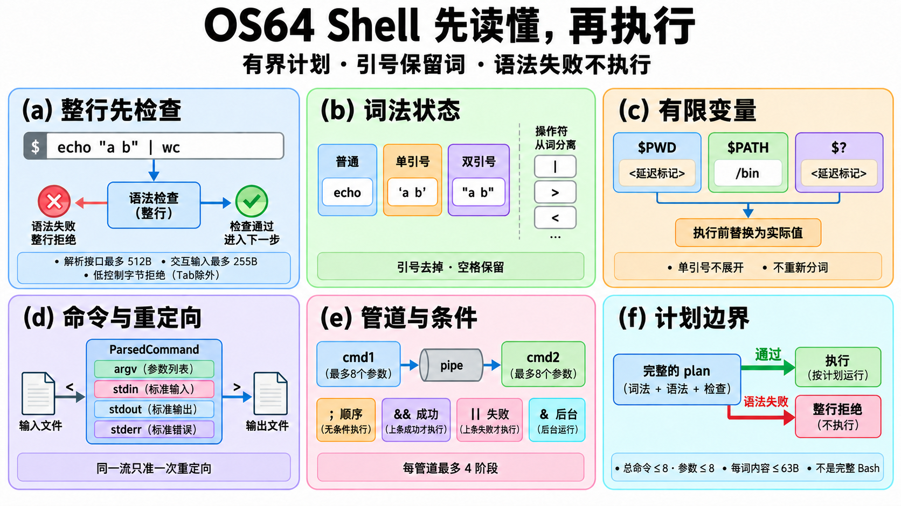
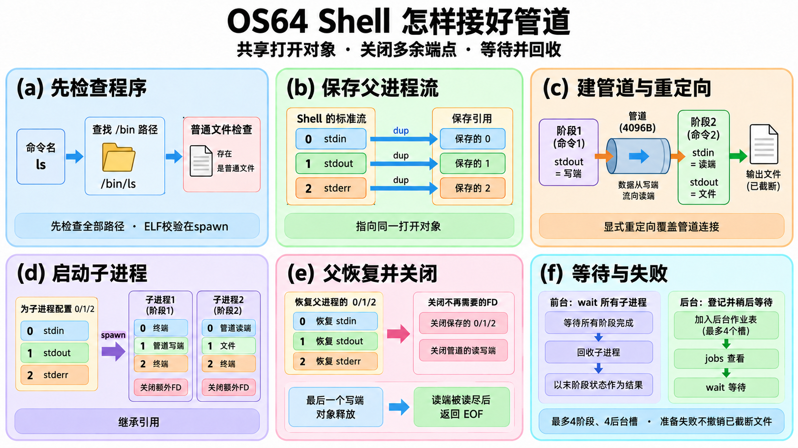
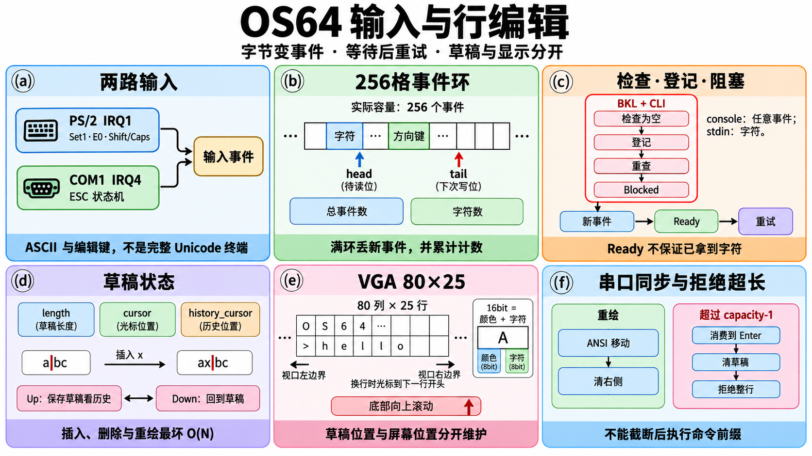
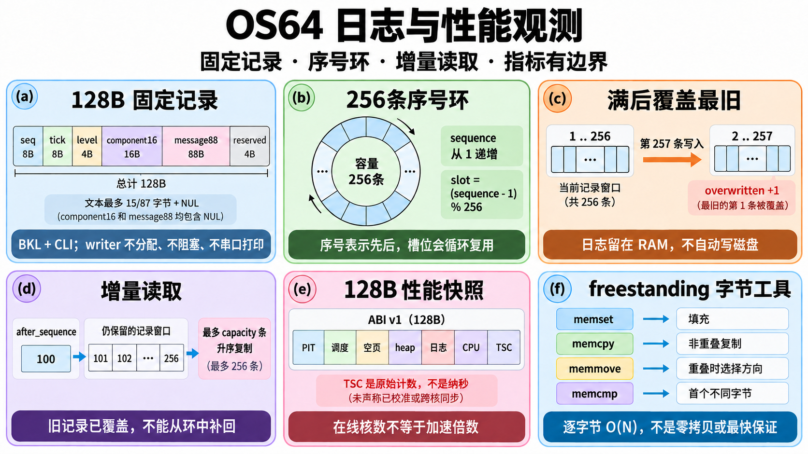

# Shell逐函数：把一行文字变成进程与数据流

讲义标题中的文件前缀用于区分同名函数，不表示源码新增了这些命名空间。

本章包含parser.cpp的10项、shell.cpp的77项定义，共87项。每个函数都有源码位置、输入、结果、步骤、理由、失败边界和复杂度。图块 `Q(a…f)` 对应词法与语法图，`X(a…f)` 对应管道执行图，`I/H/O` 借用[设备I/O图解](DEVICES_IO_FUNCTIONS.md)的实际图片，`L/T/V` 借用[文件系统图解](FILESYSTEM_FUNCTIONS.md)的实际图片；图的短句用于看整体，函数表用于学细节。

Shell做两件不同的事：先把文字解析成一个**计划**，再执行这个计划。整行输入先解析成功，才会打开重定向文件或启动子进程；不过执行阶段的文件截断已经是实际副作用，之后spawn失败并不恢复这个文件。

当前子集支持单双引号、反斜杠、注释、`$PWD`、固定`$PATH=/bin`、`$?`，以及管道、顺序、成功／失败条件、后台、三种标准流重定向。没有完整Bash／POSIX语法、通配、命令替换、环境变量表、完整终端作业控制或pipefail。解析器接收一行最多512B，总命令最多8个，每管道最多4阶段，每命令最多8参数，每参数／重定向名字内容最多63B；历史最多24条，每条255B；后台作业表4槽。实际交互Shell使用256B行缓冲，最多输入255B；512B是解析器接口上限，不能把两者混为同一个限制。

普通交互中的cat、echo、pwd、ls、mkdir、rm是独立的`/bin`用户程序；启动烟测保留较详细的内核处理器。改变Shell自身目录的cd必须在Shell上下文执行。plain的旧run保留详细装载诊断；管道中的run则去掉这个包装词，走spawn路径。

`a | b`在文档示例中表示a的stdout接b的stdin。两个端点是共享打开对象；dup2／spawn增加同一对象的references，不为每个FD都新建“reader／writer”。父进程必须恢复0/1/2并关闭备用端点，子进程必须关闭不需要的3号以上FD，最后写端对象释放后读者才能得到EOF。前台等待所有阶段并以最后阶段退出值作为管道状态。

源码链接固定到本轮教程基线；复杂度只描述本层循环及调用，不将磁盘／终端／等待时间藏进O(1)。SMP允许已pin的用户计算在不同核并行，内核入口使用BKL串行执行；这里没有无锁Shell或跨核并行文件系统。

## 解析与执行两张图

Q(a)拒绝的是小于0x20且不为Tab的低控制字节；Tab可以分隔词。Q(b)的引号框表示读词过程的状态，输出argv本身不含这些包裹引号。Q(c)只在执行前替换延迟标记，不把展开内容重新拆成多个参数。

X(a)只预查路径存在和普通文件类型，没有可执行mode权限检查；ELF内容由spawn装载时验证。X(e)的EOF条件是队列读尽且最后写端对象释放，关闭某一份FD引用未必让对象消失。

输入与显示引用[设备I/O图I](images/console-input.png)，中断／时钟引用[图H](images/interrupt-devices.png)，日志与性能引用[图O](images/logging-observability.png)；完整解释在[设备I/O讲义](DEVICES_IO_FUNCTIONS.md)。这里没有另造一个不存在的S图。

本章Q/X的原始图片、提示词、尺寸与审校见[图清单](images-files.json)，规格见[文件与Shell图规格](specs/FILES_SHELL_FIGURES.md)。

## 词法与语法

### `parser::space`

源码：[parser.cpp:7](https://github.com/zmy1213/os64/blob/67efd0d008e0b58b31c89ad4ecfbab502416e087/kernel/shell/parser.cpp#L7)；图块：Q(a)。

| 项目 | 说明 |
| --- | --- |
| 输入 | 一个字符 |
| 返回／结果 | 空格或Tab为true |
| 主步骤 | 两次字符比较 |
| 为什么 | 确定Shell词边界 |
| 失败与边界 | 换行和其它控制符不算空白 |
| 复杂度 | O(1) |

### `parser::name_char`

源码：[parser.cpp:8](https://github.com/zmy1213/os64/blob/67efd0d008e0b58b31c89ad4ecfbab502416e087/kernel/shell/parser.cpp#L8)；图块：Q(c)。

| 项目 | 说明 |
| --- | --- |
| 输入 | 变量名字符 |
| 返回／结果 | 英文字母、数字、下划线为true |
| 主步骤 | 检查四类区间 |
| 为什么 | 限定可识别的变量名 |
| 失败与边界 | 不处理Unicode标识符，首字符也允许数字 |
| 复杂度 | O(1) |

### `parser::equal`

源码：[parser.cpp:12](https://github.com/zmy1213/os64/blob/67efd0d008e0b58b31c89ad4ecfbab502416e087/kernel/shell/parser.cpp#L12)；图块：Q(c)。

| 项目 | 说明 |
| --- | --- |
| 输入 | 两个有效NUL结尾字符串 |
| 返回／结果 | 完全相同为true |
| 主步骤 | 同步前进直到差异，再比较终止字符 |
| 为什么 | 区分PWD、PATH等固定变量 |
| 失败与边界 | 调用方保证非空且终止 |
| 复杂度 | O(较短字符串长度) |

### `parser::append`

源码：[parser.cpp:16](https://github.com/zmy1213/os64/blob/67efd0d008e0b58b31c89ad4ecfbab502416e087/kernel/shell/parser.cpp#L16)；图块：Q(b)。

| 项目 | 说明 |
| --- | --- |
| 输入 | 64B字段、当前长度、一个字符 |
| 返回／结果 | 成功true并保留NUL结尾 |
| 主步骤 | 先检查长度，再写字符和终止符 |
| 为什么 | 每一步都防止词缓冲越界 |
| 失败与边界 | 内容最多63B；失败不追加该字符 |
| 复杂度 | O(1) |

### `parser::append_text`

源码：[parser.cpp:20](https://github.com/zmy1213/os64/blob/67efd0d008e0b58b31c89ad4ecfbab502416e087/kernel/shell/parser.cpp#L20)；图块：Q(c)。

| 项目 | 说明 |
| --- | --- |
| 输入 | 字段、长度、字符串 |
| 返回／结果 | 全部追加成功为true |
| 主步骤 | 空源视为空串；逐字调用append |
| 为什么 | 展开变量仍服从同一个长度上限 |
| 失败与边界 | 失败前可能已追加部分，外层必须丢弃失败计划 |
| 复杂度 | O(源长度) |

### `parser::copy`

源码：[parser.cpp:25](https://github.com/zmy1213/os64/blob/67efd0d008e0b58b31c89ad4ecfbab502416e087/kernel/shell/parser.cpp#L25)；图块：Q(f)。

| 项目 | 说明 |
| --- | --- |
| 输入 | 源与目标字符串 |
| 返回／结果 | 将源连同NUL复制 |
| 主步骤 | 顺序复制到终止符 |
| 为什么 | 把已验证的词交给计划字段 |
| 失败与边界 | 本函数不带容量，依赖调用方已证明最大63B |
| 复杂度 | O(字符串长度) |

### `parser::expand`

源码：[parser.cpp:28](https://github.com/zmy1213/os64/blob/67efd0d008e0b58b31c89ad4ecfbab502416e087/kernel/shell/parser.cpp#L28)；图块：Q(c)。

| 项目 | 说明 |
| --- | --- |
| 输入 | 指向美元符号的游标、展开上下文、字段 |
| 返回／结果 | 追加变量内容并移动游标 |
| 主步骤 | 识别问号、可选花括号与名字；PWD取目录、PATH固定/bin；其它变量为空 |
| 为什么 | 支持教程需要的少量变量 |
| 失败与边界 | 延迟模式把PWD与状态记为内部标记；不做命令替换、通配或词拆分；未闭合花括号失败 |
| 复杂度 | O(名字长度+展开长度) |

### `parser::next`

源码：[parser.cpp:58](https://github.com/zmy1213/os64/blob/67efd0d008e0b58b31c89ad4ecfbab502416e087/kernel/shell/parser.cpp#L58)；图块：Q(b)。

| 项目 | 说明 |
| --- | --- |
| 输入 | 输入游标与上下文 |
| 返回／结果 | 返回词、操作符、结束或Invalid token |
| 主步骤 | 跳空格；识别操作符；按单双引号和转义状态组词；调用expand |
| 为什么 | 引号中的空格要属于同一个参数 |
| 失败与边界 | 词最大63B，未闭合引号／尾反斜杠失败；单引号内不展开；#只在token起点开始注释 |
| 复杂度 | O(本token字节数+展开长度) |

### `parser::shell_parse_line`

源码：[parser.cpp:104](https://github.com/zmy1213/os64/blob/67efd0d008e0b58b31c89ad4ecfbab502416e087/kernel/shell/parser.cpp#L104)；图块：Q(a–f)。

| 项目 | 说明 |
| --- | --- |
| 输入 | 一行、展开上下文、输出计划和错误指针 |
| 返回／结果 | 成功给完整命令／管道计划；失败给错误文字 |
| 主步骤 | 清计划；验证长度与控制字符；依次词法分析，组参数、重定向、管道与条件 |
| 为什么 | 先证明整行语法成立，再允许开文件和启动进程 |
| 失败与边界 | 输入≤512B；总命令≤8、每管道≤4、每命令参数≤8；每个流只能重定向一次；缺命令／重定向目标拒绝 |
| 复杂度 | O(输入长度+展开总字节数)，固定大小计划空间 |

### `parser::shell_expand_command`

源码：[parser.cpp:160](https://github.com/zmy1213/os64/blob/67efd0d008e0b58b31c89ad4ecfbab502416e087/kernel/shell/parser.cpp#L160)；图块：Q(c,e)。

| 项目 | 说明 |
| --- | --- |
| 输入 | 已解析命令与执行时目录／上次状态 |
| 返回／结果 | 替换延迟标记成功为true |
| 主步骤 | 扫所有参数与三个重定向字段；在64B临时字段里替换PWD和问号状态再复制 |
| 为什么 | cd后面同一行的PWD与条件前一命令状态要反映当前值 |
| 失败与边界 | 展开后仍≤63B；不重新分词；后字段失败时前字段可能已改但该命令不执行 |
| 复杂度 | O(参数及路径总字节数+展开长度) |

## 交互、命令与进程启动

### `shell::write_char`

源码：[shell.cpp:33](https://github.com/zmy1213/os64/blob/67efd0d008e0b58b31c89ad4ecfbab502416e087/kernel/shell/shell.cpp#L33)；图块：I(e,f)。

| 项目 | 说明 |
| --- | --- |
| 输入 | Shell与一个字符 |
| 返回／结果 | 交给输出后端 |
| 主步骤 | 检查write_char回调再调用 |
| 为什么 | Shell不固定依赖某个终端实现 |
| 失败与边界 | 无回调则不输出；不提供输出失败返回值 |
| 复杂度 | O(1)+后端成本 |

### `shell::write_string`

源码：[shell.cpp:41](https://github.com/zmy1213/os64/blob/67efd0d008e0b58b31c89ad4ecfbab502416e087/kernel/shell/shell.cpp#L41)；图块：I(e,f)。

| 项目 | 说明 |
| --- | --- |
| 输入 | Shell与NUL结尾文本 |
| 返回／结果 | 输出完整字符串 |
| 主步骤 | 空指针返回；逐字write_char |
| 为什么 | 复用相同字符输出接口 |
| 失败与边界 | 必须有合法终止符；不是格式化函数 |
| 复杂度 | O(文本长度) |

### `shell::write_newline`

源码：[shell.cpp:51](https://github.com/zmy1213/os64/blob/67efd0d008e0b58b31c89ad4ecfbab502416e087/kernel/shell/shell.cpp#L51)；图块：I(e,f)。

| 项目 | 说明 |
| --- | --- |
| 输入 | Shell |
| 返回／结果 | 输出一个换行 |
| 主步骤 | 调用write_char |
| 为什么 | 保持输出风格一致 |
| 失败与边界 | 不主动写回车，后端处理显示行为 |
| 复杂度 | O(1) |

### `shell::clear_output`

源码：[shell.cpp:55](https://github.com/zmy1213/os64/blob/67efd0d008e0b58b31c89ad4ecfbab502416e087/kernel/shell/shell.cpp#L55)；图块：I(e,f)。

| 项目 | 说明 |
| --- | --- |
| 输入 | Shell |
| 返回／结果 | 若存在回调则清屏 |
| 主步骤 | 检查并调用clear |
| 为什么 | 将终端控制留给后端 |
| 失败与边界 | 无回调无动作 |
| 复杂度 | O(1)+后端成本 |

### `shell::set_output_color`

源码：[shell.cpp:63](https://github.com/zmy1213/os64/blob/67efd0d008e0b58b31c89ad4ecfbab502416e087/kernel/shell/shell.cpp#L63)；图块：I(e,f)。

| 项目 | 说明 |
| --- | --- |
| 输入 | Shell与颜色值 |
| 返回／结果 | 后端切换颜色 |
| 主步骤 | 检查回调再调用 |
| 为什么 | 提示符和正文可使用不同颜色 |
| 失败与边界 | 不校验设备支持哪些颜色 |
| 复杂度 | O(1)+后端成本 |

### `shell::write_u64`

源码：[shell.cpp:71](https://github.com/zmy1213/os64/blob/67efd0d008e0b58b31c89ad4ecfbab502416e087/kernel/shell/shell.cpp#L71)；图块：I(e,f)。

| 项目 | 说明 |
| --- | --- |
| 输入 | uint64数值 |
| 返回／结果 | 输出十进制字符 |
| 主步骤 | 零单独处理；取余存最多20位，逆序输出 |
| 为什么 | 避免依赖标准格式化库 |
| 失败与边界 | 不输出符号和分组分隔 |
| 复杂度 | O(十进制位数≤20) |

### `shell::write_hex_nibble`

源码：[shell.cpp:90](https://github.com/zmy1213/os64/blob/67efd0d008e0b58b31c89ad4ecfbab502416e087/kernel/shell/shell.cpp#L90)；图块：I(e,f)。

| 项目 | 说明 |
| --- | --- |
| 输入 | 0到15的半字节 |
| 返回／结果 | 输出一位大写十六进制 |
| 主步骤 | 小于10写数字，否则写字母 |
| 为什么 | 给地址打印做基础 |
| 失败与边界 | 不自动屏蔽非法高位，调用方先取半字节 |
| 复杂度 | O(1) |

### `shell::write_hex64`

源码：[shell.cpp:99](https://github.com/zmy1213/os64/blob/67efd0d008e0b58b31c89ad4ecfbab502416e087/kernel/shell/shell.cpp#L99)；图块：I(e,f)。

| 项目 | 说明 |
| --- | --- |
| 输入 | 64位数值 |
| 返回／结果 | 输出固定16位十六进制 |
| 主步骤 | 从高位到低位提取并输出16个半字节 |
| 为什么 | 固定宽度便于对齐地址 |
| 失败与边界 | 不含0x前缀、不省前导零 |
| 复杂度 | O(16) |

### `shell::write_bounded_string`

源码：[shell.cpp:106](https://github.com/zmy1213/os64/blob/67efd0d008e0b58b31c89ad4ecfbab502416e087/kernel/shell/shell.cpp#L106)；图块：I(e,f)。

| 项目 | 说明 |
| --- | --- |
| 输入 | 文本与最大字符数 |
| 返回／结果 | 输出至NUL或上限 |
| 主步骤 | 判空并按上限扫描 |
| 为什么 | 打印固定长度字段时防止读过字段 |
| 失败与边界 | 不保证完整输出被截断的长名字 |
| 复杂度 | O(min(文本长度,上限)) |

### `shell::is_space_char`

源码：[shell.cpp:118](https://github.com/zmy1213/os64/blob/67efd0d008e0b58b31c89ad4ecfbab502416e087/kernel/shell/shell.cpp#L118)；图块：Q(a)。

| 项目 | 说明 |
| --- | --- |
| 输入 | 字符 |
| 返回／结果 | 空格或Tab判断 |
| 主步骤 | 直接比较 |
| 为什么 | 旧命令切词与解析器一致 |
| 失败与边界 | 不识别其它Unicode空白 |
| 复杂度 | O(1) |

### `shell::skip_spaces`

源码：[shell.cpp:122](https://github.com/zmy1213/os64/blob/67efd0d008e0b58b31c89ad4ecfbab502416e087/kernel/shell/shell.cpp#L122)；图块：Q(a)。

| 项目 | 说明 |
| --- | --- |
| 输入 | 字符串游标 |
| 返回／结果 | 返回第一个非空格／Tab字符 |
| 主步骤 | 空指针原样返回；循环跳过 |
| 为什么 | 允许命令前后常见空白 |
| 失败与边界 | 只移动指针，不改原串 |
| 复杂度 | O(前导空白数) |

### `shell::is_empty_after_trim`

源码：[shell.cpp:134](https://github.com/zmy1213/os64/blob/67efd0d008e0b58b31c89ad4ecfbab502416e087/kernel/shell/shell.cpp#L134)；图块：I(d)。

| 项目 | 说明 |
| --- | --- |
| 输入 | 一行字符串 |
| 返回／结果 | 空或全空白为true |
| 主步骤 | skip_spaces后看NUL |
| 为什么 | 不将空命令加入执行路径 |
| 失败与边界 | nullptr也视为空；不分析注释 |
| 复杂度 | O(前导空白数) |

### `shell::string_length`

源码：[shell.cpp:139](https://github.com/zmy1213/os64/blob/67efd0d008e0b58b31c89ad4ecfbab502416e087/kernel/shell/shell.cpp#L139)；图块：I(e,f)。

| 项目 | 说明 |
| --- | --- |
| 输入 | NUL结尾文本 |
| 返回／结果 | 字节数；空指针为0 |
| 主步骤 | 顺序扫描至NUL |
| 为什么 | 用于复制、路径容量与写文件长度 |
| 失败与边界 | 字节长度不等于汉字显示列宽 |
| 复杂度 | O(文本字节数) |

### `shell::path_leaf_name`

源码：[shell.cpp:152](https://github.com/zmy1213/os64/blob/67efd0d008e0b58b31c89ad4ecfbab502416e087/kernel/shell/shell.cpp#L152)；图块：Q(e),X(a,f)。

| 项目 | 说明 |
| --- | --- |
| 输入 | 路径 |
| 返回／结果 | 最后斜杠后非空部分的指针 |
| 主步骤 | 扫路径记最近斜杠；空叶名回原串 |
| 为什么 | 从可执行路径取诊断名称 |
| 失败与边界 | 不做路径规范化，也不分配新串 |
| 复杂度 | O(路径长度) |

### `shell::trim_trailing_spaces`

源码：[shell.cpp:170](https://github.com/zmy1213/os64/blob/67efd0d008e0b58b31c89ad4ecfbab502416e087/kernel/shell/shell.cpp#L170)；图块：Q(a)。

| 项目 | 说明 |
| --- | --- |
| 输入 | 起点与尾后指针 |
| 返回／结果 | 返回去掉尾空白后的尾后指针 |
| 主步骤 | 从后往前检查空格／Tab |
| 为什么 | 旧命令路径片段不含无意义尾空白 |
| 失败与边界 | 调用者保证同一合法范围 |
| 复杂度 | O(尾空白数) |

### `shell::copy_text_slice`

源码：[shell.cpp:178](https://github.com/zmy1213/os64/blob/67efd0d008e0b58b31c89ad4ecfbab502416e087/kernel/shell/shell.cpp#L178)；图块：Q(f)。

| 项目 | 说明 |
| --- | --- |
| 输入 | 起点、尾后指针、目标容量 |
| 返回／结果 | 成功复制并加NUL |
| 主步骤 | 检查指针顺序与长度+1容量再复制 |
| 为什么 | 对旧命令的路径取片段做边界检查 |
| 失败与边界 | 空指针、逆序、容量不足均false |
| 复杂度 | O(片段长度) |

### `shell::split_path_and_text`

源码：[shell.cpp:199](https://github.com/zmy1213/os64/blob/67efd0d008e0b58b31c89ad4ecfbab502416e087/kernel/shell/shell.cpp#L199)；图块：Q(e),X(a,f)。

| 项目 | 说明 |
| --- | --- |
| 输入 | 旧write／append的参数串、路径缓冲 |
| 返回／结果 | 分离第一个路径词与后面的文本游标 |
| 主步骤 | 跳空白；取第一段；有界复制路径；跳分隔空白 |
| 为什么 | 明确写入路径与内容各是什么 |
| 失败与边界 | 此辅助本身不做引号解析；新执行器已先解码参数再组合；缺路径false |
| 复杂度 | O(路径与分隔空白长度) |

### `shell::is_boot_info_valid`

源码：[shell.cpp:233](https://github.com/zmy1213/os64/blob/67efd0d008e0b58b31c89ad4ecfbab502416e087/kernel/shell/shell.cpp#L233)；图块：O(e)。

| 项目 | 说明 |
| --- | --- |
| 输入 | BootInfo指针 |
| 返回／结果 | magic、E820指针与条目宽度合法为true |
| 主步骤 | 逐个检查必要字段 |
| 为什么 | 打印启动数据前证明基本结构 |
| 失败与边界 | 不完整验证所有映射范围内容 |
| 复杂度 | O(1) |

### `shell::memory_kind_name`

源码：[shell.cpp:240](https://github.com/zmy1213/os64/blob/67efd0d008e0b58b31c89ad4ecfbab502416e087/kernel/shell/shell.cpp#L240)；图块：O(e)。

| 项目 | 说明 |
| --- | --- |
| 输入 | E820类型 |
| 返回／结果 | usable或reserved标签 |
| 主步骤 | 只把可用类型判作usable |
| 为什么 | 避免将其它类型错误列为可分配内存 |
| 失败与边界 | 多种非可用类型统一展示reserved |
| 复杂度 | O(1) |

### `shell::read_cpuid`

源码：[shell.cpp:248](https://github.com/zmy1213/os64/blob/67efd0d008e0b58b31c89ad4ecfbab502416e087/kernel/shell/shell.cpp#L248)；图块：O(e)。

| 项目 | 说明 |
| --- | --- |
| 输入 | leaf与四个输出引用 |
| 返回／结果 | 执行CPUID并填寄存器 |
| 主步骤 | 内联汇编使用EAX输入 |
| 为什么 | 读取真实CPU报告能力 |
| 失败与边界 | 本辅助不检查最大leaf，上层查询扩展leaf前检查 |
| 复杂度 | O(1) |

### `shell::history_slot_index`

源码：[shell.cpp:261](https://github.com/zmy1213/os64/blob/67efd0d008e0b58b31c89ad4ecfbab502416e087/kernel/shell/shell.cpp#L261)；图块：I(d)。

| 项目 | 说明 |
| --- | --- |
| 输入 | 历史状态与逻辑序号 |
| 返回／结果 | 对应环形物理槽 |
| 主步骤 | 未满按序号；满后从next槽开始取模 |
| 为什么 | 始终按旧到新展示24条历史 |
| 失败与边界 | 非法逻辑序号返回0，公开读取先做范围检查 |
| 复杂度 | O(1) |

### `shell::history_provider_entry_count`

源码：[shell.cpp:276](https://github.com/zmy1213/os64/blob/67efd0d008e0b58b31c89ad4ecfbab502416e087/kernel/shell/shell.cpp#L276)；图块：I(d)。

| 项目 | 说明 |
| --- | --- |
| 输入 | 不透明历史上下文 |
| 返回／结果 | 条目数或0 |
| 主步骤 | 转成ShellState并判空 |
| 为什么 | 给console提供回调，不让console依赖Shell布局 |
| 失败与边界 | nullptr返回0 |
| 复杂度 | O(1) |

### `shell::history_provider_entry_text`

源码：[shell.cpp:281](https://github.com/zmy1213/os64/blob/67efd0d008e0b58b31c89ad4ecfbab502416e087/kernel/shell/shell.cpp#L281)；图块：I(d)。

| 项目 | 说明 |
| --- | --- |
| 输入 | 上下文与逻辑索引 |
| 返回／结果 | 对应历史字符串或nullptr |
| 主步骤 | 判空／索引，再映射槽 |
| 为什么 | 上下键读取安全的历史项 |
| 失败与边界 | 返回借用指针，记录新历史可能覆盖 |
| 复杂度 | O(1) |

### `shell::record_history_line`

源码：[shell.cpp:292](https://github.com/zmy1213/os64/blob/67efd0d008e0b58b31c89ad4ecfbab502416e087/kernel/shell/shell.cpp#L292)；图块：I(d)。

| 项目 | 说明 |
| --- | --- |
| 输入 | Shell与输入行 |
| 返回／结果 | 更新24槽环、序号、计数 |
| 主步骤 | 忽略空白行；复制最多255B；移动next槽；更新累计序号 |
| 为什么 | 有界保存交互命令 |
| 失败与边界 | 执行输入可达512B，历史可能只存前255B；解析失败行也记录；不把历史截断当执行输入 |
| 复杂度 | O(min(行长,255)) |

### `shell::command_matches`

源码：[shell.cpp:337](https://github.com/zmy1213/os64/blob/67efd0d008e0b58b31c89ad4ecfbab502416e087/kernel/shell/shell.cpp#L337)；图块：Q(e),X(a,f)。

| 项目 | 说明 |
| --- | --- |
| 输入 | 旧命令行、命令名、参数指针输出 |
| 返回／结果 | 命令名完整匹配并取剩余参数 |
| 主步骤 | 比较前缀并要求随后为NUL或空白 |
| 为什么 | 防止mem误匹配memory |
| 失败与边界 | 不识别引号／管道，交由上层解析 |
| 复杂度 | O(命令名长度+空白数) |

### `shell::handle_help_command`

源码：[shell.cpp:375](https://github.com/zmy1213/os64/blob/67efd0d008e0b58b31c89ad4ecfbab502416e087/kernel/shell/shell.cpp#L375)；图块：Q(e),X(a,f)。

| 项目 | 说明 |
| --- | --- |
| 输入 | Shell |
| 返回／结果 | 打印支持的命令与示例 |
| 主步骤 | 逐段固定字符串输出 |
| 为什么 | 把已实现能力展示给初学者 |
| 失败与边界 | 说明有限Shell子集，不意味着POSIX／Bash全兼容 |
| 复杂度 | O(固定帮助文字长度) |

### `shell::handle_mem_command`

源码：[shell.cpp:440](https://github.com/zmy1213/os64/blob/67efd0d008e0b58b31c89ad4ecfbab502416e087/kernel/shell/shell.cpp#L440)；图块：O(e),L(b)。

| 项目 | 说明 |
| --- | --- |
| 输入 | Shell及页分配器 |
| 返回／结果 | 打印空闲页数与字节数 |
| 主步骤 | 检查初始化状态；读取free_pages并乘4096 |
| 为什么 | 区分物理页与heap统计 |
| 失败与边界 | 无PMM给诊断，不测用户进程虚拟内存 |
| 复杂度 | O(1)+输出 |

### `shell::handle_ticks_command`

源码：[shell.cpp:459](https://github.com/zmy1213/os64/blob/67efd0d008e0b58b31c89ad4ecfbab502416e087/kernel/shell/shell.cpp#L459)；图块：H(c)。

| 项目 | 说明 |
| --- | --- |
| 输入 | Shell |
| 返回／结果 | 打印PIT tick计数 |
| 主步骤 | 读取timer_tick_count |
| 为什么 | 展示系统统一时钟 |
| 失败与边界 | AP抢占tick不额外增加这个全局计数 |
| 复杂度 | O(1)+输出 |

### `shell::handle_heap_command`

源码：[shell.cpp:465](https://github.com/zmy1213/os64/blob/67efd0d008e0b58b31c89ad4ecfbab502416e087/kernel/shell/shell.cpp#L465)；图块：O(e)。

| 项目 | 说明 |
| --- | --- |
| 输入 | Shell |
| 返回／结果 | 打印内核heap使用／映射／失败等计数 |
| 主步骤 | 取heap stats并逐字段输出 |
| 为什么 | 内核小块分配与PMM整页有不同计量 |
| 失败与边界 | 是统计快照，不是碎片形状图 |
| 复杂度 | O(固定字段数) |

### `shell::handle_disk_command`

源码：[shell.cpp:497](https://github.com/zmy1213/os64/blob/67efd0d008e0b58b31c89ad4ecfbab502416e087/kernel/shell/shell.cpp#L497)；图块：L(a,b)。

| 项目 | 说明 |
| --- | --- |
| 输入 | Shell的设备和文件系统指针 |
| 返回／结果 | 打印设备容量与OS64FS布局／占用 |
| 主步骤 | 判初始化；读取设备和superblock／allocation stats |
| 为什么 | 让扇区、数据块、inode容量对应起来 |
| 失败与边界 | 统计的是当前挂载卷，不是全机磁盘扫描 |
| 复杂度 | O(固定字段数) |

### `shell::handle_pwd_command`

源码：[shell.cpp:570](https://github.com/zmy1213/os64/blob/67efd0d008e0b58b31c89ad4ecfbab502416e087/kernel/shell/shell.cpp#L570)；图块：V(b)。

| 项目 | 说明 |
| --- | --- |
| 输入 | Shell系统调用上下文 |
| 返回／结果 | 打印当前工作目录或失败诊断 |
| 主步骤 | sys_getcwd写有界缓冲并展示 |
| 为什么 | 当前目录属于进程上下文 |
| 失败与边界 | 旧教学形式较详细；live pwd通常启动/bin/pwd |
| 复杂度 | O(路径长度) |

### `shell::handle_cd_command`

源码：[shell.cpp:590](https://github.com/zmy1213/os64/blob/67efd0d008e0b58b31c89ad4ecfbab502416e087/kernel/shell/shell.cpp#L590)；图块：V(b)。

| 项目 | 说明 |
| --- | --- |
| 输入 | Shell与目录参数 |
| 返回／结果 | 修改上下文目录并打印 |
| 主步骤 | 空参数默认根；sys_chdir校验路径与类型 |
| 为什么 | cd必须改变Shell自身，而不是短命子进程 |
| 失败与边界 | 不存在／非目录／过长失败；新执行器还直接设置last_status |
| 复杂度 | O(路径解析成本+输出) |

### `shell::handle_ls_command`

源码：[shell.cpp:633](https://github.com/zmy1213/os64/blob/67efd0d008e0b58b31c89ad4ecfbab502416e087/kernel/shell/shell.cpp#L633)；图块：V(d)。

| 项目 | 说明 |
| --- | --- |
| 输入 | 可选路径与VFS上下文 |
| 返回／结果 | 打印目录条目 |
| 主步骤 | 默认cwd；resolve／stat；分配最多128项；sys_listdir；打印后释放 |
| 为什么 | 先证明是目录再读 |
| 失败与边界 | 旧教学列表上限128，内存不足和数量过大拒绝；live ls用独立工具 |
| 复杂度 | O(路径查找+目录项数+名字总长度) |

### `shell::handle_cat_command`

源码：[shell.cpp:732](https://github.com/zmy1213/os64/blob/67efd0d008e0b58b31c89ad4ecfbab502416e087/kernel/shell/shell.cpp#L732)；图块：V(c,e)。

| 项目 | 说明 |
| --- | --- |
| 输入 | 文件路径 |
| 返回／结果 | 输出内容及诊断 |
| 主步骤 | resolve／open／stat；64B循环read；关闭FD |
| 为什么 | 从文件偏移逐次读到最初看到的大小 |
| 失败与边界 | 失败关闭；并发改大小会影响读取；live cat工具支持stdin |
| 复杂度 | O(文件字节数+路径查找) |

### `shell::handle_stat_command`

源码：[shell.cpp:819](https://github.com/zmy1213/os64/blob/67efd0d008e0b58b31c89ad4ecfbab502416e087/kernel/shell/shell.cpp#L819)；图块：V(a,b)。

| 项目 | 说明 |
| --- | --- |
| 输入 | 路径 |
| 返回／结果 | 打印类型、大小、块号并设状态 |
| 主步骤 | 先置失败；解析路径与stat；逐字段输出；成功置0 |
| 为什么 | 观察inode与名字的联系 |
| 失败与边界 | 缺参数状态2，查找失败1；不修改文件 |
| 复杂度 | O(路径查找+固定块字段数) |

### `shell::handle_touch_command`

源码：[shell.cpp:906](https://github.com/zmy1213/os64/blob/67efd0d008e0b58b31c89ad4ecfbab502416e087/kernel/shell/shell.cpp#L906)；图块：T(a–e)。

| 项目 | 说明 |
| --- | --- |
| 输入 | 文件路径 |
| 返回／结果 | 已有普通文件保持原样，缺失则创建 |
| 主步骤 | stat；已有目录拒绝；缺失调用vfs_create_file |
| 为什么 | 提供空文件创建入口 |
| 失败与边界 | 不实现更新时间戳；缺参数2，其余失败1 |
| 复杂度 | O(路径查找+FS修改成本) |

### `shell::handle_mkdir_command`

源码：[shell.cpp:970](https://github.com/zmy1213/os64/blob/67efd0d008e0b58b31c89ad4ecfbab502416e087/kernel/shell/shell.cpp#L970)；图块：T(a–e)。

| 项目 | 说明 |
| --- | --- |
| 输入 | 路径 |
| 返回／结果 | 创建空目录并打印 |
| 主步骤 | resolve；已有路径拒绝；vfs_create_directory |
| 为什么 | 目录也要有inode与父目录项 |
| 失败与边界 | 无递归-p；旧void处理器某些错误只打印，未完整设置last_status |
| 复杂度 | O(路径查找+FS修改成本) |

### `shell::handle_write_command`

源码：[shell.cpp:1014](https://github.com/zmy1213/os64/blob/67efd0d008e0b58b31c89ad4ecfbab502416e087/kernel/shell/shell.cpp#L1014)；图块：T(a–e)。

| 项目 | 说明 |
| --- | --- |
| 输入 | 路径与文本 |
| 返回／结果 | 全量替换文件内容并设置状态 |
| 主步骤 | split路径／文本；resolve；vfs_write_file；成功0 |
| 为什么 | 把覆盖写与追加写区分 |
| 失败与边界 | 缺参数2，资源／卷错误1；文本用strlen，不输入任意NUL二进制 |
| 复杂度 | O(文本字节数+FS事务成本) |

### `shell::handle_append_command`

源码：[shell.cpp:1061](https://github.com/zmy1213/os64/blob/67efd0d008e0b58b31c89ad4ecfbab502416e087/kernel/shell/shell.cpp#L1061)；图块：T(a–e)。

| 项目 | 说明 |
| --- | --- |
| 输入 | 路径与文本 |
| 返回／结果 | 追加到文件末尾并设置状态 |
| 主步骤 | split／resolve；vfs_append_file；成功0 |
| 为什么 | 内容从当前EOF继续增长 |
| 失败与边界 | 同写命令容量／错误限制；不存在可由底层创建 |
| 复杂度 | O(文本字节数+FS事务成本) |

### `shell::handle_rm_command`

源码：[shell.cpp:1108](https://github.com/zmy1213/os64/blob/67efd0d008e0b58b31c89ad4ecfbab502416e087/kernel/shell/shell.cpp#L1108)；图块：T(a–e)。

| 项目 | 说明 |
| --- | --- |
| 输入 | 路径 |
| 返回／结果 | 删除名字与释放资源，或给诊断 |
| 主步骤 | 检查挂载；resolve；sys_unlink再打印 |
| 为什么 | 通过系统调用保留打开引用和cwd保护 |
| 失败与边界 | 非空目录／受保护引用不能删；旧void处理器部分错误没有数值状态 |
| 复杂度 | O(路径查找+FS修改成本) |

### `shell::handle_sync_command`

源码：[shell.cpp:1146](https://github.com/zmy1213/os64/blob/67efd0d008e0b58b31c89ad4ecfbab502416e087/kernel/shell/shell.cpp#L1146)；图块：T(f)。

| 项目 | 说明 |
| --- | --- |
| 输入 | Shell与VFS |
| 返回／结果 | 写元数据并flush，设置0／1 |
| 主步骤 | 挂载检查后vfs_sync |
| 为什么 | 显式请求设备同步 |
| 失败与边界 | 不等于持久化日志或断电恢复协议 |
| 复杂度 | O(缓存元数据扇区数+flush) |

### `shell::handle_run_command`

源码：[shell.cpp:1169](https://github.com/zmy1213/os64/blob/67efd0d008e0b58b31c89ad4ecfbab502416e087/kernel/shell/shell.cpp#L1169)；图块：X(d,f)。

| 项目 | 说明 |
| --- | --- |
| 输入 | 程序路径与最多8个参数 |
| 返回／结果 | 装载、等待、回收用户程序并打印结果 |
| 主步骤 | 自己的有界引号lexer；resolve／stat；创建ELF线程；设置cwd／argv；wait；打印退出再reap |
| 为什么 | 保留详细启动教学诊断 |
| 失败与边界 | 失败准备discard；普通legacy run不同于pipeline中的sys_spawn路径；只启动受支持ELF |
| 复杂度 | O(参数字节数+ELF装载+等待时间) |

### `shell::handle_ps_command`

源码：[shell.cpp:1356](https://github.com/zmy1213/os64/blob/67efd0d008e0b58b31c89ad4ecfbab502416e087/kernel/shell/shell.cpp#L1356)；图块：O(e)。

| 项目 | 说明 |
| --- | --- |
| 输入 | Scheduler |
| 返回／结果 | 打印PCB状态、线程数与ticks |
| 主步骤 | 遍历最多16个PCB槽 |
| 为什么 | 显示进程与线程并非同一对象 |
| 失败与边界 | 快照是有界PCB表，ticks不是硬件周期精确计时 |
| 复杂度 | O(16) |

### `shell::handle_power_command`

源码：[shell.cpp:1371](https://github.com/zmy1213/os64/blob/67efd0d008e0b58b31c89ad4ecfbab502416e087/kernel/shell/shell.cpp#L1371)；图块：H(f)。

| 项目 | 说明 |
| --- | --- |
| 输入 | Shell与reboot布尔选择 |
| 返回／结果 | 同步后尝试重启／关机 |
| 主步骤 | 同步失败取消；CLI；8042重启或QEMU端口关机；最终停机 |
| 为什么 | 先让磁盘操作得到同步机会 |
| 失败与边界 | 设备平台有限；这是明确终止系统的路径，不用于普通等待 |
| 复杂度 | O(最多100000次8042检查)+sync |

### `shell::handle_irq_command`

源码：[shell.cpp:1399](https://github.com/zmy1213/os64/blob/67efd0d008e0b58b31c89ad4ecfbab502416e087/kernel/shell/shell.cpp#L1399)；图块：H(b,c,d)。

| 项目 | 说明 |
| --- | --- |
| 输入 | Shell |
| 返回／结果 | 打印PIT与键盘IRQ／队列计数 |
| 主步骤 | 读取计数与频率再输出 |
| 为什么 | 用可观察统计理解中断和输入队列 |
| 失败与边界 | 不在IRQ热路径打印，不列举全部APIC中断 |
| 复杂度 | O(固定字段数) |

### `shell::handle_bootinfo_command`

源码：[shell.cpp:1421](https://github.com/zmy1213/os64/blob/67efd0d008e0b58b31c89ad4ecfbab502416e087/kernel/shell/shell.cpp#L1421)；图块：H(f)。

| 项目 | 说明 |
| --- | --- |
| 输入 | BootInfo |
| 返回／结果 | 打印启动参数与内存图位置 |
| 主步骤 | 基本有效性检查，再读取字段 |
| 为什么 | bootloader和内核通过结构交接数据 |
| 失败与边界 | 无效结构只诊断，不跟随不合法映射指针 |
| 复杂度 | O(固定字段数) |

### `shell::handle_e820_command`

源码：[shell.cpp:1461](https://github.com/zmy1213/os64/blob/67efd0d008e0b58b31c89ad4ecfbab502416e087/kernel/shell/shell.cpp#L1461)；图块：L(b)。

| 项目 | 说明 |
| --- | --- |
| 输入 | BootInfo的映射数组 |
| 返回／结果 | 列出每段地址、大小与类型 |
| 主步骤 | 检查BootInfo；按entry_count遍历 |
| 为什么 | 内存可用性是分段信息 |
| 失败与边界 | 本命令展示，不替PMM保留重叠规则；设备表数量由启动验证保证 |
| 复杂度 | O(E820条目数) |

### `shell::handle_smp_command`

源码：[shell.cpp:1492](https://github.com/zmy1213/os64/blob/67efd0d008e0b58b31c89ad4ecfbab502416e087/kernel/shell/shell.cpp#L1492)；图块：O(e)。

| 项目 | 说明 |
| --- | --- |
| 输入 | Shell |
| 返回／结果 | 打印在线CPU与每核dispatch／ticks |
| 主步骤 | smp_snapshot，按online mask输出 |
| 为什么 | 证明用户进程被分派到不同核 |
| 失败与边界 | user_ticks包含用户TCB所执行内核服务时间；固定pin、没有迁移 |
| 复杂度 | O(最多4核) |

### `shell::handle_cpu_command`

源码：[shell.cpp:1505](https://github.com/zmy1213/os64/blob/67efd0d008e0b58b31c89ad4ecfbab502416e087/kernel/shell/shell.cpp#L1505)；图块：O(e)。

| 项目 | 说明 |
| --- | --- |
| 输入 | Shell |
| 返回／结果 | 输出厂商与long-mode能力 |
| 主步骤 | CPUID0拼厂商；先查扩展最大leaf再查80000001 |
| 为什么 | 区分启动处于64位与CPU支持64位 |
| 失败与边界 | 不把CPUID能力位当性能结果 |
| 复杂度 | O(固定CPUID调用数) |

### `shell::handle_uptime_command`

源码：[shell.cpp:1547](https://github.com/zmy1213/os64/blob/67efd0d008e0b58b31c89ad4ecfbab502416e087/kernel/shell/shell.cpp#L1547)；图块：H(c)。

| 项目 | 说明 |
| --- | --- |
| 输入 | Shell |
| 返回／结果 | 输出ticks、Hz和换算毫秒 |
| 主步骤 | ticks×1000/Hz，Hz为0则显示0 |
| 为什么 | 说明单位换算 |
| 失败与边界 | 100Hz量化；不是宿主wall时长，极长时间乘法存在固定宽度上限 |
| 复杂度 | O(1) |

### `shell::handle_echo_command`

源码：[shell.cpp:1570](https://github.com/zmy1213/os64/blob/67efd0d008e0b58b31c89ad4ecfbab502416e087/kernel/shell/shell.cpp#L1570)；图块：Q(e),X(a,f)。

| 项目 | 说明 |
| --- | --- |
| 输入 | 文本参数 |
| 返回／结果 | 输出修剪前导空白后的文本与换行 |
| 主步骤 | skip_spaces后write_string |
| 为什么 | 最小输出教学命令 |
| 失败与边界 | 旧形式重组参数，live echo使用/bin/echo保留参数边界规则 |
| 复杂度 | O(文本长度) |

### `shell::handle_history_command`

源码：[shell.cpp:1579](https://github.com/zmy1213/os64/blob/67efd0d008e0b58b31c89ad4ecfbab502416e087/kernel/shell/shell.cpp#L1579)；图块：I(d)。

| 项目 | 说明 |
| --- | --- |
| 输入 | 历史环 |
| 返回／结果 | 按旧到新打印序号和文字 |
| 主步骤 | 遍历count，history_slot_index换槽 |
| 为什么 | 显示覆盖式有界历史 |
| 失败与边界 | 最多24条、每条255B内容，无磁盘持久化 |
| 复杂度 | O(24×255)上界 |

### `shell::initialize_shell`

源码：[shell.cpp:1610](https://github.com/zmy1213/os64/blob/67efd0d008e0b58b31c89ad4ecfbab502416e087/kernel/shell/shell.cpp#L1610)；图块：I(d,e),X(b)。

| 项目 | 说明 |
| --- | --- |
| 输入 | 输出回调、依赖指针、Shell存储 |
| 返回／结果 | 建立初始Shell状态 |
| 主步骤 | 检查输出／上下文；保存借用指针；清jobs与history；初始cwd根 |
| 为什么 | 所有命令共享一套执行上下文 |
| 失败与边界 | 不拥有依赖资源；缺write_char或未就绪上下文false |
| 复杂度 | O(固定状态大小) |

### `shell::shell_print_prompt`

源码：[shell.cpp:1652](https://github.com/zmy1213/os64/blob/67efd0d008e0b58b31c89ad4ecfbab502416e087/kernel/shell/shell.cpp#L1652)；图块：I(e,f)。

| 项目 | 说明 |
| --- | --- |
| 输入 | Shell |
| 返回／结果 | 输出os64提示符并恢复文字颜色 |
| 主步骤 | 设置prompt色、写提示、恢复text色 |
| 为什么 | 终端区分输入位置 |
| 失败与边界 | 依赖已初始化Shell；不包含cwd或作业数量 |
| 复杂度 | O(固定提示长度) |

### `shell::shell_history_entry_count`

源码：[shell.cpp:1659](https://github.com/zmy1213/os64/blob/67efd0d008e0b58b31c89ad4ecfbab502416e087/kernel/shell/shell.cpp#L1659)；图块：I(d)。

| 项目 | 说明 |
| --- | --- |
| 输入 | Shell |
| 返回／结果 | 历史count或0 |
| 主步骤 | 判空后取字段 |
| 为什么 | 公共只读接口 |
| 失败与边界 | nullptr返回0 |
| 复杂度 | O(1) |

### `shell::shell_history_entry_text`

源码：[shell.cpp:1667](https://github.com/zmy1213/os64/blob/67efd0d008e0b58b31c89ad4ecfbab502416e087/kernel/shell/shell.cpp#L1667)；图块：I(d)。

| 项目 | 说明 |
| --- | --- |
| 输入 | Shell与逻辑序号 |
| 返回／结果 | 借用文本或nullptr |
| 主步骤 | 检查范围后映射环槽 |
| 为什么 | 安全提供指定历史项 |
| 失败与边界 | 返回内容可被后续记录覆盖 |
| 复杂度 | O(1) |

### `shell::shell_execute_legacy_line`

源码：[shell.cpp:1676](https://github.com/zmy1213/os64/blob/67efd0d008e0b58b31c89ad4ecfbab502416e087/kernel/shell/shell.cpp#L1676)；图块：Q(e),X(a,f)。

| 项目 | 说明 |
| --- | --- |
| 输入 | 已规范化的简单命令行 |
| 返回／结果 | Empty／Executed／Unknown分类 |
| 主步骤 | 依次command_matches路由到旧处理器 |
| 为什么 | 保留启动烟测和详细教学命令 |
| 失败与边界 | 本函数不是现代词法分析器；分类不是退出状态；不自行记录历史 |
| 复杂度 | O(内置命令数×名字比较+处理器成本) |

### `shell::same_word`

源码：[shell.cpp:1856](https://github.com/zmy1213/os64/blob/67efd0d008e0b58b31c89ad4ecfbab502416e087/kernel/shell/shell.cpp#L1856)；图块：Q(e),X(a,f)。

| 项目 | 说明 |
| --- | --- |
| 输入 | 两个有效字符串 |
| 返回／结果 | 严格相同为true |
| 主步骤 | 同步比较至终止 |
| 为什么 | 命令名不能只比较前缀 |
| 失败与边界 | 不接空指针、不做大小写折叠 |
| 复杂度 | O(较短长度) |

### `shell::legacy_builtin`

源码：[shell.cpp:1860](https://github.com/zmy1213/os64/blob/67efd0d008e0b58b31c89ad4ecfbab502416e087/kernel/shell/shell.cpp#L1860)；图块：Q(e),X(a,f)。

| 项目 | 说明 |
| --- | --- |
| 输入 | 命令名 |
| 返回／结果 | 在29个旧内置名字表里为true |
| 主步骤 | 遍历names调用same_word |
| 为什么 | 决定plain命令能否走旧诊断路径 |
| 失败与边界 | 不含net/perf等新专门路径；不意味着都可进入管道 |
| 复杂度 | O(29×名字长度) |

### `shell::show_performance`

源码：[shell.cpp:1867](https://github.com/zmy1213/os64/blob/67efd0d008e0b58b31c89ad4ecfbab502416e087/kernel/shell/shell.cpp#L1867)；图块：O(e)。

| 项目 | 说明 |
| --- | --- |
| 输入 | Shell |
| 返回／结果 | 打印CPU与16个性能快照字段 |
| 主步骤 | performance_snapshot；cpu_information；逐字段输出 |
| 为什么 | 指标与ABI可用于可复现实验 |
| 失败与边界 | 原始TSC与tick不同，不直接宣称周期校准或现代系统胜负 |
| 复杂度 | O(固定字段数) |

### `shell::show_network`

源码：[shell.cpp:1884](https://github.com/zmy1213/os64/blob/67efd0d008e0b58b31c89ad4ecfbab502416e087/kernel/shell/shell.cpp#L1884)；图块：O(e)。

| 项目 | 说明 |
| --- | --- |
| 输入 | Shell |
| 返回／结果 | 打印设备、协议与UDP等待计数 |
| 主步骤 | 取network／virtio状态；未就绪立即返回；格式化IP与有界字段 |
| 为什么 | 让丢包、忙、阻塞、超时有证据 |
| 失败与边界 | 单队列BSP worker；支持ARP/IPv4/ICMP/UDP；没有TCP |
| 复杂度 | O(固定字段数) |

### `shell::ping_command`

源码：[shell.cpp:1913](https://github.com/zmy1213/os64/blob/67efd0d008e0b58b31c89ad4ecfbab502416e087/kernel/shell/shell.cpp#L1913)；图块：H(e)。

| 项目 | 说明 |
| --- | --- |
| 输入 | 已解析命令 |
| 返回／结果 | 成功0，网络失败1，参数错误2 |
| 主步骤 | 验证argc与IPv4；一次network_ping；打印发送／回复／RTT |
| 为什么 | 真正发送ICMP，而非仅显示网卡存在 |
| 失败与边界 | ARP解析和ICMP各有等待；1000ms预算；不做连续ping或精确亚tick测时 |
| 复杂度 | O(协议等待时间+固定包处理) |

### `shell::append_log_number`

源码：[shell.cpp:1924](https://github.com/zmy1213/os64/blob/67efd0d008e0b58b31c89ad4ecfbab502416e087/kernel/shell/shell.cpp#L1924)；图块：O(d)。

| 项目 | 说明 |
| --- | --- |
| 输入 | 文本、cursor、uint64 |
| 返回／结果 | 新cursor并追加十进制 |
| 主步骤 | 最多20位反转复制 |
| 为什么 | 不调用通用printf完成有界日志格式 |
| 失败与边界 | 不检查容量；上层176B记录缓冲证明足够 |
| 复杂度 | O(数字位数) |

### `shell::append_log_text`

源码：[shell.cpp:1930](https://github.com/zmy1213/os64/blob/67efd0d008e0b58b31c89ad4ecfbab502416e087/kernel/shell/shell.cpp#L1930)；图块：O(d)。

| 项目 | 说明 |
| --- | --- |
| 输入 | 文本、cursor、源串 |
| 返回／结果 | 新cursor并追加文字 |
| 主步骤 | 复制到NUL但不写最终NUL |
| 为什么 | 拼接多字段减少重复扫描 |
| 失败与边界 | 不接非法指针／容量，由上层固定字段上界保证 |
| 复杂度 | O(源长度) |

### `shell::format_log_record`

源码：[shell.cpp:1933](https://github.com/zmy1213/os64/blob/67efd0d008e0b58b31c89ad4ecfbab502416e087/kernel/shell/shell.cpp#L1933)；图块：O(a,d)。

| 项目 | 说明 |
| --- | --- |
| 输入 | 至少176B输出与一条record |
| 返回／结果 | 一行字节数，末尾换行与NUL |
| 主步骤 | 顺序写sequence、ticks、level、component、message |
| 为什么 | 把定长结构转成人能读的文本 |
| 失败与边界 | 依赖record字段已终止且有界；不在IRQ中调用 |
| 复杂度 | O(记录字段总长度) |

### `shell::show_or_save_log`

源码：[shell.cpp:1941](https://github.com/zmy1213/os64/blob/67efd0d008e0b58b31c89ad4ecfbab502416e087/kernel/shell/shell.cpp#L1941)；图块：O(d),T(e,f)。

| 项目 | 说明 |
| --- | --- |
| 输入 | Shell，可空文件路径 |
| 返回／结果 | 显示或replace+sync成功0，否则1 |
| 主步骤 | 分配record快照；只读环一次；锁外格式化；显示或一次replace；释放 |
| 为什么 | 热路径只记结构，慢格式化与磁盘放在命令执行时 |
| 失败与边界 | 分配／替换／同步失败；环可能已覆盖旧日志；无日志文件系统含义 |
| 复杂度 | O(日志容量×记录长度+磁盘写) |

### `shell::redirect_present`

源码：[shell.cpp:1966](https://github.com/zmy1213/os64/blob/67efd0d008e0b58b31c89ad4ecfbab502416e087/kernel/shell/shell.cpp#L1966)；图块：X(c)。

| 项目 | 说明 |
| --- | --- |
| 输入 | ParsedCommand |
| 返回／结果 | 任一重定向非空为true |
| 主步骤 | 检查三个字段首字节 |
| 为什么 | 有重定向就不能直接走普通内置路径 |
| 失败与边界 | 不验证路径存在或权限 |
| 复杂度 | O(1) |

### `shell::refresh_job`

源码：[shell.cpp:1969](https://github.com/zmy1213/os64/blob/67efd0d008e0b58b31c89ad4ecfbab502416e087/kernel/shell/shell.cpp#L1969)；图块：X(f)。

| 项目 | 说明 |
| --- | --- |
| 输入 | Shell、一个job、wait选择 |
| 返回／结果 | 更新PID槽、完成标志与最后阶段状态 |
| 主步骤 | 查各PCB；不等待时保留运行者；已退出或wait时waitpid；清已回收PID |
| 为什么 | jobs查看与wait阻塞共享一次性回收逻辑 |
| 失败与边界 | waitpid失败用127；已done不重复回收；取最后阶段不是所有阶段合成 |
| 复杂度 | O(最多4个进程查找+可选等待) |

### `shell::jobs_command`

源码：[shell.cpp:1983](https://github.com/zmy1213/os64/blob/67efd0d008e0b58b31c89ad4ecfbab502416e087/kernel/shell/shell.cpp#L1983)；图块：X(f)。

| 项目 | 说明 |
| --- | --- |
| 输入 | Shell与wait选择 |
| 返回／结果 | 列作业或等待所有，返回状态 |
| 主步骤 | 遍历4槽；refresh；显示running/done或wait后清槽 |
| 为什么 | 后台任务不能丢失回收责任 |
| 失败与边界 | 表满需wait；列表已完成项显示后移除；无完整POSIX作业控制 |
| 复杂度 | O(4×每作业阶段数+等待) |

### `shell::restore_streams`

源码：[shell.cpp:1998](https://github.com/zmy1213/os64/blob/67efd0d008e0b58b31c89ad4ecfbab502416e087/kernel/shell/shell.cpp#L1998)；图块：X(b,e)。

| 项目 | 说明 |
| --- | --- |
| 输入 | Shell与保存的三个FD |
| 返回／结果 | 全部dup2成功为true |
| 主步骤 | 把保存引用依次dup2回0/1/2 |
| 为什么 | 父Shell恢复不会撤销子进程已继承的共享对象 |
| 失败与边界 | 个别失败也继续恢复其它流；不回滚文件内容 |
| 复杂度 | O(3×FD操作) |

### `shell::close_descriptor`

源码：[shell.cpp:2005](https://github.com/zmy1213/os64/blob/67efd0d008e0b58b31c89ad4ecfbab502416e087/kernel/shell/shell.cpp#L2005)；图块：X(e)。

| 项目 | 说明 |
| --- | --- |
| 输入 | Shell与FD |
| 返回／结果 | FD非负则关闭 |
| 主步骤 | 跳过负哨兵；sys_close |
| 为什么 | 统一处理部分准备成功后的释放 |
| 失败与边界 | 忽略close错误；不直接释放共享对象，引用到零才销毁 |
| 复杂度 | O(1)+端点唤醒成本 |

### `shell::apply_redirect`

源码：[shell.cpp:2008](https://github.com/zmy1213/os64/blob/67efd0d008e0b58b31c89ad4ecfbab502416e087/kernel/shell/shell.cpp#L2008)；图块：X(c)。

| 项目 | 说明 |
| --- | --- |
| 输入 | 路径、标准流号、append选择 |
| 返回／结果 | 打开并dup2成功为true |
| 主步骤 | 空路径无动作；stdin只读；输出create+append或truncate；dup2；关临时FD |
| 为什么 | 重定向变成标准流对同一个打开对象的引用 |
| 失败与边界 | 打开成功时truncate可已发生；后续失败不恢复被截文件；无原子rename |
| 复杂度 | O(路径查找+打开／可能截断成本) |

### `shell::launch_pipeline`

源码：[shell.cpp:2017](https://github.com/zmy1213/os64/blob/67efd0d008e0b58b31c89ad4ecfbab502416e087/kernel/shell/shell.cpp#L2017)；图块：X(a–f)。

| 项目 | 说明 |
| --- | --- |
| 输入 | Shell、完整plan、一个pipeline |
| 返回／结果 | 前台末阶段退出值，后台启动0；失败1/2/127 |
| 主步骤 | 先查全部程序路径与普通文件类型；保存标准流；建N−1管道；逐阶段dup2并重定向、spawn；子进程关闭额外FD；恢复并关父端点；等待或登记job |
| 为什么 | 未关闭写端引用会使读者永远收不到EOF |
| 失败与边界 | 最多4阶段／4后台作业；这里只预查文件类型，ELF有效性在spawn检查；准备失败discard子进程，但不撤销已truncate输出；无pipefail |
| 复杂度 | O(阶段数×路径/FD操作+ELF装载+前台等待) |

### `shell::shell_execute_line`

源码：[shell.cpp:2108](https://github.com/zmy1213/os64/blob/67efd0d008e0b58b31c89ad4ecfbab502416e087/kernel/shell/shell.cpp#L2108)；图块：Q(a–f),X(a–f)。

| 项目 | 说明 |
| --- | --- |
| 输入 | Shell与输入行 |
| 返回／结果 | 空、已执行或未知分类，并更新last_status |
| 主步骤 | 记录历史；分配plan；整行解析；按条件选择pipeline；临执行展开PWD/status；plain专门内置或legacy，其他走launch_pipeline；释放plan |
| 为什么 | 同行cd后变量和条件要按执行顺序生效 |
| 失败与边界 | 语法错误2，不执行任何pipeline；未知127；分类Executed也可失败；固定PATH/bin，没有脚本语言全兼容 |
| 复杂度 | O(解析字节数+实际选中命令成本) |

### `shell::shell_command_result_name`

源码：[shell.cpp:2201](https://github.com/zmy1213/os64/blob/67efd0d008e0b58b31c89ad4ecfbab502416e087/kernel/shell/shell.cpp#L2201)；图块：Q(e),X(a,f)。

| 项目 | 说明 |
| --- | --- |
| 输入 | 结果枚举 |
| 返回／结果 | 静态描述字符串 |
| 主步骤 | switch返回empty/executed/unknown/invalid |
| 为什么 | 区分交互结果类别和数值状态 |
| 失败与边界 | 非已知枚举返回invalid；不等于问号变量 |
| 复杂度 | O(1) |

### `shell::shell_run_once`

源码：[shell.cpp:2214](https://github.com/zmy1213/os64/blob/67efd0d008e0b58b31c89ad4ecfbab502416e087/kernel/shell/shell.cpp#L2214)；图块：I(d,f),Q(a)。

| 项目 | 说明 |
| --- | --- |
| 输入 | Shell、输入缓冲与容量、可选长度输出 |
| 返回／结果 | 读一行并返回执行分类 |
| 主步骤 | 接历史provider；打印prompt；console完整读行；更新长度；超长整行丢弃否则execute |
| 为什么 | 不把被截掉的前缀当成完整命令执行 |
| 失败与边界 | 无效缓冲不执行；TooLong状态2；键盘等待在console／scheduler层 |
| 复杂度 | O(行输入等待+解析／执行) |

### `shell::shell_run_forever`

源码：[shell.cpp:2252](https://github.com/zmy1213/os64/blob/67efd0d008e0b58b31c89ad4ecfbab502416e087/kernel/shell/shell.cpp#L2252)；图块：I(e,f)。

| 项目 | 说明 |
| --- | --- |
| 输入 | 已初始化Shell、行缓冲和容量 |
| 返回／结果 | 持续交互 |
| 主步骤 | 校验参数后循环run_once |
| 为什么 | Shell线程以阻塞输入驱动 |
| 失败与边界 | 永不正常返回；不是主动忙轮询键盘 |
| 复杂度 | O(各次run_once之和) |

## 跟着一个例子走

输入`echo "hello world" | wc > /tmp/count.txt`：Q(a)先检查整行；Q(b)去掉双引号但保留一个参数里的空格；Q(d,e)得到两阶段计划与stdout目标。X(a)先确认两个程序路径存在且是文件；X(b,c)保存Shell流、创建管道，把第一个stdout接写端、第二个stdin接读端，再把第二个stdout接文件。X(d)spawn得到独立地址空间与继承的打开对象引用。X(e)父Shell恢复原标准流并关闭所有临时端点；X(f)等待两个子进程并回收。这里wc数的是输入字节／词／行，不代表管道保留“消息边界”：4096B以内写保证不被其它写者插入，而read仍可以拆成多次。

输入`cd /tmp; echo "$PWD"; false || echo recover`：先解析整行，PWD和状态保留内部标记；每条管道执行前才替换。因此第二条看到新目录，第四条按第三条的失败状态执行。用户不能输入内部控制标记，解析预检会拒绝对应控制字符。

`jobs`只展示／回收已完成后台任务，`wait`阻塞等待并清作业；这不是向前后台进程组发信号的完整作业控制。`dmesg`从有界环取快照再格式化，`logsave`替换普通文件再sync；它和OS64FS持久化事务日志是不同概念。
