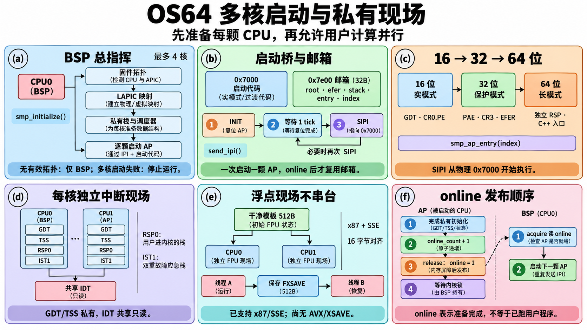
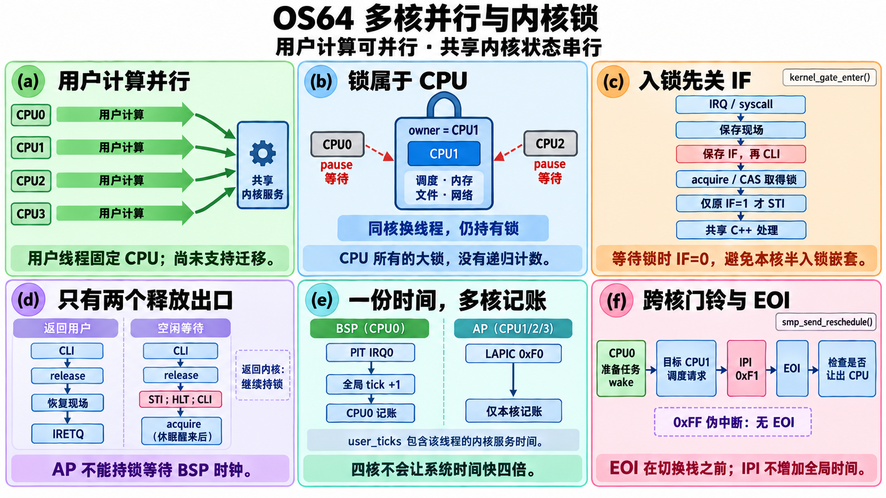
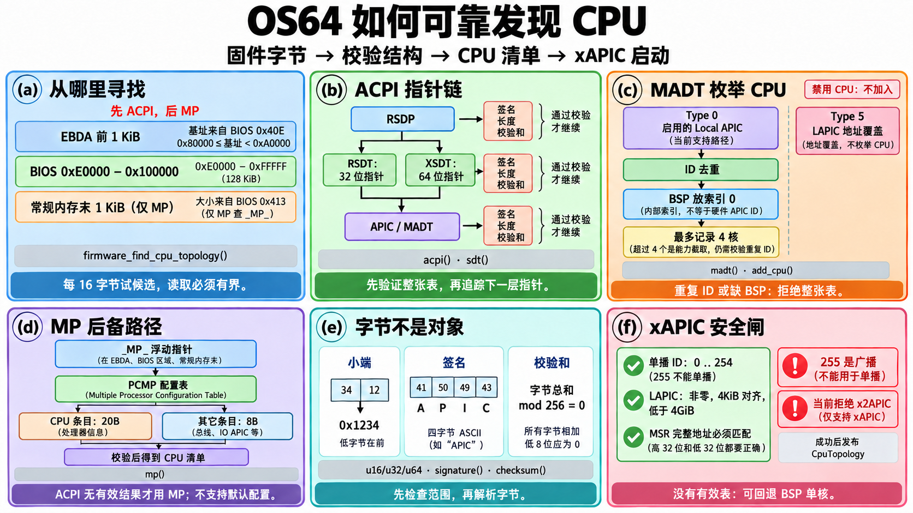

# 多核启动逐函数图解：CPU 怎样从等待变成并行执行

这篇讲义按当前真实实现解释 `kernel/cpu/` 和每核中断入口，不把尚未实现的算法画成现有功能。先看三张总图，再按函数名读解释；小函数也列出输入、返回值、步骤和边界。图中每个 (a)–(f) 小栏对应下文标记：**B** 是启动图，**G** 是内核锁图，**T** 是拓扑图。

源文件：[smp.cpp](../../kernel/cpu/smp.cpp)、[topology.cpp](../../kernel/cpu/topology.cpp)、[cpu.cpp](../../kernel/cpu/cpu.cpp)、[xapic.hpp](../../kernel/cpu/xapic.hpp)、[ap_start.asm](../../kernel/cpu/ap_start.asm)、[interrupts.cpp](../../kernel/interrupts/interrupts.cpp)。进一步读 [多核启动教程](../SMP_BOOT_TUTORIAL.md) 和 [调度与进程协作教程](../SMP_SCHEDULER_TUTORIAL.md)。

## 先理解八个词

| 词 | 可以怎样理解 | 在 OS64 中的含义 |
| --- | --- | --- |
| CPU / 核 | 能独立执行指令的一位工人 | 最多使用 4 个逻辑 CPU；CPU 数量不等于程序已经在全部 CPU 上工作 |
| BSP | 先醒来的总指挥 | 内部索引固定为 0，硬件 APIC ID 可以不是 0 |
| AP | 后来被唤醒的工人 | 从低地址启动桥进入 64 位 C++，各自准备中断和浮点现场 |
| LAPIC | 每位工人的门铃与本地钟 | 接收跨核 IPI、产生本核定时中断；当前使用 xAPIC MMIO 模式 |
| IPI | 一颗 CPU 发给另一颗的门铃 | INIT/SIPI 用于启动，向量 `0xF1` 用于请求重新调度 |
| IF | 本核是否接收可屏蔽中断的开关 | `CLI` 关闭，`STI` 打开；关闭本核中断不能代替跨核锁 |
| TSS / RSP0 / IST | 进入内核时使用的栈地址簿 | 每核 TSS 的 RSP0 指向用户进内核的栈，IST1 是双重故障的应急栈 |
| acquire / release | 看见发布消息时也看见此前准备结果 | AP 先增加在线总数，再 release 发布 `online=1`；BSP 用 acquire 读取 |

进程是拥有地址空间和资源的程序实例，线程是调度器实际安排的执行单位。当前一个用户进程的执行线程固定在第一次分配的 CPU 上；这里的多核并行主要来自多个用户进程同时计算。内核服务由一把 CPU 所有的大锁保护，因此并行计算与并行执行系统调用是两个不同的能力。

## B：启动与私有现场



看图时从 B.a 沿 B.b、B.c 到 B.d/B.e，再看 B.f。CPU1 能执行 C++ 代码并不代表它能立刻进入用户程序：它还要等 BSP 持有的内核锁。`online` 的准确含义是“本核启动准备完成”。

## G：并行计算与内核锁



绿色用户轨道能同时前进；进入共享内核服务区时需要逐个通过蓝色门。这给当前调度器、文件、内存和网络实现提供了明确的串行保护，也解释了性能报告中某些负载增加 CPU 后收益有限的原因。

## T：固件拓扑校验



固件表只是内存中的字节。不能看见 `APIC` 四个字母就直接相信后面的地址。代码先确认读取范围和整张表的结构，成功以后才把临时结果复制给调用者。

## `smp.cpp`：启动主线

### `smp_initialize(scheduler, allocator)` — B.a、B.b、B.f

**输入与结果。** 输入已经准备好的调度器和物理页分配器；BSP 必须已打开中断。成功返回 `true`；失败返回 `false`。若没有有效 ACPI/MP 拓扑，记录警告并以 BSP 单核方式成功继续。已经探测到多核但后续准备或启动失败时，调用者停止正式运行，不能假装余下 CPU 已经可用。

**照着代码做一遍。**

1. 把 BSP 放到内部索引 0，在线数初始为 1，关联活动调度器。
2. 调用 `firmware_find_cpu_topology()` 发现 CPU；能力上限是 4。
3. 确认 CPUID 宣告 APIC，检查 `IA32_APIC_BASE` 完整地址与固件地址一致。
4. 将 LAPIC 映射到 `0xfffffe0000000000` 的内核设备虚拟页，准备多核调度状态和硬件 ID → 内部索引查表；给每颗 AP 分配 32 KiB 启动栈。
5. 初始化 BSP LAPIC，并用已经运行的 PIT 校准本地钟计数。检查启动桥大小在 `1..0x800` 字节内，复制到物理 `0x7000`。
6. 发布“启用内核锁”，BSP 取得锁；填 `0x7e00` 邮箱，使用内存屏障，再发 INIT/SIPI。
7. 每次只启动一颗 AP。等待其 acquire 可见的 `online` 后，再写下一颗的邮箱。全部准备好后返回，BSP 此时仍持有锁。

**为什么。** 一份邮箱不能同时被 BSP 改写和多颗 AP 读取；逐颗启动把这个竞争消除。LAPIC 设备页不当普通 RAM 缓存，且只允许内核访问、禁止执行。AP 在启动阶段公布 online 之后才等锁，所以 BSP 可以一直持锁验证启动结果。

**边界与代价。** 空参数、中断未开、重复多核初始化、APIC 模式/地址不支持、映射/内存不足、IPI 失败、AP 未在 100 PIT tick 内上线均可失败。等待逻辑依赖 BSP PIT 继续到达；当前没有独立硬件启动看门狗。启动按 CPU 数串行，最多 3 颗 AP；表解析另见 T 图，其复杂度取决于读取的表字节数。它不是热插拔 API，也不负责失败后的重新启动与回滚。

### `smp_ap_entry(index)` — B.d、B.e、B.f

**输入与结果。** 邮箱传入内部 CPU 索引；函数不返回。成功进入该 AP 的调度器，失败进入 `park_cpu()`。

**步骤。** 先关闭本核中断，确认索引不是 BSP 且没有越界、当前硬件 APIC ID 与预定 ID 一致；调用 `cpu_initialize_local()` 和 `initialize_secondary_interrupts()`；再次确认本核 LAPIC 模式和地址；配置除 16、周期模式、向量 `0xF0` 的本地钟。然后按严格顺序执行 `online_count += 1`，再 release 发布该 CPU 的 `online=1`，最后取得内核锁，调用 `scheduler_run_secondary_cpu()`。

**为什么与边界。** CR0/CR4、GDT/TR/IDT 寄存器属于每颗 CPU，BSP 初始化过不能代替 AP 初始化。AP 不能在持锁之前运行调度器，但必须先告诉仍持锁的 BSP“我准备好了”，否则两边会互相等待。这个函数没有 CPU 特性重新枚举步骤，使用 BSP 建立的浮点模板；当前目标是兼容该约定的教学平台，不能把这当任意异构 CPU 验证。准备过程固定规模；取得锁的等待没有有限时延保证。

### `local_apic_initialize(bsp)` — B.a、G.e

**输入与结果。** `bsp=true` 表示启动 CPU，`false` 表示 AP；返回本核 LAPIC 是否成功准备。它首先读 MSR `0x1B`，用 `xapic_base_supported()` 校验，成功以后才允许写 MMIO。

**步骤与理由。** 打开 APIC 全局使能，TPR 设为 0，暂时屏蔽本地钟；BSP 的 LINT0 用 ExtINT 保留 PIC 的虚拟线路中断，AP 的 LINT0 被屏蔽。LINT1 和尚未提供处理路径的错误 LVT 也被屏蔽；设置伪中断向量 `0xFF` 并清 EOI。这里没有 IOAPIC 重路由，也没有把 PIC/PIT 中断分发给所有 AP。

**边界与代价。** 当前不支持 x2APIC，固件地址必须非零、4 KiB 对齐、低于 4 GiB，且与本核 MSR 中所有地址位匹配。检查失败直接返回 `false`。固定数量寄存器读写，`O(1)`；只有设备映射建立后才可调用。

### `calibrate_timer()` — B.a、G.e

**输入与结果。** 无参数；依赖 BSP PIT 和已初始化的 LAPIC。返回是否得到有效的 `g_timer_count`。

**步骤。** LAPIC 设为除 16，从 `0xFFFFFFFF` 开始倒数；经过至少 5 个 PIT tick 后读取倒数差值，再停钟。以 `delta / ticks` 作为一个 PIT tick 对应的 LAPIC 计数。默认 PIT 是 100 Hz，所以后续 AP 本地周期大约是 10 ms。

**理由与边界。** 不能假定不同机器 LAPIC 输入频率完全一样。`ticks=0`、计数差小于 tick 数、超过 100 tick 或算出零都拒绝；等待阶段仍依赖 PIT。实际频率和整数除法有误差，不能把这个粗校准当高精度时间服务。等待开销大约为至少 5 个 PIT tick，与用户任务数量无关。

### `send_ipi(apic_id, command)` 与 `wait_delivery()` — B.b、G.f

| 函数 | 输入 → 输出/副作用 | 主步骤与原因 | 错误边界和复杂度 |
| --- | --- | --- | --- |
| `wait_delivery()` | 无参数 → ICR 发送忙位是否清零 | 反复读 ICR 低寄存器 bit 12；忙时 `pause`，确认上一条命令已发送 | 最多检查 1,000,000 次，超出返回 `false`。这是有界忙等，按上限 `O(1)`，不证明目标 AP 已执行命令 |
| `send_ipi()` | 硬件目标 ID、ICR 命令 → 是否发送完成 | 先检查单播 ID 并等待空闲；写 ICR high 目标 ID，再写 ICR low 命令；再等发送完成 | `255` 是广播，拒绝；任一次发送等待失败返回 `false`。调用方区分启动命令与运行期 `0xF1`，函数不自行决定目标是否 online |

SIPI 命令里的页号 7 表示从物理 `7 × 4096 = 0x7000` 起跑。IPI 投递完成和 AP online 是两个事件；前者由 ICR 发送忙位判断，后者由 `smp_ap_entry()` 发布。

### 设备与启动辅助函数 — B.a、B.b、T.f

| 函数 / 图区域 | 输入 → 输出/副作用 | 步骤、理由、边界与代价 |
| --- | --- | --- |
| `hardware_apic_id()` / B.a | 无参数 → 8 位 initial APIC ID | CPUID leaf 1 取 EBX 高 8 位。硬件 ID 与内部 CPU 索引不同；当前 xAPIC 查表使用它。`O(1)`，但 CPUID 有实际执行成本 |
| `read_msr(msr)` / B.a | MSR 编号 → 64 位寄存器值 | `RDMSR` 得到 EDX:EAX 并拼接。仅内核合法 MSR 调用；错误编号可触发异常，不返回软件错误码。`O(1)` |
| `write_msr(msr, value)` / B.a | MSR 编号与 64 位值 → 改硬件寄存器 | 拆成高低 32 位执行 `WRMSR`。调用方先验证 APIC 地址/模式；函数不替调用方检查 MSR 权限和编号。`O(1)` |
| `apic_read(offset)` / B.a | LAPIC 寄存器偏移 → 32 位值 | 通过 volatile 读取设备虚拟页，防止编译器把设备访问当可省略的普通读取。要求映射已建立、偏移有效。`O(1)` |
| `apic_write(offset, value)` / B.a | 偏移和值 → 写 LAPIC | volatile 写入后读 ID 寄存器 `0x20`，冲刷可能缓冲的 MMIO 写。设备写不是普通变量赋值；函数不做偏移检查。`O(1)` |
| `delay_tick()` / B.b | 无参数 → 至少观察到 PIT tick 改变 | 保存起始 tick，循环 `STI; HLT`，中断唤醒后再检查。只给启动间隔使用；PIT 不推进就无法结束，也没有恢复调用前 IF 的接口。等待约一个 tick，非实时保证 |
| `read_firmware(physical, size, context)` / T.a | 物理区间 → 字节指针或 `nullptr` | `context` 当前未用。先检查地址低于管理上限，再以 `size <= limit-physical` 避免加法溢出，然后用物理直映指针；禁止无界追固件指针。`O(1)` |
| `park_cpu()` / B.f | 无参数 → 永不返回 | 无限 `CLI; HLT`；阻止初始化失败的 AP 继续接可屏蔽中断并跑调度器。无重试/下线恢复；不是正常线程睡眠接口 |

## `ap_start.asm`：没有 C++ 栈之前的桥

汇编中的这些是**标签/入口**，不是普通 C++ 函数；仍然逐个说明其契约。它们在 B.c 的同一条模式切换阶梯上。

| 标签 / 图区域 | 输入与状态 → 输出与副作用 | 步骤与边界 |
| --- | --- | --- |
| `smp_trampoline_start` / B.c 的 16 位段 | AP 接到 SIPI，CS 起点对应物理 `0x7000` → 进入保护模式 | `CLI`，DS/ES/SS 清零，临时 SP=`0x6FF0`；装启动 GDT，置 CR0.PE，远跳到 `ap_protected`。必须预先把这段代码复制到指定位置；AP 不重新执行 BIOS |
| `ap_protected` / B.c 的 32 位段 | 32 位保护模式和 BSP 写好的邮箱 → 开启分页并进入长模式 | 数据选择子 `0x10`；置 CR4.PAE；从邮箱加载 CR3；开启 EFER.LME，且只有 BSP 开启 NX 才设置 NXE；置 CR0.PG/WP；远跳到 64 位段。依赖低地址恒等映射和可用内核页表，当前邮箱 root 是 32 位字段 |
| `ap_long` / B.c 的 64 位段 | 长模式、邮箱栈与入口 → 调用 `smp_ap_entry(index)` | 装数据段，RSP 从邮箱读取并向下对齐 16 字节；清 RBP，EDI=index，RAX=entry，间接调用。先有独立栈才能按 C++ ABI 调用；入口不应返回 |
| `.halt` / B.c 的异常出口 | AP C++ 入口意外返回 → 停止继续执行 | 无限 `CLI; HLT`。是兜底停机，不是用户线程 idle 循环 |

`ap_gdt`、`ap_gdt_pointer` 与 `smp_trampoline_end` 是数据/边界标签，不执行算法。BSP 使用首尾标签相减检查代码长度；邮箱用 32 字节 C++ 结构与汇编偏移的静态断言对齐，字段顺序不能随意改。

## 内核锁：三个函数维持一条不变量

### `kernel_gate_enter()` — G.b、G.c

**输入与结果。** 无参数；多核锁未启用时直接返回。启用后，返回意味着当前 CPU 拥有大锁。它不返回等待超时错误。

**步骤。** 保存 RFLAGS，然后 `CLI`；查当前内部 CPU 索引；读取 owner。如果 owner 已是本 CPU，继续执行；如果无人持有，尝试原子 CAS 将 owner 改为本 CPU；否则 `pause` 等待。只有成功后，才在原 IF=1 时重新 `STI`。

**为什么不是递归锁。** owner 保存的是 CPU 编号，没有“加锁次数”。同一 CPU 上的内核 IRQ 可以看见 owner 已属于自己，同一 CPU 切换到另一条线程的内核栈也不移交所有权。IRQ/syscall 汇编先调用它，再读取共享调度器。普通返回内核的 IRQ 也不能误把外层持有的锁释放掉。

**边界与复杂度。** 开本核中断不保护其它核共享数据，所以还需要原子锁；反过来，等锁时先关 IF，避免同核半取得锁时嵌套 IRQ。当前锁不公平，没有队列、超时和饥饿上限；竞争次数不是 `O(1)` 时间保证。持锁 CPU 长时间执行内核代码会推迟别核服务和中断处理。

### `kernel_gate_leave_user()` — G.d 的用户出口

**输入与结果。** 无参数；多核锁未启用则直接返回。启用时先 `CLI`，检查 owner 是否是当前 CPU，是则 release 写成无人持有；不是则不替别核放锁。

**为什么与边界。** 从用户陷入后，内核保存现场、换 CR3、保存浮点/旧 RSP、切换栈的过程持续受保护。只在最终返回 ring3 的路径释放，然后靠 IRETQ 恢复用户 RFLAGS。释放时 IF=0 消除“门已经打开，自己仍在内核栈上又被 IRQ 打断”的窗口。函数本身不执行 IRETQ、不重新开中断；调用方必须遵守出口契约。常量步骤，`O(1)`。

### `kernel_gate_release_idle()` — G.d 的空闲出口

**输入与结果。** 无参数；先关中断，再复用 `kernel_gate_leave_user()` 放锁。随后调用方使用 `STI; HLT; CLI`，唤醒以后重新取得锁。

**为什么与边界。** 全部用户都在等待时，idle 不能占着内核锁休眠，否则另一颗 CPU 无法推进 BSP 时间/网络/唤醒状态。`STI` 的中断影子覆盖紧跟的 `HLT`，用于避免检查完工作到休眠之间漏掉门铃。此函数只是释放，不独自完成整段等待；`O(1)`。正式线程睡眠应登记 Sleeping/Blocked 并调度出去，不能直接持锁 HLT。

## `smp.cpp`：运行期查询、门铃与观测

| 函数 / 图区域 | 输入 → 输出/副作用 | 步骤、为什么、边界与复杂度 |
| --- | --- | --- |
| `smp_current_cpu_index()` / G.b | 无参数 → 当前内部索引 | 查表未准备时返回 0；否则 CPUID 获得硬件 ID，再查 256 项映射；异常未映射值也回退 0。正常运行要求所有已启动 AP 先已建表。`O(1)`，频繁 CPUID 的成本仍存在 |
| `smp_is_enabled()` / G.b | 无参数 → 是否启用内核锁 | acquire 读 `g_gate_enabled`。单核回退时可能为 `false`，不能用它代替在线 CPU 数查询。`O(1)` |
| `smp_online_cpu_count()` / B.f | 无参数 → 已公布准备完成的 CPU 数 | acquire 读在线总数，初始 BSP=1；AP 增加后才发布 online。数量是容量，不能证明应用已经利用各核。`O(1)` |
| `smp_local_apic_eoi()` / G.f | 无参数 → LAPIC EOI 写 0 | 设备已准备才写偏移 `0xB0`；处理真实 LAPIC 中断要在可能切换栈前完成。它不会检查传入向量，伪中断调用方必须跳过。`O(1)` |
| `smp_send_reschedule(target_cpu)` / G.f | 内部目标索引 → 尝试发 `0xF1` IPI | 无 LAPIC、目标超界、未 online、目标就是当前 CPU 时直接返回；否则调用 `send_ipi()`。实际请求位由调度器先设置，IPI 是提醒检查的门铃。发送失败不向上返回错误，不能承诺实时唤醒；发送等待有固定上限 |
| `smp_snapshot(output)` / G.a、G.e | 内核输出指针 → 清零并填 128B v1 快照 | 空指针不写；填在线数、当前索引、mask、硬件 ID、每核 dispatch/user_ticks，未发现的 ID 填 `UINT64_MAX`；最多循环 4 次。调用上下文须已保护共享状态。`user_ticks` 归属正在运行的用户线程，包含该线程内核服务时间，不等于纯 CPL3 时间或准确 CPU 利用率 |

`SmpSnapshot` 的数组容量固定为 4。在线位图与工作计数回答不同的问题：前者证明 CPU 准备好，后者帮助证明程序确实在其上执行。快照不显示 NUMA、缓存拓扑，也不测周期精确耗时。

## `topology.cpp`：按字节寻找可靠的 CPU 清单

### `firmware_find_cpu_topology(read, context, bsp, output)` — T.a、T.f

**输入与结果。** `read` 是有界物理内存读取回调；`context` 原样交给回调；`bsp` 是当前 BSP 的硬件 APIC ID；`output` 接成功拓扑。缺回调或输出指针返回 `false`。

**步骤。** 读取 BIOS 数据区 `0x40E` 的 EBDA 段地址与 `0x413` 的常规内存 KiB 数；先以 ACPI 模式扫描合规 EBDA 的前 1 KiB，再扫描 `0xE0000..0x100000`。找不到有效 ACPI 结果，才尝试 MP：EBDA、常规内存末尾 1 KiB、BIOS 高区。第一次有效解析返回 `true`，所有候选失败返回 `false`。

**为什么与边界。** 不假定固件只用一种格式；错误候选不会直接发布一半清单。EBDA 和常规内存范围经过筛选；回调必须真正保证请求字节全可读。输出只在 `madt()` 或 `mp()` 成功后写入。它不扫描所有 RAM，也不支持 CPU 热插拔。复杂度是扫描候选数加检查到的表字节数，能力截取上限 4 核。

### `scan(read, context, start, end, want_acpi, bsp, output)` — T.a

**输入与结果。** 输入物理扫描区间及 ACPI/MP 选择，返回是否找到有效拓扑。循环每次地址增加 16，先读签名所需的最小字节。

**步骤与边界。** ACPI 匹配 `RSD PTR `；修订版至少 2 时重读 36 字节头部，确认扩展长度 `36..4096`，再读完整 RSDP，交给 `acpi()`。MP 匹配 `_MP_` 后交给 `mp()`。读取失败、签名错或解析失败均继续下一个候选。扫描循环按 `address+16 <= end` 约束候选位置，实际 20/36/扩展长度能否读取仍由回调负责；不应把循环终点检查误读成整个扩展对象的范围保证。扫描区间长 S 时约 `O(S/16)` 候选，加解析代价。

### `acpi(read, context, rsdp, bsp, output)` — T.b

**输入与结果。** 已读取完整候选 RSDP、回调和 BSP ID；成功调用 MADT 解析并填拓扑，否则 `false`。

**步骤。** 校验 RSDP 前 20 字节的字节和；默认选 RSDT 的 32 位物理指针。修订版至少 2 时还检查扩展长度和完整校验和；存在 XSDT 地址就改用 64 位指针。调用 `sdt()` 读取根表，确认签名与选用类型一致、指针区长度能被 4/8 整除；逐个根表指针读 4 字节签名，只对 `APIC` 表调用 `madt()`。

**为什么与边界。** XSDT/RSDT 的指针宽度不同，不能把 64 位地址截成 32 位。根表无效则拒绝；MADT 候选无效继续查下一个。它不建立其它 ACPI 服务，也不解析 x2APIC CPU 记录。复杂度为根表及所尝试 MADT 的总字节数；每张 SDT 限制最多 1 MiB。

### `madt(read, context, physical, bsp, output)` — T.c、T.f

**输入与结果。** MADT 物理地址；成功返回 `true` 并一次性复制 `CpuTopology`。失败不发布临时 CPU 清单。

**步骤。** 用 `sdt()` 校验完整表，再确认 `APIC` 签名与至少 44 字节固定部分。临时结果先放 BSP 到索引 0；逐条读 `type,length`，长度必须至少 2 且不能超过余下字节。Type 0 必须长 8，仅 flags bit 0 启用的 Local APIC 经 `add_cpu()` 加入。Type 5 必须长 12，覆盖 LAPIC 物理地址。其它类型按经过校验的长度跳过。

**边界。** 启用 CPU 的重复 ID/广播 ID、表中缺启用 BSP、零 LAPIC 地址、非页对齐或至少 4 GiB 的地址都拒绝。没有支持 Type 9 x2APIC CPU 记录；不能把“跳过未知类型”理解成“支持它”。即使已收满 4 核，仍检查后续启用 ID 是否重复。遍历 `O(表长)`；`seen[256]` 固定空间。

### `mp(read, context, floating, bsp, output)` — T.d

**输入与结果。** 16 字节 MP 浮动指针候选；成功返回完整拓扑，失败 `false`。

**步骤。** 检查浮动指针长度单位为 1、版本为 1 或 4、校验和正确、默认配置编号为 0；读其 32 位指向的 PCMP 表头，确认最少 44 字节和版本；读取完整基本表并校验。遍历声明的条目数：Type 0 CPU 条目长 20，其它 Type 1..4 条目长 8；仅启用 CPU 经 `add_cpu()` 加入。

**边界与理由。** 未支持默认配置表，所以默认编号非零拒绝；未知类型、条目越界、最终字节数与声明不符、缺 BSP、重复 ID、非法/未对齐 LAPIC 地址均拒绝。物理字段本身是 32 位，读取是否落在可管理 RAM 内由回调保证。它主要提供旧固件后备路径，不是第二次覆盖已有有效 ACPI 结果。复杂度 `O(基本表长)`，长度来自 16 位字段。

### 字节解析与校验辅助函数 — T.e、T.c

小端就是低位字节放在前面：`34 12` 表示 `0x1234`。这里用字节拼接避免把固件内存直接当未对齐 C++ 对象读取。

| 函数 / 图区域 | 输入 → 输出/副作用 | 步骤、为什么、边界与复杂度 |
| --- | --- | --- |
| `u16(p)` / T.e | 至少 2 个可读字节 → 16 位小端数 | `p[0] | p[1]<<8`；不检查空指针/长度，由先前有界读取保证。`O(1)` |
| `u32(p)` / T.e | 至少 4 个字节 → 32 位小端数 | 组合两个 `u16`，高半左移 16；契约与边界同上。`O(1)` |
| `u64(p)` / T.e | 至少 8 个字节 → 64 位小端数 | 组合两个 `u32`，高半先扩为 64 位再左移 32；避免高位丢失。`O(1)` |
| `signature(p, text, n)` / T.e | 字节指针、目标签名与长度 → 是否逐字节相同 | `p=nullptr` 返回 `false`，否则遇不同字节立即失败；不是 C 字符串结束符比较。调用方保证 `p` 和 `text` 至少 n 字节。最坏 `O(n)` |
| `checksum(p, n)` / T.e | n 个可读字节 → 8 位累加和是否为 0 | 每次转为 `uint8_t`，相当于 mod 256。能发现某些固件损坏，但不是加密真实性验证；函数本身不检查指针。`O(n)` |
| `add_cpu(topology, seen, id)` / T.c | 临时清单、256 项 seen、8 位 ID → 是否接受条目 | 广播 ID 或已见 ID 返回 `false`；先标记 seen，非 BSP 且未到 4 核才追加。满容量时合法唯一 ID 仍返回 `true` 并记入 seen，后续重复仍可拒绝。BSP 始终保留内部索引 0。`O(1)` |
| `sdt(read, context, physical, size)` / T.b | SDT 地址 → 完整表指针或 `nullptr`，并写长度 | 先读 36B 头，取总长并要求 `36..1MiB`，再读全表并校验。SDT 通用读取不自行认定 `APIC/XSDT/RSDT` 类型；调用者另查签名。失败时长度可能已写，但成功拓扑尚未发布。`O(表长)` |

### `xapic_unicast_id_valid(id)` 与 `xapic_base_supported(msr, physical)` — T.f

| 函数 | 输入 → 返回值 | 为什么与边界 |
| --- | --- | --- |
| `xapic_unicast_id_valid()` | 32 位 ID → `id < 255` | xAPIC 物理目的地 `0xFF` 是广播；“编号可以装进 8 位”不等于“可以单播”。用于拓扑和发 IPI 两层检查，`O(1)` |
| `xapic_base_supported()` | 完整 MSR 与固件地址 → 当前映射方案是否支持 | 地址非零、低于 4 GiB、4 KiB 对齐，MSR bit 10（x2APIC）为 0，且去掉低 12 位后的**所有地址位**与固件地址相等；只比低 32 位会漏掉高地址错误。它允许后续显式打开 bit 11 APIC enable；不替调用方读写硬件。`O(1)` |

## `cpu.cpp`：每核浮点与能力模板

### `cpu_initialize()` — B.e

**输入与结果。** 无参数，由 BSP 首次调用，返回是否能够启用所需浮点状态。再次调用返回已记录的 `floating_state_enabled`，不会重做模板。

**步骤。** CPUID 读取厂商、family/model/stepping、FPU/FXSAVE/SSE/SSE2/TSC；在扩展 leaf 可用时记录 NX、Invariant TSC 和品牌字符串。必须有 FPU、FXSAVE、SSE、SSE2 才继续。清 CR0.EM/TS，设 MP/NE；设 CR4.OSFXSR/OSXMMEXCPT，采用立即保存/恢复浮点现场的方案。重置 x87，并先用八次 `FLDZ` 覆盖其物理载荷后再清标签；设 MXCSR=`0x1F80`，清 XMM0–15，最后 FXSAVE64 得到干净 512 字节模板。

**为什么。** 只 `FNINIT` 会把 x87 寄存器标记为空，物理载荷仍可能残留。新线程的模板不能继承固件或上一段执行的内容。模板结构 16 字节对齐符合 FXSAVE 要求。

**边界与代价。** 所需特性缺失返回 `false`，全局已记录初始化尝试；它不是运行期间的多调用者竞态 API。当前不打开 CR4.OSXSAVE，因此不支持 AVX 上半部、XSAVE 或惰性浮点切换。固定 CPUID 和寄存器清理步骤，`O(1)`；每次线程切换保存/恢复的成本由调度器承担。

### 其余 CPU 函数 — B.e、G.e

| 函数 / 图区域 | 输入 → 输出/副作用 | 步骤、为什么、边界与复杂度 |
| --- | --- | --- |
| `cpuid(leaf, subleaf=0)` / B.e | 能力查询编号 → EAX/EBX/ECX/EDX 四寄存器 | 执行 CPUID，返回 `Registers`；它是查询工具，调用者先判断扩展 leaf 是否存在。`O(1)`，执行成本不为零 |
| `cpu_information()` / B.e | 无参数 → 全局信息的 const 引用 | 用于显示已检测能力；返回引用不是本核重新查询。BSP 尚未初始化时字段仍为零/默认值，调用方须遵守启动顺序。`O(1)` |
| `cpu_initialize_local()` / B.e | 无参数 → 本核浮点是否准备完成 | 必须先有全局干净模板；为当前 AP 设置 CR0/CR4，再 FXRSTOR64 模板。没有全局初始化或模板未启用返回 `false`。每核控制寄存器不能由 BSP 代写。`O(1)` |
| `cpu_initialize_floating_state(state)` / B.e | 状态指针 → 拷贝 512B 初始模板 | 空指针直接略过；正常调用由线程创建/CPU bootstrap 状态准备使用，要求先完成 CPU 初始化。它初始化内存镜像，不切换当前 CPU 的寄存器。固定 512B，`O(1)` |
| `cpu_read_tsc()` / G.e | 无参数 → 当前 CPU 的 TSC 值，或无能力时 0 | 检测 TSC 标志，`LFENCE; RDTSC`，拼 EDX:EAX。结果是计数而非毫秒；未校准频率，也不证明不同 CPU 的 TSC 同步。只在 RDTSC 之前放 fence，不能自动代替完整性能测量边界设计。`O(1)` |

## `interrupts.cpp`：每颗 CPU 有自己的入口栈

### `initialize_tss()` — B.d

**输入与结果。** 无参数，初始化当前内部 CPU 的 `CpuInterruptState`，返回是否在 TR 中确认正确 TSS 选择子。ready 已为 true 时直接成功。

**步骤。** 清 104B TSS；RSP0 指向本 CPU 的 8 KiB 默认内核栈顶，并记录不变的 `default_rsp0`；IST1 指向另外 8 KiB 应急栈顶；I/O bitmap 偏移设为 TSS 大小。调用 `build_kernel_gdt()` 写本 CPU 的 GDT，再调用 `load_kernel_gdt_and_tss()`；`STR` 检查结果并记 ready。

**为什么。** TSS 的 RSP0 之后会随当前用户线程改变；每核必须独立。64 位 TSS 描述符的 busy 状态也不能由多核共享。这里使用 TSS 的栈切换服务，不使用旧式硬件任务切换。I/O bitmap 放在段限长之外，用户代码不能据此得到端口 I/O 权限。

**边界与代价。** 正常初始化由 CLI 保护并先建立内部索引映射；不能在 AP 未映射身份时误初始化 CPU0 槽。GDT/TSS 指令失败可能触发异常，函数没有任意故障恢复。数据容量固定，`O(1)`；这些默认栈属于静态每核状态，不是用户执行栈。

### `build_kernel_gdt()` 与 `load_kernel_gdt_and_tss(pointer)` — B.d

| 函数 | 输入 → 输出/副作用 | 步骤、原因、边界与代价 |
| --- | --- | --- | --- |
| `build_kernel_gdt()` | 无参数 → 写本核 9 个 GDT qword | 清表；前 5 项保持 stage2 段选择子兼容；第 5/6 槽共同保存 16B 64 位 TSS 描述符；第 7/8 槽是用户数据/代码段。TSS base 指向本核 TSS。此函数不装载 CPU；必须随后 LGDT/LTR，`O(1)` |
| `load_kernel_gdt_and_tss()` | 合法 GDT pointer → 更新本核 GDTR/CS/段寄存器/TR | LGDT；压入代码选择子与返回标签，LRETQ 刷新 CS；重装 DS/ES/SS/FS/GS；LTR 装 TSS。仅改变本 CPU，要求描述符正确、当前栈有效；无软件错误返回，错误可触发异常。`O(1)` |

GDT 在长模式下仍决定代码/数据段权限和 TSS 入口。独立 TSS/GDT 与共享 IDT 没有矛盾：前者含本核可变栈信息，后者只是同一组中断处理函数地址。

### `initialize_idt()` 与 `initialize_secondary_interrupts()` — B.d、G.f

| 函数 | 输入 → 返回/副作用 | 步骤、理由、边界与复杂度 |
| --- | --- | --- | --- |
| `initialize_idt()` | 无参数 → 建立共享 IDT，返回 `true` | BSP 清 256 门；异常 0..31（双重故障使用 IST1）、PIC 32..47、LAPIC `0xF0/0xF1/0xFF`、用户可触发的 `int 0x80`；最后 LIDT。默认其它门仍为空。必须在 AP 和中断正式使用前建立，不能运行期反复清正在用的 IDT。256 是固定上限，`O(1)` |
| `initialize_secondary_interrupts()` | 无参数 → AP 装本核入口环境，返回成功 | 先 `initialize_tss()`，失败返回 `false`；只 LIDT 装载 BSP 已建立的共享 IDT，不重写 IDT 内容。这避免 AP 清掉其它 CPU 正在使用的中断门。需要 BSP 先完成 IDT，`O(1)` |

### 中断结构辅助函数 — B.d、G.c

| 函数 / 图区域 | 输入 → 输出/副作用 | 步骤、为什么、边界与复杂度 |
| --- | --- | --- |
| `cpu_interrupt_state()` / B.d | 无参数 → 当前 CPU 私有结构的引用 | 使用 `smp_current_cpu_index()` 索引 4 项数组。它本身不重复验证身份，正确性依赖启动映射。`O(1)` |
| `set_idt_gate(vector, handler, type_attributes, ist_index)` / B.d | 向量、函数地址、门属性、IST 编号 → 写一个 IDT 门 | 拆地址为低16/中16/高32位；指定内核代码选择子；IST 取低3位，reserved 清零。默认是内核中断门，syscall 特设 DPL3。不替调用者判断 handler 或权限是否合理，`O(1)` |
| `load_idt(pointer)` / B.d | 指向 limit/base 的描述符 → 更新本核 IDTR | 执行 LIDT，只装本 CPU；内容正确性由构建方保证。不是内存拷贝，错误指针可能异常，`O(1)` |
| `stack_top_address(stack, bytes)` / B.d | 栈底和长度 → 栈顶地址 | 地址相加，因为 x86 栈向低地址增长。无分配和通用溢出检查，调用方传固定静态栈范围。`O(1)` |
| `read_task_register_selector()` / B.d | 无参数 → 本核 TR 选择子 | `STR` 读取硬件，帮助验证 LTR 真正生效；不返回 TSS 内容地址。`O(1)` |
| `register_frame_came_from_user_mode(frame)` / G.c | 中断帧指针 → 是否来源 CPL3 | 空指针返回 false；CS 最低两位为 3 表示用户。只解释可信完整帧，不能拿任意用户地址当帧。`O(1)` |

### TSS 查询和更新函数 — B.d 的 RSP0/IST1 小盒

| 函数 | 输入 → 输出/副作用 | 用途与边界 |
| --- | --- | --- |
| `tss_is_ready()` | 无参数 → 本核 ready 标志 | 查询初始化结果，不重新加载 TR；`O(1)` |
| `tss_task_register_selector()` | 无参数 → TR 选择子或 0 | 未 ready 返回 0，ready 则真实 STR；`O(1)` |
| `tss_kernel_rsp0()` | 无参数 → 当前本核 RSP0 | 调度器会把它改为当前用户线程的内核进入栈；默认未准备时字段可能为 0。读取不证明地址有效；`O(1)` |
| `tss_default_kernel_rsp0()` | 无参数 → 本核静态默认栈顶 | 可用于回到 kernel/idle 场景；与随线程变化的 RSP0 分开存储。初始化前为默认零；`O(1)` |
| `tss_set_kernel_rsp0(rsp0)` | 非零栈顶 → 是否更新成功 | 未 ready 或传 0 返回 false；否则写本核 TSS 并返回 true。调用方需保证地址、容量、生命周期、映射有效；函数不做完整栈验证。调度切换在内核锁/本核中断约束下调用；`O(1)` |
| `tss_double_fault_ist1()` | 无参数 → 本核应急 IST1 栈顶 | 双重故障使用独立栈，不沿用可能损坏的当前栈；读取函数不捕获双重故障，也不验证映射；`O(1)` |
| `tss_io_map_base()` | 无参数 → 本核 TSS 的 I/O bitmap 偏移 | 正常初始化后是 TSS 大小 104；此值使 bitmap 不在有效段范围内，配合权限规则限制用户端口访问。初始化前可能是 0；`O(1)` |

## `kernel_handle_irq(frame)`：门铃到了以后怎么处理 — G.e、G.f

**输入与结果。** 输入汇编保存的完整寄存器帧；无返回值，空指针直接略过。汇编已经取得内核锁，C++ 才可以读写共享调度器/设备状态。

**不同向量沿不同路径。**

1. `0xFF` 伪中断：直接返回，不发送 EOI。
2. `0xF0` 本地钟：`scheduler_handle_local_timer_tick()` 仅给本核记账；`0xF1` IPI 不做时钟加一。这两种先 LAPIC EOI，再在来源用户态且调度请求允许时让出 CPU。该处理链稍后恢复继续时记录用户抢占帧。
3. PIC IRQ0（向量 32）：`handle_timer_irq()` 增加 BSP PIT tick，并推进调度器全局时间、唤醒期限到达者、给 CPU0 记账；**先 PIC EOI，再可能换线程**。
4. PIC IRQ1/IRQ4：交给键盘/串口输入。其它或共享 PCI IRQ：网络处理函数只认领本设备源、确认中断并唤醒 worker；不在中断里完整解析数据包。
5. PIC 区间路径最后发送 PIC EOI。

**为什么。** 中断处理调用调度器后可能在旧栈上暂停很久；若 EOI 留到恢复以后才做，控制器可能一直不再递送下一次中断。全局时间只来自 BSP PIT，AP 的本地钟是各核时间片记账工具，所以四核不会让睡眠期限以四倍速度到达。

**边界与代价。** 持有 CPU 所有的大锁仍需遵守本核 IF 和栈切换规则；中断本身不是线程任意迁移机制。分支选择是固定开销，但被调用的调度器、唤醒扫描和上下文切换有各自代价，而且可能暂停当前调用链，因此不能给整个 IRQ 函数宣称有固定墙钟耗时上限。

### `capture_current_user_preempt_trap_frame(frame)` — G.c、G.f

**输入与结果。** 输入完整 IRQ 寄存器帧；只在活动线程为用户线程且保存 CS 表示 CPL3 时，写该线程的 `user_preempt_trap_frame`、置有效标志并增加抢占计数。

**步骤与原因。** 复制 15 个通用寄存器、vector/error/RIP/CS/RFLAGS；ring3→ring0 的 CPU 自动压栈还包含 RSP/SS，所以在 160B `RegisterInterruptFrame` 后读取两个 qword。它与 syscall 的 `user_trap_frame` 分开保存，便于区分主动系统调用与时钟抢占。

**边界与代价。** 空帧、没有当前线程、内核线程或来源不是用户态，均直接返回。必须使用汇编真实产生的完整帧；不是任意地址的安全解析器。当前 IRQ 路径在实际 yield 后、原线程恢复该调用链时才调用它；不是“先截图再决定抢占”。固定字段复制，`O(1)`。

### 中断开关与名称工具 — G.c、G.d

| 函数 / 图区域 | 输入 → 输出/副作用 | 为什么、错误边界和代价 |
| --- | --- | --- |
| `exception_name(vector)` / G.c | 向量 → 固定名称字符串 | 0..31 返回表中名称，越界返回 `unknown exception`。只提供说明，不处理异常。`O(1)` |
| `enable_interrupts()` / G.c、G.d | 无参数 → 本 CPU IF=1 | 执行 STI；仅在 IDT、栈、控制器和锁状态合法时使用。不能打开所有 CPU 的中断，`O(1)` |
| `disable_interrupts()` / G.c、G.d | 无参数 → 本 CPU IF=0 | 执行 CLI；不阻止其它 CPU，也不屏蔽 NMI/CPU 异常，`O(1)` |
| `interrupts_are_enabled()` / B.a、G.c | 无参数 → 本核 IF 是否为 1 | PUSHFQ/POP 读取 bit9；只观察当时状态，不证明 IRQ 路由或设备已好。`O(1)` |
| `wait_for_interrupt()` / G.d | 无参数 → 执行一次 HLT，醒来后返回 | 不自动 STI、放内核锁或登记线程等待；IF=0 时可屏蔽中断不能把它正常唤醒。正式线程不能持大锁用它等 BSP 时间。等待时长取决于外部事件，无有限时间保证 |

## 跟一遍“CPU1 开始工作”的调用关系

```text
BSP 已完成 cpu_initialize / initialize_tss / initialize_idt / PIT
    ↓
smp_initialize
    ├─ firmware_find_cpu_topology → scan → acpi → madt
    │                                          └─ sdt / add_cpu / 字节校验
    │                            或 scan → mp
    ├─ map_device_page + scheduler_prepare_smp
    ├─ local_apic_initialize(true) + calibrate_timer
    ├─ 填邮箱 + send_ipi(INIT/SIPI)
    │      ↓ AP 从 0x7000 执行
    │  smp_trampoline_start → ap_protected → ap_long
    │      ↓
    │  smp_ap_entry(1)
    │      ├─ cpu_initialize_local
    │      ├─ initialize_secondary_interrupts → initialize_tss + load_idt
    │      ├─ local_apic_initialize(false) + 本地钟
    │      ├─ online_count + 1 → release online=1
    │      └─ kernel_gate_enter → scheduler_run_secondary_cpu
    └─ acquire 观察 online → 下一 AP → BSP 正式调度
```

这是调用关系示意，图和文字都描述当前实现。真正源码中，“取得内核锁”和“切换栈”还通过汇编出口协作；不能把这些步骤删成几个看似独立的函数调用再随意调换顺序。

## 动手观察：区分“有四核”与“真的并行”

启动前在宿主机设置 `OS64_CPUS=4`，按 [启动教程](../SMP_BOOT_TUTORIAL.md) 运行。进入 OS64 shell 后先执行 `smp`，观察 online 数、online mask 与每核计数，再运行 `/bin/smp_test`。程序应报告工作分布和校验通过；可继续运行 `/bin/fp_test` 验证多个进程切换以后 SSE/x87 状态没有串台。性能对照条件和原始结果见 [多核测量报告](../measurements/smp/REPORT.md)。

观察时注意三件事：online=4 是容量证据；每核 dispatch/user_ticks 增长是工作证据；工作校验通过才是并行后的正确性证据。`smp` 快照不直接给你公平性、纯用户态占用率或世界最佳性能排名。

本轮函数图覆盖的是多核启动、拓扑、CPU 浮点与每核中断这一个家族；每个函数都在对应总图的小栏/区域找到位置。细颗粒锁、任务迁移、工作窃取、NUMA、CPU 热插拔和 AVX/XSAVE 都还需要另行设计和验证，不能当成这里已经实现的步骤。
