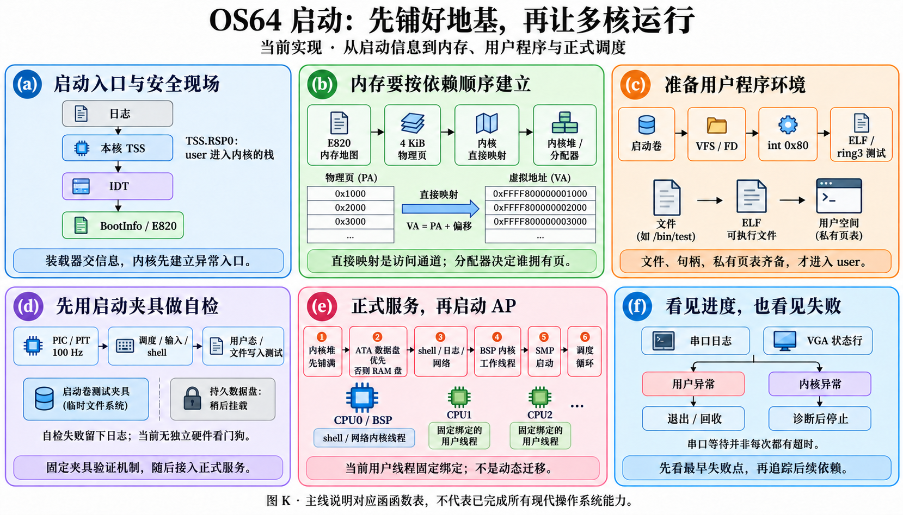
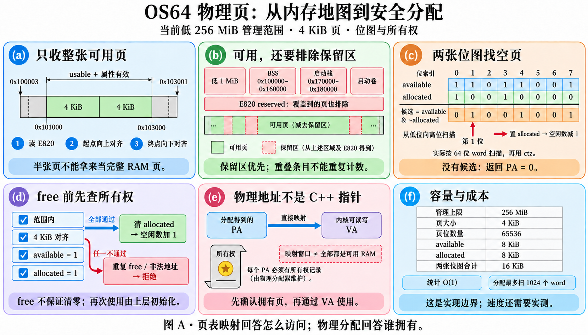
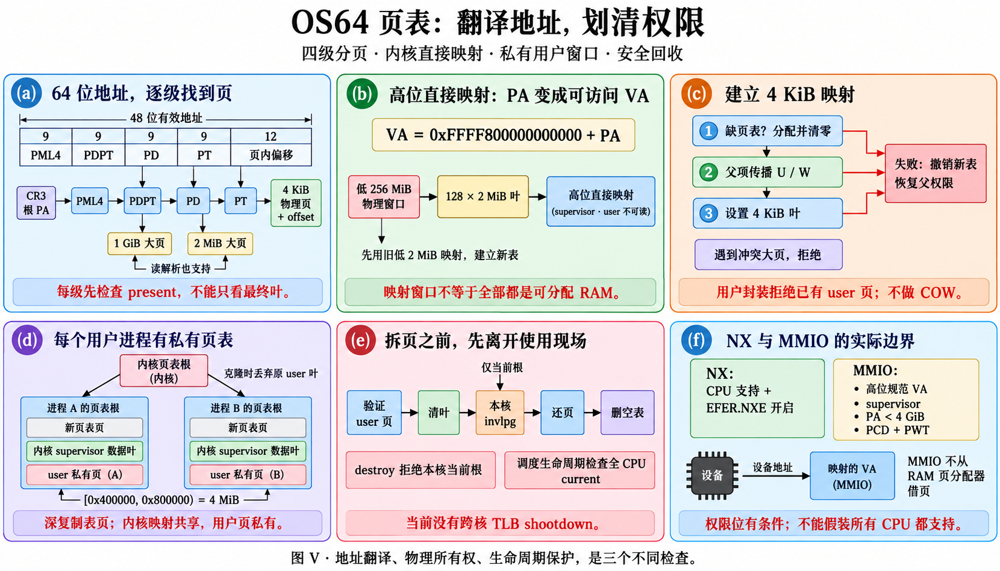
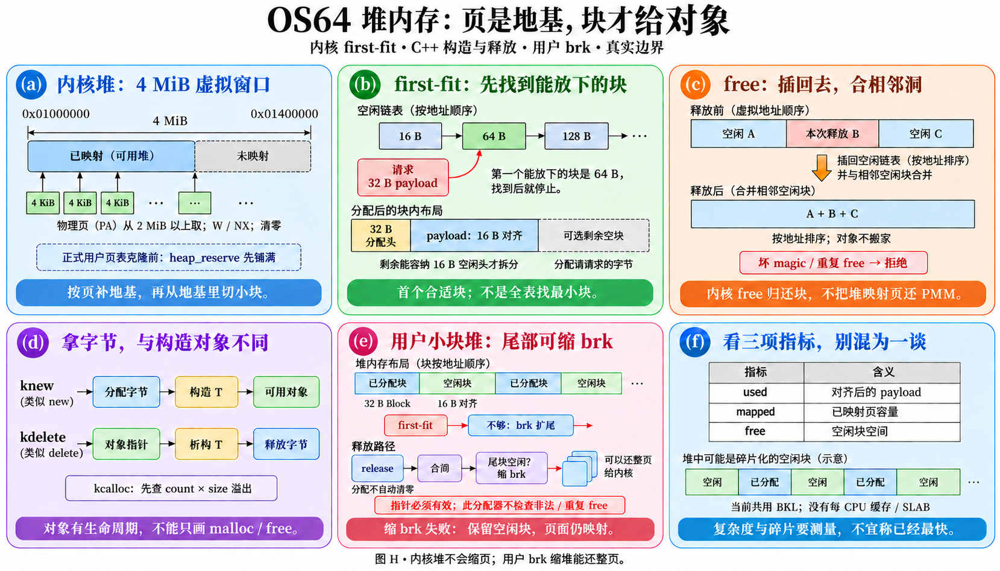

# 从启动到内存：逐函数读懂系统底座

本章覆盖 `kernel/core/kernel_main.cpp` 的 94 个定义与 `kernel/memory/` 的 87 个定义，共 **181 个**。每个定义都有独立表行，重载按源码行分开；“源码”链接指向具体实现，而不是按名字猜用途。对应清单与逐定义哈希见 [FUNCTION_INVENTORY.json](FUNCTION_INVENTORY.json)。这里只解释现有实现，不把将来可能采用的算法说成已经实现。

图片用 K/A/V/H 标识，后面的 (a)..(f) 对应六栏图面。小 helper 共用一个机制图块，表格继续补足各自的输入、输出、步骤、理由、失败与代价。复杂度中 `E` 是 E820 条目数，`L` 是字符串字节数，`n` 是请求字节数；页分配的“位图字数”上限是 1024，页表每层 512 项。串口、设备 I/O、等待中断的时间不能只用 CPU 指令数量描述。

## 图 K：为什么启动要按这个次序

先让 CPU 知道异常/特权转换要落到哪根栈，再建立可分配物理页、稳定物理访问窗口和堆。文件层与系统调用依赖这些内存能力；时钟/调度/输入就绪后，shell 才能作为真实线程阻塞等输入。启动自检用内存中的预载卷，完成后才挂个人 `data.img`，避免自检写入个人文件。

最后阶段创建 shell/network 内核线程，初始化多核，再交给调度器执行。普通内核线程仍在 BSP；各核用户计算可以并行，内核服务使用 BKL。SMP 启动失败会停止 runtime，不把部分启动当成功。

自检函数中的单页用户栈、固定 inode/PID/TID、ARM/DONE 共享页，是启动 fixture 的刻意简化，不能推广为正式用户 ABI。正式 ELF 进程拥有 64 KiB 用户栈、保护页、两根各 32 KiB 的内核栈。

## 图 A：物理页是借出的资源

E820 的 usable 说明固件报告可用，但还要减去内核自己占用的区域。两遍处理让保留区优先：先加入完整 usable 页，再删除任何被保留条目碰到的页。低 1 MiB、BSS `0x100000..0x160000`、启动栈 `0x170000..0x180000` 和传入的预载卷不能借出。

一位表示一张 4096 字节物理页。available 表示可借，allocated 表示已借；候选是 `available & ~allocated`。分配返回 **物理地址**，不是任意页表下可直接解引用的 C++ 指针。先调用 `paging_physical_pointer` 转成稳定的 supervisor 指针。

管理上限当前是低 256 MiB，不是机器全部 RAM。64 位变量不表示已经支持无限物理内存；direct map 的映射也不表示该区间每个地址都是 RAM。释放校验 available+allocated，拒绝重复释放，页内容并不由 free_page 自动清零；新用户页由创建路径清零。

## 图 V：翻译、拥有与回收是三件事

四级页表每级取 9 位索引，末尾 12 位是 4 KiB 页内偏移。direct map 在 `0xFFFF800000000000 + PA` 提供 supervisor 高区访问；建立前只保证低 2 MiB 恒等映射，因此早期页表也必须能通过低区访问。

克隆的是 **页表树**：各进程有独立表页，保留相同 supervisor 内核叶映射，不带走父进程 user 数据页。它不是 fork，也没有写时复制。用户窗口为 `[0x400000,0x800000)`，大小 4 MiB。叶页映射必须来自该页分配器、位于窗口、没有既有映射；整条路径都需要 U/S 权限。

修改当前 root 时执行本地 invlpg；当前没有跨核 TLB shootdown。固定 CPU 绑定和调度器的全核 current 生命周期检查是现有约束，不能随意让同一地址空间同时运行在多核后还沿用这些接口。销毁页表不能销毁当前 CR3，也不能释放仍被任何 CPU 使用的进程。

NX 要 CPU 支持且先开 EFER.NXE。LAPIC 的 MMIO 独立映射为 canonical 高区、supervisor、不可缓存，物理设备地址小于 4 GiB；设备页不能送到 RAM 分配器。

## 图 H：一张页还可以切成很多小块

内核堆虚拟窗口 `[0x1000000,0x1400000)`，即 16–20 MiB，共 4 MiB。扩容先分物理页，再映射成 supervisor W/NX；空闲块按地址排序，first-fit 找到能容纳 payload+32 字节分配头的区域。小到容不下空闲头的尾缝合进分配，避免产生无法管理的碎片。这里的“合并”只合相邻空闲块，不搬动活对象。

内核 heap_free 回收的是可复用块，已映射 heap 页留给堆，不直接归还 PMM。用户 memory::release 不同：尾部空块可通过 brk 缩堆，整页会归还内核。用户分配不是自动清零的 calloc，复用块可能仍有旧内容。knew 先分字节，再构造；kdelete 先析构，再释放，placement new 本身不分配。

这些共享内存结构没有自己的细粒度 SMP 锁，正式入口依赖调用者的 BKL；不要把位运算与空闲链表误称为无锁并行分配器。增长映射中途失败可能留下已增长部分，本章没有承诺每个底层内存函数都是事务；正式 ELF 启动失败由上层 discard 整个新进程回收。

## 逐函数：内存模块

表里的“内部参数”表示 helper 的调用者已验证对象与生命周期，函数本身不重新做全部验证。O(1) 是算法步数，不是零开销。

### kernel/memory/page_allocator.cpp

| 函数（源码） | 输入 | 步骤与理由 | 输出 / 失败 / 边界 | 复杂度 | 图块 |
| --- | --- | --- | --- | --- | --- |
| [align_up](../../kernel/memory/page_allocator.cpp#L5) | 地址 | 向上到4KiB边界，避免交出半页 | 返回地址；调用方先保证加法不溢出 | O(1) | A(b) |
| [clipped_end](../../kernel/memory/page_allocator.cpp#L9) | E820条目 | 计算base+length；溢出/越管理上界裁至256MiB | 返回裁后末尾，不绕回低地址 | O(1) | A(a) |
| [change_available_range](../../kernel/memory/page_allocator.cpp#L18) | 位图、整页区间、可用标志 | 逐页置/清available；覆盖条目天然去重 | 无返回；内部参数须已裁边界 | O(页数) | A(b) |
| [usable](../../kernel/memory/page_allocator.cpp#L31) | E820条目 | 同时要求type=usable与扩展属性bit0有效 | bool；其他类型均保留 | O(1) | A(a) |
| [allocate_between](../../kernel/memory/page_allocator.cpp#L35) | 分配器、下界/上界 | 掩掉范围外bit，找available & ~allocated的首个1，再ctz定页 | 物理地址；无候选/非法返回0，free_count减一 | O(位图字数) | A(c) |
| [initialize_page_allocator](../../kernel/memory/page_allocator.cpp#L78) | BootInfo、分配器 | 清位图→加入完整usable页→排除任何重叠保留页→保护BSS/启动栈/卷→统计 | bool；空/格式错/无可用页false，不返回C++指针 | O(E×页数+总页数) | A(a)(b) |
| [alloc_page](../../kernel/memory/page_allocator.cpp#L158) | 分配器 | 包装allocate_between，范围1MiB..256MiB | 物理页首址；耗尽0 | 同allocate_between | A(c) |
| [alloc_page_below](../../kernel/memory/page_allocator.cpp#L162) | 分配器、排他上界 | 限制可分配页，启动页表须能通过旧恒等映射访问 | 物理页首址；无符合页0 | 同allocate_between | A(c) |
| [alloc_page_at_least](../../kernel/memory/page_allocator.cpp#L166) | 分配器、下界 | 从指定物理位置往高处找整页 | 物理页首址；越界/耗尽0 | 同allocate_between | A(c) |
| [page_allocator_owns_page](../../kernel/memory/page_allocator.cpp#L170) | 分配器、物理首址 | 要求对齐、管理范围、available与allocated均为1 | bool；不接受任意RAM或重复释放页 | O(1) | A(d) |
| [free_page](../../kernel/memory/page_allocator.cpp#L182) | 分配器、已分配物理页 | 先owns检查，再清allocated并增计数 | bool；非法/重复释放false，不擦除页内容 | O(1) | A(d) |
| [count_free_pages](../../kernel/memory/page_allocator.cpp#L192) | 分配器 | 读已维护的free_page_count，不重新扫描 | 页数；空对象0 | O(1) | A(f) |

### kernel/memory/paging.cpp

| 函数（源码） | 输入 | 步骤与理由 | 输出 / 失败 / 边界 | 复杂度 | 图块 |
| --- | --- | --- | --- | --- | --- |
| [read_cr3](../../kernel/memory/paging.cpp#L16) | 无 | 读CPU当前页表根寄存器 | 原始CR3；只能内核执行 | O(1) | V(a) |
| [invalidate_page](../../kernel/memory/paging.cpp#L22) | 虚拟地址 | invlpg撤销本CPU该页旧TLB翻译 | 无返回；不是跨CPU shootdown | O(1) | V(e) |
| [is_page_aligned](../../kernel/memory/paging.cpp#L26) | 地址 | 检查低12位为0 | bool；4KiB对齐前置验证 | O(1) | V(a) |
| [pml4_index](../../kernel/memory/paging.cpp#L30) | 虚拟地址 | 取位47..39作为根表索引 | 0..511，不自行检查canonical | O(1) | V(a) |
| [pdpt_index](../../kernel/memory/paging.cpp#L36) | 虚拟地址 | 取位38..30作为PDPT索引 | 0..511 | O(1) | V(a) |
| [pd_index](../../kernel/memory/paging.cpp#L40) | 虚拟地址 | 取位29..21作为PD索引 | 0..511 | O(1) | V(a) |
| [pt_index](../../kernel/memory/paging.cpp#L44) | 虚拟地址 | 取位20..12作为PT索引 | 0..511；低12位是页内偏移 | O(1) | V(a) |
| [table_from_physical_address](../../kernel/memory/paging.cpp#L48) | 含地址的整数 | 去flags后通过paging_physical_pointer访问表 | 表指针；超可访问范围nullptr | O(1) | V(b) |
| [table_from_entry](../../kernel/memory/paging.cpp#L54) | 页表项 | 包装物理地址转换，避免把flags当地址 | 表指针或nullptr | O(1) | V(a)(b) |
| [allocate_page_table_page](../../kernel/memory/paging.cpp#L58) | 分配器 | 只分配当前可访问范围内页，转换指针并清零 | 物理首址；失败0，转换失败归还页 | O(位图字数+4096) | V(c) |
| [ensure_next_level](../../kernel/memory/paging.cpp#L78) | 父表、索引、flags | 已有非大页子表复用并补W/U；缺失则创建清零表 | 子表指针；遇大页或耗尽nullptr | O(1)或页分配成本 | V(c) |
| [enable_no_execute](../../kernel/memory/paging.cpp#L114) | 无 | CPUID查NX支持，设置EFER.NXE bit11 | bool；不支持false；仅CPU支持并启用后可用NX位 | O(1) | V(f) |
| [paging_initialize_direct_map](../../kernel/memory/paging.cpp#L135) | 分配器 | 在旧低2MiB映射中建PDPT/PD；以2MiB叶映射低256MiB高区，刷新CR3 | bool；根槽占用/分配失败false，成功标ready | O(256MiB/2MiB)及分配 | V(b) |
| [paging_physical_pointer](../../kernel/memory/paging.cpp#L172) | 物理地址 | direct map准备后返回BASE+PA，之前返回低恒等地址 | C++指针；越可访问上界nullptr；映射存在不证明是RAM | O(1) | V(b) |
| [paging_managed_physical_limit](../../kernel/memory/paging.cpp#L183) | 无 | 直接映射前上界2MiB，之后256MiB | 物理范围上界 | O(1) | V(b) |
| [paging_no_execute_enabled](../../kernel/memory/paging.cpp#L187) | 无 | 读取NX初始化结果 | bool；不是每个叶页的执行权限 | O(1) | V(f) |
| [paging_current_root_physical](../../kernel/memory/paging.cpp#L191) | 无 | 读CR3并去低flags及非地址位 | PML4物理首址 | O(1) | V(a) |
| [map_page](../../kernel/memory/paging.cpp#L195) | 分配器、VA/PA/flags | 包装当前CR3的4KiB映射 | bool；失败遵守map_page_internal | 同下级实现 | V(c) |
| [map_page_internal](../../kernel/memory/paging.cpp#L201) | allocator、root、VA/PA、flags、device | 验证对齐/PA上界→建四级路径→写PTE；失败逆序恢复新表/父权限 | bool；当前root才本地invlpg；普通RAM不能当MMIO | 最多3张表分配，O(位图字数) | V(c)(e) |
| [map_page_in_root](../../kernel/memory/paging.cpp#L258) | allocator、指定root、VA/PA/flags | 调用internal(device=false)，可修改非当前用户root | bool；低层允许覆盖叶项，用户包装另行拒绝重映射 | 同internal | V(c) |
| [map_device_page](../../kernel/memory/paging.cpp#L263) | allocator、VA/设备PA | 必须canonical高半区；<4GiB设备页设supervisor/W/NX/PCD/PWT | bool；初始化阶段安装，不把设备计作可分配RAM | 同internal | V(f) |
| [map_identity_range](../../kernel/memory/paging.cpp#L270) | allocator、起止、flags | 逐4KiB建立VA=PA，保留启动用访问路径 | bool；不对齐/反向false，中途失败不整体撤销前面映射 | O(范围页数×映射成本) | V(b)(c) |
| [resolve_physical_address_in_root](../../kernel/memory/paging.cpp#L286) | root、VA | 手工走PML4→PDPT→PD→PT，支持1GiB/2MiB叶，最后加偏移 | PA；缺映射/无表0，只查询不验证user权限 | O(4) | V(a) |

### kernel/memory/address_space.cpp

| 函数（源码） | 输入 | 步骤与理由 | 输出 / 失败 / 边界 | 复杂度 | 图块 |
| --- | --- | --- | --- | --- | --- |
| [table_from_physical_address](../../kernel/memory/address_space.cpp#L12) | 物理首址 | 非零并掩flags后转direct-map指针 | 表指针；0/越范围nullptr | O(1) | V(b) |
| [allocate_clone_table_page](../../kernel/memory/address_space.cpp#L20) | allocator | 分配可访问清零页表，失败转换时归还 | 物理首址或0 | O(位图字数+4096) | V(d) |
| [destroy_table](../../kernel/memory/address_space.cpp#L40) | allocator、表PA、层数、是否归还user页 | 递归销毁私有表，叶页只在release_user_pages且U位时归还 | 无返回；借用内核叶页不释放，表页归还 | O(私有表项+用户页数) | V(e) |
| [clone_page_table_level](../../kernel/memory/address_space.cpp#L67) | allocator、源表、层数 | 递归深拷表树；保留supervisor叶，剔除user叶；失败销毁本次已建表 | 新表PA或0；不是复制父进程用户内容/fork | O(源页表项数) | V(d) |
| [fill_common_layout](../../kernel/memory/address_space.cpp#L121) | AddressSpace | 填用户窗口4..8MiB、默认栈顶8MiB | 无返回；nullptr无操作 | O(1) | V(d) |
| [user_region_contains](../../kernel/memory/address_space.cpp#L133) | VA页首址 | 检查4..8MiB排他上界及4KiB对齐 | bool；不是页权限检查 | O(1) | V(d) |
| [table_is_empty](../../kernel/memory/address_space.cpp#L139) | 有效表指针 | 看512项是否任何Present | bool；用于从叶向上剪空表 | O(512) | V(e) |
| [initialize_kernel_address_space_view](../../kernel/memory/address_space.cpp#L150) | 输出space | 清描述→记录当前root/direct-map表指针→owns=false | bool；无有效root/指针false；借用而非分配 | O(1) | V(d) |
| [clone_current_address_space](../../kernel/memory/address_space.cpp#L171) | space、allocator | 包装当前CR3克隆 | bool；成本同clone_from_root | 同克隆 | V(d) |
| [clone_address_space_from_root](../../kernel/memory/address_space.cpp#L176) | space、allocator、源root | 清描述/布局→深拷四层→记录独立root/owns=true | bool；失败清理本次克隆表 | O(表项数) | V(d) |
| [address_space_map_user_page](../../kernel/memory/address_space.cpp#L205) | space、allocator、用户VA、拥有的PA、flags | 验证私有root/窗口/owns物理页→拒绝已有映射→map并增计数 | bool；失败不接管尚未映射PA，调用者归还 | O(4)+映射分配成本 | V(c)(d) |
| [address_space_unmap_user_page](../../kernel/memory/address_space.cpp#L239) | space、allocator、用户VA | 保存四层路径→验U/Present/owns→清叶/本地invlpg→还页→向上剪空表 | bool；非法/大页/非拥有页false；root仍保留 | O(4×512) | V(e) |
| [address_space_resolve_mapping](../../kernel/memory/address_space.cpp#L288) | space、VA | ready后包装root查询 | PA或0；不等于user读写验证 | O(4) | V(a) |
| [address_space_destroy](../../kernel/memory/address_space.cpp#L298) | space、allocator | 要求拥有、ready且非当前CR3，递归归还user页/所有私有表，再清描述 | bool；当前root/借用视图false；全CPU使用检查由调度器保证 | O(表项+用户页数) | V(e) |
| [address_space_user_range_valid](../../kernel/memory/address_space.cpp#L309) | space、地址、字节数、可写要求 | 防窗口越界/溢出，逐覆盖页检查全部四层Present/U，写入还需W | bool；零长度仍要求窗口内地址；拒绝user大页 | O(覆盖页数×4) | S(c) |
| [address_space_copy_to_user](../../kernel/memory/address_space.cpp#L345) | space、目标VA、内核source、长度 | 先全范围验证可写，再按页翻译/direct-map拷贝，支持非当前root | bool；非法source/映射false，不承诺中途复制无副作用 | O(字节数+覆盖页数) | S(c)、V(d) |

### kernel/memory/heap.cpp

| 函数（源码） | 输入 | 步骤与理由 | 输出 / 失败 / 边界 | 复杂度 | 图块 |
| --- | --- | --- | --- | --- | --- |
| [record_failed_allocation](../../kernel/memory/heap.cpp#L23) | heap | 非空则失败计数加一 | 无返回；空对象无操作 | O(1) | H(f) |
| [is_power_of_two](../../kernel/memory/heap.cpp#L29) | 数值 | 非零且仅一位为1 | bool；验证对齐要求 | O(1) | H(b) |
| [align_up](../../kernel/memory/heap.cpp#L33) | 值、2幂对齐 | 位掩码向上取整，0对齐原值 | 整数；外围验证溢出/对齐 | O(1) | H(b) |
| [address_of](../../kernel/memory/heap.cpp#L42) | 指针 | 转换为64位地址数值 | 地址；不验证该内存有效 | O(1) | H(b) |
| [free_region_start](../../kernel/memory/heap.cpp#L46) | 空闲块指针 | 取块头本身地址 | 首址；内部有效对象 | O(1) | H(c) |
| [free_region_end](../../kernel/memory/heap.cpp#L50) | 空闲块 | 首址+region_bytes求排他末尾 | 末尾；内部元数据须有效 | O(1) | H(c) |
| [minimum_growth_bytes](../../kernel/memory/heap.cpp#L54) | payload大小、对齐 | 预留分配头、payload、对齐空隙和空闲块头 | 需要增长字节；heap上界另外检查 | O(1) | H(a)(b) |
| [merge_forward](../../kernel/memory/heap.cpp#L61) | 空闲块 | 与后续地址恰好相邻的空块连续合并 | 无返回；不相邻不合；非compact搬数据 | O(相邻空块数) | H(c) |
| [insert_free_region](../../kernel/memory/heap.cpp#L69) | heap、区间首址/大小 | 小到装不下头则忽略；按地址插入并向前/向后合并 | 无返回；调用者保证无重叠有效区间 | O(空闲块数) | H(c) |
| [ensure_heap_mapping](../../kernel/memory/heap.cpp#L106) | heap、增量字节 | 上界/溢出检查→逐页从≥2MiB物理区分配→映射W/NX清零→加入free list | bool；失败前已映射的部分可能保留，非原子事务 | O(新增页×分配成本+字节清零) | H(a) |
| [try_allocate_from_region](../../kernel/memory/heap.cpp#L146) | heap、空块及前驱、大小/对齐、输出 | 算payload/头/前后缝；容不下拒绝；切掉原块，保留足够大的缝，写magic/计账 | bool及payload指针；失败未选中该块 | O(空闲块数) | H(b) |
| [initialize_kernel_heap](../../kernel/memory/heap.cpp#L212) | heap、allocator | 登记16..20MiB虚拟窗口，mapped=start，各统计/free_list清空 | bool；空参数false，不马上分配所有页 | O(1) | H(a) |
| [heap_reserve](../../kernel/memory/heap.cpp#L229) | heap、总容量字节 | 若已映射足够直接成功，否则按整页提前映射容量 | bool；超过4MiB/映射失败false；为克隆user roots稳定kernel映射 | O(新增页×映射成本) | H(a) |
| [heap_alloc](../../kernel/memory/heap.cpp#L241) | heap、size、alignment | 验非零与2幂→至少16字节对齐→first-fit空表→必要时增长→清size字节/增计数 | payload或nullptr；统计失败；内核分配默认清零 | O(空闲块数+size+扩容成本) | H(a)(b) |
| [heap_free](../../kernel/memory/heap.cpp#L298) | heap、payload | 查范围/前32字节magic/计账→清magic→回挂空区并合并 | bool；null成功，非法/重复false；不把heap映射页还PMM | O(空闲块数) | H(c) |
| [heap_used_bytes](../../kernel/memory/heap.cpp#L337) | heap | 读当前对齐后payload使用量 | 字节数；空0，不含全部元数据 | O(1) | H(f) |
| [heap_mapped_bytes](../../kernel/memory/heap.cpp#L345) | heap | mapped_limit-start | 已映射容量；空/反向0，不等于used | O(1) | H(f) |
| [heap_free_bytes](../../kernel/memory/heap.cpp#L353) | heap | 累加free_list区域总字节 | 可复用区字节；含空块头，空0 | O(空闲块数) | H(f) |
| [heap_active_allocations](../../kernel/memory/heap.cpp#L368) | heap | 读尚未free成功块数 | 计数；空0 | O(1) | H(f) |
| [heap_total_allocations](../../kernel/memory/heap.cpp#L376) | heap | 读历史成功分配次数 | 累计；空0，free不减少 | O(1) | H(f) |
| [heap_failed_allocations](../../kernel/memory/heap.cpp#L384) | heap | 读失败分配计数 | 计数；空0，不是失败释放计数 | O(1) | H(f) |

### kernel/memory/kmemory.cpp

| 函数（源码） | 输入 | 步骤与理由 | 输出 / 失败 / 边界 | 复杂度 | 图块 |
| --- | --- | --- | --- | --- | --- |
| [multiply_would_overflow](../../kernel/memory/kmemory.cpp#L19) | count、size | 除法比较避免先乘再绕回 | bool；任一0不溢出 | O(1) | H(d) |
| [initialize_kernel_memory_system](../../kernel/memory/kmemory.cpp#L29) | 已初始化allocator/heap | 登记默认对象与ready，不重新创建堆 | bool；空false，不深验heap布局 | O(1) | H(d) |
| [kernel_memory_system_ready](../../kernel/memory/kmemory.cpp#L43) | 无 | ready且两个指针非空 | bool；只检查默认入口登记 | O(1) | H(d) |
| [kernel_memory_page_allocator](../../kernel/memory/kmemory.cpp#L48) | 无 | ready后返回默认页分配器 | 指针；未ready nullptr | O(1) | A(f) |
| [kernel_memory_heap](../../kernel/memory/kmemory.cpp#L56) | 无 | ready后返回默认heap | 指针；未ready nullptr | O(1) | H(d) |
| [kmalloc](../../kernel/memory/kmemory.cpp#L64) | 字节数 | 包装kmalloc_aligned(size,16) | 清零payload或nullptr | 同heap_alloc | H(d) |
| [kmalloc_aligned](../../kernel/memory/kmemory.cpp#L68) | 大小、对齐 | 取得默认heap后调用heap_alloc | 指针；未ready/分配失败nullptr | 同heap_alloc | H(d) |
| [kcalloc](../../kernel/memory/kmemory.cpp#L79) | count、size | 拒绝0/乘法溢出→kmalloc乘积，heap本身已清零 | 清零内存或nullptr | 分配成本+总字节 | H(d) |
| [kfree](../../kernel/memory/kmemory.cpp#L87) | 指针 | 取得默认heap→heap_free | bool；未ready false，null语义由heap_free处理 | 同heap_free | H(c)(d) |

### kernel/memory/kmemory.hpp

| 函数（源码） | 输入 | 步骤与理由 | 输出 / 失败 / 边界 | 复杂度 | 图块 |
| --- | --- | --- | --- | --- | --- |
| [kforward](../../kernel/memory/kmemory.hpp#L50) | T的左值引用 | static_cast成对应T&&，给knew保留实参值类别 | 转发引用；无分配/运行失败协议 | O(1) | H(d) |
| [kforward](../../kernel/memory/kmemory.hpp#L56) | T的右值引用 | 第二个重载，同样转发到构造器，不复制对象 | 转发引用；调用者类型须合法 | O(1) | H(d) |
| [operator new](../../kernel/memory/kmemory.hpp#L63) | size、已分配place | placement new只返回place，随后语言调用构造器 | place；它不负责分配、对齐或释放 | O(1) | H(d) |
| [operator delete](../../kernel/memory/kmemory.hpp#L67) | 指针、place | 配套placement delete为空体 | 无操作；不是kfree的替代 | O(1) | H(d) |
| [knew](../../kernel/memory/kmemory.hpp#L71) | 类型T、构造实参 | 按sizeof(T)/alignof(T)分堆→placement new+转发构造 | T*；分配失败nullptr，当前freestanding不做异常恢复 | 分配成本+构造器 | H(d) |
| [kdelete](../../kernel/memory/kmemory.hpp#L83) | T* | null成功；非空先~T再kfree承载字节 | bool；释放失败false，析构已执行 | 析构成本+heap_free | H(d) |

## 逐函数：kernel_main 装配、自检与显示辅助

下面每个 `run_*_smoke_test` 都是程序：它有输入、有副作用、有断言和失败返回。失败阶段通常写串口并让 kernel_main 停止继续初始化；不能把所有启动函数都描述成“打印一行”。固定测试规模用真实读取字节/页表操作/等待时长说明成本，不从它们宣称最大吞吐。

### kernel/core/kernel_main.cpp

| 函数（源码） | 输入 | 步骤与理由 | 输出 / 失败 / 边界 | 复杂度 | 图块 |
| --- | --- | --- | --- | --- | --- |
| [timer_wait_running_smoke_ticks](../../kernel/core/kernel_main.cpp#L39) | tick数 | 保持Running，HLT等PIT并兑现yield请求，以验证运行记账 | 无返回；仅AP启动前单核fixture，不是正式sleep | 等待时长+调度成本 | K(d) |
| [KernelObjectProbe::KernelObjectProbe](../../kernel/core/kernel_main.cpp#L357) | 两个操作数 | 保存操作数/和/cookie并增构造次数，验证knew真正构造对象 | 构造对象；无独立失败码 | O(1) | H(d) |
| [KernelObjectProbe::~KernelObjectProbe](../../kernel/core/kernel_main.cpp#L365) | this | 清cookie并增析构次数，验证kdelete先析构 | 无返回；不自行kfree | O(1) | H(d) |
| [KernelObjectProbe::is_valid](../../kernel/core/kernel_main.cpp#L370) | this | 比对预设操作数、和和cookie | bool；不符合false | O(1) | H(d) |
| [KernelAlignedObjectProbe::KernelAlignedObjectProbe](../../kernel/core/kernel_main.cpp#L382) | marker | 初始化64字节对齐对象的marker/cookie，增构造次数 | 构造对象；对齐由knew/heap保障 | O(1) | H(d) |
| [KernelAlignedObjectProbe::~KernelAlignedObjectProbe](../../kernel/core/kernel_main.cpp#L388) | this | 清marker/cookie并记析构次数 | 无返回；承载块另行释放 | O(1) | H(d) |
| [KernelAlignedObjectProbe::is_valid](../../kernel/core/kernel_main.cpp#L394) | this | 比对预设marker/cookie | bool；与地址对齐检查分别验证 | O(1) | H(d) |
| [out8](../../kernel/core/kernel_main.cpp#L464) | I/O端口、字节 | outb写硬件寄存器 | 无返回；内核特权指令 | O(1) | K(f) |
| [in8](../../kernel/core/kernel_main.cpp#L469) | I/O端口 | inb读取硬件状态 | 字节；无超时协议 | O(1) | K(f) |
| [serial_write_char](../../kernel/core/kernel_main.cpp#L476) | 字符 | 轮询COM1发送空bit，再写字符 | 无返回；设备不就绪会一直轮询 | 硬件等待+O(1) | K(f) |
| [serial_write_string](../../kernel/core/kernel_main.cpp#L484) | 有效NUL字符串 | 逐字符发送供自检脚本捕获 | 无返回；不检查null/无终止字串 | O(L)+串口等待 | K(f) |
| [serial_write_crlf](../../kernel/core/kernel_main.cpp#L491) | 无 | 直接发送CR与LF两个字节 | 无返回；终端换行一致 | O(1)+硬件等待 | K(f) |
| [shell_output_char](../../kernel/core/kernel_main.cpp#L500) | 字符 | 写VGA，同时串口输出；LF转CRLF | 无返回；自动测试与屏幕看到同一命令结果 | O(1)+串口等待 | K(f) |
| [shell_clear_output](../../kernel/core/kernel_main.cpp#L511) | 无 | 调用console_clear | 无返回；清显示不删文件/日志 | 按控制台区域大小 | K(f) |
| [shell_set_output_color](../../kernel/core/kernel_main.cpp#L515) | 颜色属性字节 | 设置console后续输出颜色 | 无返回；视觉状态 | O(1) | K(f) |
| [syscall_output_write](../../kernel/core/kernel_main.cpp#L519) | fd、buffer、长度、context | 逐字节写已初始化console和串口，LF转CRLF；这里忽略fd/context | 返回已写原始字节数；null返回0 | O(n)+串口等待 | S(f)、K(f) |
| [serial_write_hex_nibble](../../kernel/core/kernel_main.cpp#L556) | 0..15半字节 | 0..9转数字，10..15转A..F | 无返回；调用者保证范围 | O(1) | K(f) |
| [serial_write_hex64](../../kernel/core/kernel_main.cpp#L566) | 64位数 | 固定16个十六进制字符逐nibble打印 | 无返回，适合对照地址 | O(16)+串口等待 | K(f) |
| [serial_write_bounded_string](../../kernel/core/kernel_main.cpp#L573) | 字符串、上限 | 遇NUL或上限停止，避免日志名字无限读 | 无返回；null无操作 | O(min(L,limit)) | K(f) |
| [serial_write_u64](../../kernel/core/kernel_main.cpp#L584) | 无符号数 | 取十进制余数暂存，逆序输出，0单独处理 | 无返回；最多20位 | O(位数)+串口等待 | K(f) |
| [serial_write_i64](../../kernel/core/kernel_main.cpp#L603) | 有符号数 | 负数先负号，使用-(value+1)+1安全处理INT64_MIN | 无返回 | O(位数)+串口等待 | K(f) |
| [read_rflags](../../kernel/core/kernel_main.cpp#L613) | 无 | pushfq/pop读本CPU标志 | RFLAGS，用于记录/验证IF | O(1) | K(a) |
| [is_aligned](../../kernel/core/kernel_main.cpp#L619) | 值、2幂对齐 | 检查低位掩码 | bool；alignment=0 false；非任意整数对齐算法 | O(1) | H(b) |
| [string_length](../../kernel/core/kernel_main.cpp#L627) | NUL字符串 | 计字节长度，null视为0 | 长度；不处理无终止不可信内存 | O(L) | K(f) |
| [strings_equal](../../kernel/core/kernel_main.cpp#L640) | 两字符串 | 按字节比较直至NUL；null仅相同才相等 | bool，启动断言辅助 | O(共同前缀) | K(f) |
| [bounded_text_equals](../../kernel/core/kernel_main.cpp#L656) | actual、expected、limit | 限制比较范围，检查expected结束时actual也结束 | bool；null指针对等，调用者保证可读容量 | O(limit) | K(f) |
| [page_is_accessible_to_kernel](../../kernel/core/kernel_main.cpp#L676) | PA | 要求非零且当前paging_physical_pointer可转换 | bool；不证明E820可分配/owns | O(1) | V(b) |
| [user_mode_smoke_program_bytes](../../kernel/core/kernel_main.cpp#L680) | 无 | 返回内嵌ring3程序起始符号地址 | 内核字节指针；未运行该程序 | O(1) | U(c) |
| [user_mode_smoke_program_size](../../kernel/core/kernel_main.cpp#L684) | 无 | 结束符号减开始符号 | 字节数；顺序反向返回0 | O(1) | U(c) |
| [user_mode_yield_program_bytes](../../kernel/core/kernel_main.cpp#L692) | 无 | 返回yield/preempt/stdin自检字节起点 | 指针；复制区间含相对引用常量 | O(1) | U(c) |
| [user_mode_yield_program_size](../../kernel/core/kernel_main.cpp#L696) | 无 | 计算对应start..end长度 | 字节数；非法次序0 | O(1) | U(c) |
| [load_user_program_file](../../kernel/core/kernel_main.cpp#L707) | allocator、space、fs/path、VA、三个输出 | 旧raw机器码文件≤一页，分配清零页、读全文件关闭、映射为user代码 | bool及PA/inode/大小；失败false，非ELF正式加载入口 | O(文件字节+页映射) | U(a)(c) |
| [vga_fill_line](../../kernel/core/kernel_main.cpp#L769) | 行号、颜色 | 80列写空格和属性 | 无返回；内部行号须合法 | O(80) | K(f) |
| [vga_write_text_at](../../kernel/core/kernel_main.cpp#L779) | 行列、字符串、颜色 | 写字符/属性直到行尾或NUL | 无返回；null/列≥80不写，行号由调用方保障 | O(min(L,80-column)) | K(f) |
| [vga_write_centered_line](../../kernel/core/kernel_main.cpp#L795) | 行号、字符串、颜色 | 计算长度/居中列，超宽从0开始再截到行尾 | 无返回；null不写 | O(L+80) | K(f) |
| [vga_write_line](../../kernel/core/kernel_main.cpp#L812) | 行号、文本、颜色 | 先清整行，再从列0写文字 | 无返回；避免旧尾巴残留 | O(80+L) | K(f) |
| [vga_write_inset_line](../../kernel/core/kernel_main.cpp#L817) | 行列、文本、颜色 | 清行后从指定缩进列开始写 | 无返回；边界由text_at限制 | O(80+L) | K(f) |
| [draw_terminal_chrome](../../kernel/core/kernel_main.cpp#L825) | 无 | 画标题栏、三色字符与session分隔 | 无返回；只是文本模式外观 | O(固定屏幕区域) | K(f) |
| [draw_terminal_overview_panel](../../kernel/core/kernel_main.cpp#L839) | 无 | 画已进入runtime后的各子系统概览文本 | 无返回；不重新执行验证 | O(固定屏幕区域) | K(f) |
| [write_status_line](../../kernel/core/kernel_main.cpp#L865) | 行号、文本 | 同一状态写VGA和串口 | 无返回；让失败阶段可定位 | O(L)+串口等待 | K(f) |
| [memory_kind_name](../../kernel/core/kernel_main.cpp#L872) | E820类型 | usable返回usable，其余统一reserved | 静态字符串；保守显示非usable类型 | O(1) | A(a) |
| [is_boot_info_valid](../../kernel/core/kernel_main.cpp#L881) | BootInfo | 查非空/magic/map_ptr/entry_size | bool；最小契约检查，allocator另验count与区间 | O(1) | K(a) |
| [log_e820_entries](../../kernel/core/kernel_main.cpp#L888) | 已验证BootInfo | 按条打印base/length/type/kind | 无返回；必须先有有效map指针 | O(E)+输出 | A(a)、K(f) |
| [log_allocator_ranges](../../kernel/core/kernel_main.cpp#L911) | allocator引用 | 打印ranges可用快照 | 无返回；ranges不是实际分配位图状态 | O(range_count)+输出 | A(f) |
| [log_allocated_pages](../../kernel/core/kernel_main.cpp#L925) | allocator | 演示分配3页并打印地址 | 无返回；这3页保持借出，不是无副作用日志 | 3次页分配成本 | A(c) |
| [run_tss_smoke_test](../../kernel/core/kernel_main.cpp#L942) | 无 | 初始化TSS并比对RSP0/IST1非零、TR选择子、iomap=104 | bool；任何不符false，之后才装IDT | O(1)+初始化 | K(a) |
| [run_direct_map_smoke_test](../../kernel/core/kernel_main.cpp#L980) | allocator | 优先取≥32MiB页，direct-map写读/反查，再free/拒绝二次free | bool；要求空闲计数恢复，失败false | 页分配+O(1) | A(d)、V(b) |
| [run_paging_smoke_test](../../kernel/core/kernel_main.cpp#L1003) | allocator | 将物理页映射到VA2MiB写模式值再读回 | bool；分配/映射/值错false；测试映射保留 | 页分配+映射成本 | V(c) |
| [run_address_space_smoke_test](../../kernel/core/kernel_main.cpp#L1043) | allocator | 克隆当前root→独立user页→反查/计数→销毁 | bool；root必须独立且回收成功 | 页表克隆+分配+销毁 | V(d)(e) |
| [run_user_mode_smoke_test](../../kernel/core/kernel_main.cpp#L1125) | allocator、context、fd表 | 复制内嵌代码，准备页表/栈/共享fixture页，iret进入再exit，校验CS与cwd/readme位 | bool；需要回收空间；旧fixture仅单页栈 | 用户程序耗时+页表操作 | K(c)、U(c) |
| [run_user_file_program_smoke_test](../../kernel/core/kernel_main.cpp#L1259) | allocator、fs、context/fd | 加载hello.bin原始代码，进入ring3并检查inode6/CPL/文件程序成功位 | bool；失败false，退出后销毁space | 文件读+用户运行+回收 | U(a)(c) |
| [run_user_elf_program_smoke_test](../../kernel/core/kernel_main.cpp#L1394) | allocator、fs、context/fd | 正式loader装hello.elf，再进入ring3；验inode7/两段两页/CS/成功位 | bool；单页自检栈与正式64KiB栈区分 | ELF加载+用户运行+回收 | U(a)(b)(c) |
| [run_scheduler_elf_thread_smoke_test](../../kernel/core/kernel_main.cpp#L1551) | allocator、fs、context/fd | 调度器总装ELF进程，跑到退出；验独立fd/cwd、TSS进入栈与所有live/ready等清零 | bool；恢复全局syscall视图并destroy成功才通过 | 加载+调度运行+回收 | K(d)、U(d) |
| [run_heap_smoke_test](../../kernel/core/kernel_main.cpp#L1728) | heap | 小块/6000B跨页/页对齐写读，释放后复用，相邻512+768合并供1024请求 | bool；校验复用与合并地址，不代表普遍性能 | 堆分配/清零/合并成本 | H(a)(b)(c) |
| [run_kernel_memory_smoke_test](../../kernel/core/kernel_main.cpp#L1834) | allocator、heap | 登记kmem→kmalloc/kcalloc/knew普通与64对齐对象→kdelete；验证计数/零填/析构 | bool；active恢复、total增4、失败0 | 4次分配/释放+构造 | H(d)(f) |
| [read_inode_text](../../kernel/core/kernel_main.cpp#L1967) | fs、inode、buffer/cap | 读整个inode并补NUL | bool；容量必须大于文件字节数 | O(文件字节+I/O) | K(c) |
| [run_boot_volume_smoke_test](../../kernel/core/kernel_main.cpp#L1993) | BootInfo、volume/device输出 | 初始化预载卷和RAM块设备，读扇区0并比对LBA/大小/总字节 | bool；无卷/读错false | 初始化+一扇区读取 | K(c) |
| [run_filesystem_smoke_test](../../kernel/core/kernel_main.cpp#L2054) | device、fs输出 | 挂OS64FS fixture，检签名/名字/inode路径与文本、big.txt直接/间接块A/H/I/J | bool；固定fixture断言，非任意数据盘validator | 元数据及测试文件I/O | K(c) |
| [run_file_handle_smoke_test](../../kernel/core/kernel_main.cpp#L2295) | fs | open/read/EOF/seek/stat/close，核对readme与guide/目录类型 | bool；任何数据/句柄错误false | 测试文件字节+路径查找 | K(c) |
| [run_directory_handle_smoke_test](../../kernel/core/kernel_main.cpp#L2398) | fs | 遍历root3项/docs4项，验名称inode/EOF，rewind再close | bool；固定目录fixture | O(测试目录项数+I/O) | K(c) |
| [run_vfs_smoke_test](../../kernel/core/kernel_main.cpp#L2525) | mount输出、fs | 挂VFS后文件/目录/stat统一读取，核对EOF与首项 | bool；验证抽象层而非新文件格式 | 路径/文件/目录I/O | K(c) |
| [run_filesystem_write_smoke_test](../../kernel/core/kernel_main.cpp#L2629) | device、mount | RAM fixture创建/lab、写alpha+beta、append/unlink/sync/remount并读回/验统计 | bool；只在启动fixture，实际data盘之后才挂载 | 事务与重挂载I/O | K(c)(d) |
| [run_file_descriptor_smoke_test](../../kernel/core/kernel_main.cpp#L2859) | fd表输出、VFS | 初始化表，slot0读seek/stat/EOF/close，验证open_count恢复 | bool；内核slot0≠公开stdin0 | FD操作+测试文件字节 | S(d)、K(c) |
| [invoke_int80_syscall](../../kernel/core/kernel_main.cpp#L2952) | 编号、四整数参数 | 按RAX/RDI/RSI/RDX/RCX发int80，读取有符号RAX | int64结果；内核自检入口仅4参数，用户正式wrapper支持R8第五项 | 实际syscall成本 | S(a) |
| [run_syscall_smoke_test](../../kernel/core/kernel_main.cpp#L2973) | context、fd表 | 直接调用C++ sys_*，测cwd/cd/ls/open/read/write/stat/seek/close与错误码 | bool；fixture只读文件写入unsupported属权限检查 | 测试路径/数据操作 | S(d)(f) |
| [run_int80_syscall_smoke_test](../../kernel/core/kernel_main.cpp#L3185) | context、fd表 | 相同文件操作通过真实int80，补非法fd/编号与寄存器结果验证 | bool；内核CPL0自检不证明用户坏指针验证 | 实际syscall总成本 | S(a)(b)(f) |
| [run_timer_smoke_test](../../kernel/core/kernel_main.cpp#L3444) | 无 | 初始化PIC/PIT100Hz，观察10/20tick，再等3tick及sleep50ms | bool；检查最少tick增量，退出关闭IRQ | 等待时长+IRQ | K(d) |
| [append_scheduler_trace](../../kernel/core/kernel_main.cpp#L3526) | trace/cap、length指针、字符 | 留一个NUL位置后追加mark，维护长度 | 无返回；空/容量不足忽略，不越界 | O(1) | K(d) |
| [observe_scheduler_thread_tid](../../kernel/core/kernel_main.cpp#L3540) | observed输出 | 仅第一次非零current时记该线程TID | 无返回；空/已有记录不改 | O(1) | K(d) |
| [run_scheduler_phase_until_idle](../../kernel/core/kernel_main.cpp#L3552) | 无 | 开IRQ→跑fixture调度器→关IRQ | bool；封装单核自检阶段 | 任务运行时长 | K(d) |
| [scheduler_priority_thread_entry](../../kernel/core/kernel_main.cpp#L3559) | 测试context | 每轮追加H/A/B/C并保持Running等tick，验证优先级/RR记账 | 无返回；空context提前return | 迭代数×等待/调度 | K(d) |
| [scheduler_sleep_thread_entry](../../kernel/core/kernel_main.cpp#L3580) | 测试context | 追加A/B后正式sleep，验证Sleeping→Ready轨迹 | 无返回；空context提前return | 迭代数×sleep | K(d) |
| [scheduler_blocked_thread_entry](../../kernel/core/kernel_main.cpp#L3598) | 测试context | 写B→block→恢复后写b | 无返回；block失败提前return | 事件等待+调度 | K(d) |
| [scheduler_wake_thread_entry](../../kernel/core/kernel_main.cpp#L3621) | 测试context | 等tick后写W→wake目标→yield | 无返回；空target不唤醒 | 等待+调度 | K(d) |
| [scheduler_user_yield_helper_thread_entry](../../kernel/core/kernel_main.cpp#L3642) | helper context/共享fixture页 | 观察ARM/DONE，证明ring3 timer preempt；等待用户Blocked再注入a并标完成 | 无返回；fixture忙协作循环，非公共共享内存API | 测试条件等待 | K(d) |
| [run_scheduler_smoke_test](../../kernel/core/kernel_main.cpp#L3690) | 无 | 创建三批内核fixture，验优先级HABABC、sleep ABAB、block BWb以及PID/TID/计数 | bool；仅AP启动前；不构成多核测压 | 固定任务运行与等待 | K(d) |
| [run_scheduler_user_thread_smoke_test](../../kernel/core/kernel_main.cpp#L4012) | allocator、context/fd | user+kernel helper不同root，验证yield/抢占/stdin、独立cwd、TSS/trap现场/退出 | bool；恢复全局context，后续runtime会destroy旧fixture | 测试用户运行+映射 | K(d)、S(b) |
| [stdin_blocking_reader_thread_entry](../../kernel/core/kernel_main.cpp#L4405) | reader context | sys_read(0,1)存字符/结果，记录TID | 无返回；context空不执行 | 输入等待 | K(d)、S(e) |
| [stdin_blocking_injector_thread_entry](../../kernel/core/kernel_main.cpp#L4419) | injector context | 保持Running等1tick后注入测试scancode | 无返回；仅启动fixture | 1tick等待 | K(d) |
| [run_stdin_blocking_scheduler_smoke_test](../../kernel/core/kernel_main.cpp#L4431) | context | reader先等字符、injector后注入a，核对Blocked恢复/TID/读1字节/缓冲清空 | bool；无ready keyboard/scheduler false | 任务运行+输入等待 | K(d)、S(e) |
| [wait_for_keyboard_irq_count](../../kernel/core/kernel_main.cpp#L4517) | 目标IRQ数、超时tick | HLT等计数推进，并用PIT差值限定启动自检等待 | bool；超时false，仅SMP前fixture | 至目标/超时的等待 | K(d) |
| [run_keyboard_smoke_test](../../kernel/core/kernel_main.cpp#L4532) | 无 | 初始化键盘/IRQ1，注入按下/松开码，核对6字符与无丢弃/额外项 | bool；test injection失败/超时false | scancode数×等待 | K(d) |
| [run_stdin_syscall_smoke_test](../../kernel/core/kernel_main.cpp#L4646) | context、fd表 | 分别C++ read与int80 read，箭头码忽略、普通字节ok/ir；再做真实Blocked自检 | bool；无线程关IRQ空读0仅fixture探测语义 | 注入与输入等待 | K(d)、S(e) |
| [run_console_input_smoke_test](../../kernel/core/kernel_main.cpp#L4797) | 无 | 注入os 65退格改4回车，console_read_line必须得到os 64 | bool；行长度/IRQ/余字符错误false | 行字节+IRQ等待 | K(d) |
| [inject_scancode_sequence](../../kernel/core/kernel_main.cpp#L4957) | 日志前缀、字节数组、计数/IRQ输出 | 逐码注入，更新预计IRQ并等待达到，供shell端到端自检 | bool；空参数/注入错/20tick超时false | 码数×等待 | K(d) |
| [run_shell_smoke_test](../../kernel/core/kernel_main.cpp#L4988) | BootInfo/卷/设备/syscall context | 堆分配临时scheduler，注入命令→console→shell，逐行验文字/长度/结果，再恢复原active | bool；必须回收临时scheduler且缓冲空；不是个人数据盘测试 | 命令集合运行/I/O | K(d) |
| [SmokeSchedulerStorage::~SmokeSchedulerStorage](../../kernel/core/kernel_main.cpp#L5000) | state | 作用域结束destroy临时scheduler并kfree，覆盖早退路径 | 无返回；destroy返回忽略，仅已停止fixture使用 | 销毁+堆释放 | K(d)、H(d) |
| [kernel_shell_thread_entry](../../kernel/core/kernel_main.cpp#L5070) | shell context | 记录启动PID/TID，32KiB线程栈上循环shell读行/执行 | 无返回或context空return；可在等输入时block | 交互循环，无有限总时长 | K(e) |
| [network_worker_entry](../../kernel/core/kernel_main.cpp#L5094) | 忽略context | 启用可用RX IRQ，预算32轮询后等待事件；失败使用有界定时轮询 | 无限循环；网络层记录IRQ回退，kernel线程BSP执行 | 每轮≤32包处理+等待 | K(e) |
| [start_kernel_shell_under_scheduler](../../kernel/core/kernel_main.cpp#L5108) | 无 | 创建kernel-shell PCB/视图与32KiB shell线程，网卡ready则加32KiB network worker | bool；无ready/IRQ/资源false；线程创建不等于已开始运行 | PCB/TCB分配与入队 | K(e) |
| [kernel_user_mode_exit_is_armed](../../kernel/core/kernel_main.cpp#L5181) | 无 | 判断早期session或正式current user存在 | bool；调度器user退出走正式路径 | O(1) | S(e)、U(d) |
| [kernel_handle_user_mode_exit](../../kernel/core/kernel_main.cpp#L5191) | 返回值 | 旧session或正式TCB保存返回值并resume原内核调用栈/CR3 | noreturn；无合法现场停等，不回用户态 | O(1) | U(d) |
| [kernel_main](../../kernel/core/kernel_main.cpp#L5221) | BootInfo | 按依赖自检→重建runtime→优先data盘→安装services→shell/network→启动SMP→调度 | void；关键失败写阶段并return停止；网络无设备可继续 | 各初始化/自检之和，随后常驻 | K(a)..K(f) |
| [kernel_handle_exception](../../kernel/core/kernel_main.cpp#L5565) | 异常frame、fault地址 | 日志记录；ring3异常尝试结束该user；内核异常打印vector/error/RIP，PF追加地址 | void；有效frame由ASM保证，内核异常上层停止 | O(1)+日志/输出 | K(f)、S(e) |

## 两个重点调用链

创建正式用户进程的内存路线是：`heap_reserve` 稳定内核映射 → `clone_address_space_from_root` 拷表 → ELF 分配清零用户页 → 用户栈16页与未映射保护页 → 两根 supervisor 栈 → ready 入队。失败由 scheduler_discard_process 回收没有 dispatch 的对象，已经执行的对象则先退出/切离，再 reap。

读取用户缓冲区的权限路线是：syscall 入口判断来自 ring3 → 按编号验证长度/方向 → address_space_user_range_valid 检查覆盖的每页和每层 U/W 位 → 服务复制。能把 VA 翻译成 PA，并不等于该 VA 对用户可读写。

`kernel_handle_exception` 由有效异常帧进入。用户异常通常结束该进程，内核异常打印位置后由异常汇编停止；这不是通用的“内核异常恢复”。两个 `#if` 专用构建中的 UD2/页错误入口不在默认编译清单的181项内，详见既有异常回归教程。

继续：[系统调用和用户ABI逐函数](USER_ABI_FUNCTIONS.md)、[多核调度逐函数](SCHEDULER_FUNCTIONS.md)。图片直接由 imagegen 生成，提示词与审校记录在本目录 prompts 和 images-memory.json。
