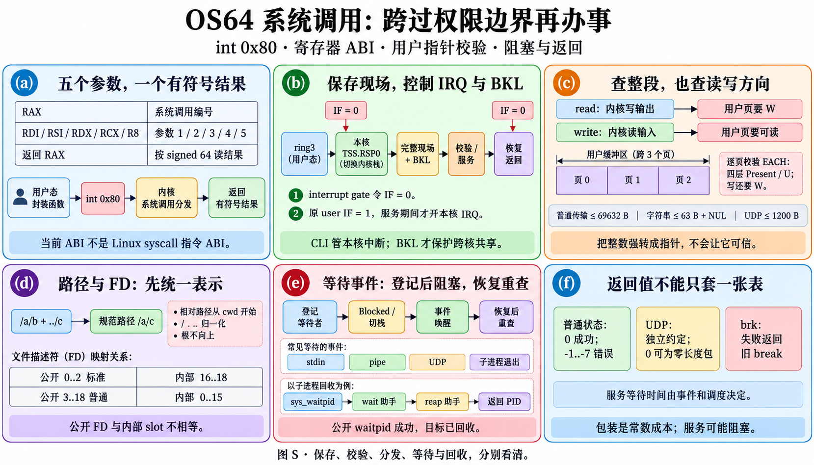
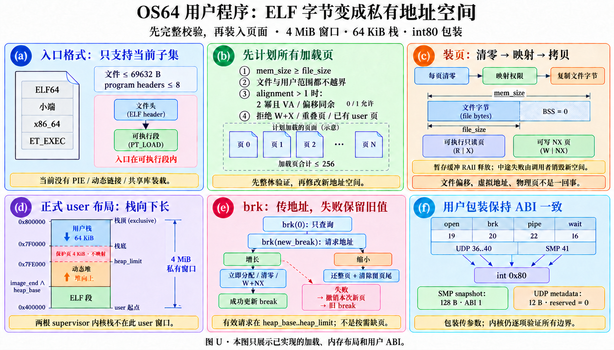

# 看图读系统调用、ELF 与用户 ABI

本章覆盖 `kernel/syscall/syscall.cpp` 60 个定义、`kernel/task/elf_loader.cpp` 7 个、用户内存/ABI头文件40个，共 **107 个定义**。每个定义一行，包含内部辅助函数与析构器；同名函数以源码文件和行号区分。完整签名/逐定义哈希在 [FUNCTION_INVENTORY.json](FUNCTION_INVENTORY.json)。

图 S 是系统调用边界，图 U 是 ELF 与用户资源布局，图 H(e) 解释用户小块分配。阅读表格前，先把“整数寄存器参数、用户虚拟地址、内核服务对象”分成三种东西：把整数强转成指针，并没有让该指针自动可信。

## 图 S：从 int80 到服务函数

本系统用 `int 0x80`：RAX 是编号，RDI/RSI/RDX/RCX/R8 是第1至第5个参数，RAX 按 int64 读结果。它不是直接使用 x86 的 syscall 指令，也不是 Linux 的寄存器 ABI。入口汇编先保存现场并取得 BKL；若来自ring3，CPU按本核TSS.RSP0使用该用户线程的进入栈。C++ 捕获完整用户现场后才查参数并分发。

系统调用从 ring3 进入 interrupt gate 时 IF 自动清零。只有原用户 RFLAGS.IF=1，kernel_handle_syscall 才在服务期间保守开本地 IRQ，让终端/管道/UDP 等等待能推进；返回前关IRQ，汇编完整恢复现场并在返回user时放锁。CLI不是跨核锁，BKL保护共享资源；阻塞切栈期间二者都不能提前失效。

### 指针验证要同时问范围和方向

`read` 的缓冲区由内核写，需要完整范围可写；`write` 的缓冲区由内核读，只需完整范围可读。每个覆盖页的四层 Present/U 位都要通过，写还需要W，不能只查起点。普通用户读写/replace最多69632字节，目录最多128项，日志最多64条；这些上限在乘法前检查，防止“项数乘大小”回绕。

路径最多64字节内找到NUL，也就是内容最多63字节；每一个字节先验再读。公开spawn最多8个参数，每条同样受64字节字符串检查；调度器内部的参数装配helper支持16条/每条256字节上限，公开API更窄，二者不混写。

有限位宽的参数要先检查整个64位寄存器，再窄化。例如UDP receive_wait的R8必须≤60000或恰为UINT32_MAX，不能把高位带垃圾的值截成一个合法小超时。等待恢复后的缓冲区/句柄复核由相应服务实现；UDP会复核owner/generation与写入范围。

### 返回值按接口理解

普通SyscallStatus为0成功，-1参数、-2找不到、-3类型、-4FD、-5I/O、-6不支持、-7管道无读端。UDP有自己的-1无包/超时、-2非法、-3无网卡、-4等待时关闭；不能用同一错误表解释所有服务。UDP返回0可能是真正的零字节数据报，不是超时。brk失败返回旧break，也不使用负错误码。

`scheduler_wait_process` helper 只等待并读退出码；`scheduler_reap_process` helper 释放资源。**公开 `sys_waitpid` / 用户 `waitpid` 会把两步串联，成功时目标进程已经回收**。图中分开的wait/reap阶段不能理解成公开waitpid只查询。

## 图 U：文件字节怎么成为可运行程序

文件偏移是“文件里第几个字节”，虚拟地址是“进程里放在哪里”，物理地址是“真正借到哪张RAM页”；三者不能互换。loader读全文件到内核暂存缓冲，先验证ELF与所有PT_LOAD页计划，然后清零/映射用户页、拷贝文件字节。mem_size超过file_size的尾部保持零，就是BSS的来源。

当前接受ELF64、小端、x86_64、ET_EXEC；最多8个program headers、文件69632字节、合计256个加载页。入口必须在可执行PT_LOAD内。拒绝W+X段、文件/虚拟范围越界、加法回绕、不合规定的对齐同余、重叠加载页与已有user映射。section headers不是当前执行所需入口，loader不解析动态链接器、PIE重定位或共享库。

ELF 的 alignment 字段为0或1时允许，不做“2幂且虚拟地址与文件偏移同余”检查；只有 alignment > 1 才检查这两个条件。这个段级条件与实际映射必须按4KiB页对齐是两件事。

正式用户窗口是 `[0x400000,0x800000)`，4MiB大小；从低地址看是ELF段、动态堆、未映射保护页、64KiB用户栈。栈底 `0x7F0000`，保护页 `[0x7EF000,0x7F0000)`，栈顶排他地址 `0x800000`。堆从ELF image_end（页对齐）开始，最大break为保护页起点，不侵入栈。正式线程两根各32KiB的supervisor内核栈见[调度图C(d)](SCHEDULER_FUNCTIONS.md)，不画成用户可读内存。

## 用户堆：按字节申请，内核按页支持

用户 memory::allocate 的32字节Block头带bytes/prev/next/available，16字节对齐。先复用空块，再通过brk扩末尾；release合邻洞，末尾空块可缩brk归还整页。它不检测非法或重复free，传入的指针必须是此分配器尚未释放的结果；当前一进程一用户线程，没有为共享地址空间多线程加锁。resize分配失败保留旧块，不能先release再冒险复制。

release 先将块标为空闲并合洞，再尝试缩小尾部brk。缩brk失败时，块已经空闲且仍挂在链表里，可以复用；相关页面仍映射。这不同于 resize 为替换块分配失败：后者返回nullptr，而原来的已分配块及其内容保持有效。释放与重新分配失败的含义不能共用一句“保留旧块”。

内核sys_brk是立即分配，不是缺页后按需分配：新增页清零，映射W/NX；中途失败撤销本次新增页，break保持旧值。缩减时返还整页，并清最后保留页里被裁掉的尾巴，避免再增长读到旧内容。break是地址，不是“使用了多少字节”，用户必须检查 `brk(wanted)==wanted`。

## 逐函数：系统调用实现

每行复杂度将wrapper自己的常数成本和实际服务成本区分；阻塞服务的墙钟时间由事件/调度决定，不能标为“因为只是一个包装，所以整个调用O(1)”。

### kernel/syscall/syscall.cpp

| 函数（源码） | 输入 | 步骤与理由 | 输出 / 失败 / 边界 | 复杂度 | 图块 |
| --- | --- | --- | --- | --- | --- |
| [user_network_owner](../../kernel/syscall/syscall.cpp#L23) | 无 | 从本核current user/owner取PID，kernel进程不允许用户socket ABI | PID；无合法user返回0 | O(1) | S(b)、U(f) |
| [is_space_char](../../kernel/syscall/syscall.cpp#L35) | 字符 | 只识别空格与tab，供路径两端trim | bool；不是完整Unicode空白判定 | O(1) | S(d) |
| [is_path_separator](../../kernel/syscall/syscall.cpp#L39) | 字符 | 只识别/ | bool；不把反斜线当分隔符 | O(1) | S(d) |
| [skip_spaces](../../kernel/syscall/syscall.cpp#L43) | 字符串 | 跳开开头空格/tab | 剩余指针；null仍null | O(前导空白) | S(d) |
| [string_length](../../kernel/syscall/syscall.cpp#L55) | 字符串 | NUL终止计字节 | 长度；null0；用户指针应先经过入口验证 | O(L) | S(d) |
| [trim_trailing_spaces](../../kernel/syscall/syscall.cpp#L68) | begin/end | 向前收缩end到最后非空白后 | 新end；不写原串，调用者提供有效区间 | O(尾空白) | S(d) |
| [copy_string](../../kernel/syscall/syscall.cpp#L76) | 目标/cap、source | 先算长度，能装含NUL才复制 | bool；null/0容量/过长false，不静默截断 | O(L) | S(d) |
| [set_root_path](../../kernel/syscall/syscall.cpp#L93) | 目标/cap | 写/与NUL | bool；容量<2/null false | O(1) | S(d) |
| [skip_path_separators](../../kernel/syscall/syscall.cpp#L103) | cursor/end | 跨过连续/但不越end | 指针；内部区间有效 | O(分隔数) | S(d) |
| [path_component_length](../../kernel/syscall/syscall.cpp#L111) | begin/end | 到下一个/或end计算组件长度 | 长度；内部有效区间 | O(组件长度) | S(d) |
| [path_component_is_dot](../../kernel/syscall/syscall.cpp#L121) | 组件/长度 | 要求恰好单字符. | bool；null false | O(1) | S(d) |
| [path_component_is_dot_dot](../../kernel/syscall/syscall.cpp#L125) | 组件/长度 | 要求恰好两个点 | bool；不是名字里含..就回退 | O(1) | S(d) |
| [append_path_component](../../kernel/syscall/syscall.cpp#L132) | 路径/cap、组件/长度 | 计算空间，根后不多加/，其他补/，拷并NUL | bool；空组件/过长false | O(已有路径+组件) | S(d) |
| [pop_path_component](../../kernel/syscall/syscall.cpp#L163) | 规范化路径 | 倒找最后/，根不再向上 | 无返回；null无操作，末组件被去掉 | O(路径长度) | S(d) |
| [syscall_fd_is_open](../../kernel/syscall/syscall.cpp#L194) | context、内部slot | 上下文ready且fd_is_open | bool；slot不是公开fd，转换由外层做 | FD查询成本 | S(d) |
| [table_fd_to_syscall_fd](../../kernel/syscall/syscall.cpp#L199) | 内部slot | 包装fd_slot_to_public，普通0..15→3..18，标准16..18→0..2 | 公开fd；非法-1 | O(1) | S(d) |
| [syscall_fd_to_table_fd](../../kernel/syscall/syscall.cpp#L203) | 公开fd | 包装fd_public_to_slot，0..2→16..18，3..18→0..15 | 内部slot；越界-1 | O(1) | S(d) |
| [syscall_write_handler_is_ready](../../kernel/syscall/syscall.cpp#L207) | context | 检查存在写回调 | bool；不检查真正TTY驱动 | O(1) | S(f) |
| [encode_syscall_result](../../kernel/syscall/syscall.cpp#L211) | int64结果 | 保留二进制位转uint64写入RAX | 无符号编码；负数由user再按signed读 | O(1) | S(a)(f) |
| [syscall_status_result](../../kernel/syscall/syscall.cpp#L218) | 状态枚举 | 扩展成int64服务dispatcher | 有符号结果；不统一UDP独立错误约定 | O(1) | S(f) |
| [read_stdin_stream](../../kernel/syscall/syscall.cpp#L222) | buffer、正长度 | 先取已有字符；无线程启动期可HLT，正式线程登记键盘wait再恢复重查 | 字节数；无键盘-6，正式等待失败/IF关-5，不把空终端当EOF | 字符数+事件等待 | S(e) |
| [current_dispatch_context](../../kernel/syscall/syscall.cpp#L270) | 无 | 优先current->owner的syscall view，启动期才全局默认 | context指针，可能null | O(1) | S(b) |
| [frame_came_from_user_mode](../../kernel/syscall/syscall.cpp#L283) | frame | 检查非空且CS低两位=3 | bool；内核int80测试不走user指针策略 | O(1) | S(b) |
| [user_range_valid](../../kernel/syscall/syscall.cpp#L287) | 地址、长度、可写 | 零长度直接true；建立当前root观察视图，再检查全部页路径 | bool；非法非零范围false，与底层zero长度规则不同 | O(覆盖页×4) | S(c) |
| [user_path_valid](../../kernel/syscall/syscall.cpp#L296) | 用户字符串地址 | 最多64次先查字节可读再读，找到NUL才通过，检查地址加法回绕 | bool；≤63字节字符串，缺NUL/跨未映射页false | O(64×页表步数) | S(c) |
| [user_syscall_arguments_valid](../../kernel/syscall/syscall.cpp#L308) | 完整寄存器frame | 按编号与传输方向查长度/指针；argv逐串验证；第五项高位先验再窄化 | bool；读写≤69632，目录≤128，log≤64，UDP≤1200，未知编号交dispatcher拒绝 | O(范围页+argv字符串) | S(c) |
| [capture_current_user_trap_frame](../../kernel/syscall/syscall.cpp#L390) | frame | 只对current user+ring3捕获15通用寄存器/iret现场，读取额外RSP/SS | 无返回；kernel或无current不写；标has_user_trap_frame | O(1) | S(b) |
| [dispatch_syscall_registers](../../kernel/syscall/syscall.cpp#L432) | 编号+5整数参数 | context ready→switch翻译类型→调用sys/调度/网络；exit不返回、sleep限一天 | int64结果；未知编号-1；UDP需当前user owner | 所选服务成本 | S(a)(e)(f) |
| [stat_path_internal](../../kernel/syscall/syscall.cpp#L600) | context、path、stat输出、可选resolved缓冲 | 统一规范路径+vfs_stat+错误翻译，复用于cd/ls/stat | 状态；参数错-1，找不到-2 | 路径解析+VFS查询 | S(d) |
| [initialize_syscall_context](../../kernel/syscall/syscall.cpp#L633) | context、fd表 | 先清context，验证fd表并绑定，cwd设/ | bool；无效表false，避免半有效旧指针 | O(固定结构) | S(b) |
| [syscall_context_is_ready](../../kernel/syscall/syscall.cpp#L651) | context | 查context/fd_table/vfs/os64fs链非空 | bool；结构检查，非资源锁 | O(1) | S(b) |
| [install_syscall_write_handler](../../kernel/syscall/syscall.cpp#L657) | context、handler/context | 验证ready+回调非空后登记 | bool；无效false，输出仍可被fd重定向 | O(1) | S(f) |
| [install_syscall_dispatch_context](../../kernel/syscall/syscall.cpp#L669) | ready context | 设置启动默认context | bool；无效false；runtime优先每进程view | O(1) | S(b) |
| [syscall_dispatch_is_ready](../../kernel/syscall/syscall.cpp#L680) | 无 | current_dispatch_context后结构检查 | bool | O(1) | S(b) |
| [syscall_current_working_directory](../../kernel/syscall/syscall.cpp#L684) | context | 有效且cwd非空时返回内置数组 | 只读指针；失败nullptr，生命周期属于context | O(1) | S(d) |
| [syscall_resolve_path](../../kernel/syscall/syscall.cpp#L693) | context、raw、输出/cap | trim两端空白，绝对从/或相对从cwd，逐组件处理重复/、.、.. | bool；空路径代表cwd，容量不够false；不解析符号链接 | 最坏O(L²)，路径有界64 | S(d) |
| [sys_getcwd](../../kernel/syscall/syscall.cpp#L766) | context、buffer/cap | 将cwd复制含NUL，返回不含NUL长度 | 长度或-1，容量需足够 | O(cwd字节) | S(d) |
| [sys_chdir](../../kernel/syscall/syscall.cpp#L781) | context、path | 规范化+stat，确认目录后更新cwd | 0成功；参数/不存在/类型负码，非简单字符串赋值 | 路径与stat成本 | S(d) |
| [sys_open](../../kernel/syscall/syscall.cpp#L807) | context、path、flags | 0flags默认READ；验权限组合→规范路径/stat→fd_open→公开编号 | fd或负错误；写选项必须WRITE，目录拒绝 | 路径查询+FD分配/I/O | S(d) |
| [sys_read](../../kernel/syscall/syscall.cpp#L851) | context、公开fd、buffer/n | 0长度0；转slot、验可读，terminal走等待流，其他交fd_read | 字节数/文件或管道EOF0/负码；内核API长度上限INT32_MAX | 数据n+I/O/等待 | S(c)(e) |
| [sys_write](../../kernel/syscall/syscall.cpp#L884) | context、公开fd、buffer/n | 转slot验可写；terminal回调，文件/pipe交fd_write，保留BrokenPipe | 写字节/负码；0长度0，无读端-7且无SIGPIPE | 数据n+I/O/等待 | S(e)(f) |
| [sys_stat_path](../../kernel/syscall/syscall.cpp#L923) | context、path、输出 | 包装统一path stat | 状态与VfsStat；无效/不存在负码 | 路径与stat成本 | S(d) |
| [sys_listdir](../../kernel/syscall/syscall.cpp#L928) | context、path、entries/cap | 要求目录→open；null+0只询数量，否则容量须装全体，逐项读后close | 项数或负码；不是getdents字节打包ABI | 目录项数×I/O | S(d) |
| [sys_close](../../kernel/syscall/syscall.cpp#L986) | context、公开fd | 转slot→确认open→fd_close引用 | 0或负码；最后端点可能唤醒等待者 | FD关闭成本 | S(e) |
| [sys_seek](../../kernel/syscall/syscall.cpp#L999) | context、公开fd、offset32 | 转slot验open，再fd_seek | 状态；不支持对象/I/O失败负码 | FD/文件seek成本 | S(d) |
| [sys_stat](../../kernel/syscall/syscall.cpp#L1014) | context、公开fd、stat输出 | 转slot验open，再fd_stat | 状态及元数据；无缓冲/非法fd负码 | 对象stat成本 | S(d) |
| [install_syscall_process_services](../../kernel/syscall/syscall.cpp#L1030) | scheduler、allocator、fs/VFS | 验证各依赖就绪后登记进程服务全局入口 | bool；参数未ready false | O(1) | S(e) |
| [sys_spawn](../../kernel/syscall/syscall.cpp#L1045) | context、path、argv/argc | ≤8参数复制为内核短串；无参数补argv0；ELF总装后继承cwd/fd并布初始参数 | PID或负码；继承/参数失败discard未运行新进程 | ELF/页表/复制/FD成本 | U(d)、S(e) |
| [sys_waitpid](../../kernel/syscall/syscall.cpp#L1095) | 正PID、可选status | scheduler_wait_process等待读取→scheduler_reap_process真正回收→写status | PID或负码；不同于只读的scheduler_wait_process helper | 子运行等待+回收成本 | S(e) |
| [sys_mkdir](../../kernel/syscall/syscall.cpp#L1113) | context、path | 规范路径，在对应VFS副本上创建目录 | 0/负码；空/解析失败-1 | 路径与文件系统事务 | S(d) |
| [sys_unlink](../../kernel/syscall/syscall.cpp#L1122) | context、path | stat后检查当前及全部PCB同文件系统fd引用、cwd及子目录；空闲才VFS删除 | 0/负码；打开inode/活cwd拒绝-6，非Unix延迟删除 | O(进程数×FD/cwd扫描)+I/O | S(d) |
| [sys_sync](../../kernel/syscall/syscall.cpp#L1165) | context | 验证ready后调用VFS sync | 0或负码；冲刷不是断电日志恢复 | 设备sync成本 | S(f) |
| [sys_read_log](../../kernel/syscall/syscall.cpp#L1173) | 输出、capacity、after_sequence | 最多64条，读取seq之后的环形记录 | 条数；非法容量/指针-1，不清日志 | O(环形容量+输出条数) | S(f) |
| [sys_performance_snapshot](../../kernel/syscall/syscall.cpp#L1177) | 输出 | 取一次perf快照 | 0或null -1；ABI布局固定 | 固定统计扫描成本 | S(f) |
| [sys_replace_file](../../kernel/syscall/syscall.cpp#L1184) | context、path、buffer/n | 验≤69632与指针，规范路径，一次事务替换完整文件 | 字节数或负码；未实现突然断电日志恢复 | 路径+n字节及事务I/O | S(d)(f) |
| [sys_pipe](../../kernel/syscall/syscall.cpp#L1197) | context、两int32输出 | 创建两内部槽，再转成公开read/write端编号 | 0或负码；容量不足不发布成功 | FD/pipe分配成本 | S(e) |
| [sys_dup2](../../kernel/syscall/syscall.cpp#L1205) | context、旧/新公开fd | 转slot，定目标复制共享description并返回公开编号 | 新fd或负码；不是克隆文件offset | FD引用处理成本 | S(e) |
| [sys_dup](../../kernel/syscall/syscall.cpp#L1210) | context、旧公开fd | 找空slot引用同description并转公开编号 | 新fd或负码；共享offset/pipe端点 | O(FD容量) | S(e) |
| [sys_brk](../../kernel/syscall/syscall.cpp#L1218) | 请求末尾地址，0查询 | 只改current user堆；增长立即清零映射；失败撤销本次新页；缩减还整页并清尾 | 新break；越界/失败返回旧break，无合法进程0 | O(变化页×分配/剪表+尾清零) | U(e)、H(e) |
| [kernel_handle_syscall](../../kernel/syscall/syscall.cpp#L1273) | 完整frame | 捕获user现场→ring3参数验→按原IF保守开IRQ分发→写RAX→关IRQ交ASM恢复 | 无返回值；badptr普通-1/UDP-2；空frame无操作 | 参数验证+服务成本 | S(a)(b)(c) |

## 逐函数：ELF 装载

验证阶段还未发布加载映射；实际分配映射阶段若耗尽内存，已经完成的映射归上层新进程对象拥有。loader的StagingBuffer只自动释放暂存文件缓冲；上层必须discard/destroy失败的新地址空间，不能误称loader返回false就总能自行还清所有用户页。

### kernel/task/elf_loader.cpp

| 函数（源码） | 输入 | 步骤与理由 | 输出 / 失败 / 边界 | 复杂度 | 图块 |
| --- | --- | --- | --- | --- | --- |
| [StagingBuffer::~StagingBuffer](../../kernel/task/elf_loader.cpp#L23) | this.bytes | RAII在作用域所有返回路径kfree ELF暂存缓冲 | 无返回；nullptr无操作，只收缓冲不收已映射用户页 | heap释放成本 | U(a) |
| [align_down](../../kernel/task/elf_loader.cpp#L28) | 值、2幂对齐 | 页起点向下掩位；0对齐原值 | 对齐值；内部使用4KiB | O(1) | U(b) |
| [align_up](../../kernel/task/elf_loader.cpp#L36) | 值、2幂对齐 | 页末尾向上掩位；0对齐原值 | 对齐值；段范围验证保证正常加法 | O(1) | U(b) |
| [elf_header_is_valid](../../kernel/task/elf_loader.cpp#L44) | header、实际文件大小 | 查ELF64小端/version/ET_EXEC/x86_64、64B头/56B PH、1..8项；先offset后差值边界 | bool；任何格式/表越界false；不解析section表 | O(1) | U(a) |
| [loadable_segment_is_valid](../../kernel/task/elf_loader.cpp#L86) | user_space、PH、文件大小 | 只PT_LOAD非空，mem≥file；文件范围；alignment>1才查2幂/同余，0/1允许；拒W+X、地址回绕、guard前边界与≤256页 | bool；非法false；不是只查ELF魔数 | O(1) | U(b) |
| [entry_belongs_to_any_loadable_segment](../../kernel/task/elf_loader.cpp#L133) | PH数组/count、entry | entry必须落某个可执行PT_LOAD的内存区间 | bool；null/无匹配false；上层先验段范围 | O(PH数≤8) | U(b) |
| [load_elf_user_program](../../kernel/task/elf_loader.cpp#L163) | allocator、space、fs/path、输出 | 读完整文件暂存→全图验证/去重规划→逐段清零映射按W/NX→按页拷file字节→输出entry/image_end | bool；≤69632B/8PH/256页；错误false，caller须销毁已部分装载space | O(文件字节+计划页²+映射成本) | U(a)(b)(c) |

## 逐函数：用户内存、基础包装与网络/SMP ABI

用户wrapper不会替调用者验证字符串终止、对象容量、短写或分配器指针来源。系统调用入口负责保护内核；用户程序仍然要检查自己的返回值。按字节IPv4表示是 `a<<24 | b<<16 | c<<8 | d`；UDP metadata固定12字节，reserved位于偏移10且内核写0。SMP/perf快照各128字节，先看abi_version再解读字段。快照是观察工具，不是同步或CPU利用率测量的替代。

### user/memory.cpp

| 函数（源码） | 输入 | 步骤与理由 | 输出 / 失败 / 边界 | 复杂度 | 图块 |
| --- | --- | --- | --- | --- | --- |
| [memcpy](../../user/memory.cpp#L4) | 目标/source/n | 按字节前向复制，返回目标供C/C++运行时使用 | 目标；调用方保证有效非重叠区间，不验user权限 | O(n) | H(e) |
| [memmove](../../user/memory.cpp#L10) | 目标/source/n | 目标低于源则前向，否则倒向复制以支持重叠 | 目标；有效容量由调用者保证 | O(n) | H(e) |
| [memset](../../user/memory.cpp#L21) | 目标、值/n | 逐字节写低8位值 | 目标；不做容量验证 | O(n) | H(e) |
| [memcmp](../../user/memory.cpp#L26) | 两个范围/n | 逐unsigned字节找首个差异，小于-1、大于1、全相同0 | 比较号；有效指针/容量前置 | O(n) | H(e) |
| [memory::round_size](../../user/memory.cpp#L48) | 大小、输出 | 拒0/加法溢出，向16字节对齐，再留32B头空间 | bool及对齐大小；非法false | O(1) | H(e)、U(e) |
| [memory::split](../../user/memory.cpp#L54) | 有效空闲Block、wanted | 仅余量≥32B头+16B payload才分尾块，维护prev/next/last | 无返回；内部保证block.bytes≥wanted | O(1) | H(e) |
| [memory::merge_next](../../user/memory.cpp#L69) | 有效Block | 后一块available才吸收其头+payload并修链表/last | 无返回；本实现连续brk布局支持物理虚拟邻接 | O(1) | H(e) |
| [memory::allocate](../../user/memory.cpp#L79) | 字节数 | first-fit复用并split；无空块查询brk，验对齐/溢出再增长，串新Block | payload或nullptr；扩容返回地址不匹配即失败，复用块不清零 | O(块数)+brk页成本 | H(e)、U(e) |
| [memory::release](../../user/memory.cpp#L106) | 本分配器返回的live payload | 取前32B头标空→合后一块/前空块；若为last则brk缩至头首址；缩失败仍保留空闲块/映射页，可复用 | 无返回；null无操作；非法/重复free无检测，不可传任意地址 | O(1)+缩堆页成本 | H(e)、U(e) |
| [memory::resize](../../user/memory.cpp#L128) | payload或null、大小 | null等allocate；0释放；够大保留；可合邻洞原地扩，否则alloc-copy-release | 新/旧指针或nullptr；新分配失败旧块保留 | O(旧payload+块搜索+brk) | H(e) |

### user/os64.hpp

| 函数（源码） | 输入 | 步骤与理由 | 输出 / 失败 / 边界 | 复杂度 | 图块 |
| --- | --- | --- | --- | --- | --- |
| [syscall](../../user/os64.hpp#L8) | 编号、最多5个整数参数 | 指定RAX/RDI/RSI/RDX/RCX/R8后int80，memory/cc clobber告诉编译器有副作用 | 有符号RAX；实际OS64 ABI不是Linux syscall指令ABI | O(1)封装+内核服务 | S(a) |
| [length](../../user/os64.hpp#L16) | NUL字符串 | 逐字节数长度 | 长度；无null/越界/UTF-8字符校验 | O(L) | U(f) |
| [write](../../user/os64.hpp#L17) | 公开fd、data/n | 包装编号9，传字节指针与长度 | 字节数/负码；短写调用方处理 | 服务+O(1) | S(f) |
| [print](../../user/os64.hpp#L20) | NUL字符串 | 算length后write(1) | void；忽略错误/短写，适合简单教程输出 | O(L)+write | U(f) |
| [error](../../user/os64.hpp#L21) | NUL字符串 | 算length后write(2) | void；输出到stderr描述符，可被重定向 | O(L)+write | U(f) |
| [number](../../user/os64.hpp#L22) | uint64数 | 反向存最多20位，逐字符write(1)，0也输出 | void；逐位系统调用并非高吞吐输出路径 | O(位数)次write | U(f) |
| [parse_number](../../user/os64.hpp#L27) | 十进制字符串 | 从首字符连续0..9累乘，遇其他字符停 | uint64；无sign/空白/溢出错误检测 | O(数字前缀长度) | U(f) |
| [open](../../user/os64.hpp#L30) | path、flags | 包装OpenFlags编号19；flags0内核默认为READ | 公开fd或负码 | O(1)封装+open | S(d) |
| [read](../../user/os64.hpp#L33) | fd、可写data/n | 包装编号3 | 字节数、EOF0或负码；终端空不是EOF | 服务+O(1) | S(e) |
| [close](../../user/os64.hpp#L36) | fd | 包装编号4 | 0或负码；关闭引用可能产生EOF/唤醒 | 服务+O(1) | S(e) |
| [pipe](../../user/os64.hpp#L37) | 两个int32输出 | 包装编号22创建read/write端 | 0或负码，成功填两公开fd | 服务+O(1) | S(e) |
| [dup2](../../user/os64.hpp#L40) | 旧fd、新fd | 包装编号23，指定公开目标 | 目标fd或负码；共享对象/offset | 服务+O(1) | S(e) |
| [dup](../../user/os64.hpp#L41) | 旧fd | 包装编号24选择新公开fd | 新fd或负码；只增引用不复制文件内容 | 服务+O(1) | S(e) |
| [yield](../../user/os64.hpp#L43) | 无 | 包装编号11请求调度机会 | 0成功语义；无可选同伴不保证真正切换 | 调度成本+O(1) | S(e) |
| [sleep](../../user/os64.hpp#L44) | 毫秒数 | 包装编号14，内核正式线程睡眠而非拿锁忙等 | 0/负码；内核限≤86400000ms并向上取tick | 等待+调度成本 | S(e) |
| [sync](../../user/os64.hpp#L45) | 无 | 包装编号18 | 0/负码；不意味着实现断电日志恢复 | 设备sync成本 | S(f) |
| [ticks](../../user/os64.hpp#L46) | 无 | 编号30结果转uint64 | BSP PIT全局tick，不是各CPU运行tick之和 | O(1)封装+查询 | S(f) |
| [read_log](../../user/os64.hpp#L47) | records、count、after_seq | 编号31按sequence取环形记录 | 条数/负码；count≤64，不会清空记录 | 日志查询成本 | S(f) |
| [perf_snapshot](../../user/os64.hpp#L50) | 128B结构输出 | 编号32 | 0/负码；查看abi_version后解字段 | 固定快照成本 | S(f) |
| [brk](../../user/os64.hpp#L55) | 请求末尾，默认0 | 编号20传地址；0只查询，失败仍为旧末尾 | uintptr末尾；必须比较返回地址，不能按负码判断 | 变化页成本 | U(e) |
| [replace_file](../../user/os64.hpp#L60) | path、data/n | 编号21，一笔文件系统事务完整替换 | 写入字节或负码；不承诺掉电恢复 | 文件事务成本 | S(d)(f) |
| [spawn](../../user/os64.hpp#L64) | path、argv/count | 编号15，内核复制参数、创建私有ELF进程，继承cwd/fd | PID或负码；公开≤8参数/每串≤63B | ELF/创建成本 | U(d) |
| [waitpid](../../user/os64.hpp#L67) | PID、可选int32状态输出 | 编号16；公开服务先wait后reap | PID或负码；成功已回收目标资源 | 等待+回收成本 | S(e) |
| [listdir](../../user/os64.hpp#L75) | path、entries/count | 编号8；null+0先问数量，否则需装全目录项 | 项数/负码；DirectoryEntry固定68B | 目录项I/O | S(d) |

### user/smp.hpp

| 函数（源码） | 输入 | 步骤与理由 | 输出 / 失败 / 边界 | 复杂度 | 图块 |
| --- | --- | --- | --- | --- | --- |
| [smp_snapshot](../../user/smp.hpp#L14) | 128B SmpSnapshot输出 | 编号41，读取online/current/mask以及4核计数/APIC ID | 0或负码；abi_version=1；user_ticks含所属线程内核时间 | 固定快照成本 | U(f)、S(f) |

### user/udp.hpp

| 函数（源码） | 输入 | 步骤与理由 | 输出 / 失败 / 边界 | 复杂度 | 图块 |
| --- | --- | --- | --- | --- | --- |
| [udp_open](../../user/udp.hpp#L17) | 本地端口16位 | 编号36创建属于本PID的socket | handle或负码；端口0不合法，最多4个socket | 网络服务成本 | U(f) |
| [udp_close](../../user/udp.hpp#L18) | handle | 编号37，以uint32保存非负句柄位形 | 0成功/-2非法；内核核对generation与owner | 网络服务成本 | U(f) |
| [udp_send](../../user/udp.hpp#L19) | handle、IPv4、端口、payload/n | 编号38，payload指针第四RCX，长度第五R8 | 字节数/负码；≤1200B，IPv4 a<<24\|b<<16\|c<<8\|d | ARP/发送及n字节成本 | S(a)、U(f) |
| [udp_receive](../../user/udp.hpp#L22) | handle、12B metadata、payload/cap | 编号39立即探测，内核填source/dest端口及reserved=0 | ≥0数据包字节（0可为空包），无包-1，其余错误负码 | 接收/复制成本 | U(f) |
| [udp_receive_wait](../../user/udp.hpp#L28) | handle、metadata/payload/cap、timeout | 编号40：第五R8为0探测/1..60000ms有限/MAX无限，阻塞与AP唤醒 | ≥0包字节；-1无包/超时，-2非法，-3无网卡，-4等时关闭 | 事件等待+复制/调度 | S(e)、U(f) |

继续：[系统底座与内存逐函数](SYSTEM_MEMORY_FUNCTIONS.md)、[调度与退出逐函数](SCHEDULER_FUNCTIONS.md)、[进程运行时](../PROCESS_RUNTIME.md)。图S/U/H的实际提示词和图片审校记录在 prompts 与 images-memory.json；图片均直接imagegen生成，没有使用代码绘图。
