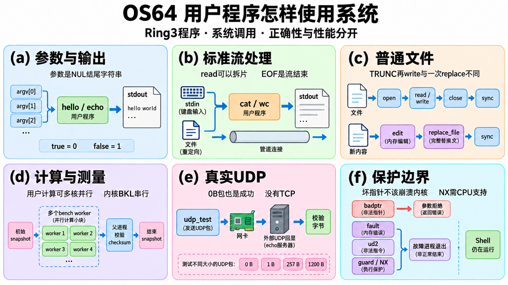
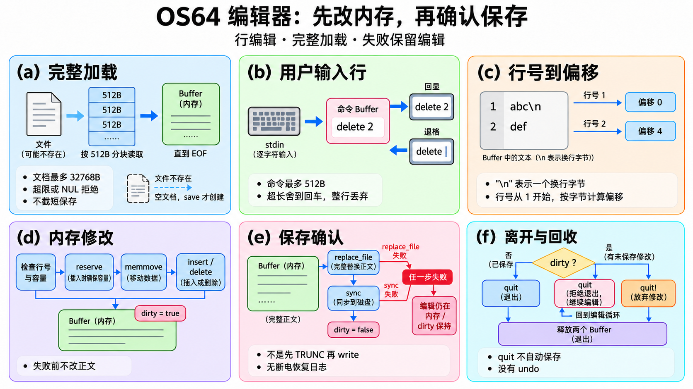

# 用户工具逐函数：程序怎样使用系统能力

讲义标题中的文件前缀用于区分同名函数，不表示源码新增了这些命名空间；Buffer成员保留原类归属。

本章解释其余用户程序中的80个实际定义。协作程序coop_test、smp_test、udp_mixed的24项已经在[协作逐函数](COOPERATION_FUNCTIONS.md)；parallel_reduce由分块归约教程负责，避免重复计数。代码里多个文件都有main／equal，它们属于不同ELF或编译单元，本章逐个列出。

图块 `U(a…f)` 对应用户工具概览：参数与输出、标准流、文件、计算与测量、UDP、保护边界；`E(a…f)` 对应编辑器：缓冲／加载、命令输入、行查询、内存修改、保存、退出。长函数的实际步骤写在各表，图不是代码替代品。

这些程序处于Ring3，通过int80和用户API请求内核服务。每个进程有自己的地址空间、cwd和FD表，spawn得到新的程序内存，但FD可指向相同共享打开对象；文件offset也可共享。内核服务由BKL串行，已pin的用户计算能在最多4个在线CPU上并行；没有任务迁移、共享内存或futex。

测试分两类：badptr传非法参数，应收到错误且内核继续工作；fault／stackfault／nxfault／ud2真正触发CPU异常，应只结束故障用户进程。NX实验须在CPU支持并启用NX时才成立。所有复杂度都包含算法量级，系统调用、等待与I/O成本另列；不把一个正确性通过结果当作“全面快于现代系统”。

## 用户工具与编辑器两张图

U(d)的多worker是用户计算并行，内核BKL仍串行；结果校验和正式速度比较是不同证据。U(e)的0B数据报是一个成功包，与流的EOF不是同一个概念。

E(c)里的ASCII文本abc加一个换行字节后，第二行起点是偏移4；行号不是字节偏移。E(e)两种失败都保留内存编辑与dirty；E(f)拒绝未保存quit后回编辑循环，只有实际退出路径才释放两个Buffer。

原图与所有修订版均保留；精确prompt、实际尺寸与审校见[图清单](images-files.json)，内容规格见[文件与Shell图规格](specs/FILES_SHELL_FIGURES.md)。

## 对照图读程序

用户工具概览把stdin→计算／处理→stdout画成一条流，但不是每个工具都读取stdin：echo输出参数，cat无路径和wc无路径才从stdin读。文件示例也分开：writer／fs_test用open(TRUNC)再write；edit用一次replace_file保存完整文本，失败保护语义不同。UDP仅支持有界socket与ARP/IPv4/ICMP基础，没有TCP。

## `badptr.cpp`

### `badptr::rejected`

源码：[badptr.cpp:14](https://github.com/zmy1213/os64/blob/67efd0d008e0b58b31c89ad4ecfbab502416e087/user/programs/badptr.cpp#L14)；图块：U(f)。

| 项目 | 说明 |
| --- | --- |
| 输入 | 实际值、预期值、测试名 |
| 返回／结果 | 相等true，否则诊断false |
| 主步骤 | 精确比错误码 |
| 为什么 | 坏地址应变错误码而不是内核崩溃 |
| 失败与边界 | 不仅检查负数，避免把错误分类混同 |
| 复杂度 | O(1)，失败输出O(名字长度) |

### `badptr::ipc_boundaries`

源码：[badptr.cpp:20](https://github.com/zmy1213/os64/blob/67efd0d008e0b58b31c89ad4ecfbab502416e087/user/programs/badptr.cpp#L20)；图块：U(f),U(b)。

| 项目 | 说明 |
| --- | --- |
| 输入 | 无参数，运行进程上下文 |
| 返回／结果 | 所有pipe／dup拒绝正确且原FD可用true |
| 主步骤 | 多类坏输出地址；真实端点上测高位／负数／越界FD；再传一字节 |
| 为什么 | 失败dup2不能先关闭有效目标 |
| 失败与边界 | 测空、用户外、内核、guard、跨页、溢出、只读输出；只验证列出的边界 |
| 复杂度 | O(固定测试数) |

### `badptr::performance_boundaries`

源码：[badptr.cpp:47](https://github.com/zmy1213/os64/blob/67efd0d008e0b58b31c89ad4ecfbab502416e087/user/programs/badptr.cpp#L47)；图块：U(f)。

| 项目 | 说明 |
| --- | --- |
| 输入 | 无参数 |
| 返回／结果 | 日志／快照坏输出拒绝且合法调用仍成功true |
| 主步骤 | 扫坏地址；测试count65／高位；count0无需有效输出；最后读合法快照 |
| 为什么 | 接口拒绝参数后内部状态应继续可用 |
| 失败与边界 | 零条日志是成功；只测ABI边界，不执行硬件性能校准 |
| 复杂度 | O(固定测试数+最多一条日志) |

### `badptr::udp_boundaries`

源码：[badptr.cpp:66](https://github.com/zmy1213/os64/blob/67efd0d008e0b58b31c89ad4ecfbab502416e087/user/programs/badptr.cpp#L66)；图块：U(f,e)。

| 项目 | 说明 |
| --- | --- |
| 输入 | 无参数 |
| 返回／结果 | UDP36…40预检精确返回−2为true |
| 主步骤 | 检查高位端口／地址／handle／size与坏输入输出；timeout越界；不分配真实socket |
| 为什么 | 参数先检，不能截断高位或把坏指针当would-block |
| 失败与边界 | capacity≤1200；timeout≤60000或精确UINT32_MAX；UINT64_MAX拒绝；无NIC也应先拒绝这些参数 |
| 复杂度 | O(固定边界集合) |

### `badptr::smp_boundaries`

源码：[badptr.cpp:121](https://github.com/zmy1213/os64/blob/67efd0d008e0b58b31c89ad4ecfbab502416e087/user/programs/badptr.cpp#L121)；图块：U(f)。

| 项目 | 说明 |
| --- | --- |
| 输入 | 无参数 |
| 返回／结果 | 坏输出被拒绝、合法snapshot一致true |
| 主步骤 | 多类坏地址调用41；再检查ABI、online1…4、current与mask |
| 为什么 | 验证跨核信息输出仍受用户映射约束 |
| 失败与边界 | 快照证明拓扑／当前CPU，不直接证明加速 |
| 复杂度 | O(固定边界集合+4核) |

### `badptr::main`

源码：[badptr.cpp:136](https://github.com/zmy1213/os64/blob/67efd0d008e0b58b31c89ad4ecfbab502416e087/user/programs/badptr.cpp#L136)；图块：U(f)。

| 项目 | 说明 |
| --- | --- |
| 输入 | 无所需参数 |
| 返回／结果 | 全部拒绝和合法对照通过0 |
| 主步骤 | 测write/open/flags/replace_file；调用各边界组；测sleep高位／溢出／一天上限和0 |
| 为什么 | 内核不能解引用用户任意地址，失败不能产生磁盘副作用 |
| 失败与边界 | 是参数拒绝测试，和fault程序真正触发CPU异常不同 |
| 复杂度 | O(固定测试集合) |

## `bench.cpp`

### `bench::equal`

源码：[bench.cpp:9](https://github.com/zmy1213/os64/blob/67efd0d008e0b58b31c89ad4ecfbab502416e087/user/programs/bench.cpp#L9)；图块：U(a)。

| 项目 | 说明 |
| --- | --- |
| 输入 | 两个有效NUL结尾字符串 |
| 返回／结果 | 完全相同为true |
| 主步骤 | 同步逐字比较至差异／终止 |
| 为什么 | 同一个ELF用参数选择父协调者或子工作者 |
| 失败与边界 | 不接空指针，不做前缀匹配 |
| 复杂度 | O(较短串长度) |

### `bench::integer`

源码：[bench.cpp:13](https://github.com/zmy1213/os64/blob/67efd0d008e0b58b31c89ad4ecfbab502416e087/user/programs/bench.cpp#L13)；图块：U(d)。

| 项目 | 说明 |
| --- | --- |
| 输入 | 十进制串与uint64输出 |
| 返回／结果 | 完整有效才写结果并true |
| 主步骤 | 每字验证0…9，先检查乘10加数字溢出再累计 |
| 为什么 | 参数不能被窄类型截断成别的工作量 |
| 失败与边界 | 空串、符号、非数字、溢出false；此层允许0，main再检查范围 |
| 复杂度 | O(参数长度) |

### `bench::decimal`

源码：[bench.cpp:22](https://github.com/zmy1213/os64/blob/67efd0d008e0b58b31c89ad4ecfbab502416e087/user/programs/bench.cpp#L22)；图块：U(d)。

| 项目 | 说明 |
| --- | --- |
| 输入 | uint64与至少21B目标 |
| 返回／结果 | NUL结尾十进制串 |
| 主步骤 | 取余存反向位，再逆序复制 |
| 为什么 | spawn传文本参数，不能直接传父地址中的整数 |
| 失败与边界 | 不自带容量参数，调用方给固定21B空间 |
| 复杂度 | O(位数≤20) |

### `bench::compute`

源码：[bench.cpp:27](https://github.com/zmy1213/os64/blob/67efd0d008e0b58b31c89ad4ecfbab502416e087/user/programs/bench.cpp#L27)；图块：U(d)。

| 项目 | 说明 |
| --- | --- |
| 输入 | 循环次数、seed、yield间隔 |
| 返回／结果 | 分块链式计算后的uint64 |
| 主步骤 | 间隔0一次bench_compute；否则逐块计算，块间yield |
| 为什么 | 可控制主动让出与纯抢占两种负载 |
| 失败与边界 | 只在块之间yield；最后块后不额外让出；不能当全部应用性能代理 |
| 复杂度 | O(循环数)，O(1)额外空间 |

### `bench::field`

源码：[bench.cpp:36](https://github.com/zmy1213/os64/blob/67efd0d008e0b58b31c89ad4ecfbab502416e087/user/programs/bench.cpp#L36)；图块：U(d)。

| 项目 | 说明 |
| --- | --- |
| 输入 | 标签与uint64 |
| 返回／结果 | 输出标签、数值、换行 |
| 主步骤 | print／number／print |
| 为什么 | 机器可解析的测量字段 |
| 失败与边界 | 输出成本由上层移到计时段之后；未返回写失败 |
| 复杂度 | O(标签长度+数字位数) |

### `bench::main`

源码：[bench.cpp:38](https://github.com/zmy1213/os64/blob/67efd0d008e0b58b31c89ad4ecfbab502416e087/user/programs/bench.cpp#L38)；图块：U(d)。

| 项目 | 说明 |
| --- | --- |
| 输入 | 父模式workers／iterations／yield，或worker参数 |
| 返回／结果 | 校验计算与退出状态成功0 |
| 主步骤 | 生成每子seed和预期checksum；前后perf快照；spawn1…12子；wait全部；比较结果并输出 |
| 为什么 | 结果正确和资源回收应先于“更快”结论 |
| 失败与边界 | 主工作量1…500000000；子阶段不打印；ticks量化、总时长含spawn/wait；不是Linux普遍胜负 |
| 复杂度 | O(workers×iterations+装载／等待)，父O(workers) |

## `bench_ipc.cpp`

### `bench_ipc::equal`

源码：[bench_ipc.cpp:7](https://github.com/zmy1213/os64/blob/67efd0d008e0b58b31c89ad4ecfbab502416e087/user/programs/bench_ipc.cpp#L7)；图块：U(a)。

| 项目 | 说明 |
| --- | --- |
| 输入 | 两个有效NUL结尾字符串 |
| 返回／结果 | 完全相同为true |
| 主步骤 | 同步逐字比较至差异／终止 |
| 为什么 | 同一个ELF用参数选择父协调者或子工作者 |
| 失败与边界 | 不接空指针，不做前缀匹配 |
| 复杂度 | O(较短串长度) |

### `bench_ipc::integer`

源码：[bench_ipc.cpp:8](https://github.com/zmy1213/os64/blob/67efd0d008e0b58b31c89ad4ecfbab502416e087/user/programs/bench_ipc.cpp#L8)；图块：U(d)。

| 项目 | 说明 |
| --- | --- |
| 输入 | 十进制串与uint64输出 |
| 返回／结果 | 完整有效才写结果并true |
| 主步骤 | 每字验证0…9，先检查乘10加数字溢出再累计 |
| 为什么 | 参数不能被窄类型截断成别的工作量 |
| 失败与边界 | 空串、符号、非数字、溢出false；此层允许0，main再检查范围 |
| 复杂度 | O(参数长度) |

### `bench_ipc::decimal`

源码：[bench_ipc.cpp:14](https://github.com/zmy1213/os64/blob/67efd0d008e0b58b31c89ad4ecfbab502416e087/user/programs/bench_ipc.cpp#L14)；图块：U(d)。

| 项目 | 说明 |
| --- | --- |
| 输入 | uint64与至少21B目标 |
| 返回／结果 | NUL结尾十进制串 |
| 主步骤 | 取余存反向位，再逆序复制 |
| 为什么 | spawn传文本参数，不能直接传父地址中的整数 |
| 失败与边界 | 不自带容量参数，调用方给固定21B空间 |
| 复杂度 | O(位数≤20) |

### `bench_ipc::field`

源码：[bench_ipc.cpp:19](https://github.com/zmy1213/os64/blob/67efd0d008e0b58b31c89ad4ecfbab502416e087/user/programs/bench_ipc.cpp#L19)；图块：U(d)。

| 项目 | 说明 |
| --- | --- |
| 输入 | 标签与uint64 |
| 返回／结果 | 输出标签、数值、换行 |
| 主步骤 | print／number／print |
| 为什么 | 机器可解析的测量字段 |
| 失败与边界 | 输出成本由上层移到计时段之后；未返回写失败 |
| 复杂度 | O(标签长度+数字位数) |

### `bench_ipc::reader`

源码：[bench_ipc.cpp:20](https://github.com/zmy1213/os64/blob/67efd0d008e0b58b31c89ad4ecfbab502416e087/user/programs/bench_ipc.cpp#L20)；图块：U(b,d)。

| 项目 | 说明 |
| --- | --- |
| 输入 | 读FD、继承写FD、预期字节数 |
| 返回／结果 | EOF且字节序列／总量正确返回0 |
| 主步骤 | 先关无用写端；4096B循环read；按全局offset验证；关读端 |
| 为什么 | 自己留下写端会永远收不到EOF |
| 失败与边界 | 读可能短于4096；数据错11，错误／总量错12；无消息边界假设 |
| 复杂度 | O(传输字节数)，4096B局部缓冲 |

### `bench_ipc::main`

源码：[bench_ipc.cpp:32](https://github.com/zmy1213/os64/blob/67efd0d008e0b58b31c89ad4ecfbab502416e087/user/programs/bench_ipc.cpp#L32)；图块：U(b,d)。

| 项目 | 说明 |
| --- | --- |
| 输入 | 总传输字节数或reader模式 |
| 返回／结果 | IPC校验成功0并打印计数 |
| 主步骤 | 建pipe；spawnreader；父关读端；4096B块循环写并处理短写；关写端；wait；快照 |
| 为什么 | 生产／消费阻塞与唤醒是真实进程协作成本 |
| 失败与边界 | 1…64MiB；环容量4096B；模式共享同ELF，Linux适配器换系统API不换数据算法 |
| 复杂度 | O(传输字节数+阻塞／装载)，固定缓冲 |

## `cat.cpp`

### `cat::main`

源码：[cat.cpp:3](https://github.com/zmy1213/os64/blob/67efd0d008e0b58b31c89ad4ecfbab502416e087/user/programs/cat.cpp#L3)；图块：U(b)。

| 项目 | 说明 |
| --- | --- |
| 输入 | 可选多个路径；无路径读stdin |
| 返回／结果 | 全部复制成功0，否则1 |
| 主步骤 | 256B循环read→stdout；路径逐个open/read/close；任一失败记录结果 |
| 为什么 | 相同工具能接文件、键盘或管道 |
| 失败与边界 | 短read正常；write未满即失败，不提供重试全部短写；不是字符编码转换 |
| 复杂度 | O(总字节数+I/O等待) |

## `echo.cpp`

### `echo::main`

源码：[echo.cpp:2](https://github.com/zmy1213/os64/blob/67efd0d008e0b58b31c89ad4ecfbab502416e087/user/programs/echo.cpp#L2)；图块：U(a)。

| 项目 | 说明 |
| --- | --- |
| 输入 | 参数数组 |
| 返回／结果 | 参数空格连接加换行，返回0 |
| 主步骤 | 从argv1逐个print，中间空格 |
| 为什么 | 展示argv边界并能作为管道生产者 |
| 失败与边界 | 不支持-n、反斜杠选项，未逐次检查输出错误 |
| 复杂度 | O(参数总字节数) |

## `edit.cpp`

### `edit::Buffer::reserve`

源码：[edit.cpp:13](https://github.com/zmy1213/os64/blob/67efd0d008e0b58b31c89ad4ecfbab502416e087/user/programs/edit.cpp#L13)；图块：E(a)。

| 项目 | 说明 |
| --- | --- |
| 输入 | Buffer与所需容量 |
| 返回／结果 | 空间足够true；失败原Buffer继续有效 |
| 主步骤 | 从128B或旧容量倍增到足够；memory::resize成功后再替换指针／capacity |
| 为什么 | 少量追加无需每次重新分配 |
| 失败与边界 | 私有调用者先限文本32KiB／命令512B；辅助自身不另查任意巨大wanted溢出 |
| 复杂度 | O(复制旧数据长度+倍增次数)，追加容量增长摊销 |

### `edit::Buffer::clear`

源码：[edit.cpp:23](https://github.com/zmy1213/os64/blob/67efd0d008e0b58b31c89ad4ecfbab502416e087/user/programs/edit.cpp#L23)；图块：E(b)。

| 项目 | 说明 |
| --- | --- |
| 输入 | Buffer |
| 返回／结果 | size变0，有data时写首NUL |
| 主步骤 | 保留已分配容量 |
| 为什么 | 每条命令复用同一缓冲 |
| 失败与边界 | 不释放内存，不清掉所有旧字节 |
| 复杂度 | O(1) |

### `edit::Buffer::destroy`

源码：[edit.cpp:24](https://github.com/zmy1213/os64/blob/67efd0d008e0b58b31c89ad4ecfbab502416e087/user/programs/edit.cpp#L24)；图块：E(f)。

| 项目 | 说明 |
| --- | --- |
| 输入 | Buffer |
| 返回／结果 | 释放data并清指针、size、capacity |
| 主步骤 | memory::release后归零 |
| 为什么 | 正常／失败退出都回收用户heap |
| 失败与边界 | nullptr释放安全；借用旧指针不可继续用 |
| 复杂度 | O(allocator释放成本) |

### `edit::equal`

源码：[edit.cpp:27](https://github.com/zmy1213/os64/blob/67efd0d008e0b58b31c89ad4ecfbab502416e087/user/programs/edit.cpp#L27)；图块：U(a)。

| 项目 | 说明 |
| --- | --- |
| 输入 | 两个有效NUL结尾字符串 |
| 返回／结果 | 完全相同为true |
| 主步骤 | 同步逐字比较至差异／终止 |
| 为什么 | 同一个ELF用参数选择父协调者或子工作者 |
| 失败与边界 | 不接空指针，不做前缀匹配 |
| 复杂度 | O(较短串长度) |

### `edit::begins`

源码：[edit.cpp:31](https://github.com/zmy1213/os64/blob/67efd0d008e0b58b31c89ad4ecfbab502416e087/user/programs/edit.cpp#L31)；图块：E(b)。

| 项目 | 说明 |
| --- | --- |
| 输入 | 命令文本与前缀 |
| 返回／结果 | 前缀逐字匹配为true |
| 主步骤 | 对前缀每字与文本比较 |
| 为什么 | insert／append前缀后还带参数 |
| 失败与边界 | 不是完整命令匹配，main用含空格前缀区分 |
| 复杂度 | O(前缀长度) |

### `edit::command_line`

源码：[edit.cpp:37](https://github.com/zmy1213/os64/blob/67efd0d008e0b58b31c89ad4ecfbab502416e087/user/programs/edit.cpp#L37)；图块：E(b)。

| 项目 | 说明 |
| --- | --- |
| 输入 | 可复用命令Buffer |
| 返回／结果 | 读到回车成功true，读失败false |
| 主步骤 | 清缓冲；每次read一字；回显／退格；忽略控制符；增长缓冲；超长后继续吞到整行末 |
| 为什么 | 用户程序负责原始stdin字符组行，不把半条命令执行 |
| 失败与边界 | 最多512B；分配失败／超长整条丢弃，不允许退格恢复该失败行；不支持光标左右编辑 |
| 复杂度 | O(整行输入字节数+阻塞时间) |

### `edit::load`

源码：[edit.cpp:70](https://github.com/zmy1213/os64/blob/67efd0d008e0b58b31c89ad4ecfbab502416e087/user/programs/edit.cpp#L70)；图块：E(a)。

| 项目 | 说明 |
| --- | --- |
| 输入 | 空document与路径 |
| 返回／结果 | 完整加载文本成功true |
| 主步骤 | open；缺文件准备空文本；512B读到EOF；检查32KiB与分配；close；检查嵌入NUL |
| 为什么 | 固定小数组不能悄悄截掉文件后半段 |
| 失败与边界 | 超限／二进制／读失败不保存磁盘；main失败销毁部分Buffer；不存在留到save才创建 |
| 复杂度 | O(文件字节数)，空间≤文档界限的倍增容量 |

### `edit::line_count`

源码：[edit.cpp:108](https://github.com/zmy1213/os64/blob/67efd0d008e0b58b31c89ad4ecfbab502416e087/user/programs/edit.cpp#L108)；图块：E(c)。

| 项目 | 说明 |
| --- | --- |
| 输入 | document |
| 返回／结果 | 文本行数 |
| 主步骤 | 数换行；最后非换行再算一行 |
| 为什么 | 无末尾换行的文本也有最后一行 |
| 失败与边界 | 空文档0行；末尾换行不额外创造空行 |
| 复杂度 | O(文档字节数) |

### `edit::line_start`

源码：[edit.cpp:114](https://github.com/zmy1213/os64/blob/67efd0d008e0b58b31c89ad4ecfbab502416e087/user/programs/edit.cpp#L114)；图块：E(c)。

| 项目 | 说明 |
| --- | --- |
| 输入 | document、从1开始行号 |
| 返回／结果 | 对应字节offset，找不到返回size |
| 主步骤 | 1直接0；扫描换行递减目标 |
| 为什么 | 行号要转换为字节位置才能移动内容 |
| 失败与边界 | 调用者先验证范围；这里不单独报错 |
| 复杂度 | O(文档字节数) |

### `edit::show`

源码：[edit.cpp:121](https://github.com/zmy1213/os64/blob/67efd0d008e0b58b31c89ad4ecfbab502416e087/user/programs/edit.cpp#L121)；图块：E(c)。

| 项目 | 说明 |
| --- | --- |
| 输入 | document |
| 返回／结果 | 打印行数、字节数、带行号正文 |
| 主步骤 | line_count；每行找换行；write精确字节片段 |
| 为什么 | 不把文本内容当格式字符串 |
| 失败与边界 | 字节不是屏幕列宽；输出失败未逐次检查 |
| 复杂度 | O(文档字节数+终端输出) |

### `edit::insert_line`

源码：[edit.cpp:134](https://github.com/zmy1213/os64/blob/67efd0d008e0b58b31c89ad4ecfbab502416e087/user/programs/edit.cpp#L134)；图块：E(d)。

| 项目 | 说明 |
| --- | --- |
| 输入 | document、1…lines+1行号、文本 |
| 返回／结果 | 成功插入并true |
| 主步骤 | 数行／定位；计算文本+换行及缺尾换行分隔；先校验32KiB并reserve；memmove尾部；复制并更新size/NUL |
| 为什么 | 在原文移动前证明容量足够，失败不改内容 |
| 失败与边界 | 总文档≤32768B；每次插入含一个换行；在无尾换行EOF追加时先加分隔换行 |
| 复杂度 | O(文档字节数+插入文本长度) |

### `edit::delete_line`

源码：[edit.cpp:156](https://github.com/zmy1213/os64/blob/67efd0d008e0b58b31c89ad4ecfbab502416e087/user/programs/edit.cpp#L156)；图块：E(d)。

| 项目 | 说明 |
| --- | --- |
| 输入 | document、有效行号 |
| 返回／结果 | 删除整行成功true |
| 主步骤 | 定位起点和行尾；包含已有换行；memmove后半段；更新size/NUL |
| 为什么 | 行删除必须带走本行分隔符 |
| 失败与边界 | 行号0或超范围拒绝；不自动缩容，也没有undo |
| 复杂度 | O(文档字节数) |

### `edit::line_argument`

源码：[edit.cpp:170](https://github.com/zmy1213/os64/blob/67efd0d008e0b58b31c89ad4ecfbab502416e087/user/programs/edit.cpp#L170)；图块：E(b,d)。

| 项目 | 说明 |
| --- | --- |
| 输入 | 命令参数游标、size_t输出 |
| 返回／结果 | 成功取行号并推进游标 |
| 主步骤 | 必须数字起头；乘10前检溢出；末尾只准空格或NUL；跳一个空格 |
| 为什么 | 巨大行号不能溢出成小行号 |
| 失败与边界 | 0语法可读但插入／删除层拒绝；非数字后缀false |
| 复杂度 | O(数字位数) |

### `edit::help`

源码：[edit.cpp:184](https://github.com/zmy1213/os64/blob/67efd0d008e0b58b31c89ad4ecfbab502416e087/user/programs/edit.cpp#L184)；图块：E(b)。

| 项目 | 说明 |
| --- | --- |
| 输入 | 无参数 |
| 返回／结果 | 打印print/append/insert/delete/save/quit/quit! |
| 主步骤 | 固定说明输出 |
| 为什么 | 告诉读者修改先在内存，save才写卷 |
| 失败与边界 | 行号从1；不是全屏编辑器，32KiB和512B上限固定 |
| 复杂度 | O(帮助文本长度) |

### `edit::save`

源码：[edit.cpp:198](https://github.com/zmy1213/os64/blob/67efd0d008e0b58b31c89ad4ecfbab502416e087/user/programs/edit.cpp#L198)；图块：E(e)。

| 项目 | 说明 |
| --- | --- |
| 输入 | 完整document与路径 |
| 返回／结果 | replace与sync都确认才true |
| 主步骤 | 一次replace_file写全部正文；检查返回完整size；再sync；失败保留内存编辑 |
| 为什么 | 先TRUNC后write失败会丢旧内容，单次替换使用底层暂存／回滚 |
| 失败与边界 | 运行中失败保护不是断电事务；sync失败不能宣布保存确认；没有原子rename |
| 复杂度 | O(正文长度+FS暂存／校验／提交) |

### `edit::main`

源码：[edit.cpp:213](https://github.com/zmy1213/os64/blob/67efd0d008e0b58b31c89ad4ecfbab502416e087/user/programs/edit.cpp#L213)；图块：E(a–f)。

| 项目 | 说明 |
| --- | --- |
| 输入 | 唯一路径参数 |
| 返回／结果 | 正常退出0，参数／load／输入失败非零 |
| 主步骤 | load；循环command_line与分派；成功插入／删除设dirty；save成功清dirty；quit拒绝未存更改；最后释放两Buffer |
| 为什么 | 明确“内存修改”和“磁盘已保存”两种状态 |
| 失败与边界 | quit!明确丢弃；quit不自动保存；没有撤销、搜索、TCP远程编辑或共享内存 |
| 复杂度 | O(读入+各命令处理+保存成本) |

## `false.cpp`

### `false::main`

源码：[false.cpp:1](https://github.com/zmy1213/os64/blob/67efd0d008e0b58b31c89ad4ecfbab502416e087/user/programs/false.cpp#L1)；图块：U(a)。

| 项目 | 说明 |
| --- | --- |
| 输入 | 任意参数 |
| 返回／结果 | 退出状态1 |
| 主步骤 | 直接return1 |
| 为什么 | 用失败状态试验条件执行 |
| 失败与边界 | 不输出，不读参数 |
| 复杂度 | O(1) |

## `fault.cpp`

### `fault::main`

源码：[fault.cpp:2](https://github.com/zmy1213/os64/blob/67efd0d008e0b58b31c89ad4ecfbab502416e087/user/programs/fault.cpp#L2)；图块：U(f)。

| 项目 | 说明 |
| --- | --- |
| 输入 | 无参数 |
| 返回／结果 | 预期用户page fault被隔离处理 |
| 主步骤 | 打印说明后向0x10000000写64位值 |
| 为什么 | CPU真正异常与syscall坏指针拒绝是两种测试 |
| 失败与边界 | 正常不抵达return；该地址在用户窗外，不能要求整机停机才算成功 |
| 复杂度 | O(1)+异常处理 |

## `fp_test.cpp`

### `fp_test::equal`

源码：[fp_test.cpp:4](https://github.com/zmy1213/os64/blob/67efd0d008e0b58b31c89ad4ecfbab502416e087/user/programs/fp_test.cpp#L4)；图块：U(a)。

| 项目 | 说明 |
| --- | --- |
| 输入 | 两个有效NUL结尾字符串 |
| 返回／结果 | 完全相同为true |
| 主步骤 | 同步逐字比较至差异／终止 |
| 为什么 | 同一个ELF用参数选择父协调者或子工作者 |
| 失败与边界 | 不接空指针，不做前缀匹配 |
| 复杂度 | O(较短串长度) |

### `fp_test::worker`

源码：[fp_test.cpp:7](https://github.com/zmy1213/os64/blob/67efd0d008e0b58b31c89ad4ecfbab502416e087/user/programs/fp_test.cpp#L7)；图块：U(d,f)。

| 项目 | 说明 |
| --- | --- |
| 输入 | 不同seed |
| 返回／结果 | 新线程初态与多轮FPU/SSE保持成功true |
| 主步骤 | fxsave检查初态；设不同x87控制、MXCSR、xmm0/xmm15；长计算后yield／sleep；保存观察与期望比较 |
| 为什么 | 上下文切换必须保存浮点与SIMD状态，不能串到别的进程 |
| 失败与边界 | x87、FXSAVE、SSE2范围；不表示AVX/XSAVE已支持；48轮 |
| 复杂度 | O(首轮4194304+47×65536次) |

### `fp_test::main`

源码：[fp_test.cpp:46](https://github.com/zmy1213/os64/blob/67efd0d008e0b58b31c89ad4ecfbab502416e087/user/programs/fp_test.cpp#L46)；图块：U(d,f)。

| 项目 | 说明 |
| --- | --- |
| 输入 | worker seed或父模式 |
| 返回／结果 | 12子隔离与抢占计数通过0 |
| 主步骤 | 检CPUfeatures；spawn不同seed工作者；wait全部；要求preempt增加 |
| 为什么 | 显式yield之外还覆盖长段timer抢占 |
| 失败与边界 | features不满足失败；此测试验证状态正确，不测FPU峰值速度 |
| 复杂度 | O(12×worker计算+装载／等待) |

## `fs_test.cpp`

### `fs_test::main`

源码：[fs_test.cpp:3](https://github.com/zmy1213/os64/blob/67efd0d008e0b58b31c89ad4ecfbab502416e087/user/programs/fs_test.cpp#L3)；图块：U(c,f)。

| 项目 | 说明 |
| --- | --- |
| 输入 | 路径，额外第二参数选择verify-only |
| 返回／结果 | 11块模式读验成功0 |
| 主步骤 | 写11×512B，跨8直接进入间接；sync；清缓冲重开读并验每块字母；verify-only跳过写 |
| 为什么 | 真实跨直接／间接索引，重启后可只验证 |
| 失败与边界 | 默认large.txt；open TRUNC与write非单次replace；未测所有136块容量 |
| 复杂度 | O(11×512+路径／I/O) |

## `hello.cpp`

### `hello::main`

源码：[hello.cpp:2](https://github.com/zmy1213/os64/blob/67efd0d008e0b58b31c89ad4ecfbab502416e087/user/programs/hello.cpp#L2)；图块：U(a)。

| 项目 | 说明 |
| --- | --- |
| 输入 | argc与argv |
| 返回／结果 | 打印欢迎、argc和全部参数，返回0 |
| 主步骤 | 遍历含argv0的所有参数 |
| 为什么 | 最小用户态入口和初始栈ABI实验 |
| 失败与边界 | 输出无逐次错误检查；不是内核程序 |
| 复杂度 | O(参数总长度) |

## `ls.cpp`

### `ls::main`

源码：[ls.cpp:3](https://github.com/zmy1213/os64/blob/67efd0d008e0b58b31c89ad4ecfbab502416e087/user/programs/ls.cpp#L3)；图块：U(c)。

| 项目 | 说明 |
| --- | --- |
| 输入 | 可选路径，默认点 |
| 返回／结果 | 列目录成功0，否则1 |
| 主步骤 | 一次listdir到128项数组；每项显示名字、目录斜杠、字节数 |
| 为什么 | 普通用户程序通过syscall看目录而非直接读磁盘 |
| 失败与边界 | 最多128项；无递归、排序、完整ls选项，超出由API拒绝 |
| 复杂度 | O(目录读取+名字总长度) |

## `mem_test.cpp`

### `mem_test::make_fixture`

源码：[mem_test.cpp:9](https://github.com/zmy1213/os64/blob/67efd0d008e0b58b31c89ad4ecfbab502416e087/user/programs/mem_test.cpp#L9)；图块：U(f)。

| 项目 | 说明 |
| --- | --- |
| 输入 | 编译期无参数 |
| 返回／结果 | 8192B确定性表 |
| 主步骤 | 第i字节=(37i+11) mod251 |
| 为什么 | ELF超过旧4KiB限制，表也有真实运行校验用途 |
| 失败与边界 | constexpr生成，不是运行时分配测试 |
| 复杂度 | O(8192)编译期 |

### `mem_test::raw_break_test`

源码：[mem_test.cpp:17](https://github.com/zmy1213/os64/blob/67efd0d008e0b58b31c89ad4ecfbab502416e087/user/programs/mem_test.cpp#L17)；图块：U(f)。

| 项目 | 说明 |
| --- | --- |
| 输入 | 无参数，用户brk区域 |
| 返回／结果 | 增长／缩小／清零／拒绝通过true |
| 主步骤 | 记页对齐基址；扩3页+37B；检零后写模式；缩至23B再增；验证前23保留其余清零；拒绝下界／guard／高位；缩回 |
| 为什么 | 页内缩小后再增也不能泄漏旧数据 |
| 失败与边界 | brk失败返回旧break而不是errno；固定4–8MiB用户窗，heap不能进入guard |
| 复杂度 | O(约3页字节数+页映射成本) |

### `mem_test::allocator_test`

源码：[mem_test.cpp:39](https://github.com/zmy1213/os64/blob/67efd0d008e0b58b31c89ad4ecfbab502416e087/user/programs/mem_test.cpp#L39)；图块：U(f)。

| 项目 | 说明 |
| --- | --- |
| 输入 | 无参数 |
| 返回／结果 | heap复用、合并、resize、归还通过true |
| 主步骤 | 分配>1MiB并写验；洞分割再合并；释放尾部brk复原；重新分配检零；测0/MAX／resize数据保留 |
| 为什么 | 不仅“分配成功”，还验证生命周期和资源回收 |
| 失败与边界 | 16B对齐；resize失败原块保留；失败测试可能靠进程退出整体回收 |
| 复杂度 | O(大块字节数+allocator扫描) |

### `mem_test::large_stack_test`

源码：[mem_test.cpp:81](https://github.com/zmy1213/os64/blob/67efd0d008e0b58b31c89ad4ecfbab502416e087/user/programs/mem_test.cpp#L81)；图块：U(f)。

| 项目 | 说明 |
| --- | --- |
| 输入 | 无参数 |
| 返回／结果 | 16KiB栈写验成功true |
| 主步骤 | volatile局部数组逐字写读 |
| 为什么 | 确认实际用户栈超过单页而非编译器消除数组 |
| 失败与边界 | 测16KiB使用，不代表无限栈；64KiB栈下有未映射guard |
| 复杂度 | O(16KiB) |

### `mem_test::seed_size`

源码：[mem_test.cpp:89](https://github.com/zmy1213/os64/blob/67efd0d008e0b58b31c89ad4ecfbab502416e087/user/programs/mem_test.cpp#L89)；图块：U(f,c)。

| 项目 | 说明 |
| --- | --- |
| 输入 | 十进制串与size输出 |
| 返回／结果 | 1…69632解析成功true |
| 主步骤 | 限界乘10累计，最后排除0 |
| 为什么 | 准备超过编辑器界限但FS能容纳的文本 |
| 失败与边界 | 非数字、空、超69632拒绝 |
| 复杂度 | O(参数长度) |

### `mem_test::main`

源码：[mem_test.cpp:103](https://github.com/zmy1213/os64/blob/67efd0d008e0b58b31c89ad4ecfbab502416e087/user/programs/mem_test.cpp#L103)；图块：U(f,c)。

| 项目 | 说明 |
| --- | --- |
| 输入 | 可选seed PATH BYTES |
| 返回／结果 | 全部内存校验成功0，可选建立文本fixture |
| 主步骤 | 运行8192表／栈／brk／allocator；普通运行不写卷；seed时分配模式文本，一次replace并sync |
| 为什么 | 把ELF、虚拟heap、栈和编辑器超限实验连起来 |
| 失败与边界 | seed可能修改指定文件；FS最大69632，edit仅32768；失败使用不同退出码 |
| 复杂度 | O(内存检查字节数+可选seed写盘) |

## `mkdir.cpp`

### `mkdir::main`

源码：[mkdir.cpp:2](https://github.com/zmy1213/os64/blob/67efd0d008e0b58b31c89ad4ecfbab502416e087/user/programs/mkdir.cpp#L2)；图块：U(c)。

| 项目 | 说明 |
| --- | --- |
| 输入 | 唯一目录路径 |
| 返回／结果 | 创建成功0，参数1，失败2 |
| 主步骤 | 检argc；调用syscall12 |
| 为什么 | 用户工具只是系统调用入口，卷结构由内核维护 |
| 失败与边界 | 无-p递归；已有路径失败 |
| 复杂度 | O(路径查找+FS修改) |

## `nxfault.cpp`

### `nxfault::main`

源码：[nxfault.cpp:4](https://github.com/zmy1213/os64/blob/67efd0d008e0b58b31c89ad4ecfbab502416e087/user/programs/nxfault.cpp#L4)；图块：U(f)。

| 项目 | 说明 |
| --- | --- |
| 输入 | 无参数 |
| 返回／结果 | 预期data执行page fault；若ret成功则2 |
| 主步骤 | volatile写数据数组0xc3，再将其作为函数调用 |
| 为什么 | 运行时写确保测试目标确实在可写数据段 |
| 失败与边界 | 需CPU NX支持并已启用；不支持时无法声称保护；不是栈越界测试 |
| 复杂度 | O(1)+异常处理 |

## `perf_test.cpp`

### `perf_test::main`

源码：[perf_test.cpp:2](https://github.com/zmy1213/os64/blob/67efd0d008e0b58b31c89ad4ecfbab502416e087/user/programs/perf_test.cpp#L2)；图块：U(f,d)。

| 项目 | 说明 |
| --- | --- |
| 输入 | 无额外参数 |
| 返回／结果 | 快照、日志与坏输出通过0 |
| 主步骤 | 检ABI／Hz100／CPUfeatures；坏指针与零count；取最多8record，验序号、reserved和终止字段；未来sequence应空 |
| 为什么 | 性能观察接口也需要严格用户输出检查 |
| 失败与边界 | 快照字段范围与日志有界性，不证明测量统计显著性 |
| 复杂度 | O(最多8条日志+固定测试) |

## `pipe_test.cpp`

### `pipe_test::equal`

源码：[pipe_test.cpp:3](https://github.com/zmy1213/os64/blob/67efd0d008e0b58b31c89ad4ecfbab502416e087/user/programs/pipe_test.cpp#L3)；图块：U(a)。

| 项目 | 说明 |
| --- | --- |
| 输入 | 两个有效NUL结尾字符串 |
| 返回／结果 | 完全相同为true |
| 主步骤 | 同步逐字比较至差异／终止 |
| 为什么 | 同一个ELF用参数选择父协调者或子工作者 |
| 失败与边界 | 不接空指针，不做前缀匹配 |
| 复杂度 | O(较短串长度) |

### `pipe_test::decimal`

源码：[pipe_test.cpp:4](https://github.com/zmy1213/os64/blob/67efd0d008e0b58b31c89ad4ecfbab502416e087/user/programs/pipe_test.cpp#L4)；图块：U(b)。

| 项目 | 说明 |
| --- | --- |
| 输入 | 非负FD／小整数、12B目标 |
| 返回／结果 | 十进制NUL串 |
| 主步骤 | 取余反向存后复制 |
| 为什么 | 将FD号作为子参数传递 |
| 失败与边界 | 不支持负值；调用者只传成功FD |
| 复杂度 | O(位数) |

### `pipe_test::write_records`

源码：[pipe_test.cpp:12](https://github.com/zmy1213/os64/blob/67efd0d008e0b58b31c89ad4ecfbab502416e087/user/programs/pipe_test.cpp#L12)；图块：U(b)。

| 项目 | 说明 |
| --- | --- |
| 输入 | 继承两端FD与A／B标记 |
| 返回／结果 | 64条257B写完0 |
| 主步骤 | 关读端；每条含ID、序号、模式；单次write257；关写端 |
| 为什么 | 多写者小写入不能字节交错 |
| 失败与边界 | 257≤4096，read可拆片；并不假设每次read一条记录 |
| 复杂度 | O(64×257+阻塞) |

### `pipe_test::child_reader`

源码：[pipe_test.cpp:22](https://github.com/zmy1213/os64/blob/67efd0d008e0b58b31c89ad4ecfbab502416e087/user/programs/pipe_test.cpp#L22)；图块：U(b)。

| 项目 | 说明 |
| --- | --- |
| 输入 | 继承两端FD |
| 返回／结果 | 32785B模式正确且EOF返回0 |
| 主步骤 | 关写端；777B循环read；按累计offset检验；关读端 |
| 为什么 | 跨环形边界的长流不能丢数据，EOF依赖最后写引用释放 |
| 失败与边界 | 短read正常；错误／总长度错返回非零 |
| 复杂度 | O(32785+阻塞) |

### `pipe_test::spawn_child`

源码：[pipe_test.cpp:33](https://github.com/zmy1213/os64/blob/67efd0d008e0b58b31c89ad4ecfbab502416e087/user/programs/pipe_test.cpp#L33)；图块：U(b)。

| 项目 | 说明 |
| --- | --- |
| 输入 | 模式与两个FD |
| 返回／结果 | child PID或失败 |
| 主步骤 | decimal FD；固定4参数spawn本程序 |
| 为什么 | 通过继承FD共享对象，不复制用户地址空间 |
| 失败与边界 | 只把FD数字序列化，底层spawn必须真实继承对象引用 |
| 复杂度 | O(参数构造+ELF装载) |

### `pipe_test::await`

源码：[pipe_test.cpp:38](https://github.com/zmy1213/os64/blob/67efd0d008e0b58b31c89ad4ecfbab502416e087/user/programs/pipe_test.cpp#L38)；图块：U(b)。

| 项目 | 说明 |
| --- | --- |
| 输入 | child PID |
| 返回／结果 | wait返回该PID且status0为true |
| 主步骤 | 一次waitpid并比较 |
| 为什么 | 回收比“子已退出”还多一步 |
| 失败与边界 | 错PID／失败／非零退出false |
| 复杂度 | O(等待时间+回收) |

### `pipe_test::main`

源码：[pipe_test.cpp:40](https://github.com/zmy1213/os64/blob/67efd0d008e0b58b31c89ad4ecfbab502416e087/user/programs/pipe_test.cpp#L40)；图块：U(b,f)。

| 项目 | 说明 |
| --- | --- |
| 输入 | reader／offset／exitwriter／recordA/B子模式或父模式 |
| 返回／结果 | 全套管道和dup验证通过0 |
| 主步骤 | 父测重复EPIPE、缓冲读尽后EOF、32KiB流、退出关写唤醒、继承文件共享offset、双写者257B记录113B拼读、dup边界 |
| 为什么 | 生命周期、原子写和流读取分别验证，不能混为“消息管道” |
| 失败与边界 | 环4096B；每写者64记录；两写者次序可交错但各记录不插入；无shared-memory／futex |
| 复杂度 | O(固定测试传输总量+等待) |

## `pwd.cpp`

### `pwd::main`

源码：[pwd.cpp:3](https://github.com/zmy1213/os64/blob/67efd0d008e0b58b31c89ad4ecfbab502416e087/user/programs/pwd.cpp#L3)；图块：U(a,c)。

| 项目 | 说明 |
| --- | --- |
| 输入 | 无所需参数 |
| 返回／结果 | 打印进程cwd，成功0 |
| 主步骤 | syscall0写64B数组；print |
| 为什么 | cwd是每进程上下文，不用猜文件路径 |
| 失败与边界 | 获取失败1；路径容量64B |
| 复杂度 | O(路径长度) |

## `rm.cpp`

### `rm::main`

源码：[rm.cpp:2](https://github.com/zmy1213/os64/blob/67efd0d008e0b58b31c89ad4ecfbab502416e087/user/programs/rm.cpp#L2)；图块：U(c)。

| 项目 | 说明 |
| --- | --- |
| 输入 | 唯一路径 |
| 返回／结果 | 删除成功0，参数1，失败2 |
| 主步骤 | 检argc；syscall17 |
| 为什么 | 名字移除与块回收由FS事务统一负责 |
| 失败与边界 | 不删非空目录，无-r；打开引用／cwd保护可能拒绝 |
| 复杂度 | O(路径查找+FS修改) |

## `sched_test.cpp`

### `sched_test::equal`

源码：[sched_test.cpp:7](https://github.com/zmy1213/os64/blob/67efd0d008e0b58b31c89ad4ecfbab502416e087/user/programs/sched_test.cpp#L7)；图块：U(a)。

| 项目 | 说明 |
| --- | --- |
| 输入 | 两个有效NUL结尾字符串 |
| 返回／结果 | 完全相同为true |
| 主步骤 | 同步逐字比较至差异／终止 |
| 为什么 | 同一个ELF用参数选择父协调者或子工作者 |
| 失败与边界 | 不接空指针，不做前缀匹配 |
| 复杂度 | O(较短串长度) |

### `sched_test::decimal`

源码：[sched_test.cpp:8](https://github.com/zmy1213/os64/blob/67efd0d008e0b58b31c89ad4ecfbab502416e087/user/programs/sched_test.cpp#L8)；图块：U(d)。

| 项目 | 说明 |
| --- | --- |
| 输入 | uint64与至少21B目标 |
| 返回／结果 | NUL结尾十进制串 |
| 主步骤 | 取余存反向位，再逆序复制 |
| 为什么 | spawn传文本参数，不能直接传父地址中的整数 |
| 失败与边界 | 不自带容量参数，调用方给固定21B空间 |
| 复杂度 | O(位数≤20) |

### `sched_test::worker`

源码：[sched_test.cpp:13](https://github.com/zmy1213/os64/blob/67efd0d008e0b58b31c89ad4ecfbab502416e087/user/programs/sched_test.cpp#L13)；图块：U(d,b)。

| 项目 | 说明 |
| --- | --- |
| 输入 | id、继承端点、共同启动deadline |
| 返回／结果 | 6轮计算与进度写成功0 |
| 主步骤 | 关读端；sleep到deadline；每轮20M bench_compute；单次写32B Progress；关写端 |
| 为什么 | 计算阶段不yield，进度依赖timer抢占 |
| 失败与边界 | 启动deadline只是协调时间；32B原子写，进度read仍会拆片；并非严格障栅 |
| 复杂度 | O(6×20M+等待) |

### `sched_test::main`

源码：[sched_test.cpp:27](https://github.com/zmy1213/os64/blob/67efd0d008e0b58b31c89ad4ecfbab502416e087/user/programs/sched_test.cpp#L27)；图块：U(d,b)。

| 项目 | 说明 |
| --- | --- |
| 输入 | 父模式或worker参数 |
| 返回／结果 | 8子全部进度／结果／回收通过0 |
| 主步骤 | perf快照；建pipe；spawn8；拼32B记录；核验每子round/ticks/result；首个完成前要求8子出现；wait后检preempt和freepages |
| 为什么 | 避免只看到最终退出却遗漏饥饿或资源泄漏 |
| 失败与边界 | 6轮每子20M；SMP固定pin并行用户计算，BKL内核串行；不是调度公平性的无限证明 |
| 复杂度 | O(8×6×20M子计算+48记录与等待) |

## `sleep.cpp`

### `sleep::main`

源码：[sleep.cpp:2](https://github.com/zmy1213/os64/blob/67efd0d008e0b58b31c89ad4ecfbab502416e087/user/programs/sleep.cpp#L2)；图块：U(d)。

| 项目 | 说明 |
| --- | --- |
| 输入 | 可选毫秒，默认100 |
| 返回／结果 | sleep完成0，拒绝1 |
| 主步骤 | parse_number；打印；sleep；打印 |
| 为什么 | 阻塞等待让其它进程继续执行 |
| 失败与边界 | 参数helper不是完整溢出报告接口，最终syscall仍限一天与高位；100Hz向上量化 |
| 复杂度 | O(等待时间) |

## `spawn_test.cpp`

### `spawn_test::main`

源码：[spawn_test.cpp:2](https://github.com/zmy1213/os64/blob/67efd0d008e0b58b31c89ad4ecfbab502416e087/user/programs/spawn_test.cpp#L2)；图块：U(b)。

| 项目 | 说明 |
| --- | --- |
| 输入 | 有任意额外参数则孤儿模式 |
| 返回／结果 | 普通子echo成功0，失败非零 |
| 主步骤 | spawn固定echo；普通wait比status；孤儿模式父直接退出 |
| 为什么 | 测装载、父子归属、等待回收及孤儿处理 |
| 失败与边界 | 额外参数不作为子命令；孤儿分支依赖内核回收策略 |
| 复杂度 | O(装载+子运行／等待) |

## `spin.cpp`

### `spin::main`

源码：[spin.cpp:2](https://github.com/zmy1213/os64/blob/67efd0d008e0b58b31c89ad4ecfbab502416e087/user/programs/spin.cpp#L2)；图块：U(d)。

| 项目 | 说明 |
| --- | --- |
| 输入 | 可选iterations，默认10M |
| 返回／结果 | 完成计数0 |
| 主步骤 | volatile计数持续自增，无主动yield |
| 为什么 | 观察timer抢占能否在纯用户循环中切走 |
| 失败与边界 | 不校验算法结果或性能快照，不是严谨基准；参数用简单parse_number |
| 复杂度 | O(iterations) |

## `stackfault.cpp`

### `stackfault::main`

源码：[stackfault.cpp:2](https://github.com/zmy1213/os64/blob/67efd0d008e0b58b31c89ad4ecfbab502416e087/user/programs/stackfault.cpp#L2)；图块：U(f)。

| 项目 | 说明 |
| --- | --- |
| 输入 | 无参数 |
| 返回／结果 | 预期用户guard写page fault |
| 主步骤 | 写0x7ef000的一个字节 |
| 为什么 | 未映射guard阻止栈下界越过而静默破坏heap |
| 失败与边界 | 栈0x7f0000…0x800000；该测试直接写guard，不靠递归触发 |
| 复杂度 | O(1)+异常处理 |

## `sync.cpp`

### `sync::main`

源码：[sync.cpp:2](https://github.com/zmy1213/os64/blob/67efd0d008e0b58b31c89ad4ecfbab502416e087/user/programs/sync.cpp#L2)；图块：U(c)。

| 项目 | 说明 |
| --- | --- |
| 输入 | 任意参数 |
| 返回／结果 | sync失败1，成功0 |
| 主步骤 | 只调用sync并比较 |
| 为什么 | 用户可显式flush卷 |
| 失败与边界 | 成功不代表有断电日志或原子rename |
| 复杂度 | O(元数据扇区写+flush) |

## `true.cpp`

### `true::main`

源码：[true.cpp:1](https://github.com/zmy1213/os64/blob/67efd0d008e0b58b31c89ad4ecfbab502416e087/user/programs/true.cpp#L1)；图块：U(a)。

| 项目 | 说明 |
| --- | --- |
| 输入 | 任意参数 |
| 返回／结果 | 退出状态0 |
| 主步骤 | 直接return0 |
| 为什么 | 条件成功路径最小实验 |
| 失败与边界 | 不输出，不验证参数 |
| 复杂度 | O(1) |

## `ud2.cpp`

### `ud2::main`

源码：[ud2.cpp:2](https://github.com/zmy1213/os64/blob/67efd0d008e0b58b31c89ad4ecfbab502416e087/user/programs/ud2.cpp#L2)；图块：U(f)。

| 项目 | 说明 |
| --- | --- |
| 输入 | 无参数 |
| 返回／结果 | 预期非法指令异常隔离 |
| 主步骤 | 打印后执行x86 UD2 |
| 为什么 | 检查异常入口能终止故障用户进程并继续Shell |
| 失败与边界 | 正常不抵达return，不是系统调用错误码 |
| 复杂度 | O(1)+异常处理 |

## `udp_test.cpp`

### `udp_test::equal`

源码：[udp_test.cpp:4](https://github.com/zmy1213/os64/blob/67efd0d008e0b58b31c89ad4ecfbab502416e087/user/programs/udp_test.cpp#L4)；图块：U(a)。

| 项目 | 说明 |
| --- | --- |
| 输入 | 两个有效NUL结尾字符串 |
| 返回／结果 | 完全相同为true |
| 主步骤 | 同步逐字比较至差异／终止 |
| 为什么 | 同一个ELF用参数选择父协调者或子工作者 |
| 失败与边界 | 不接空指针，不做前缀匹配 |
| 复杂度 | O(较短串长度) |

### `udp_test::decimal`

源码：[udp_test.cpp:5](https://github.com/zmy1213/os64/blob/67efd0d008e0b58b31c89ad4ecfbab502416e087/user/programs/udp_test.cpp#L5)；图块：U(e)。

| 项目 | 说明 |
| --- | --- |
| 输入 | 字符串、正数上限、输出 |
| 返回／结果 | 1…limit为true |
| 主步骤 | 数字验证并在累计前检查上限 |
| 为什么 | IP以外的port/count/handle不应溢出 |
| 失败与边界 | 不允许0；limit由调用者给且至少涵盖单个数字 |
| 复杂度 | O(参数长度) |

### `udp_test::ipv4`

源码：[udp_test.cpp:11](https://github.com/zmy1213/os64/blob/67efd0d008e0b58b31c89ad4ecfbab502416e087/user/programs/udp_test.cpp#L11)；图块：U(e)。

| 项目 | 说明 |
| --- | --- |
| 输入 | dotted-decimal串与uint32输出 |
| 返回／结果 | 四段IPv4解析成功true |
| 主步骤 | 每段1…3数字且≤255；合成高字节在先；要求点与串尾 |
| 为什么 | 用户程序可以从文字构造协议地址 |
| 失败与边界 | 不解析域名、IPv6、CIDR；前导零是十进制 |
| 复杂度 | O(IPv4串长度≤15) |

### `udp_test::format_handle`

源码：[udp_test.cpp:20](https://github.com/zmy1213/os64/blob/67efd0d008e0b58b31c89ad4ecfbab502416e087/user/programs/udp_test.cpp#L20)；图块：U(e)。

| 项目 | 说明 |
| --- | --- |
| 输入 | uint32 handle与至少12B输出 |
| 返回／结果 | 十进制NUL串 |
| 主步骤 | 反向取余后复制 |
| 为什么 | 把父socket号码给隔离子来验证拒绝 |
| 失败与边界 | 只传号码，socket归属不随spawn继承 |
| 复杂度 | O(最多10位) |

### `udp_test::main`

源码：[udp_test.cpp:25](https://github.com/zmy1213/os64/blob/67efd0d008e0b58b31c89ad4ecfbab502416e087/user/programs/udp_test.cpp#L25)；图块：U(e,f)。

| 项目 | 说明 |
| --- | --- |
| 输入 | 外部echo IP PORT COUNT，或foreign/leak/timeout/arp_timeout模式 |
| 返回／结果 | 正常收发与各边界验证成功0 |
| 主步骤 | 外部模式先坏参检查；子foreign验证owner；填满4socket槽再释放；轮流0/1/257/1200B发回验内容与12Bmetadata；特殊模式测退出清理和AP超时 |
| 为什么 | 真正UDP收发、零包、隔离、资源限制和计时域分别验证 |
| 失败与边界 | 外部echo必需；COUNT≤1000；顺序往返非TCP；25ms等3…6tick界限仅空闲测试；无ARP目标send约100tick，不持BKL HLT |
| 复杂度 | O(COUNT×载荷+网络等待)，固定1200B缓冲 |

## `wc.cpp`

### `wc::main`

源码：[wc.cpp:2](https://github.com/zmy1213/os64/blob/67efd0d008e0b58b31c89ad4ecfbab502416e087/user/programs/wc.cpp#L2)；图块：U(b)。

| 项目 | 说明 |
| --- | --- |
| 输入 | 可选一路径，默认stdin |
| 返回／结果 | 打印换行数、词数、字节数，成功0 |
| 主步骤 | 512B循环读；状态inside_word跨块保存；空白分界统计 |
| 为什么 | read分块不会切断逻辑词，管道仍是字节流 |
| 失败与边界 | 行数数换行，EOF无换行不补一行；按ASCII六类空白分词，不按中文语义 |
| 复杂度 | O(输入字节数)，512B缓冲 |

## `writer.cpp`

### `writer::main`

源码：[writer.cpp:3](https://github.com/zmy1213/os64/blob/67efd0d008e0b58b31c89ad4ecfbab502416e087/user/programs/writer.cpp#L3)；图块：U(c)。

| 项目 | 说明 |
| --- | --- |
| 输入 | 可选路径与文本，默认writer.txt |
| 返回／结果 | 写／sync／读回成功0 |
| 主步骤 | open CREATE/TRUNC；write；close；sync；重开读最多128B并显示 |
| 为什么 | 最简持久卷往返教学程序 |
| 失败与边界 | open截断与write是两操作，失败不能保证保旧；大文本读回只展示前128B，编辑器用replace不同 |
| 复杂度 | O(文本写入+最多128B读取+sync) |

## 编辑器的两个事实

第一，load读到EOF再判断是否完整，而不是只读取一个小数组就允许保存。超过32768B或有NUL的文件拒绝进入编辑状态，原卷内容不会被当成截断文本覆盖。command_line同样在命令超长后吞掉直到回车，随后返回空命令，不执行前半段。

第二，dirty是用户程序内存状态；save只有replace_file返回完整字节数、sync也成功后才清dirty。失败时编辑仍留在Buffer里。quit要求先保存，quit!明确放弃；quit本身不自动写文件。replace的底层是有限内存暂存与同步错误回滚，不是持久化日志、断电恢复或原子rename。

## 怎样判断一次实验通过

bench用确定性计算的预期checksum检查每个退出值；bench_ipc验证每个字节和EOF总量；sched_test检查8个工作者都在第一个完成前提交过进度；fp_test检查x87与xmm0/xmm15保存；udp_test检查真实包、元数据、owner与超时。它们的通过证明对应代码路径按实验条件工作；正式性能比较还需固定配置、重复样本、说明guest ticks与宿主wall的范围。

udp_test的timeout_waiter在空闲100Hz实验中，25ms向上取整为3tick，要求3…6tick，因而能暴露“PIT从boot计时、scheduler从初始化计时”误用时钟起点造成的几十tick偏移。负载重时不能把这个测试上界当作通用调度实时保证。UDP空payload返回0是成功包，返回−1才是未收到／超时；不得把两者混为EOF。
